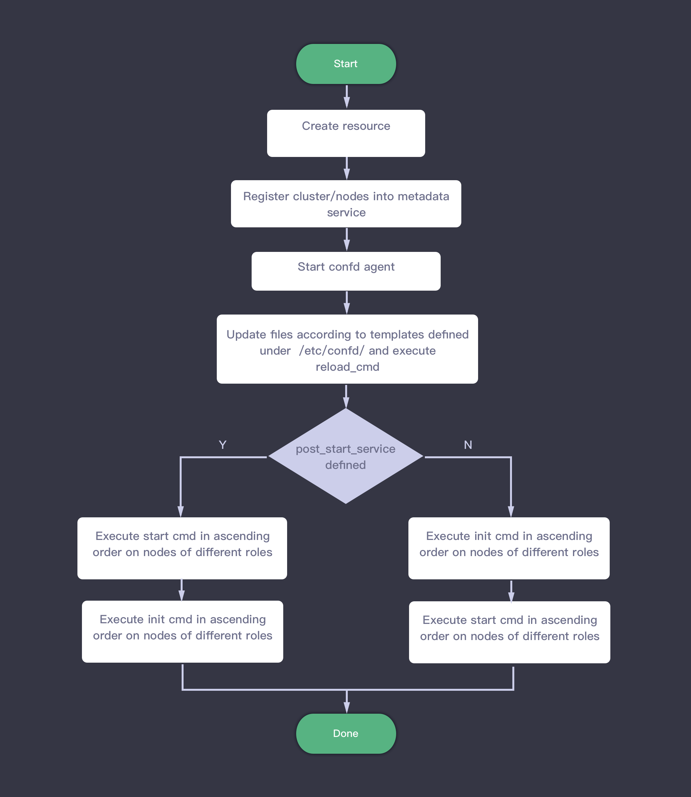
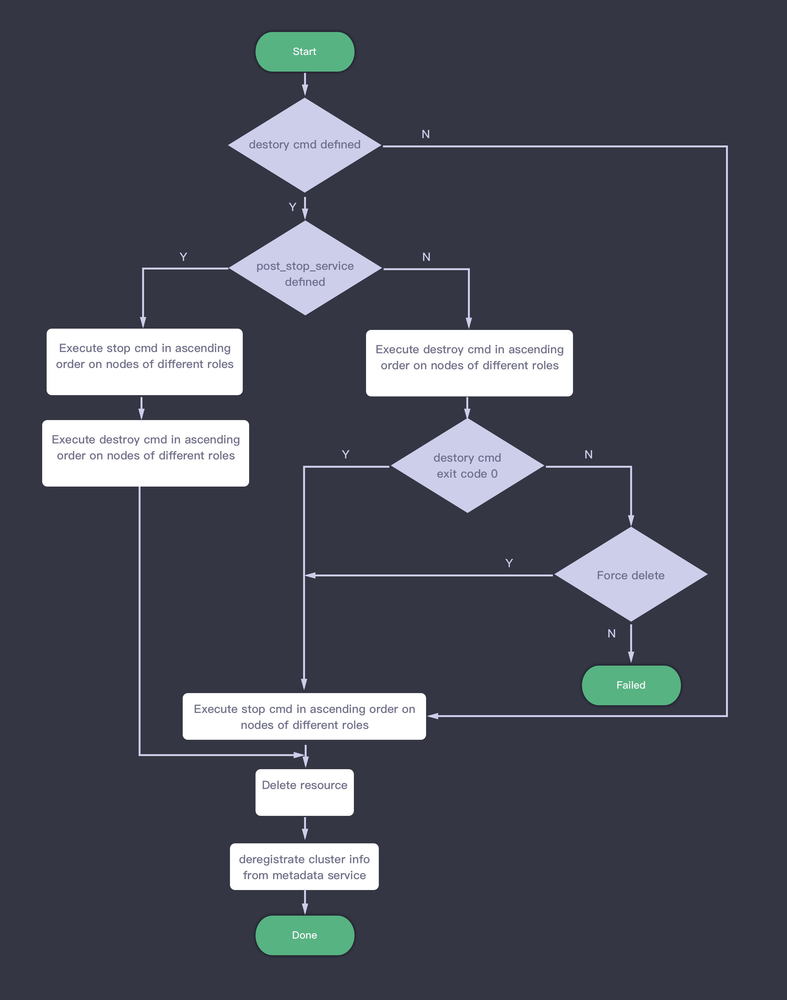
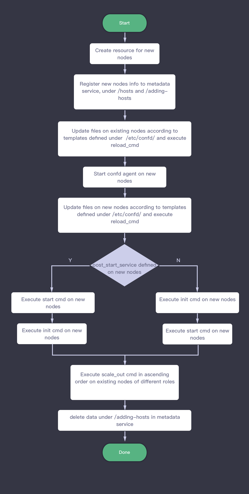
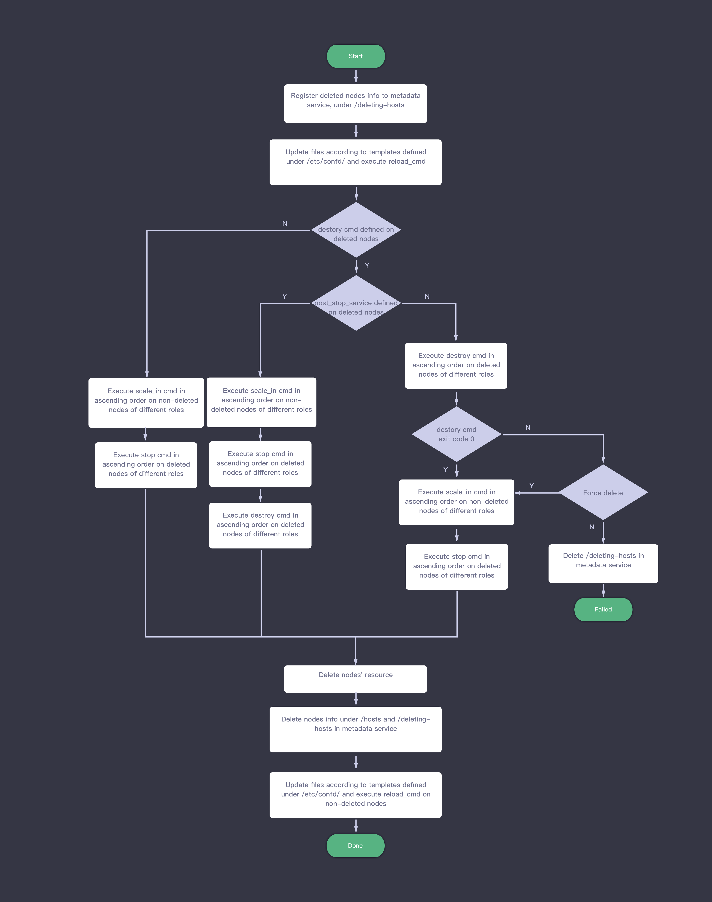
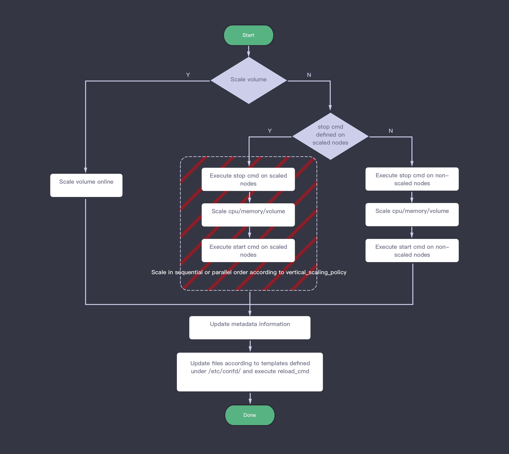
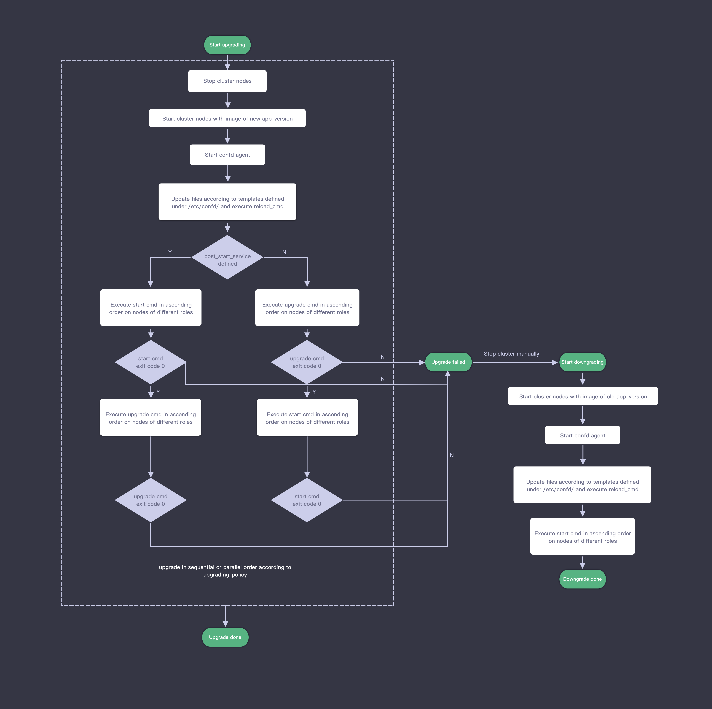

---
---

# Lifecycle of Managing Application Cluster

This section demonstrates the typical working flows of managing an application including creating/deleting cluster, adding/deleting cluster node, and horizontal scaling.  

## Create Cluster

1. Prepare resources for this cluster, including creating instance, volume, network, etc.  
2. Register cluster info to [metadata service](../metadata-service.html).  
3. Start confd agent on all nodes, which watches metadata service, updates the corresponding configuration files that are defined in the template files (toml & tmpl) under /etc/confd if any cluster information is changed. If reload_cmd is defined in toml file and related meta data is changed, the command will be executed.  
4. Execute the command defined in init and start service according to the order defined in init service [post\_start\_service](specifications.html#post-start-service). Init command will execute after start command if post\_start\_service is set to true. The same service command on the nodes with different roles should execute in order by 'order' property defined in mustache file, the smaller value of 'order', the higher priority the command is assigned with. The default value of 'order' property is zero(the highest priority), which means all nodes execute same service command in parallel.  

## Delete Cluster

1. If destroy service is defined for the node to be deleted, skip step 2 below and start from step 3, otherwise execute step 2 and step 8.  
2. On each node, execute stop command in ascending order based on the value of 'order' property.  
3. If post\_stop\_service of destroy service is set to False for the node to be deleted, skip step 4 and start from step 5 below, otherwise execute step 4 and step 8.  
4. On each node to be deleted, execute stop command in ascending order based on the value of 'order' property，then execute destroy command in the same way.  
5. On each node to be deleted, execute destroy command in ascending order based on the value of 'order' property, move to corresponding step according to the exit code which is success (zero) or failed (non zero). This step is to prevent losing data when deleting cluster by mistake.  
6. If destroy command returns non zero and end user does not choose 'Force Delete', terminate this 'Deleting' task as failed.  
7. If destroy command returns zero or end user selects 'Force Delete' when the destroy command returns non zero, execute stop command in ascending order based on the value of 'order' property.  
8. Delete all resources of this cluster and deregistrate cluster information from metadata service.  

## Add Node

> To support adding node, please define scale\_horizontal in advanced\_actions, refer to [Development Specification - Full Version](specifications/specifications.html)  

1. Prepare resources for new nodes, including instance, volume, network，etc.
2. Register the new nodes info into metadata service under /hosts and /adding-hosts. The latter is a temporary folder for some pre-processing operations for scaling out.  
3. As cluster informration in metadata service is changed, the files related to that information on existing nodes(not the ones just added) may be updated, and reload command is executed if reload\_cmd is defined in the related toml file.  
4. Start confd agent on each added node, also update the configuration and execute reload command if necessary.  
5. Execute init and start command on the added nodes according to the order defined by post\_start\_service in init service, The same service command on the nodes with different roles should execute in order by 'order' property defined in mustache file, the smaller value of 'order' is set, the higher priority the command is assigned with. The default value of 'order' property is zero(the highest priority), which means all nodes execute same service command in parallel.  
6. Execute scale\_out command defined on the existing nodes(not the one just added). Please be aware the command is only executed on some nodes that is defined by the property 'nodes\_to\_execute\_on'.  
7. Delete the temporary content under /adding-hosts in metadata service.

## Delete Node

> To support deleting node, please define scale\_horizontal in advanced\_actions, refer to [Development Specification - Full Version](specifications/specifications.html)  

1. Register the nodes to be deleted into metadata service under /deleting-hosts, which is the temporary folder for some pre-processing operations for scaling in.  
2. As cluster information in metadata service is changed, the files related to the information on each node would be updated and reload command is executed if reload\_cmd is defined in the related toml file.  
3. Start from step 5 if destroy service is defined on the nodes to be deleted, otherwise execute steps 4 and 10 - 12.  
4. Execute scale\_in command in ascending order on the existing nodes(not the deleted ones) of different roles according to 'order' property, then execute stop\_cmd in ascending order on the nodes to be deleted.  
5. If post\_stop\_service is set to False on the nodes to be deleted, then go to step 7, otherwise execute steps 6 and 10 - 12.  
6. Execute scale\_in command in ascending order on the existing nodes(not the deleted ones) of different roles. Execute stop\_cmd in ascending order on the nodes to be deleted, then execute destroy_cmd in ascending order on the nodes to be deleted.  
7. Execute destroy command in ascending order on the nodes to be deleted of different roles, move to corresponding step according to the exit code which is success (zero) or failed (non zero). This step is to prevent losing data when deleting nodes by mistake.  
8. Stop deleting nodes if destroy command return non zero and end user does not select 'Force Delete', terminate this 'Deleting' task as failed, and delete the data under /deleting-hosts in metadata service.  
9. If destroy command return zero or end user selects 'Force Delete' when the destroy command returns non zero, execute scale\_in command in ascending order on nodes of different roles, then execute stop command in the same way.  
10. Delete the resource of the nodes to be deleted.  
11. Deregistrate the deleted nodes from metadata service and the info under /deleting-hosts.  
12. As cluster information in metadata service is changed, the files related to the information on existing nodes(not the ones just deleted) would be updated. Execute reload command if reload\_cmd is defined in the related toml file.

## Scale Vertical

1. Register the node role to be scaled into vertical-scaling-roles in metadata service.
2. Scale vertical online if just scaling volume, then execute steps 6 - 7.  
3. If stop service is defined on the nodes to be scaled，execute steps 4 and 6 - 7, otherwise execute steps 5 and 6 - 7.  
4. According to the defined vertical_scaling_policy, execute the following operations in sequential or in parallel: execute stop command on the nodes to be scaled, scale nodes vertical, then execute start command on the nodes to be scaled.  
5. Execute stop command on the nodes not to be scaled, then scale nodes vertical, then execute start command on the nodes not to be scaled.  
6. Update the data in metadata service for the nodes scaled vertical and delete vertical-scaling-roles.  
7. As cluster information in metadata service is changed, the files related to the information on all nodes would be updated, and reload command is executed if reload\_cmd is defined in the related toml file.

> Note: vertical-scaling-roles will be deleted even any exception happens during scaling vertical.

## Upgrade

1. Stop cluster node.
2. Start cluster nodes with image of new app_version.
3. Start confd agent on all nodes, which watches metadata service, updates the corresponding configuration files that are defined in the template files (toml & tmpl) under /etc/confd if any cluster information is changed. If reload_cmd is defined in toml file and related meta data is changed, the command will be executed.
4. Execute start and upgrade command on the nodes according to the order defined by post_start_service in upgrade service, The same service command on the nodes with different roles should execute in ascending order based on the value of 'order' property.
5. If the exit code of any command in step 4 is non zero(failed), the upgrading task would be terminated and marked as failed, otherwise the upgrading task finished with success. In case of upgrading failure, please stop the cluster and start downgrading from step 6.
6. Start cluster nodes with image of old app_version.
7. Start confd agent on all nodes, which watches metadata service, updates the corresponding configuration files that are defined in the template files (toml & tmpl) under /etc/confd if any cluster information is changed. If reload_cmd is defined in toml file and related meta data is changed, the command will be executed.
8. Execute start command in ascending order on nodes of different roles.

> Note: The workflow from step 1 to step 4 would be executed sequentially or parallelly according to the defined upgrading_policy.