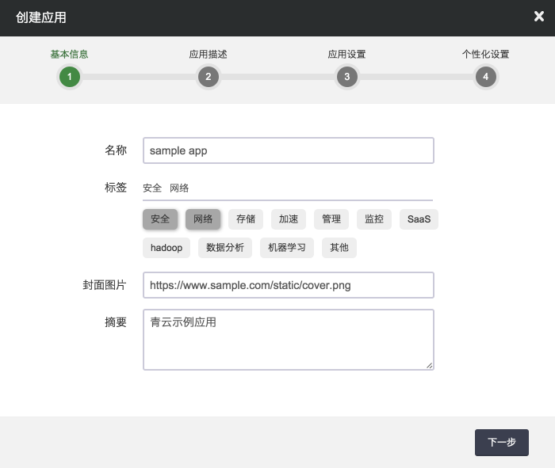
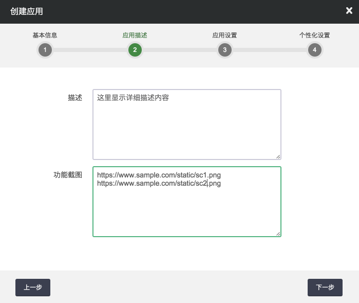
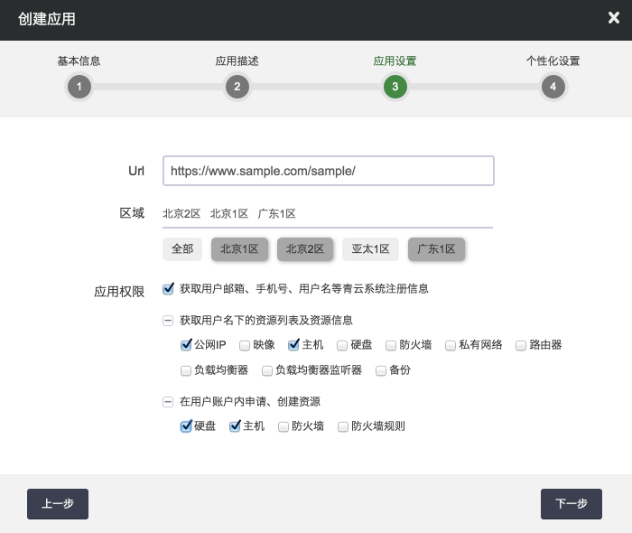
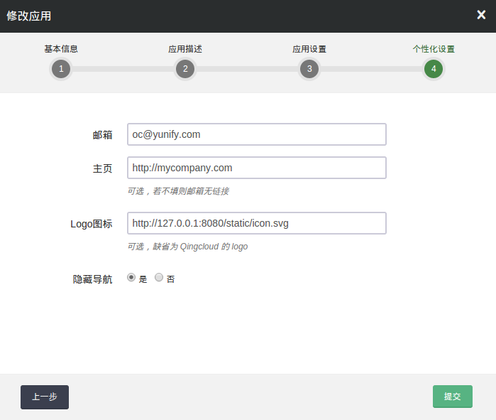
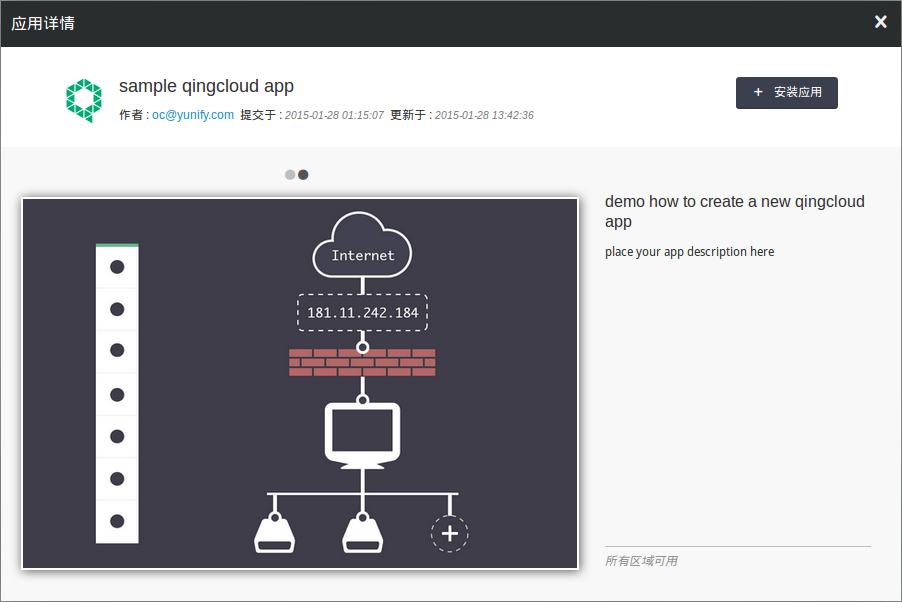
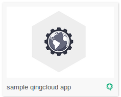

---
---

# 应用开发教程[¶](#app-common-tutorial "永久链接至标题")

青云应用需要服务提供商提供服务网页，整合到青云的 iframe 里面供用户使用。加载 iframe 时，用户授权信息会发送到对应的网址。服务提供商拿到授权信息就可以通过青云 api 获取用户资源信息，为用户提供各种服务。

## 示例程序[¶](#id2 "永久链接至标题")

首先，服务提供商需要提供一个青云应用，以 URL 的形式整合到青云。我们建了一个 [非常基础的青云应用示例程序](https://github.com/yunify/sample_qc_ap) 。 它使用 Django 提供 web 服务，结合 [QingCloud Python SDK](https://github.com/yunify/qingcloud-sdk-python) 与青云平台交互。您可以把示例程序同步到本地，用python运行:

```
$ # install dependence
$ sudo apt-get install python-pip apache2 git
$ sudo pip install Django qingcloud-sdk
$ git clone https://github.com/yunify/sample_qc_ap.git
$ cd sample_qc_ap/mysite
$ python manage.py runserver 127.0.0.1:8080
     Performing system checks...

     System check identified no issues (0 silenced).
     January 29, 2015 - 02:50:11
     Django version 1.7.4, using settings 'mysite.settings'
     Starting development server at http://127.0.0.1:8080/
     Quit the server with CONTROL-C.
```

这样您本地就运行了一个示例应用，您可以通过浏览器访问 [http://127.0.0.1:8080/sample/](http://127.0.0.1:8080/sample/) 。

注解

由于青云应用必须使用 HTTPS 协议，要在青云应用平台运行示例程序，需要提供 HTTPS URL 。这里提供两个方法，您可以任选一个:

1.  [配置apache和mod_wsgi](https://docs.djangoproject.com/en/1.8/howto/deployment/wsgi/modwsgi/) ，并启用 ssl
2.  在青云虚拟主机上运行示例应用，并使用青云负载均衡器，通过 [HTTPS模式监听器](https://docs.qingcloud.com/guide/loadbalancer.html#https) 连接后端

## 授权[¶](#id4 "永久链接至标题")

_用户，青云和服务提供商三方互相机制_

*   服务提供商使用自己私有的 secret_app_key 验证来自青云的请求，和签名发往青云 api 的请求
*   用户通过提供 access_token 授权青云应用访问自己的资源
*   服务提供商调用青云 api 获取用户信息时，需要提供 access_token ，并用 secret_app_key 对请求签名
*   服务提供商调用青云 api 获取自己的信息时，不需要 access_token

具体使用场景如下

当用户进入应用时，会通过浏览器 post form 到青云应用 URL , 包含 payload 和 signature 两个域，编码方式如下：

1.  base64 编码
2.  转换”+”到”-”, “/”到”_”， 并去掉结尾的”=”
3.  因为base64编码后的字符串长度是4的倍数，解码时按长度补齐”=”

注解

编码参考自 [Base64 URL_applications](http://en.wikipedia.org/wiki/Base64#URL_applications)

这里提供 php 和 python 的编码/解码函数供开发者参考:

```
#php版本
function base64_URL_encode($data) {
  return rtrim(strtr(base64_encode($data), '+/', '-_'), '=');
}
function base64_URL_decode($data) {
  return base64_decode(str_pad(strtr($data, '-_', '+/'), strlen($data) % 4, '=', STR_PAD_RIGHT));
}

#python版本
import base64
def base64_URL_decode(inp):
    return base64.urlsafe_b64decode(str(inp + '=' * (4 - len(inp) % 4)))

def base64_URL_encode(inp):
    return base64.urlsafe_b64encode(str(inp)).rstrip('=')
```

青云应用拿到请求后，首先要验证请求是否来自青云, 对拿到的 payload 按 HmacSHA256 签名，并 base64 URL 编码。 得到的字符串应与 signature 值相同。可参考 [python sdk 中对应的代码](https://github.com/yunify/qingcloud-sdk-python/blob/master/qingcloud/conn/auth.py)

```
def extract_payload(self, payload, signature):

    expected_sig = self.sign_string(payload)
    if signature != expected_sig:
        return None

    return json_load(base64_URL_decode(payload))
```

其中 sign_string 调用 python 提供的 sha256 对 payload 签名, 具体步骤请参考 sdk 对应代码。payload 解码后得到 json 对象，包含 user_id, access_token, action, zone, expires 和 lang 等信息, 例如：

```
{
    "user_id": "usr-inea9w7Z",
    "access_token": "t1aPdMq0yOkfhtdut9MnCUydEtSfJ1kg",
    "action": "view_app", # 表示用户进入应用
    "zone": "pek3a",
    "expires": "2014-02-08T12:00:00.000Z",
    "lang": "zh_CN"
}
```

注解

上面的 action 除了进入应用( view_app )外，还有安装应用、卸载应用等事件通知， 详见 [_事件通知_](tutorial2.html#event-notification)

需要提一下的是，由于请求来自青云，青云应用通常需要解除跨域的限制。 [在示例代码中](https://github.com/yunify/sample_qc_ap/blob/master/mysite/sample/views.py) ， 使用Django提供的 “csrf_exempt” 解除跨域 post 限制。由于 Django 默认对 iframe 嵌入有限制，还需要使用 “xframe_options_exempt” 解除限制。

```
# allow post from other site
@csrf_exempt
# allow embedded into iframe
@xframe_options_exempt
def index(request):
...
```

示例代码中， “index” 函数处理 [http://127.0.0.1:8080/sample/](http://127.0.0.1:8080/sample/) 请求。当用户浏览器post授权信息到青云应用时会被调用。 index 函数参数是 request 对象，包含用户发过来的 form 域:

```
payload   = request.POST["payload"]
signature = request.POST["signature"]
```

auth.extract_payload 是 sdk 提供的函数，用来验证 signature 和解码 payload 。 如果验证失败，返回 None ；成功的话，返回一个 dict 对象，包含 user_id, access_token, action, zone, expires 和 lang。 验证和解码具体方法在本节最开始已经介绍过，可以参照 sdk 相关代码。下面代码是调用 sdk 的场景：

```
from qingcloud.conn.auth import AppSignatureAuthHandler
....

auth = AppSignatureAuthHandler(settings.APP_ID,
                               settings.SECRET_APP_KEY)

access_info = auth.extract_payload(payload, signature)
if not access_info:
    raise AuthException("Incorrect signature")
```

注解

APP_ID和SECRET_APP_KEY在青云开发者视图提交应用后就能拿到。

## 用户账户对接[¶](#id6 "永久链接至标题")

对于已有用户管理系统的应用，通常需要在用户第一次访问时，自动为青云用户注册账号。由于青云账号分主账户和子账户两种，这两个账号之间虽然共用一个登录邮箱，但是资源互相隔离，不宜通过账户邮箱直接注册。我们推荐的方式如下：

*   使用 @qingcloud.com 作为注册账号，平等对待主账户和子账户
*   使用青云用户的“通知邮箱”发送邮件通知
*   手机号已经短信验证过，无需再次验证

上述通知邮箱和手机号可以通过调用 [_describe_users_](../api/describe_users.html#app-api-describe-users) 接口查询，下一节会以此为例，介绍如何调用青云API。

## 通过青云API访问用户资源[¶](#api "永久链接至标题")

上一节介绍了青云应用如何得到用户浏览器发过来的授权信息，这一节介绍如何使用access_token访问青云api。

青云为服务提供商提供了专用的api频道： [https://api.qingcloud.com/app/](https://api.qingcloud.com/app/)

这个频道除了提供 [IAAS API](https://docs.qingcloud.com/product/api/index.html) 所有功能和扩展函数以外，还接受access_token，让服务提供商以用户身份调用api。而且新的频道兼容传统api的签名编码方式和 [_app的base64 URL编码方式_](#base-url) 。

在示例应用里面，调用了 [_describe_users_](../api/describe_users.html#app-api-describe-users) 函数获得当前用户的信息：

```
class QcControl:

    def __init__(self, payload, signature):
        ...
        self.conn = AppConnection(settings.APP_ID,
                                  settings.SECRET_APP_KEY,
                                  access_info["zone"],
                                  access_token=access_info["access_token"])
    def get_user_info(self):
        return self.conn.describe_users()
```

[_describe_users_](../api/describe_users.html#app-api-describe-users) 是 sdk 提供的一个函数，不需要额外参数，作用是返回当前的用户信息。您可以通过使用这个函数获得用户的手机号，邮箱等。创建 AppConnection 实例时，已经传入了 access_token , 当sdk发请求给青云时，会自动在请求中添加 access_token 。

青云应用除了可以访问 [IAAS API](https://docs.qingcloud.com/api/index.html) ， 还可以访问 [APP API](https://docs.qingcloud.com/app/api/) . APP 访问 IAAS API 时，需要做以下修改：

*   修改API URL为: [https://api.qingcloud.com/app/](https://api.qingcloud.com/app/)，
*   请求中加上access_token参数,
*   使用app_id替换access_key_id。

示例请求(请忽略换行)：

```
https://api.qingcloud.com/app/
?access_token=gDV9PoTSwBII9Djv0GmZmSHVAxmsg6Or
&action=DescribeUsers
&app_id=app-wdpukp10
&users=usr-xxxxxx
&signature_method=HmacSHA256
&signature_version=1
&time_stamp=2015-04-20T08%3A45%3A22Z&version=1
&zone=pek3a
&signature=Nnn95zJjussulpn3kfjSBE7bFFvAMKMtqk6pByIaWi8
```

注解

如果您使用python以外的开发语言，可以在github.com搜索qingcloud关键字，能找到绝大多数语言的sdk。这些sdk由青云用户开发，使用起来大同小异，只是需要为app调整一下参数。

由于您的青云应用是加载在iframe里面，为了自动调整iframe高度，需要在您的网页body结尾加入一段javascript代码，示例应用的模版是这样定义的:

```

    Hello {{username}}!
    Welcome to QingCloud App
    Your notify email address is {{notify_email}}

      // 取消自动设置
      QCLIB.App.setAutoSetAppHeight(false);
      // 当页面是动态生成时，可以在需要时手动设置高度
      var height = getPageHeight();
      QCLIB.App.setAppHeight(height);

```

到这里，示例程序就结束了，您需要结合自己的服务特点，结合青云api为用户提供优质服务。下面介绍如何提交青云应用。

## 提交青云应用[¶](#id8 "永久链接至标题")

首先，您需要在青云主页注册账号，并通过工单申请成为青云合作伙伴。被认证成为合作伙伴后，就能在左侧导航栏看到“开发者”视图。进入“开发者”视图，点击“创建应用”开始创建一个新的青云应用：

> 

其中标签代表应用的提供的功能，会影响到应用中心的分类。接下来需要输入应用的文字和图片描述。图片URL至少需要一个，以换行分隔。

> 

接下来在应用设置里面，需要输入：

*   应用URL： 您的Web应用URL。**必须是HTTPS地址**。
*   区域： 由于青云在世界范围部署在多个区域，您的应用可能不适用于其中的一些区域，比如亚太一区。您在这里需要根据实际情况选择适用的区域。
*   API访问权限：
    *   DescribeUsers: 获取用户联系方式
    *   DescribeEips: 获取公网IP列表
    *   DescribeImages: 获取镜像列表
    *   DescribeInstances: 获取主机列表
    *   DescribeVolumes: 获取硬盘列表
    *   DescribeSecurityGroups: 获取防火墙列表
    *   DescribeVxnets: 获取私有网络列表
    *   DescribeRouters: 获取路由器列表
    *   DescribeLoadBalancers: 获取负载均衡器列表
    *   DescribeLoadBalancerListeners: 获取负载均衡器监听器列表
    *   DescribeSnapshots: 获取备份列表
    *   CreateVolumes: 创建硬盘
    *   RunInstances: 创建主机
    *   CreateSecurityGroup: 创建防火墙
    *   AddSecurityGroupRules: 增加防火墙规则

您需要根据自己服务的实际情况，向用户要求授权。用户安装应用时，有可能根据应用要求的权限，决定是否继续安装应用。

> 

下一步个性化设置需要您输入一些信息，包括联系方式，公司网址，应用图标等。点击提交完成创建应用。

> 

图片规格如下：

*   Logo图标 48*48px
*   封面图片 210*140px
*   功能截图 600*400px

创建后，在“密钥”这一列，点击“重新生成”，拿到应用对应的密钥。您在web应用里面，需要使用这个密钥验证来自青云的请求，并签名发往青云API的请求。

> 

注解

为了保护密钥的安全，密钥只在生成时显示一次。请妥善保管，如果丢失或泄露，重新生成一个，可以让旧密钥失效。

然后就可以在开发视图里面预览您的应用。这个时候可以结合实际情况调试一下青云应用，并调整显示效果。我们提供两种预览方式：

1.  右击应用->预览详情：预栏新建的应用在应用中心的显示效果。

>
>
>
>
> 注解
>
> 在预览模式中，点击安装并不会安装应用。
>
>
>
> 

2.  右击应用->预览应用(或者直接点击应用ID)：加载当前的应用。这个功能方便您调试应用跟青云整合后的效果。您可以在应用后台检查一下，是否可以正确解码青云发过来的信息。

> 

在预览试图里面测试通过以后，就可以提交应用。青云的管理员会审核您提交的应用，通过以后能显示到应用中心里面。

> 

用户第一次点击应用，会进入应用详情。通过点击安装按钮启用应用。下次点击应用时，就直接加载应用的URL了。
