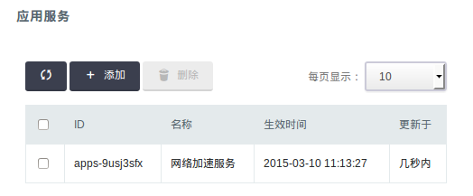
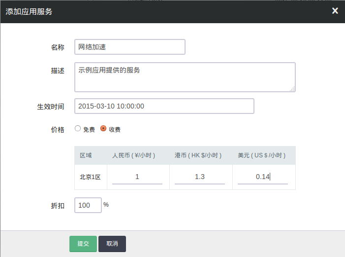
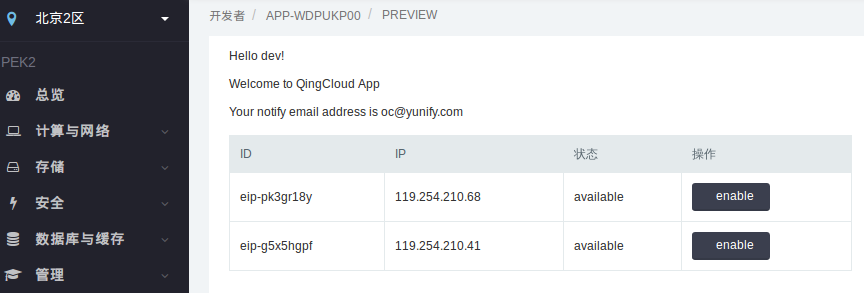

---
---

# 应用开发教程2[¶](#app-common-tutorial2 "永久链接至标题")

上一节讲了如何创建一个最基础的青云应用，这一节介绍如何加入计费功能。

## 计费原则[¶](#id2 "永久链接至标题")

每个应用可以创建一个或多个服务(app_service)

*   服务在每个区(zone)和每种货币(cny,usd,hkd)都有对应的价格
*   应用可以指定价格生效时间和折扣，价格未生效前，按当前价格计算。
*   收费模式有两类：按使用时长扣费 和 一次性扣费。

应用得到用户授权的 access_token 时，就可以开始计费，调用 [_LeaseApp_](../api/lease_app.html#app-api-lease-app)

*   输入参数包括服务ID，服务绑定的青云资源ID(可选)，access_token和zone
*   返回计费资源ID (appr_id)。可以通过 DescribeAppResources API 查询它的状态

停止计费，调用 [_UnLeaseApp_](../../appcenter1/api/unlease_app.html#app-api-unlease-app) , 不需要access_token. 传入参数是资源列表，可以是如下资源:

*   appr_id 对指定的一个计费资源停止计费
*   service_id 对所有服务的计费资源停止计费
*   app_id 对所有应用的计费资源
*   user_id 制定用户的资源，可以组合以上ID使用，停止某个用户的部分或全部计费

警告

注意下面对不同计费模式差异的说明

如果服务的计费模式是 “一次性扣费” ，则 UnLeaseApp API 需要在成功 LeaseApp 后，1小时内调用以完成扣费:

> LeaseApp -> 第三方开启服务 -> UnleaseApp -> 完成扣费

如果是“按使用时长扣费”，则跟青云的弹性资源一样，都是按小时扣费，按秒计费。也就是说，调用 LeaseApp 时， 对用户扣一小时费用，然后每小时扣一次费，直到调用 UnLeaseApp 。 最后一小时中没有消费的金额，按秒折算，返还到用户账号中。

## 创建应用服务[¶](#service-id "永久链接至标题")

进入青云控制台，开发者视图。点击上一篇教程创建的应用，可以进入应用详情视图，找到“应用服务”-“添加”按钮。



在创建应用服务对话框中，除了名称，描述，还可以填生效时间，不填的话就是当前时间。然后为每个区域的每种货币定义好价格。还可以对所有价格有个统一的折扣可以填。实际的价格 = 价格 * 折扣 %。 如果您的应用完全免费，但是希望用户释放对应青云资源时能收到通知，可以通过创建一个免费服务来实现。具体方法 [_事件通知_](#event-notification) 会详细介绍。



创建了应用服务后，会得到对应的service_id，在调用LeaseApp API时需要用到。下面我们看 [青云应用示例程序](https://github.com/yunify/sample_qc_ap) 中，使用计费API的例子。让我们假设示例应用可以为用户提供公网加速服务，对用户的每个公网IP地址可以开启加速服务。当用户启动IP对应的加速时，除了启用加速服务外，还需要通知青云开始计费; 当用户停用服务时，需要通知青云结束计费。

示例应用的界面如图：



当用户点击enable|disable按钮时，会执行如下代码，对用户开始|结束计费：

```
if action == "enable":
    # you will need to provide service to your user here

    rep = qc.conn.lease_app(settings.SERVICE_ID, qc_resource_id)
    print rep
    if rep:
        appr_id = rep["appr_id"]
        # store appr_id to unlease it later
        user_control[user_id][zone][qc_resource_id] = appr_id
        print "store appr_id %s to qc id %s"%(appr_id, qc_resource_id)
elif action == "disable":
    # stop your service and then unlease app

    # unlease app does not need access_token
    appr_id = user_control[user_id][zone][qc_resource_id]
    print "unlease appr [%s]"%(appr_id)
    if appr_id:
        rep = qc.get_connection(None, zone).unlease_app([appr_id])
        if rep:
            del user_control[user_id][zone][qc_resource_id]
        print "unlease appr [%s] result is [%s]"%(appr_id, rep)
```

上述代码中，”lease_app”是qingcloud sdk中定义的函数。它的第一个参数是公网加速服务对应的 [_service_id_](../../image_app/common/billing.html#service-id) ；第二个参数是服务对应的青云资源ID。由于公网加速服务的对象是青云用户的公网IP地址，所以这里用的是eip_id。API返回结果包含appr_id，表示应用服务对应的计费资源。这里需要把appr_id保存起来，停止计费的时候需要使用。青云用户查看计费详情时，可以看到appr_id对应的消费记录。

注解

为了让示例应用尽量简单，我们把appr_id保存到了user_control这个对象里面，在真实的场景中，请把它保存在数据库里。

“unlease_app”是跟”lease_app”对应的函数，用来停止计费。在示例应用中，用户不需要加速服务时，通过点击”disable”按钮停止计费，随后应用会调用到这个函数。它的输入参数是一个数组，数组成员可以是 appr_id, service_id, app_id 和 user_id，具体使用方法前面已经介绍过。需要注意的是，”unlease_app”并不需要用户授权，这表示调用青云API时，公共参数不需要传入access_token。示例里面使用qc.get_connection(None, zone)得到新的connection对象，就是为了让公共参数中不包含access_token。

## 事件通知[¶](#event-notification "永久链接至标题")

*   应用除了调用青云的API开始和结束计费，还需要处理来自青云的事件。这些事件包括
    *   用户安装应用时，发送 install_app 通知
    *   用户卸载应用时，发送 uninstall_app 通知
    *   服务绑定的青云资源被销毁时，发送 terminate_resource 通知
    *   用户欠费时，发出 suspend_resource 通知
    *   用户续费时，发出 resume_resource 通知
*   用户打开应用也是一种事件，是 view_app 通知
*   应用需要根据自己实际情况，处理来自青云的通知，比如： 销毁绑定的青云资源时停止服务计费。

在示例应用的QcControl类中，定义了self.handle_map对象，来处理这几种通知事件。对应的方法如下：

```
def install_app(self):
    # you can inital user management in this event
    # or leave it to view_app

    print "%s installed App"%self.req["user_id"]

def uninstall_app(self):
    # stop all your service and unlease-app for this user

    print "%s uninstalled App"%self.req["user_id"]

    user_id    = self.req["user_id"]
    zone       = self.req["zone"]
    self.get_connection(None, zone).unlease_app([user_id, settings.APP_ID])

def suspend_resource(self):
    # do something to stop your service

    print "App resource %s for %s of %s has been suspended" \
            %(self.req["appr_id"], self.req["service_id"],
              self.req["user_id"])

def resume_resource(self):
    # do something to resume your service

    print "App resource %s for %s of %s has been resumed" \
            %(self.req["appr_id"], self.req["service_id"],
              self.req["user_id"])

def terminate_resource(self):
    print "Related QC resource of %s for %s of %s has been terminated" \
            %(self.req["appr_id"], self.req["service_id"],
              self.req["user_id"])
    appr_id    = self.req["appr_id"]
    zone       = self.req["zone"]
    self.get_connection(None, zone).unlease_app([appr_id])
```

示例程序出的是青云推荐的行为，您可以根据自己应用的实际情况做调整，并对用户提供的服务做相应。

注解

suspend_resource时，表示用户没有足够余额支付您的费用。事件发生时，青云会停止用户的资源，但是对应的数据会保留5天。5天以后如果仍未充值，青云会主动调用unlease_app。您的应用不必在suspend/resume_resource事件处理函数中调用unlease_app API。

对于完全免费的应用，如果想在青云对应的资源销毁时收到terminate_resource的消息，也需要创建一个免费的应用服务，并在调用LeaseAPI时传入对应青云资源的ID, 比如eip_id。这样用户不在使用这个IP地址时，应用可以接到通知，来释放自己的资源。
