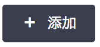
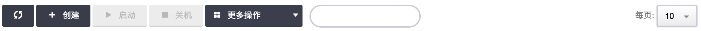
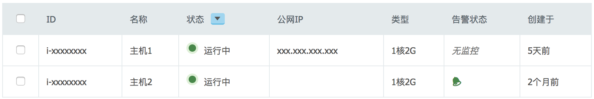
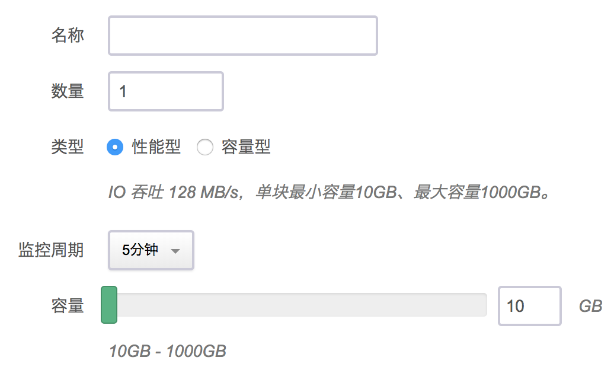
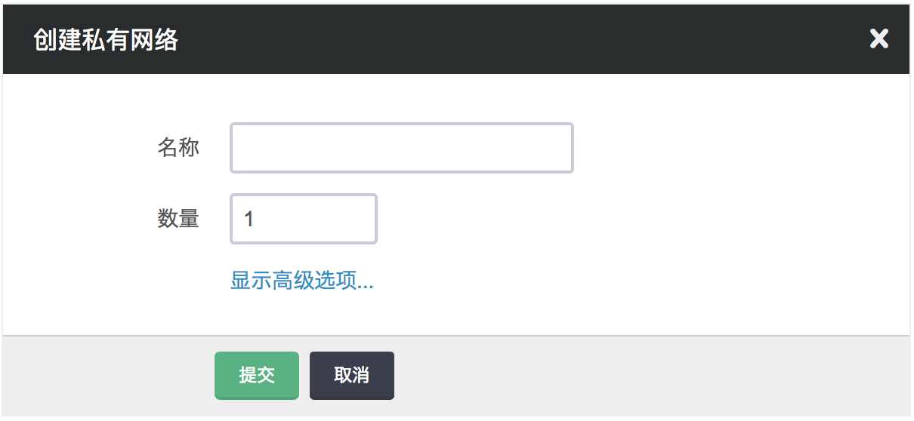
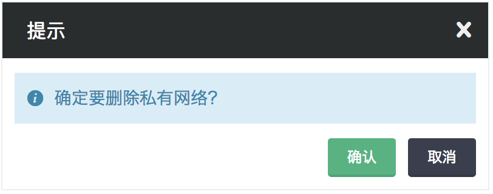
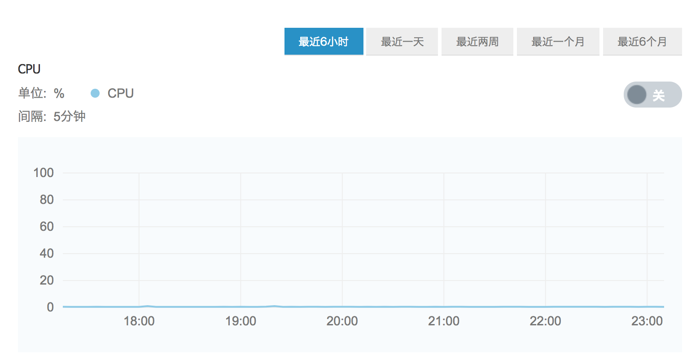

---
---

<style>
  .html-code {
    display: none
  }
</style>


# 开发者工具[¶](#id1 "永久链接至标题")

Qingcloud 应用中心提供了 appcenter.css 样式库和 qclib.js 开发包，用于生成 Qingcloud 控制台的标准组件，并可以与控制台进行交互。

## appcenter.css 样式库[¶](#appcenter-css "永久链接至标题")

应用以 iframe 方式嵌入 Qingcloud 控制台，因此需要展示上尽量保持与控制台风格统一。Qingcloud 应用中心提供了一套 css 样式库，定义了一系列组件类名和 html 代码结构，调用者可以在动态语言模板（或静态 html 文件）中按规范生成 html 代码。

常用页面组件包含toolbar、button、表格、form表单、tooltip、弹出层、提示框、图表等，以 button 为例。

首先，在页面中引用 appcenter.css 样式文件:

```
<link href="https://console.qingcloud.com/static/css/appcenter.css" rel="stylesheet" type="text/css" />

```

在页面中按控件样例的代码生成 html，保持类名，如:

```
<a class="btn" href="#"><span class="icon icon-create"></span><span class="text">添加></span></a>
```

即可生成如下的按钮:



## qclib.js 工具包[¶](#qclib-js "永久链接至标题")

Qingcloud 应用中心还提供了一个 qclib.js 的应用工具包。该工具包有生成标准 Qingcloud 控制台组件的 Mods 模块，以及与控制台交互的App模块。后续还会提供直接在控制台调用 Qingcloud API 的 API 模块。

上述 button 的例子，使用Mods模块，可以生成 button 的 html 代码：

```

  var btn = new QCLIB.Mods.Button({type: 'create', text:'创建'});
  // 可以直接操作 Dom 元素
  some_element.appendChild(btn.el);
  // 或者获取 Dom 元素的 html 代码
  some_element.innerHTML = btn.html();
  // 也可以链式操作
  some_element.innerHTML = new QCLIB.Mods.Button({type: 'create', text:'创建'}).html();

```

qclib 的 App 模块提供了一些与 Qingcloud 控制台交互的方法：

```

  // 设置控制台的 iframe 应用高度
  var height = getPageHeight();
  QCLIB.App.setAppHeight(height);

  // 返回控制台应用中心页面
  some_button.addEventListener('click', function(e) {
    QCLIB.App.toAppCenter();
  }, false);

  // 改变控制台 URL，下面的例子会将控制台改为
  // "https://console.qingcloud.com/{zone}/overview/"
  var location = "overview";
  some_button.addEventListener('click', function(e) {
    QCLIB.App.setLocation(location);
  }, false);

```

以下是各种组件使用 qclib.js Mods 模块生成组件，以及 html 的样式结构的代码示例

## toolbar & button[¶](#toolbar-button "永久链接至标题")

<div style="display: none">
<div class="app-toolbar">
    <div class="toolbar">
      <a class="btn" href="#">
        <span class="icon icon-refresh"></span>
      </a>
      <a class="btn" href="#">
        <span class="icon icon-create"></span>
        <span class="text">添加</span>
      </a>
      <a class="btn btn-forbidden" href="#">
        <span class="icon icon-start"></span>
        <span class="text">启动</span>
      </a>
      <a class="btn btn-danger btn-forbidden" href="#">
        <span class="icon icon-stop"></span>
        <span class="text">关机</span>
      </a>
      <div class="dropdown btn-disabled">
        <input class="dropdown-toggle" type="text" />
        <div class="dropdown-text">更多操作</div>
        <div class="dropdown-content">
          <a class="btn btn-forbidden" href="#">
            <span class="icon icon-restart"></span>
            <span class="text">重启</span>
          </a>
          <a class="btn btn-forbidden" href="#">
            <span class="icon icon-volumes"></span>
            <span class="text">加载硬盘</span>
          </a>
          <a class="btn btn-forbidden" href="#">
            <span class="icon icon-keypairs"></span>
            <span class="text">加载SSH密钥</span>
          </a>
          <a class="btn btn-forbidden" href="#">
            <span class="icon icon-security_groups"></span>
            <span class="text">加载防火墙规则</span>
          </a>
          <a class="btn btn-forbidden" href="#">
            <span class="icon icon-vxnet"></span>
            <span class="text">加入网络</span>
          </a>
          <a class="btn btn-forbidden" href="#">
            <span class="icon icon-resize"></span>
            <span class="text">更改配置</span>
          </a>
          <a class="btn btn-forbidden" href="#">
            <span class="icon icon-snapshot"></span>
            <span class="text">创建备份</span>
          </a>
          <a class="btn btn-forbidden" href="#">
            <span class="icon icon-alarms"></span>
            <span class="text">绑定告警策略</span>
          </a>
          <a class="btn btn-forbidden" href="#">
            <span class="icon icon-reset"></span>
            <span class="text">重置系统</span>
          </a>
          <a class="btn btn-danger btn-forbidden" href="#">
            <span class="icon icon-terminate"></span>
            <span class="text">删除</span>
          </a>
        </div>
      </div>
      <div class="form-search">
        <input type="search" placeholder="">
      </div>
      <div class="pagination">
        <span class="per-page">每页显示：&nbsp;</span>
        <div class="select-con">
          <select class="dropdown-select" name="limit">
            <option value="10" selected>10</option>
            <option value="20">20</option>
            <option value="50">50</option>
            <option value="100">100</option>
          </select>
        </div>
      </div>
    </div>
  </div>
  </div>

  

  <br/>
  <a class="view-js" href="#" data-action="app-toolbar">&gt;&gt;查看 javascript 代码</a>

  <pre class="html-code highlight" data-action="app-toolbar">
    var toolbar = new QCLIB.Mods.Toolbar({
      buttons: [
        {type: 'refresh'},
        {type: 'create', text: '添加'},
        {type: 'start', text: '启动', forbidden: true},
        {type: 'stop', text: '关机', forbidden: true},
        {type: 'more', text: '更多操作', sub_buttons: [
          {type: 'restart', text: '重启', forbidden: true},
          {type: 'volumes', text: '硬盘', forbidden: true},
          {type: 'keypairs', text: '加载SSH密钥', forbidden: true},
          {type: 'security_groups', text: '加载防火墙规则', forbidden: true},
          {type: 'vxnet', text: '加入网络', forbidden: true},
          {type: 'resize', text: '更改配置', forbidden: true},
          {type: 'snapshot', text: '创建备份', forbidden: true},
          {type: 'alarms', text: '绑定告警策略', forbidden: true},
          {type: 'reset', text: '重置系统', forbidden: true},
          {type: 'terminate', text: '删除', forbidden: true},
        ]}
      ],
      search: true,
      pagination: true
    });
  </pre>

  <a class="view-html" href="#" data-action="app-toolbar">&gt;&gt;查看 html 结构</a>

  <pre class="html-code" data-action="app-toolbar">
  </pre>
  <p />

## 表格[¶](#id2 "永久链接至标题")

<div style="display: none">
<div class="app-table">
    <table class="table table-bordered table-hover">
      <thead>
        <tr>
          <th class="checkbox"><input type="checkbox"></th>
          <th>ID</th>
          <th>名称</th>
          <th>
            状态
            <div class="dropdown">
              <input class="dropdown-toggle" type="text">
              <div class="dropdown-text"></div>
              <div class="dropdown-content">
                <a href="#" data-filter="status" data-status="pending,running,stopped,suspended">全部</a>
                <a href="#" data-filter="status" data-status="pending">等待中</a>
                <a href="#" data-filter="status" data-status="running">运行中</a>
                <a href="#" data-filter="status" data-status="stopped">已关机</a>
                <a href="#" data-filter="status" data-status="suspended">已暂停</a>
                <a href="#" data-filter="status" data-status="terminated">已删除</a>
                <a href="#" data-filter="status" data-status="ceased">已销毁</a>
              </div>
            </div>
          </th>
          <th>公网IP</th>
          <th>类型</th>
          <th>告警状态</th>
          <th>创建于</th>
        </tr>
      </thead>
      <tbody>
        <tr>
          <td class="checkbox"><input type="checkbox"></td>
          <td>i-xxxxxxxx</td>
          <td class="name">主机1</td>
          <td class="running">
            <span class="icon-status icon-running"></span>&nbsp; 运行中
          </td>
          <td>xxx.xxx.xxx.xxx</td>
          <td>1核2G</td>
          <td><span class="none">无监控</span></td>
          <td class="time">5天前</td>
        </tr>
        <tr>
          <td class="checkbox"><input type="checkbox"></td>
          <td>i-xxxxxxxx</td>
          <td class="name">主机2</td>
          <td class="running">
            <span class="icon-status icon-running"></span>&nbsp; 运行中
          </td>
          <td></td>
          <td>1核2G</td>
          <td>
            <span class="icon-alarms icon-alarm-ok"></span>
          </td>
          <td class="time">2个月前</td>
        </tr>
      </tbody>
    </table>
  </div>
  </div>

  

  <a class="view-js" href="#" data-action="app-table">&gt;&gt;查看 javascript 代码</a>

  <pre class="html-code highlight" data-action="app-table">
    // 定义嵌套在table中的dropdown组件
    // 可以分别定义filter的字段名和展示名称
    var dropdown = new QCLIB.Mods.Dropdown({
      filters: [
        {filter: 'pending', text: '等待中'},
        {filter: 'running', text: '运行中'},
        {filter: 'stopped', text: '已关机'},
        {filter: 'suspended', text: '已暂停'},
        {filter: 'terminated', text: '已删除'},
        {filter: 'ceased', text: '已销毁'}
     ]});
    // 也可以省略展示名称，字段名与展示名统一
    // var dropdown = new QCLIB.Mods.Dropdown({
    //   filters: ['pending','running','stopped','suspended','terminated','ceased']
    // });
    // 定义嵌套在table中的icon插件
    var icon = new QCLIB.Mods.Icon({type: 'status', status: 'running'});
    // table的head和body都可以嵌套组件
    var qctable = new QCLIB.Mods.Table({
      checkbox: true,
      head: ['ID', '名称', ['状态', dropdown], '公网IP', '类型', '告警状态', '创建于'],
      body: [['i-xxxxxxxx', '主机1', [icon, ' 运行中'], 'xxx.xxx.xxx.xxx', '1核2G', '<span class="none">无监控</span>', '5天前']]
    });
    // 可以动态添加一行内容
    var alarm_icon = new QCLIB.Mods.Icon({type: 'alarms', alarms: 'alarm-ok'});
    var row = ['i-xxxxxxxx', '主机1', [icon, ' 运行中'], '', '1核2G', alarm_icon, '2个月前'];
    qctable.appendRow(row);
  </pre>

  <a class="view-html" href="#" data-action="app-table">&gt;&gt;查看 html 结构</a>

  <pre class="html-code" data-action="app-table"></pre>

## form表单[¶](#form "永久链接至标题")

<div style="display: none">
<div class="app-form">
    <form class="form form-horizontal">
      <fieldset>
        <div class="item">
          <div class="control-label">名称</div>
          <div class="controls">
            <input type="text" name="volume_name">
          </div>
        </div>
        <div class="item">
          <div class="control-label">数量</div>
          <div class="controls">
            <input class="medium" type="text" name="count" value="1">
          </div>
        </div>
        <div class="item">
          <div class="control-label">类型</div>
          <div class="controls">
            <label class="inline">
              <input type="radio" value="0" name="volume_type" checked="">
              性能型
            </label>
            <label class="inline">
              <input type="radio" value="1" name="volume_type">
              容量型
            </label>
            <span class="help volume">
              IO 吞吐 128 MB/s，单块最小容量10GB、最大容量1000GB。
            </span>
            <span class="help volume" style="display: none">
              IO 吞吐 36 MB/s，单块最小容量100GB、最大容量5000GB。
            </span>
          </div>
        </div>
        <div class="item">
          <div class="control-label">监控周期</div>
          <div class="controls">
            <div class="select-con">
              <select class="dropdown-select" name="period">
                <option value="1m">1分钟</option>
                <option value="5m" selected="">5分钟</option>
              </select>
            </div>
          </div>
        </div>
        <div class="item">
          <div class="control-label">容量</div>
          <div class="controls size">
            <div class="slider slider-horizontal" style="width: 320px;">
              <div class="slider-track">
                <div class="slider-selection" style="left: 0%; width: 0%;"></div>
                <div class="slider-handle round" style="left: 0%;"></div>
                <div class="slider-handle round hide" style="left: 0%;"></div>
              </div>
              <div class="tooltip top hide" style="top: -14px; left: 0px;">
                <div class="tooltip-arrow"></div>
                <div class="tooltip-inner">10 GB</div>
              </div>
              <input id="slider" class="hide" type="text" style="width: 320px" value="10">
            </div>
            <input class="preview mini" name="size" type="text" value="10">
            <span class="help inline">GB</span>
            <span class="help">10GB - 1000GB</span>
          </div>
        </div>
      </fieldset>
    </form>
  </div>
  </div>

  

  <a class="view-js" href="#" data-action="app-form">&gt;&gt;查看 javascript 代码</a>

  <pre class="html-code" data-action="app-form">
    // 每个表单项作为一个item添加
    // 如果有多行tips，可以用数组作为参数，否则可以用一个对象或字符串。
    // 当使用字符串时，自动作为text，而不指定额外的className
    var form = new QCLIB.Mods.Form({
      items: [
        {label: '名称', type: 'text', name: 'volume_name'},
        {label: '数量', type: 'text', length:'medium', name: 'count', value: 1},
        {label: '类型', type: 'radio', name: 'volume_type', radios: [
          {text: '性能型', value: "0", checked: true},
          {text: '容量型', value: "1"}
        ], tips: [
          {
            text: 'IO 吞吐 128 MB/s，单块最小容量10GB、最大容量1000GB。',
            className: 'volume'
          },
          {
            text: 'IO 吞吐 36 MB/s，单块最小容量100GB、最大容量5000GB。',
            className: 'volume'
          }
        ]},
        {label: '监控周期', type: 'select', name: 'period', options: [
          {value: '1m', text: '1分钟'}, {value: '5m', text: '5分钟', selected: true}
        ]},
        {label: '容量', type: 'slider', name: 'size', value: '10', unit: 'GB',
         tips: '10GB - 1000GB'
        }
      ]
    });
  </pre>

  <a class="view-html" href="#" data-action="app-form">&gt;&gt;查看 html 结构</a>

  <pre class="html-code" data-action="app-form"></pre>

## tooltip[¶](#tooltip "永久链接至标题")

<div style="display: none">
<div class="app-tooltip">
  <div class="wrapper">
      <a class="icon icon-snapshot" href="#" data-tooltip="" title="" data-original-title="创建备份"></a>
      <div class="tooltip fade top in" style="top: -40px; left: -25px">
        <div class="tooltip-arrow"></div>
        <div class="tooltip-inner">创建备份</div>
      </div>
    </div>
  </div>
  </div>

  

  <a class="view-js" href="#" data-action="app-tooltip">&gt;&gt;查看 javascript 代码</a>

  <pre class="html-code" data-action="app-tooltip">
    var tooltip = new QCLIB.Mods.Tooltip({
      text: '创建备份',
      rel: document.querySelectorAll('.wrapper .icon-snapshot')[0]
    });
  </pre>

  <a class="view-html" href="#" data-action="app-tooltip">&gt;&gt;查看 html 结构</a>

  <pre class="html-code" data-action="app-tooltip"></pre>

## 弹出层[¶](#id3 "永久链接至标题")

<div style="display: none">
<div class="app-modal">
    <div class="modal" style="width: 600px; height: auto;">
      <div class="modal-header" style="cursor: move;">
        <h4>
          创建私有网络
          <a href="#" class="close">
            <span class="icon-close icon-Large"></span>
          </a>
        </h4>
      </div>
      <div class="modal-content" id="">
        <form class="form form-horizontal">
          <fieldset>
            <legend>创建私有网络</legend>
            <div class="item">
              <div class="control-label">名称</div>
              <div class="controls">
                <input type="text" name="vxnet_name">
              </div>
            </div>
            <div class="item">
              <div class="control-label">数量</div>
              <div class="controls">
                <input class="medium" type="text" name="count" value="1">
              </div>
            </div>
            <div class="item">
              <div class="control-label"></div>
              <div class="controls">
                <a class="advanced-options" href="#">显示高级选项...</a>
              </div>
            </div>
            <div class="form-actions">
              <input class="btn btn-primary" type="submit" value="提交">
              <input class="btn btn-cancel" type="button" value="取消">
            </div>
          </fieldset>
        </form>
      </div>
      <div class="modal-footer"></div>
    </div>
  </div>
  </div>

  

  <a class="view-js" href="#" data-action="app-modal">&gt;&gt;查看 javascript 代码</a>

  <pre class="html-code" data-action="app-modal">
    var modal = new QCLIB.Mods.Modal({
      title: '创建私有网络',
      width: 600
    });
    var form = new QCLIB.Mods.Form({
      legend: '创建私有网络',
      items: [
        {label: '名称', type: 'text', name: 'vxnet_name'},
        {label: '数量', type: 'text', name: 'count', value: 1, length: 'medium'},
        {label: '', type: 'more', text: '显示高级选项...'}
      ],
      actions: {submit: '提交', cancel: '取消'}
    });
    modal.addContent(form);
  </pre>

  <a class="view-html" href="#" data-action="app-modal">&gt;&gt;查看 html 结构</a>

  <pre class="html-code" data-action="app-modal"></pre>

## 提示框[¶](#id4 "永久链接至标题")

<div style="display: none">
<div class="app-confirm">
    <div class="modal" style="width: 400px; height: auto;">
      <div class="modal-header" style="cursor: move;">
        <h4>
          提示
          <a href="#" class="close">
            <span class="icon-close icon-Large"></span>
          </a>
        </h4>
      </div>
      <div class="modal-content" id="">
        <div class="confirm">
          <div class="alert alert-info">
            <span class="icon icon-info"></span>
            确定要删除私有网络？
          </div>
          <a href="#" class="btn btn-cancel">取消</a>
          <a href="#" class="btn btn-primary btn-ok">确认</a>
        </div>
      </div>
      <div class="modal-footer"></div>
    </div>
  </div>
  </div>

  

  <a class="view-js" href="#" data-action="app-confirm">&gt;&gt;查看 javascript 代码</a>

  <pre class="html-code" data-action="app-confirm">
    var qcconfirm = new QCLIB.Mods.Confirm({
      type: 'info',
      message: '确定要删除私有网络？'
    });
  </pre>

  <a class="view-html" href="#" data-action="app-confirm">&gt;&gt;查看 html 结构</a>

  <pre class="html-code" data-action="app-confirm"></pre>


## 图表[¶](#id5 "永久链接至标题")

<div style="display: none">
<div class="app-chart">
    <h3 id="m-chart">图表</h3>
    <div class="chart">
      <div class="btn-group nested btn-monitor-range">
        <button class="btn btn-small selected">最近6小时</button>
        <button class="btn btn-small">最近一天</button>
        <button class="btn btn-small">最近两周</button>
        <button class="btn btn-small">最近一个月</button>
        <button class="btn btn-small">最近6个月</button>
      </div>
      <h4>CPU</h4>
      <div class="toggle toggle-off">
        <label class="toggle-radio" for="toggleOption2">开</label>
        <input type="radio" name="toggleOptions" id="toggleOption1" value="option1" checked>
        <label class="toggle-radio" for="toggleOption1">关</label>
        <input type="radio" name="toggleOptions" id="toggleOption2" value="option2">
      </div>
      <div class="labels">
        单位:&nbsp;
        <span class="unit">%</span>
        <span class="line0 cpu "></span>
        CPU<br>
        间隔:&nbsp;
        <span class="step">5分钟</span>
      </div>
      <div class="svg-inner">
        <div class="alert alert-warning" style="display: none">
          实时数据监控已经被关闭
        </div>
        <div class="svg">
          <svg width="100%" height="200">
            <g transform="translate(50,20)">
              <g class="x axis" transform="translate(0,150)">
                <g transform="translate(84.9,0)" style="opacity: 1;">
                  <line class="tick" y2="-150" x2="0"></line>
                  <text y="10" x="0" dy=".71em" class="x-axis">18:00</text>
                </g>
                <g transform="translate(198.2,0)" style="opacity: 1;">
                  <line class="tick" y2="-150" x2="0"></line>
                  <text y="10" x="0" dy=".71em" class="x-axis">19:00</text>
                </g>
                <g transform="translate(311.4,0)" style="opacity: 1;">
                  <line class="tick" y2="-150" x2="0"></line>
                  <text y="10" x="0" dy=".71em" class="x-axis">20:00</text>
                </g>
                <g transform="translate(424.6,0)" style="opacity: 1;">
                  <line class="tick" y2="-150" x2="0"></line>
                  <text y="10" x="0" dy=".71em" class="x-axis">21:00</text>
                </g>
                <g transform="translate(537.9,0)" style="opacity: 1;">
                  <line class="tick" y2="-150" x2="0"></line>
                  <text y="10" x="0" dy=".71em" class="x-axis">22:00</text>
                </g>
                <g transform="translate(651.1,0)" style="opacity: 1;">
                  <line class="tick" y2="-150" x2="0"></line>
                  <text y="10" x="0" dy=".71em" class="x-axis">23:00</text>
                </g>
                <path class="domain" d="M0,-150V0H670V-150"></path>
              </g>
              <g class="y axis">
                <g transform="translate(0,150)" style="opacity: 1;">
                  <line class="tick" x2="670" y2="0"></line>
                  <text x="-10" y="0" dy=".32em" class="y-axis">0</text>
                </g>
                <g transform="translate(0,120)" style="opacity: 1;">
                  <line class="tick" x2="670" y2="0"></line>
                    <text x="-10" y="0" dy=".32em" class="y-axis">20</text>
                </g>
                <g transform="translate(0,90)" style="opacity: 1;">
                  <line class="tick" x2="670" y2="0"></line>
                  <text x="-10" y="0" dy=".32em" class="y-axis">40</text>
                </g>
                <g transform="translate(0,60)" style="opacity: 1;">
                  <line class="tick" x2="670" y2="0"></line>
                  <text x="-10" y="0" dy=".32em" class="y-axis">60</text>
                </g>
                <g transform="translate(0,30)" style="opacity: 1;">
                  <line class="tick" x2="670" y2="0"></line>
                  <text x="-10" y="0" dy=".32em" class="y-axis">80</text>
                </g>
                <g transform="translate(0,0)" style="opacity: 1;">
                  <line class="tick" x2="670" y2="0"></line>
                  <text x="-10" y="0" dy=".32em" class="y-axis">100</text>
                </g>
                <path class="domain" d="M670,0H0V150H670"></path>
              </g>
              <path class="line line0 cpu" d="M0,149.25L9.4,149.4L18.9,149.4L28.3,149.4L37.7,149.25L47.2,149.4L56.6,149.4L66.1,149.4L75.5,149.4L84.9,149.4L94.4,148.5L103.8,149.4L113.2,149.4L122.7,149.4L132.1,149.4L141.5,149.4L151.0,149.4L160.4,149.4L169.9,149.4L179.3,149.25L188.7,149.4L198.2,149.25L207.6,149.4L217.0,149.4L226.5,149.1L235.9,148.5L245.4,149.4L254.8,149.25L264.2,149.4L273.7,149.25L283.1,149.25L292.5,149.4L302.0,149.25L311.4,149.25L320.8,149.25L330.3,149.4L339.7,149.25L349.2,149.4L358.6,149.25L368.0,149.4L377.5,149.25L386.9,149.25L396.3,149.4L405.8,149.4L415.2,149.25L424.6,149.4L434.1,149.25L443.5,149.25L452.9,149.4L462.3,149.4L471.8,149.4L481.2,149.4L490.7,149.25L500.1,149.25L509.5,149.25L519.0,149.4L528.4,149.4L537.8,149.4L547.3,149.25L556.7,149.25L566.1,149.25L575.6,149.25L585.0,149.25L594.5,149.25L603.9,149.4L613.3,149.25L622.8,149.25L632.2,149.25L641.6,149.4L651.1,149.25L660.5,149.25L670,149.4"></path>
              <line class="line dash" y1="-5" y2="150" transform="translate(84.9, 0)" style="display: none;"></line>
            </g>
          </svg>
        </div>
      </div>
    </div>
  </div>
  </div>

  

  <a class="view-js" href="#" data-action="app-chart">&gt;&gt;查看 javascript 代码</a>

  <pre class="html-code" data-action="app-chart">
      // javascript库暂不支持
  </pre>

  <a class="view-html" href="#" data-action="app-chart">&gt;&gt;查看 html 结构</a>

  <pre class="html-code" data-action="app-chart"></pre>


<script type="text/javascript">
    // view javascript code
    var viewJsBtns = document.querySelectorAll('.view-js');
    if(viewJsBtns && viewJsBtns.length > 0) {
      for(var i = 0, len = viewJsBtns.length; i < len; i++) {
        viewJsBtns[i].addEventListener('click', function(e) {
          e.preventDefault();
          var dataAction = e.target.getAttribute('data-action');
          var codeArea = e.target.parentNode.nextElementSibling;
          if(codeArea && codeArea.tagName.toLowerCase() === 'pre') {
            var cur = codeArea.style.display;
            codeArea.style.display = (!cur || cur === 'none') ? 'block' : 'none';
          }
        }, false);
      }
    }

    // view html code
    var ViewHtmlBtns = document.querySelectorAll('.view-html');
    if(ViewHtmlBtns && ViewHtmlBtns.length > 0) {
      for(var i = 0, len = ViewHtmlBtns.length; i < len; i++) {
        ViewHtmlBtns[i].addEventListener('click', function(e) {
          e.preventDefault();
          var dataAction = e.target.getAttribute('data-action');
          var codeArea = e.target.parentNode.nextElementSibling;
          if(codeArea && codeArea.tagName.toLowerCase() === 'pre') {
            var cur = codeArea.style.display;
            var codeDiv = document.querySelectorAll('.' + dataAction)[0];
            var code = codeDiv.innerHTML.replace(/<h3[^<]*<\/h3>/, '');
            codeArea.innerHTML = code.replace(/</g, '&lt;').replace(/>/g, '&gt;');
            codeArea.style.display = (!cur || cur === 'none') ? 'block' : 'none';
          }
        }, false);
      }
    }
  </script>

