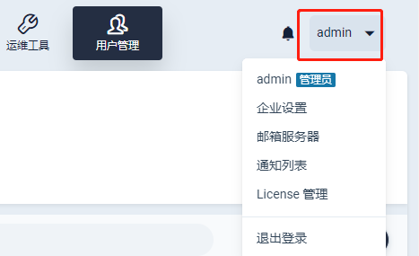
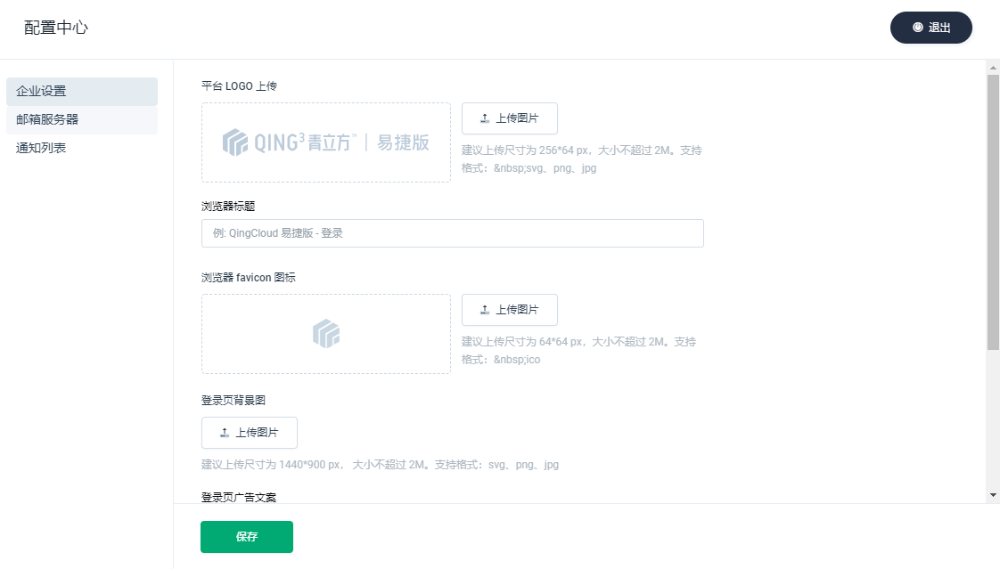
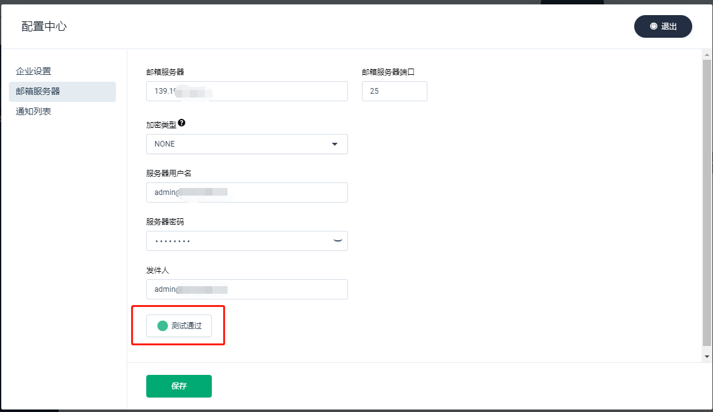
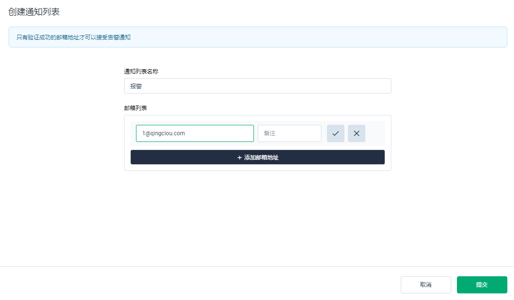

---
---

# 配置中心

通过点击控制台右上角的倒三角形可以进入配置中心。

## 企业设置

在此界面，您可以设置自己的LOGO和文档等内容。

> * 平台LOGO：建议上传尺寸为 256*64 px，大小不超过 2M。支持格式：&nbsp;svg、png、jpg
> * 浏览器favicon图标：建议上传尺寸为 64*64 px，大小不超过 2M。支持格式：&nbsp;ico
> * 高级设置：包含登录页背景图，以及登录页文案展示。背景图建议上传尺寸为 1440*900 px， 大小不超过 2M。支持格式：svg、png、jpg

## 邮件服务器

在这里可以配置您的SMTP邮件发送功能。具体配置信息需要以邮箱提供商方面提供的数据为准。

> 加密类型
>
> 1. 支持对邮箱服务器端口设置加密连接
>
> 2. 默认选择STARTTLS加密类型，端口25
>
> 3. 选择SSL/TLS加密类型时，端口默认465
>
> 4. 若SMTP服务器不使用加密连接，可选择NONE

配置完后可以点击测试连接，若可成功连接则会显示测试通过。

## 通知列表

邮件服务器配置好后，在通知列表进行“创建通知列表”操作，只有验证成功的邮箱地址才可以接受告警通知。

