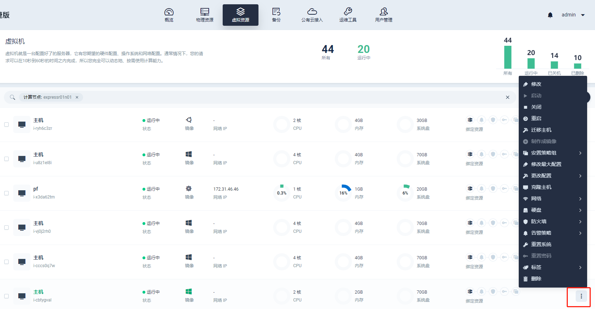
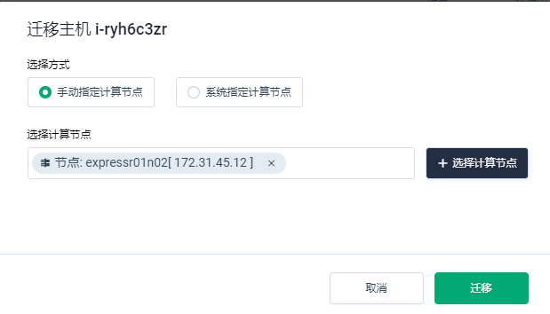
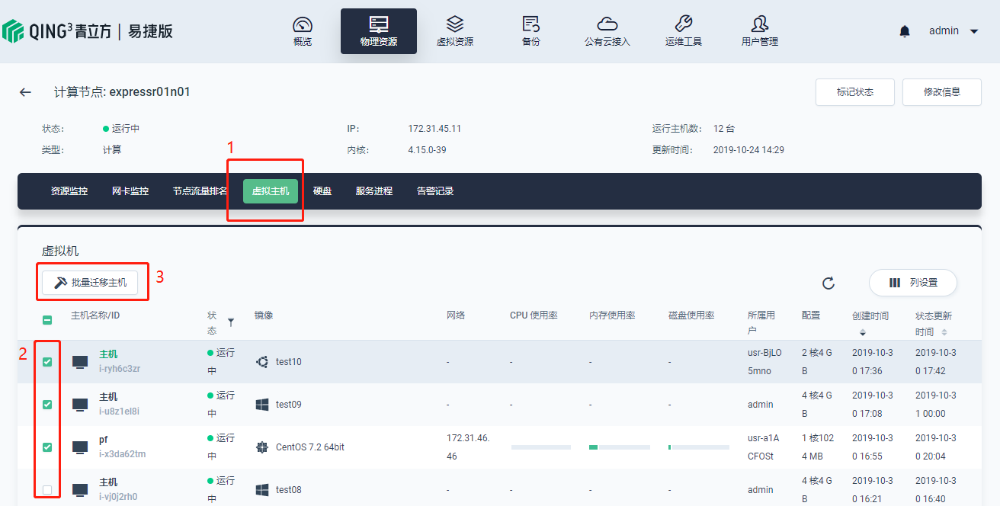

---
---

# 内部迁移

内部迁移主要目的为减轻单个物理服务器的负载，将部分高负债的虚拟主机转移至其他物理服务器节点上。

## 单个迁移

您可以通过点击“虚拟资源”-“虚拟机”界面，在您希望迁移的虚拟机行点击“更多”按钮（图中以右下角红框为例）。

在弹出列表中找到”迁移主机“

点击后可以选择手动指定计算节点或者系统指定计算节点。

> 系统指定计算节点可以自动将虚拟机迁移至低负载的物理服务器节点。

## 批量迁移

您可以通过点击“物理资源”-“计算节点”界面，单击进入某一计算节点，点击”虚拟主机“，勾选您希望迁移的主机，单击”批量迁移主机“即可。点击后也可以选择手动指定计算节点或者系统指定计算节点。

