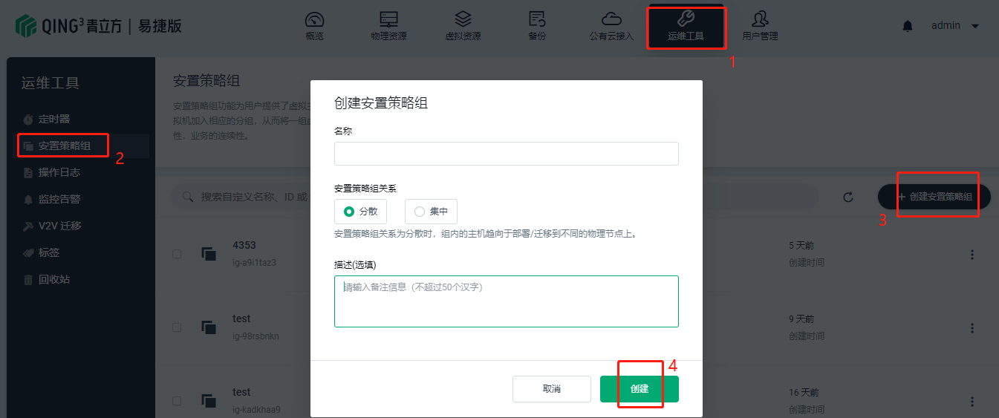
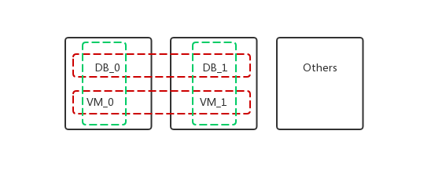

---
---

# 安置策略组

## 介绍

安置策略组功能为用户提供了虚拟主机分组功能，用户可以通过创建合适关系的安置策略组并将部署的虚拟机加入相应的分组，从而将一组虚拟机实例按照分组关系部署到合适的物理节点上，来提高资源的可用性，业务的连续性。

> 场景示例：如果新购一台物理节点，并加入到 CloudCube Express 集群中，短期内新建/启动所有的虚机都会分配在这台新服务器上，若有安置策略组，则可以增加用户对节点资源的分配调控能力。

## 使用

点击”运维工具“ - ”安置策略组“ - ”创建安置策略组“

在”安置策略组关系“中：

* 安置策略组关系为分散时，组内的主机趋向于部署/迁移到**不同**的物理节点上。
* 安置策略组关系为集中时，组内的主机趋向于部署/迁移到**相同**的物理节点上。

配置好后点击策略组名称进入策略组：

点击”加入虚拟机“即可加入您期望的虚拟机。

## 具体场景

以下图为例：DB_0和DB_1为主从数据库虚拟机，应该配置在不同的物理节点，以防止其中一台物理机宕机从而对业务运行产生影响。VM_0和VM_1是运行业务代码的虚拟机，他们需要和数据库虚拟机进行协同，所以VM_0和DB_0应该尽可能运行在同一个物理机上。同理，VM_0和VM_1功能相同，应该布置在不同的物理机以做容灾。

因此，两个DB之间应该选择“分散”的安置策略组，两个VM之间也应该选择“分散”的安置策略组。DB和VM之间应该选择“集中”的安置策略组。

