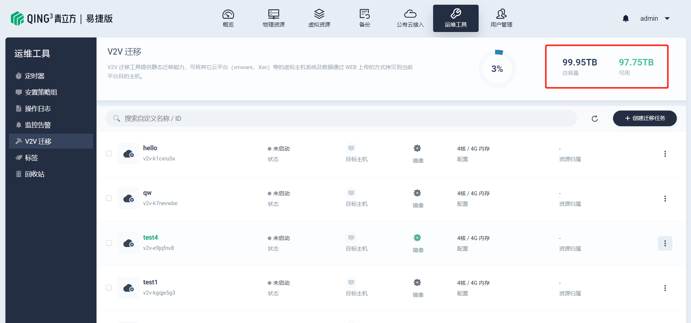
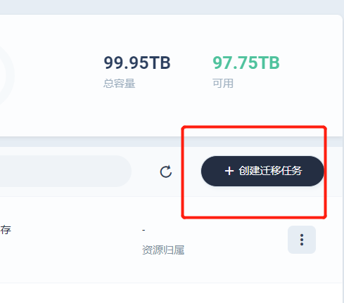
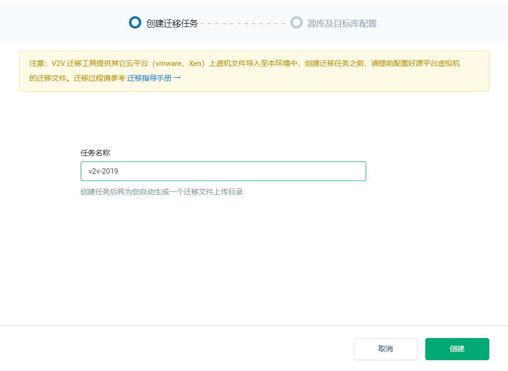
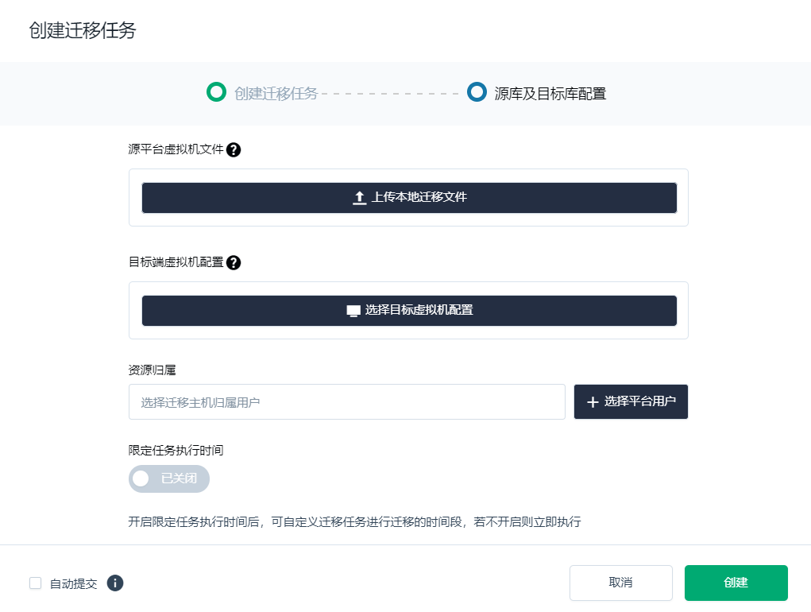
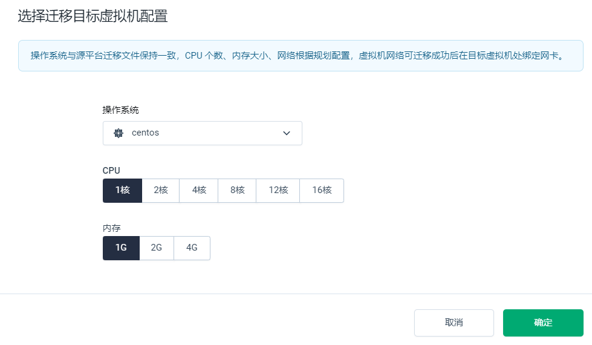
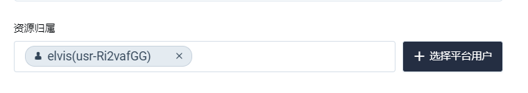
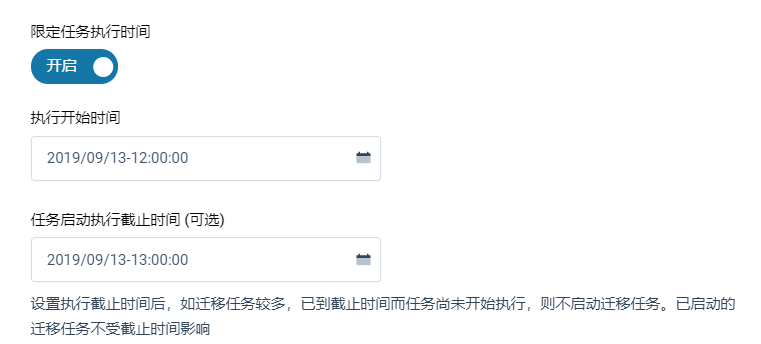
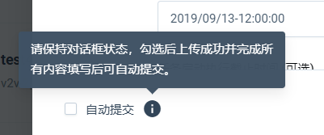
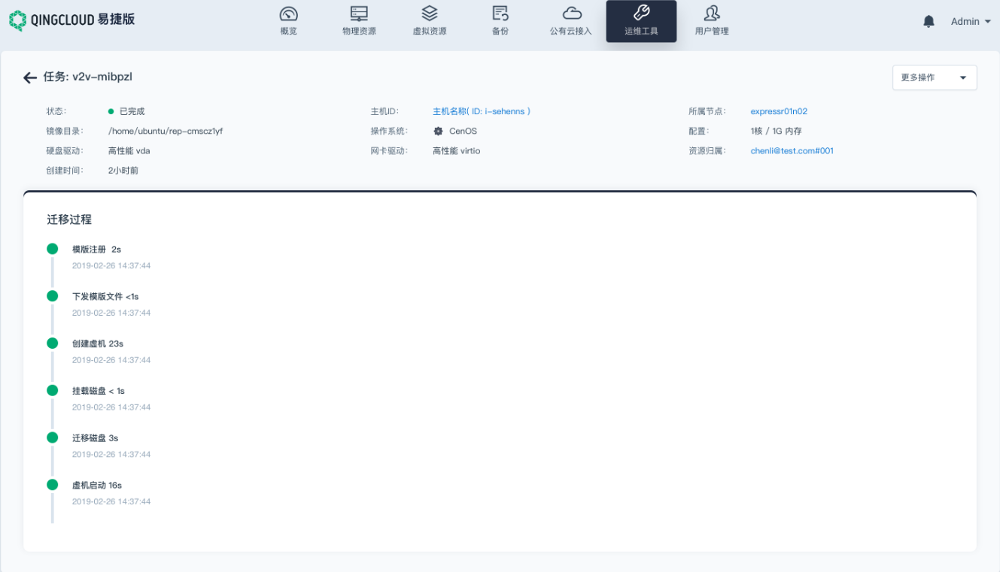
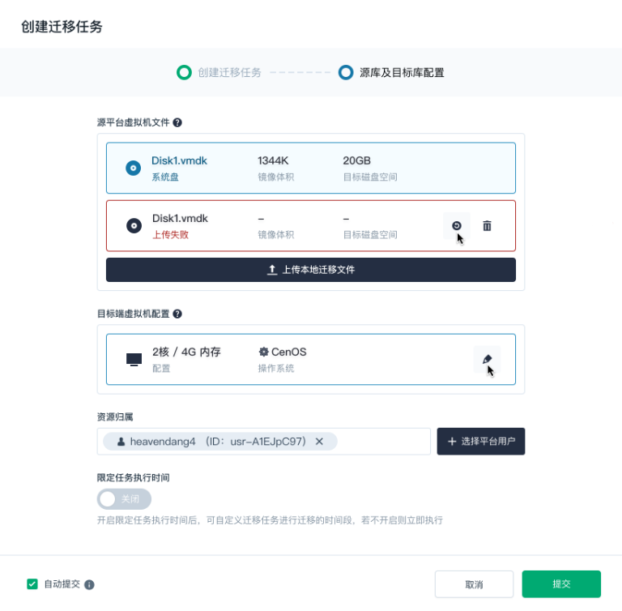

---
---

# V2V迁移指南

V2V (Virtual to Virtual) 迁移工具提供静态迁移能力，可将其它云平台（vmware、Xen）等的虚拟主机系统及数据通过 WEB 上传的方式拷贝到当前平台目的主机。

V2V迁移界面可以通过 Express 控制 - 运维工具 - V2V迁移访问。

## 概览

在这个界面，可以直观看到迁移虚拟主机信息，包括：名称、状态、目标主机、镜像版本、物理配置以及资源归属。

针对已列出的每一个迁移实例，您可以：

* 启动迁移
* 重启迁移
* 修改信息
* 删除

除此之外，在该界面需要注意上图红框中“总容量”以及“可用”数值，总容量由青云先行从磁盘中划分一部分出来，大小数值不具备更改性。若可用空间所剩不多，您只可通过删除现有迁移实例来释放空间。

## 创建迁移任务

创建迁移任务之前，请提前配置好源平台虚拟机的迁移文件。

点击“创建迁移任务”来新建迁移任务。

在下图中，任务名称主要做目录命名用，单个虚拟主机所有的迁移文件都会存放在一个单独的文件夹，文件夹名称即任务名称。

单击创建后，出现下图界面。

1. 原平台虚拟机文件：上传源平台虚机（ OS 盘、磁盘）导出的迁移文件（一块硬盘对应一个文件），文件格式支持：qcow2、vmdk、row、zip、tar、lz4

2. 目标端虚拟机配置：目标端虚拟机为迁移任务完成后运行业务的虚拟机，可根据业务规划选择目标虚拟机配置。操作系统请选择与原虚拟主机相同的系统，主要用作标记并显示操作系统类型。

3. 资源归属：主要用作选择迁移主机归属用户。通过选择特定的用户，将资源与其绑定。

   

4. 限定任务执行时间：开启后，可用设置“执行开始时间”以在集群闲时执行迁移，“任务启动截至时间（可选）”则是设置执行截止时间后，如迁移任务较多，已到截止时间而任务尚未开始执行，则不启动迁移任务。已启动的迁移任务不受截止时间影响。

5. 自动提交：请保持对话框打开状态，勿点取消或者关闭，勾选”自动提交“后上传成功并完成所有内容填写后可自动提交。

## 查看迁移状态

迁移提交后，可以在V2V迁移主界面点击进入特定主机查看迁移状态，如下图：

## 上传失败

针对上传失败之情况，您可以选择重启上传或者删除上传任务。

