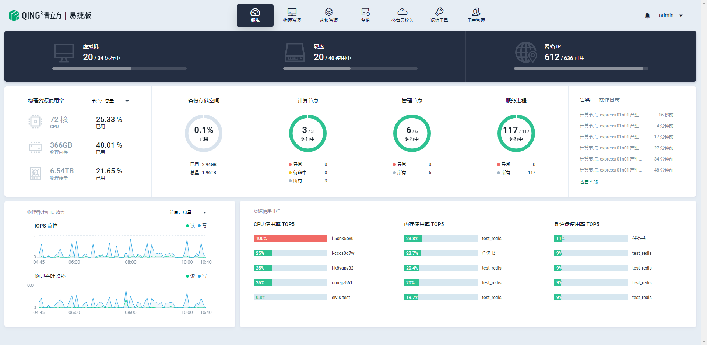
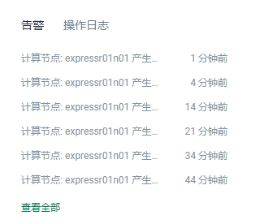
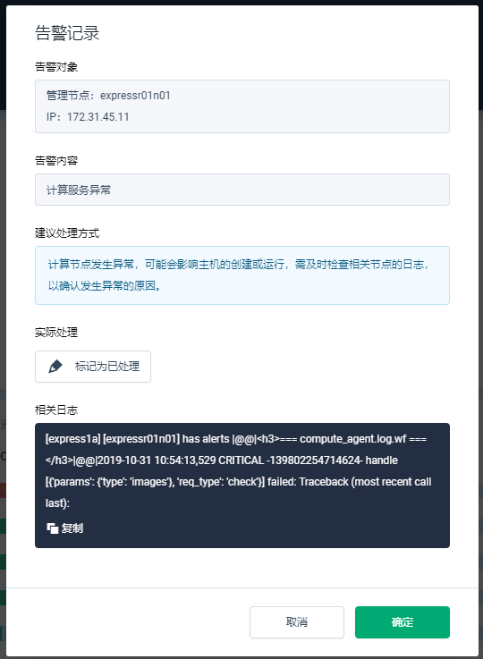

---
---

# 概览

登录青立方超融合易捷版，首页即平台的概览页，将统一直观地展示当前平台的所有资源实时运行状态和资源使用情况。

概览界面分为以下四大部分，可将鼠标移动至图标上方查看物理资源和虚拟资源使用情况。

- 虚拟资源使用情况；
- 物理资源使用情况；
- 监控告警和操作日志；
- 物理资源使用趋势与排行。

通过概览页，您可以直观地了解目前资源使用情况，以便迅速做出扩容或资源调度的决定。

## 虚拟资源使用情况

在顶部一栏对平台中所有的虚拟机、硬盘、网络 IP 等使用情况进行统计，例如虚拟机 20/34 表示当前平台中一共有 34 台虚拟机，但只有 20 台保持开启状态，其余的处于关机状态。硬盘，网络IP同理。

> * 虚拟机：就是一台配置好了的服务器，它有您期望的硬件配置、操作系统和网络配置。通常情况下，您的请求可以在10秒到60秒的时间之内完成，所以您完全可以动态地、按需使用计算能力。虚拟机的总数为“运行中”，“关机”和“已删除”状态的虚拟机之和。
> * 硬盘：硬盘（Volume）为主机提供块存储设备，它独立于主机的生命周期而存在，可以被连接到任意运行中的主机上。
> * 网络IP：对应的可以是内网IP，也可以是公网IP，如有配置需求，请通过“虚拟资源-网络-IP池”进行配置。基础网络的使用通过IP池管理功能实现，用户可将本地环境物理交换机中配置的VLAN网段地址添加到IP池管理记录中，用于分配具体IP地址的网段选择。

另外，点击**分数图标**即可跳转至该资源的列表页，查看更详细的信息。

## 物理资源使用情况

### 物理资源使用率

物理资源使用率部分统计了平台所有机器的 CPU、物理内存和物理硬盘的总量和实时使用率，支持筛选查看其中一个物理节点的物理资源使用情况。

### 物理节点与备份状况

此部分包括备份存储空间使用情况和计算节点、管理节点、系统的服务进程的健康状况监控数据，实时显示的数据结合环形图，非常直观地告知用户当前全部物理机上的备份空间使用情况以及健康状态。

## 告警和操作日志

**告警**展示了平台中最新的运维告警消息，例如服务进程异常、主机的告警消息等。

点击其中一条告警消息可查看告警记录和相关日志。其中日志可以一键复制，用以联系青云QingCloud提交工单。

操作日志展示了平台中最新的资源操作历史，例如创建备份、加载硬盘等信息，点击其中一条日志可直接下钻至该资源的详情页，点击 「查看更多」 即可查看跳转至备份列表页。

## 物理资源使用趋势与排行

### 物理吞吐和 I/O 趋势

此部分对平台所有物理节点的物理吞吐和 I/O 趋势进行统计分析，实时监控数据通过动态曲线图展示，直观告知用户当前所有物理机的吞吐和 I/O 趋势，支持分别查看读/写数据和按节点进行筛选。

### 资源使用排行

此部分展示的是所有虚拟机的 CPU 使用率、内存使用率和系统盘使用率分别排行前 5 的虚拟机，帮助用户直观地定位虚拟机的使用情况。若某项指标的使用率过高，用户需要对相应的虚拟机进行检查和扩容，也可以参考[迁移虚拟机][1]来快速迁移至其他负载较低的物理主机。

[1]: https://docs.qingcloud.com/express/virtual/vm
