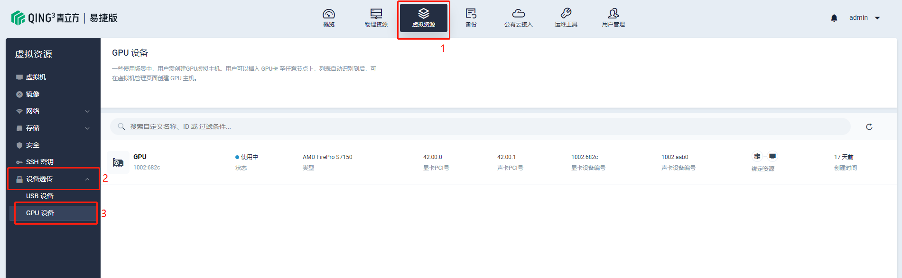
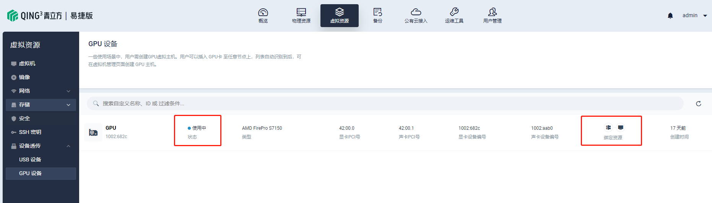

---
---

# 设备透传 - GPU 设备

CloudCube Express 支持 GPU 设备透传服务，物理机 GPU 可直接透传至该物理机上所运行的虚拟机，从而让虚拟机能够直接使用物理机上的 GPU 。用户可以插入 GPU卡 至任意节点上，列表自动识别到后，可在虚拟机管理页面创建 GPU 主机。

## 查看设备透传

点击 「虚拟资源」 → 「设备透传」 → 「GPU设备」，查看当前已加入平台的所有 GPU。

## 挂载设备至主机

1、插入 GPU 后，可以在列表页看到该设备状态显示 `可用`，点击右侧 **···** 选择 「绑定到主机」。

2、在弹窗中选择一台主机，点击 「确定」 即可完成绑定。

3、在列表中可以看到该 GPU 设备已挂载至虚拟机，状态显示 **使用中**，可点击绑定资源图标下钻至对应的物理机/虚拟机详情页。

