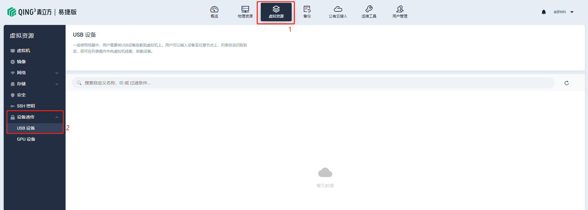

---
---

# 设备透传 - USB 设备

CloudCube Express 支持 USB 设备透传服务，物理机 USB 设备可直接透传至所有物理机上运行的虚拟机，从而让虚拟机能够直接使用物理机上的 USB 设备。

当用户使用 USB 设备上传数据到虚拟机当中或者虚拟机某些应用需要通过 USB 接口设备进行认证时，用户需要将USB设备挂载到虚拟机上。用户可以插入设备至任意节点上，列表自动识别到后，即可在列表操作中向虚拟机挂载分配给相应的虚拟机、卸载设备。

## 查看设备透传

点击 「虚拟资源」 → 「设备透传」 → 「USB设备」，查看当前已加入平台的所有 USB 设备。

## 挂载设备至主机

1、插入 USB 设备后，可以在列表页看到该设备状态显示 `可用`，点击右侧 **···** 选择 「绑定到主机」。

2、在弹窗中选择一台主机，点击 「确定」 即可完成绑定。

3、在列表中可以看到该 USB 设备已挂载至虚拟机，状态显示 **使用中**，可点击绑定资源图标下钻至该虚拟机详情页。

