---
---

# 创建CDN

>  从创建 CDN 到可以使用大致需要 30 分钟左右，您要使用 CDN 的域名必须进行备案。本指南中要加速的域名为 cdnexample.qingcloud.com

## **第1步：创建域名(domain)**

点击域名服务中的 CDN 进入如下界面

点击创建进入如下界面

[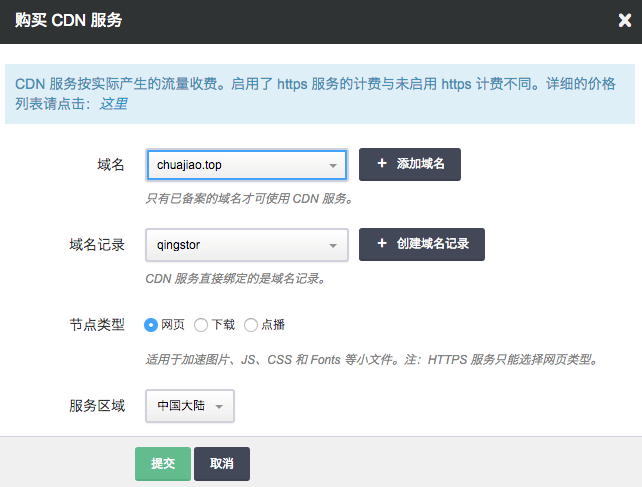](_images/create_cdn_1.png)

在创建的对话框中，点击添加域名，输入自己的主域名。

> 该域名是主域名 如：我们要为 cdnexample.qingcloud.com 加速，他的主域名是 qingcloud.com 。

[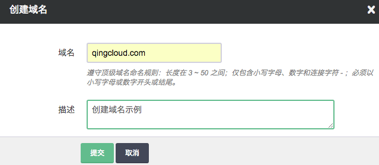](_images/create_cdn_2.png)

## **第2步：创建域名记录(子域名)**

**填写你要加速的子域名**

>  该域名是子域名 如：指除去主域名的部分 如: cdnexample.qingcloud.com 中的 cdnexample

**填写回源地址**

回源地址就是您源站的地址，您静态资源的所在站点， 当 CDN 中不存在请求的内容时，会去源站请求资源返回给用户并且缓存在 CDN 缓存服务器中。回源的方式有两种， IP 回源和域名回源:

- 使用 IP 回源时只能填写一个IP
- 如果使用域名回源则只能使用一个域名 如 resource.qingcache.com

[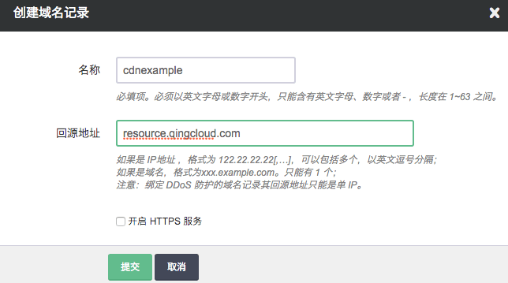](_images/create_cdn_3.png)

**开启 HTTPS (可选)**

如需开启 HTTPS 则点击 “同时支持 HTTP/HTTPS 服务” 或 “只支持 HTTPS 服务”，在证书列表选择一个要使用的证书， 点击创建证书可上传自己网站的证书和秘钥， 注意使用HTTPS只支持网页类型加速，不支持下载和点播。另外，使用 “只支持 HTTPS 服务” 会让 HTTP 访问的用户跳转成 HTTPS 访问。

[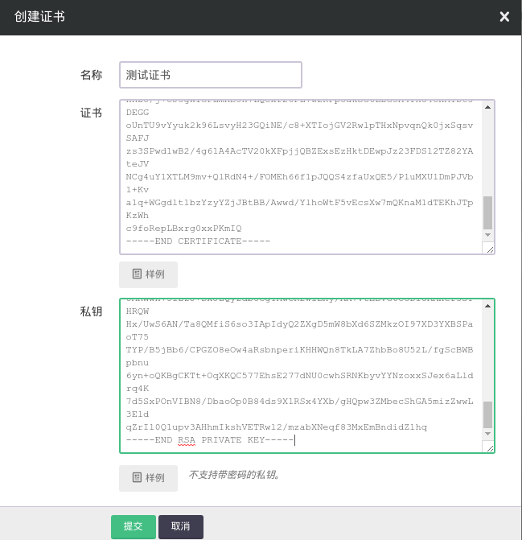](_images/create_cdn_4.png)

## **第3步：选择节点类型**

不同类型的节点背后对应不同的资源池，通常情况下，选择网页即可。点击确定后即可创建成功。

[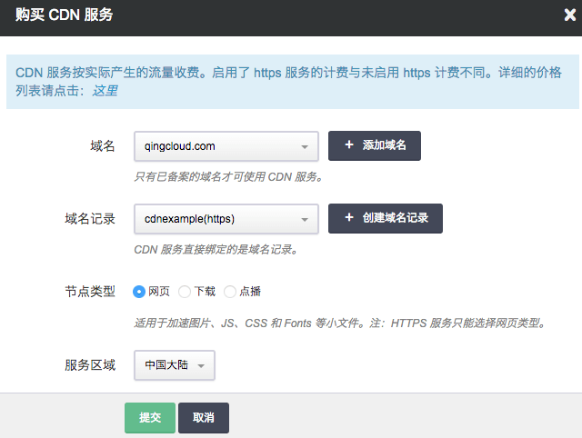](_images/create_cdn_5.png)

**缓存规则**

在 CDN 列表页点击域名记录进入 CDN 详情页，在缓存策略一栏点击创建

常见的缓存规则书写

- 如果要缓存 cdnexample.qingcloud.com/image 下的png jpg gif 可以使用/image/.*\(png\|jpg\|gif\)
- 如果要缓存 cdnexample.qingcloud.com 下的所有 mp4 js png jpg html 可以使用 /.*\(png\|jpg\|gif\|mp4\|js\|html\)
- 只允许一个 最多只允许一个 *

[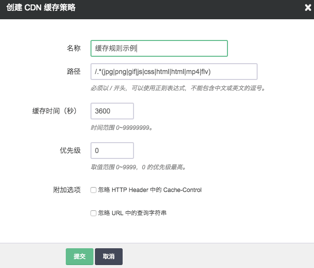](_images/create_cache_rule_1.png)

- **名称:** 名称是用帮助记忆该条规则的
- **路径:** 对哪些路径下的哪些文件应用该缓存规则
- **缓存时间:** 对路径中的文件的缓存时间单位是秒
- **优先级:** 如果有多条缓存规则，路径可能存在冲突，优先级高的规则优先生效，优先级数字越小优先级越高。
- **忽略 Cache Control:** 如果 header 中的 Cache Control 是 private ，CDN 默认不缓存该文件。但如果此参数设置为 “是” ，则 CDN 会忽略 Cache Control 头强制缓存
- **忽略查询字符串:** 如果带有查询串默认情况下 CDN 是不会缓存该资源，如果该选项为 “是” 则会强制缓存。

**访问控制:**

在 CDN 列表页点击域名记录进入 CDN 详情页，在访问控制一栏点击创建

[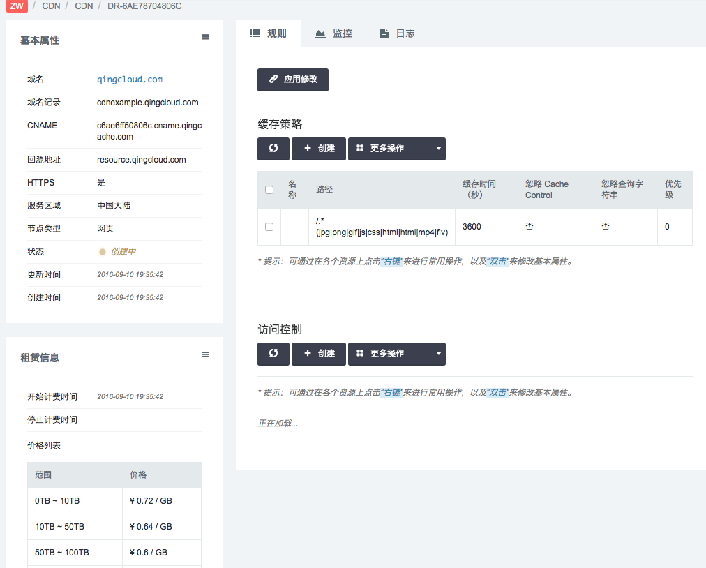](_images/create_cache_rule_0.png)

黑名单

以下图为例 该条规则的含义是 referer 主域名为 baidu.com ，google.com 以及 www.example.com 发起的请求，都无法访问 png jpg gif 文件。

[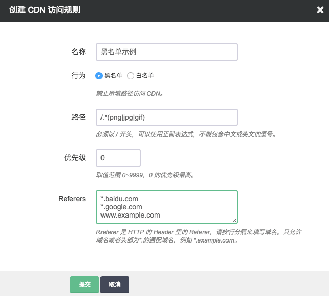](_images/create_access_rule_1.png)

- **名称:** 名称是用帮助记忆该条规则的
- **路径:** 对哪些路径下的哪些文件应用该访问控制
- **优先级:** 如果有多条访问控制规则，路径可能存在冲突，优先级高的规则优先生效，优先级数字越小优先级越高。
- **Referers:** 从一个页面请求资源或跳转 会存在一个 referer 信息表示从哪个页面发起的请求 可以只用*表示所有子域名如 *.baiud.com *.google.com
- **行为:** 使用黑名单还是白名单控制访问，黑名单表示列表中的 referer 禁止访问；白名单表示只允许 referer 列表中的站点访问

白名单

以下图为例 该条规则表示 referer 中主域名 qingcloud.com 或 www.qingcache.com 者空 referer 可以访问该文件

[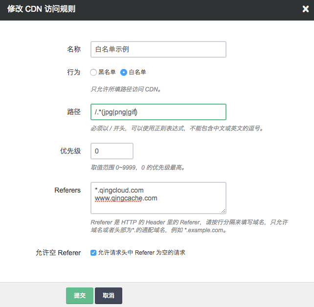](_images/create_access_rule_2.png)

- **名称:** 名称是用帮助记忆该条规则的
- **路径:** 对哪些路径下的哪些文件应用该访问控制
- **优先级:** 如果有多条访问控制规则，路径可能存在冲突，优先级高的规则优先生效，优先级数字越小优先级越高。
- **Referers:** 从一个页面请求资源或跳转 会存在一个 referer 信息表示从哪个页面发起的请求 可以只用 “*” 表示所有子域名如 *.baiud.com *.google.com
- **允许空 Referer:** 当用户直接在访问该路径时 referer 为空，是否允许访问
- **行为:** 使用黑名单还是白名单控制访问，黑名单表示列表中的 referer 禁止访问 白名单表示 “只” 允许列表中的 referer 的站点访问

## **第4步：使用 CDN 为站点进行加速**

在自己的使用的 DNS 服务商处配置 CNAME 以本域名为例，需要将 cdnexample.qingcloud.com CNAME 配置为 c6ae6ff50806c.cname.qingcache.com 至此您的域名就已经可以使用 CDN 进行加速了。

[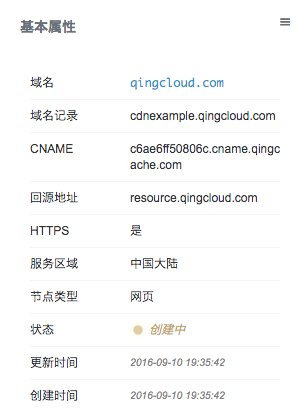](_images/use_cdn.png)

**修改加速节点类型**

在 CDN 详情页基本属性的右上角可以点击修改节点类型

警告

修改加速节点类型可能会造成大量回源，请谨慎使用。

[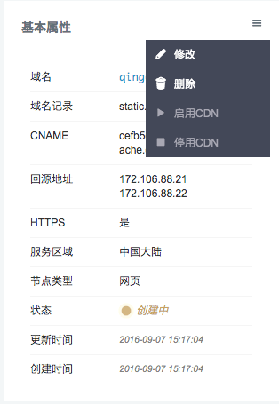](_images/change_service_type.png)

**HTTPS/HTTP切换**

警告

修改协议可能会造成大量回源，请谨慎使用。

如果想切换当前的协议到另外一种协议可以使在 CDN 详情页点击域名图中的为 qingcloud.com 切换到域名记录列表页进行操作

[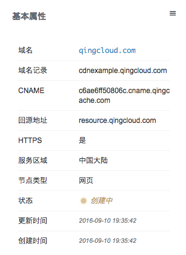](_images/use_cdn.png)

可以选择解绑

**监控**

为用户提供各类数据报表业务，包括流量，访问次数，带宽，热门访问地区，热门访问资源等

> 各项统信息会有10分钟左右的延时 * 流量 单位MB * 带宽 单位Mbps 该带宽为五分钟为粒度的平均带宽 * 访问次数 用户请求CDN的次数 * 热门访问地区 统计各地区的请求次数 * 热门访问资源 统计用户该记录下访问次数最多的文件

带宽监控

[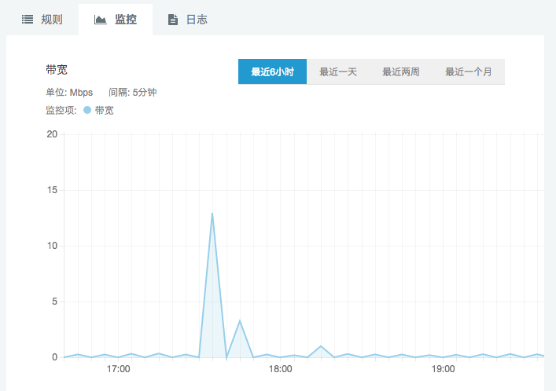](_images/bandwidth.png)

流量监控

[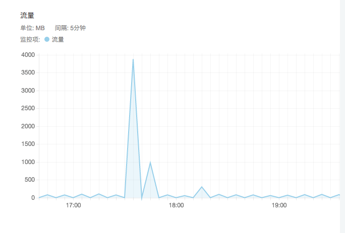](_images/flow.png)

访问次数监控

[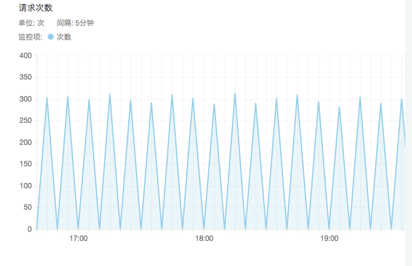](_images/access.png)

访问地区监控

[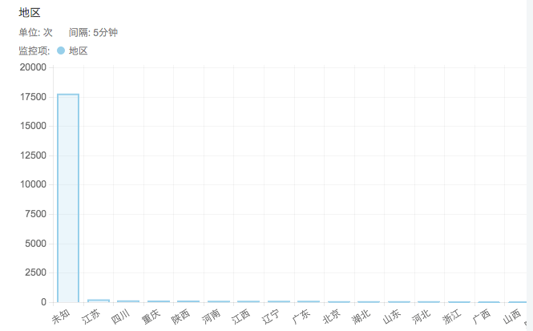](_images/top_area.png)

热门访问资源监控

**日志**

该日志是从 CDN 缓存服务器中得到的原始访问数据，默认提供的分析维度比较少，可以下载原始日志进行更多维度的分析。默认保存10天的日志

[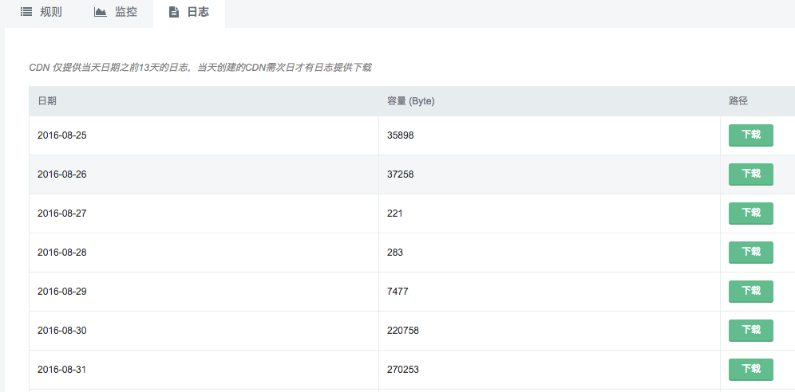](_images/log.png)

**清除 CDN 缓存**

当您更新了文件但是该文件的旧的版本可能已经被 CDN 缓存需要手动清除 CDN 的缓存重新回源去拿最新的文件。 点击清除 CDN 缓存

点击创建

填写需要刷新的文件或者目录的url 需要以 [http://](http://) 或 [https://](https://) 开头

**内用预取**

当您有较大的文件需要提前缓存到 CDN 的节点上的时候可以使用预取功能，该功能会模拟用户请求使文件提前缓存到 CDN 中。

点击创建

填写需要预取的文件 url 需要以 [http://](http://) 或 [https://](https://) 开头