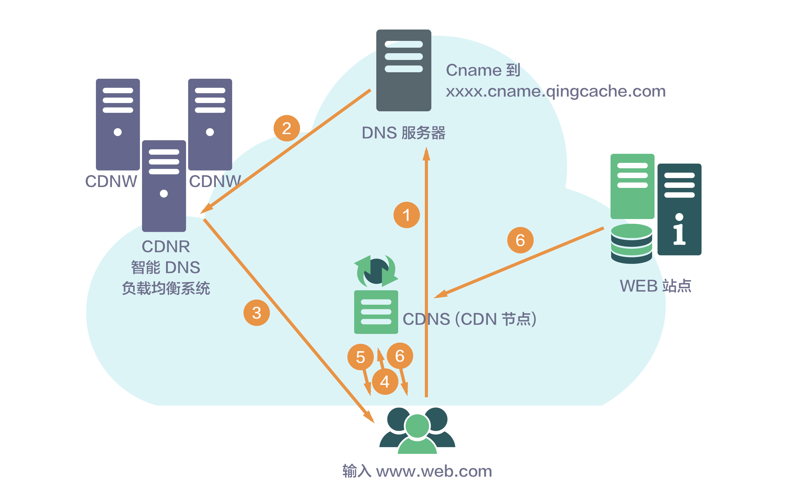

---
---

# CDN 原理图

- **缓存服务器:** 用户直接获取资源的节点，如果用户访问资源在缓存服务器中不存在，则缓存服务器会向源站请求资源并缓存，然后返回给用户，下次用户访问时，缓存服务器可直接返回资源，不需要请求源站。
- **源站:** 源站指发布内容的原始站点。添加、删除和更改网站的文件，都是在源站上进行的。缓存服务器所缓存的全部数据均是从源站获取。（图中的 web 站点）
- **智能DNS:** 他的作用是根据用户的网络状况，把用户的请求指向最适合用户的缓存服务器。

[](