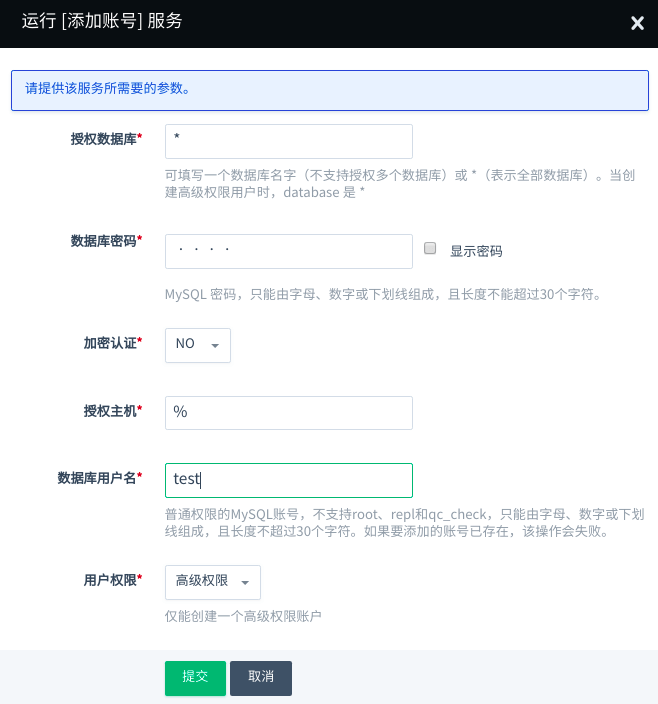
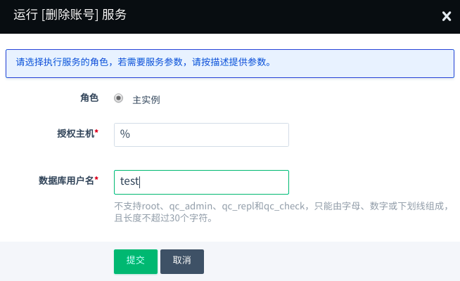

---
---

# 添加或删除账号

## 添加账号

要创建新账号时，需要指定账号密码和授权访问的数据库。

**注解**：

1. 系统保留 root 、qc_check 、 qc_repl 账号来进行自动化运维和数据同步，请勿删除这三个账号，以免破坏系统的运行。
2. 如果加密认证选项为 `YES` 则需要开启 [SSL传输加密](#ssl传输加密) 后该用户才可以用于连接数据库。
3. 支持添加`高级权限`账户，但是，仅能创建一个。
4. 添加用户成功后，如使用 Proxy 实例进行读写链接，需要重启 Proxy 实例来同步主实例用户信息。

## 删除账号

这里填写要删除的账号名。

