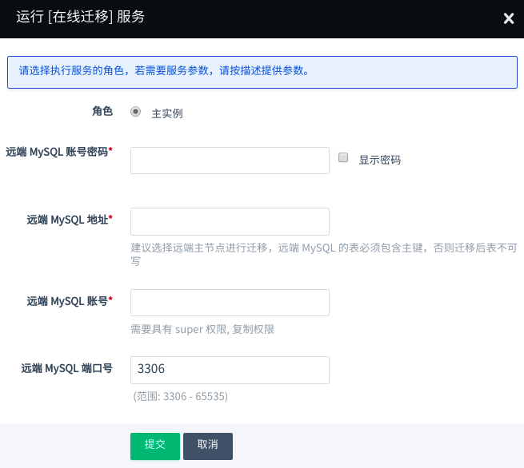

---
---

# 在线迁移

迁移服务可以将远端 MySQL 数据库的数据平滑迁移到 QingCloud MySQL Plus 集群中。目前支持迁移的 MySQL 版本为 5.6~5.7。

**迁移说明：**

> 1. 在线迁移时，会去远端 MySQL 复制全量数据，尽量在远端 MySQL 业务低峰期开启服务。
> 2. 需要提供远端 MySQL 具有 super 权限 和 复制权限 的账户，并且要求远端 MySQL 开启 GTID 模式。
> 3. 远端 MySQL 版本在 5.6 以下，可以参考[数据迁移方案](#数据迁移)进行迁移。
> 4. 迁移期间，可通过 高可用写 IP 查看同步状态。
> 5. 为了保护集群运维账户，该服务不会同步远端 MySQL 的用户，需要使用者迁移完成后添加远端 MySQL 用户信息到本集群中。
> 6. 不支持从高版本 MySQL 迁移到 低版本 MySQL。
> 7. 该服务仅会在主实例运行，当集群有只读实例时，服务运行失败，有 Proxy 实例不影响服务运行。
> 8. 开启在线迁移服务后，自动备份功能将会失效，建议暂时关闭自动备份。

**迁移步骤：**

> 1. 若原库与当前集群不在同一 VPC 下，使用 边界路由器（vpc board） 或 VPN ，打通原库与当前集群的网络。
> 2. 点击「 在线迁移 」，将原库 MySQL 账户名（要有 super 权限 和 复制权限）、密码、端口、IP 地址填入下图所示文本框，点击「 提交 」即开始迁移。
> 3. 等待「 在线迁移 」服务完成。服务执行完成后，当前集群就成功获取了原库的全量数据并与原库配置了主从关系，如此则可以持续同步原库增量数据到当前集群。
> 4. 选择合适时段，切换业务到当前集群（切换时，远端 MySQL 必须要停写以保证数据一致性）：
>
> ```
>   a) 停止原库的业务。
>
>   b) 校验当前集群与原库数据是否一致，若一致，则继续下一步。
>
>   c) 点击 「 结束迁移 」，会自动重启 MySQL 集群。
>
>   d) 将业务所连IP改为当前集群的VIP，恢复业务。
>
> ```


