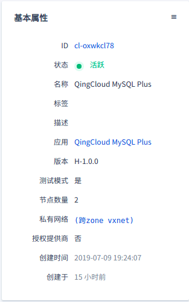
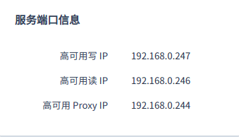
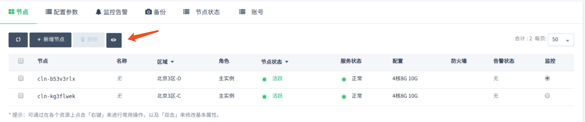
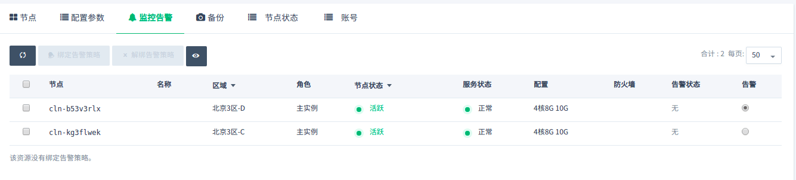
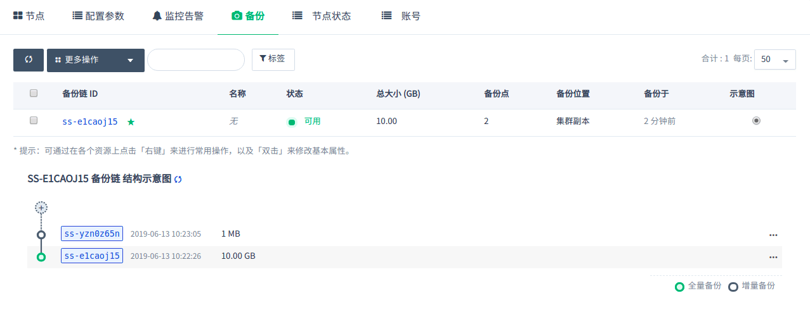
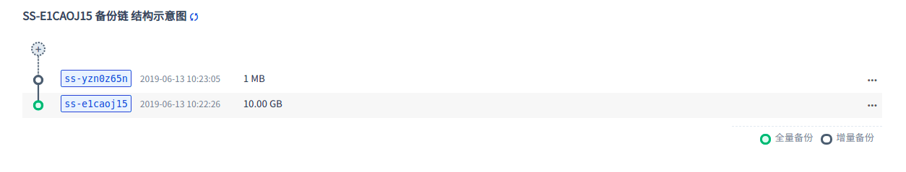
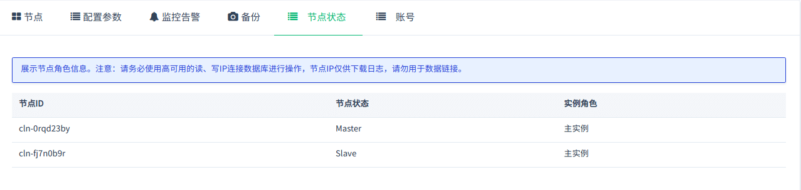
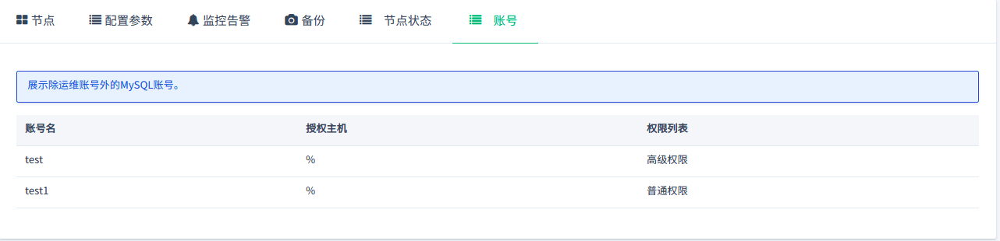

---
---

# 集群信息

## 基本属性

这里显示了集群的基本信息。

## 服务端口信息

集群提供三个高可用 IP：

- 高可用读IP：可将请求在所有节点之间进行负载分担，提高读取性能，消除单点故障。

- 高可用写IP：始终指向 Master 节点。

- 高可用 Proxy IP：始终指向 Proxy 实例的 Master 节点。

**注解**:

1. 务必使用读IP执行读请求，以将所有读请求按轮询方式分摊到所有节点；务必使用写 IP 执行写请求，以保证切主后不影响业务。
2. Proxy 实例用于读写分离。Proxy IP 作为集群预留 IP ，如未创建用 Proxy 实例该 IP 仍然被占用但是无法访问。

## 服务功能

点开基本属性旁边的下拉按钮，可以看到提供的服务功能。

## 节点列表

显示了每个节点的服务状态。如果需要下载同步的日志，需要点击标志，展示 IP 后进行下载。

## 监控告警

可以对集群节点配置告警策略，及时掌握集群的资源和服务状况。

## 备份恢复

可以对集群进行手动备份，也可以在集群列表页面右键选择备份时间进行自动备份。

如果需要从备份创建出一个独立于原有数据库服务的新数据库服务， 可以在详情页的『备份』标签下右键相应的备份点，再选择『从备份创建集群』即可。

**注解**：仅备份主实例的主节点。恢复集群时会保留原集群的数据库账号密码。

## 节点状态

展示主实例的角色信息。

**注解**：基础版集群不具备该功能。

## 账号列表

展示除运维账号外的 MySQL 账号。

