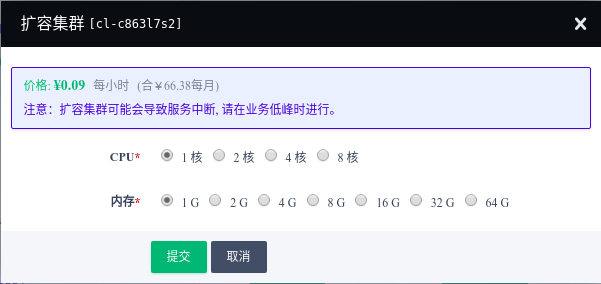

---
---

# 在线伸缩

在缓存服务运行过程中，会出现服务能力不足或者容量不够的情况，您都可以通过扩容来解决。

## 增加Memcached缓存节点

Memcached 缓存服务支持多个缓存节点。当容量或者性能不足时，您可以通过增加缓存节点来提升。 

> 默认的 Memcached 客户端使用简单 Hash 来进行数据分片，当增加或删除节点时可能会造成大量的缓存失效。可以采用支持一致性 Hash 算法的 Memcached 客户端来避免这个问题，例如[hash_ring](https://pypi.python.org/pypi/hash_ring) 

下图为扩容之后的节点列表。

## 增加Memcached缓存容量

当缓存容量不足时，您可以通过扩容操作来提升缓存容量。

> 扩容后可以通过threads和max_memory这两个配置项对缓存服务进行调优。

