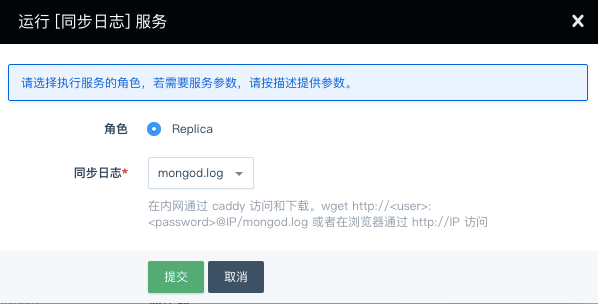
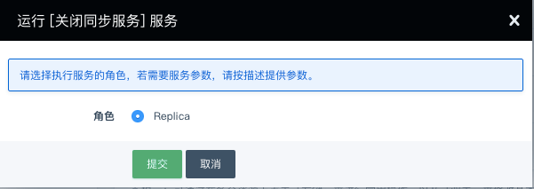

---
---

# 同步日志

## 打开同步日志

同步日志功能可以将 mongod.log 拷贝到系统的 FTP 目录，同步后可以在内网下载到本地进行分析。

> _MongoDB 4.0.3 - QingCloud 1.2.0_ 版本使用 Caddy 服务替代了老版本的 FTP 服务

## 关闭同步日志

该栏为 _MongoDB 4.0.3 - QingCloud 1.2.0_ 版本新增服务，下载或查看完日志，您可以关闭 Caddy 服务

