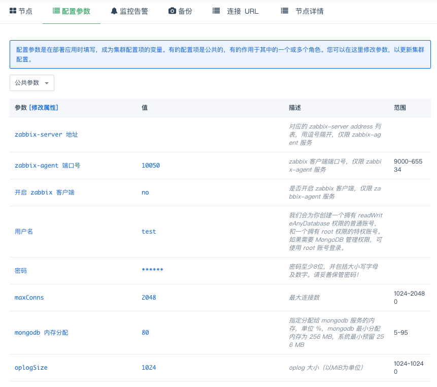

---
---

# 配置参数

这里列出了可以修改并持久化的配置参数。修改配置参数将会使集群重启，请在业务低峰时进行修改。

> _MongoDB 4.0.3 - QingCloud 1.2.0_ 之后的版本新增了 Caddy 服务替代老版本的 FTP 服务，配置参数中默认为您配置用户名为 caddy，密码为 caddy，您可以修改配置参数来配置您的用户名和密码，该相关配置不会导致 mongod 服务重启。

> _MongoDB 4.0.3 - QingCloud 1.3.0_ 新增了 zabbix-agent 服务，您可以将其加入您的 zabbix-server 方便统一管理，您可以通过修改配置参数来配置 zabbix-agent 的启停，该相关配置不会导致 mongod 服务重启。

