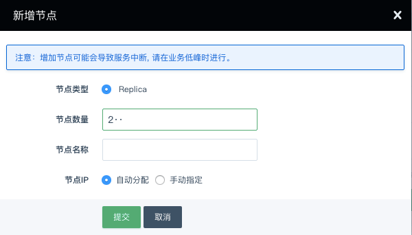

---
---

# 增删节点

可以根据需要增加集群节点，增加的节点数必须为偶数。添加节点的任务执行时间跟集群的数据量有关系，数据量大时，任务执行时间会久一些，添加节点不影响集群的读写。

删除节点不会导致主节点的 mongod 重启，但为避免影响到业务，请在业务量低时操作。

删除节点有如下限制：

- 数量必须为偶数，至少保留一个节点
- 无法删除主节点
- 无法删除 `qc_sid` 为 1 的节点

> `qc_sid` 可以使用 root 用户通过 mongo 连接之后执行 `rs.conf().members` 命令查看。`qc_sid` 为 1 的节点的选举优先级被我们设置为 2，所以这个节点通常是主节点。

