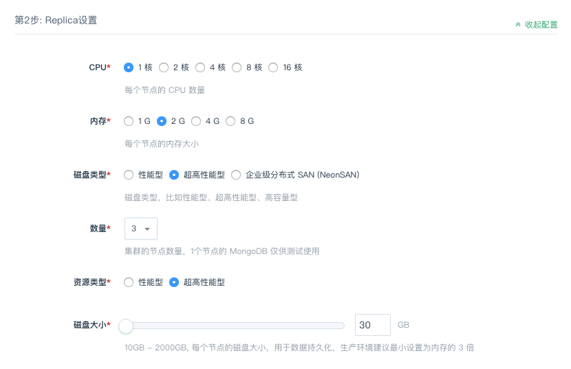
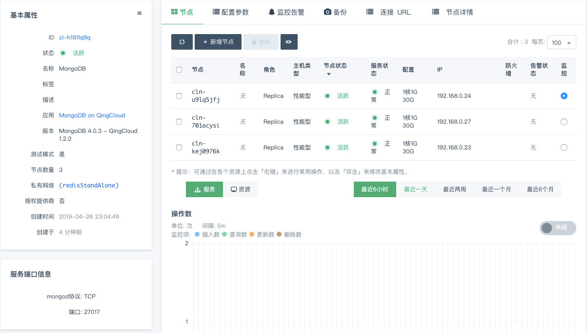

---
---

# 创建步骤

在青云上，您可以很方便的创建和管理一个 MongoDB 集群。青云的 MongoDB 集群支持横向与纵向在线伸缩，同时具有自我诊断与自我修复功能，即当系统发现某节点坏死时会自我修复，无需人为干预。 另外我们还提供了监控告警等功能来帮助您更好的管理集群。集群将运行于私有网络内，结合青云提供的高性能硬盘，在保障高性能的同时兼顾您的数据安全。

> 为了保障数据安全，MongoDB 集群需要运行在受管私有网络中。所以在创建一个 MongoDB 集群之前，需要创建一个 VPC 和一个受管私有网络，受管私有网络需要加入 VPC，并开启 DHCP 服务（默认开启）。

## 第1步：创建集群

在创建的对话框中，您需要填写名称 (可选)，选择 MongoDB 版本号、CPU、节点配置和数量、私有网络等。

> 目前集群节点数支持1、3、5、7，其中1个节点的 MongoDB 仅供测试使用。

> 用户默认创建在admin数据库下，连接时需要指定认证数据库为admin。

- 磁盘选择

_MongoDB 4.0.3 - QingCloud 1.2.0_ 添加了企业级分布式 SAN（NeonSAN），最高可支持 50000G 的磁盘扩展，可满足您大容量的数据存储需求，该功能目前仅在 `北京 3B` 、 `上海1A` 和 `广东 2 区` 支持。

## 第2步：创建成功

当 MongoDB 创建完成之后，您可以查看每个节点的运行状态。当节点的服务状态显示为“正常”状态，表示该节点启动正常。 当每个节点都启动正常后 MongoDB 集群显示为“活跃”状态，表示您已经可以正常使用 MongoDB 服务了。

