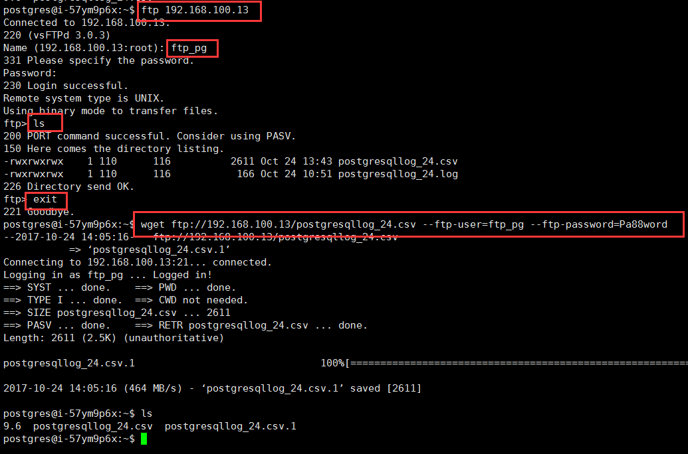
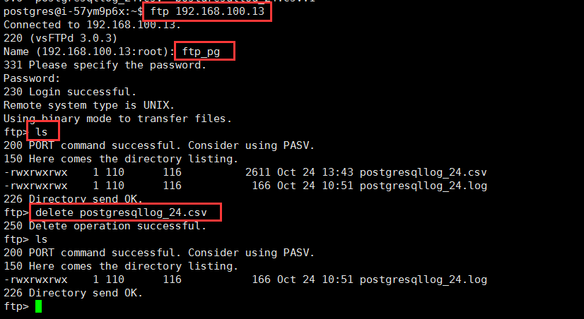

---
---

# 查看/清理 PostgreSQL 运行日志

## 查看日志

为了方便用户获取 PostgreSQL 的运行日志， `PostgreSQL on QingCloud AppCenter` 默认开启了 FTP 服务，您可以通过 FTP 来获取 PostgreSQL 的日志，用户名为 ftp_pg ，默认密码为 Pa88word。  
在任何一台装有 ftp 客户端的 host 上，通过以下 ftp 命令可以获取到日志，其中 IP 对应 PostgreSQL 节点所在的 IP 地址。

```bash
ftp 192.168.100.13
ls
exit
wget ftp://192.168.100.13/postgresqllog_24.csv --ftp-user=ftp_pg --ftp-password=Pa88word
```


>注意:    
>PostgreSQL 的日志默认保存30天，每天会自动保存一个日志文件,系统会自动清理。日志的命名规则为postgresqllog_30.csv，数字表示当前日期在当月的第多少天。

## 清理日志

日志目录给用户开放的 ftp 权限是读写权限，用户除了查看日志之外还可以根据自己的需要手动清理日志。  
输入如下命令登录和删除日志文件,参数 IP 地址为 PostgreSQL 节点 IP 。

```sh   
ftp 192.168.100.13
ls
delete postgresqllog_24.csv
```

