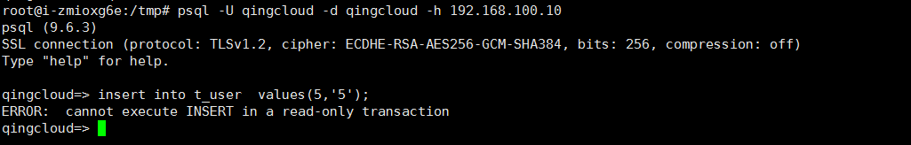

---
---

# 查看从节点 DB 的 readonly 功能  

登录 PostgreSQL DB 后，在从节点上执行写 DB 操作，查看是否能执行成功。

```sql
create table t_user1 (id int primary key,val varchar(30));
insert into t_user1  values(1,'Raito');
```

数据库会返回如下错误，表示从节点只提供读服务。

