---
---

# 集群信息

## 查看集群信息

在集群创建完毕后，可以在控制台 `Appcenter -> 集群列表` 标签下看到目前已经创建的集群信息。

集群列表
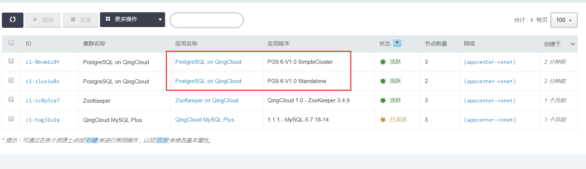

点击集群 ID 可以查看该集群的详细信息
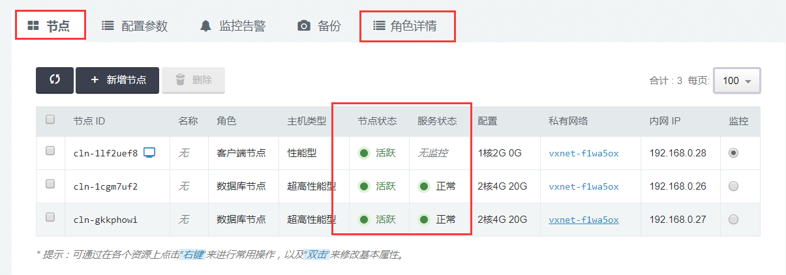

集群基础资源监控信息
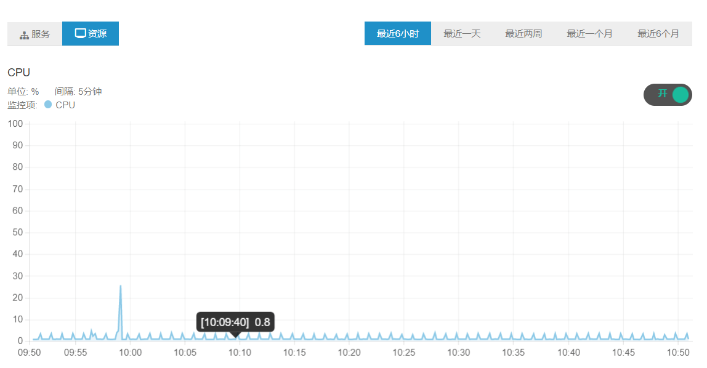  

集群节点监控信息
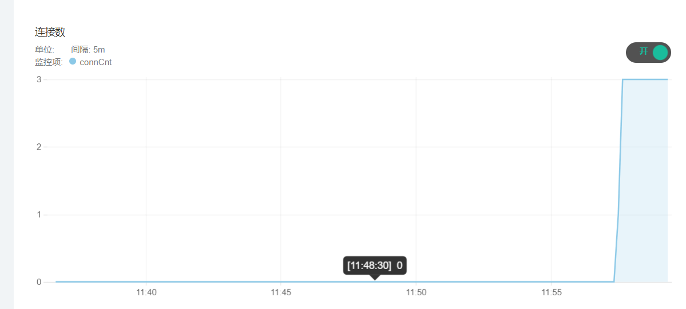

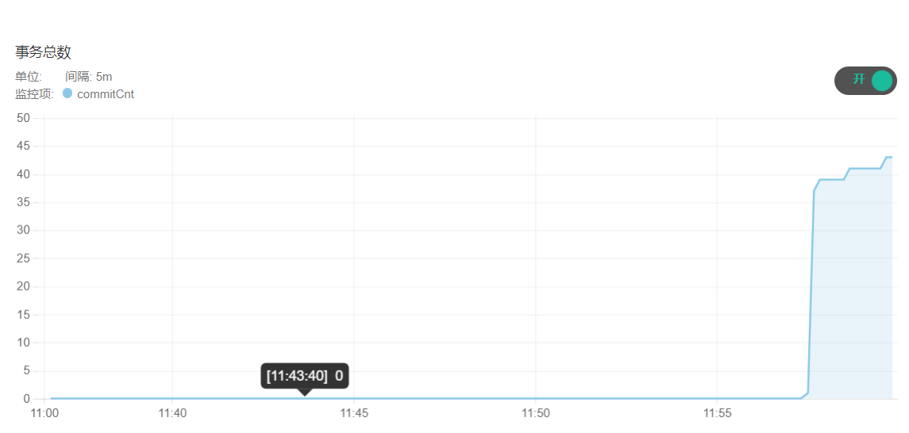

## 修改配置参数  

点击`配置参数`可以修改 `postgresql 参数` ，修改部分参数会导致 PostgreSQL 服务重启，具体可以参考参数说明。
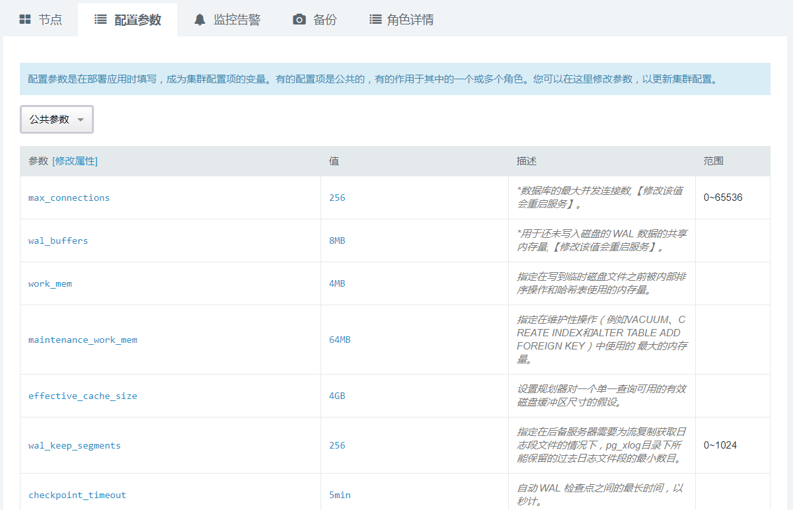

## 扩容集群  

点击 `扩容集群` ， 可以在集群性能不足时提高集群的配置：
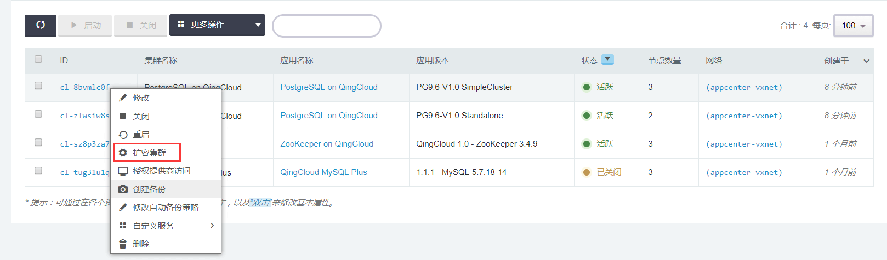

## 查看当前主节点  

因为主从双节点版本提供出现故障的情况下从节点能自动 failover 成为新的主节点，集群中的主从节点是变化的。  
点开集群的`角色详情` tab 页即可查看。
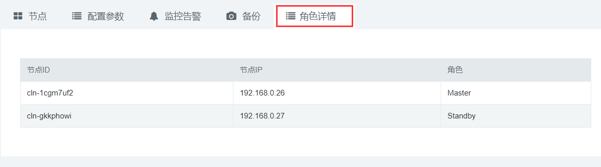

## 重建从节点

当出现主从节点数据不一致的情况下，可以通过重建从节点修复。
在集群列表中选中集群，右键自定义服务-->重建从节点。
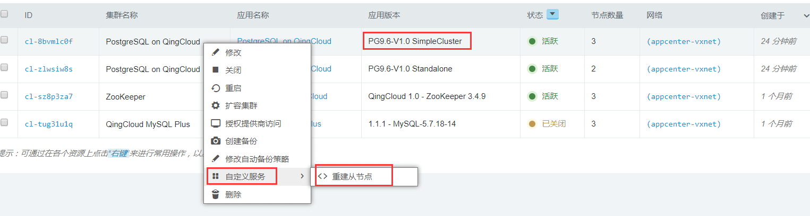

## 自动 failover

主从双节点集群具备自动 failover 的功能，当主节点上的 PostgreSQL 出现问题的时候，从节点会自动升级为新的主节点，同时 down 了的主节点会尝试自动重启，并自动以从节点的身份加入集群。可以通过观察`角色详情`的 tab 页来查看 failover 变化的情况。  

自动 failover 之前：
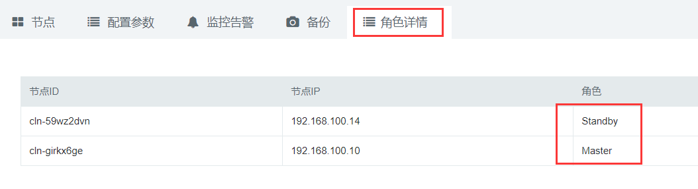

自动 failover 之后：
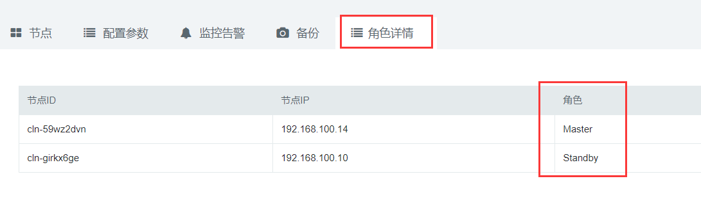

>注意：  
主从集群发生故障自动切换成功到集群可用状态时间大概为15s左右。
