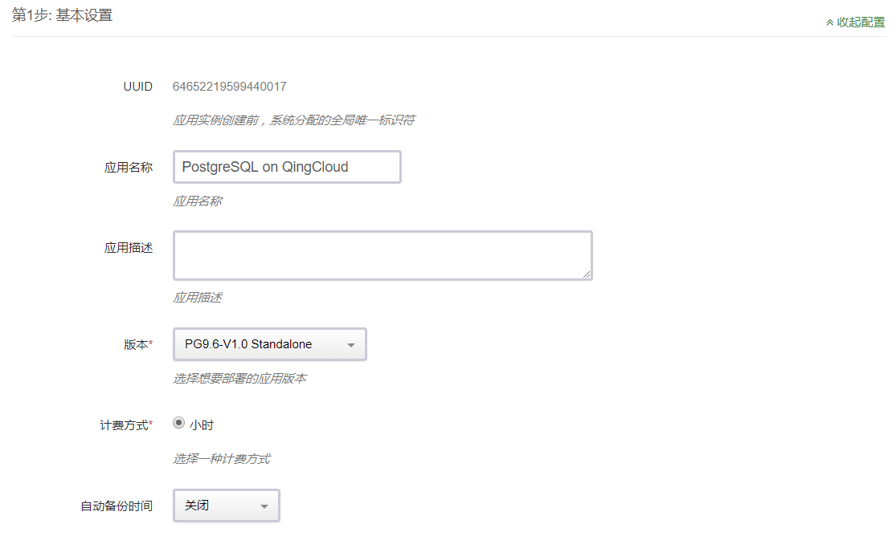

---
---

# 创建步骤

目前提供单节点版和主从双节点版本 2 个版本：

- 单节点版本号为：PG9.6-V1.0 Standalone
- 主从双节点版本号为：PG9.6-V1.0 SimpleCluster

>单节点版建议用于测试或者开发环境下，该版本内置自动备份，每周备份一次，保留 2 个备份。 
>
>主从双节点版本能满足生产环境下非大规模读负载均衡条件下的数据库的需求，主从节点可以通过修改配置参数设置同步流复制或者异步流复制模式。

两个版本的创建步骤类似，以下以单节点版为例具体说明创建步骤。

## 第一步：基本设置  

根据自己的需求填写 `应用名称` 和 `应用描述`，选择`版本`为单节点版（PG9.6-V1.0 Standalone）。

## 第二步：数据库节点设置  

CPU，内存，实例类型，磁盘类型大小根据自己实际需求进行选择即可，生产环境建议磁盘使用超高性能型。

## 第三步：网络设置  

出于安全考虑，所有的集群都需要部署在私有网络中，选择自己创建的网络中。

## 第四步：参数设置  

界面提供的参数大部分和 PostgreSQL 性能相关，如果需要调整相关参数，可以按照自己的实际需求配置和调整相关参数，修改部分参数会导致 PostgreSQL 服务重启，具体可以参考参数说明。

在配置主从双节点版本参数时，会比单节点版本的设置多出如下一个参数。  
该参数用于设置主从复制模式是同步流复制还是异步流复制，默认是异步流复制。

## 第五步: 用户协议  

阅读并同意青云 AppCenter 用户协议之后即可开始部署应用。

 >注意：  
 `PostgreSQL on QingCloud AppCenter` 在初始化的时候，会根据服务器参数中用户输入的数据库名称，数据库用户，和数据库密码。同时，为了方便用户维护，会自动创建数据库超级用户 (superuser) root，密码和用户在服务器参数中设置的数据库密码相同。    

