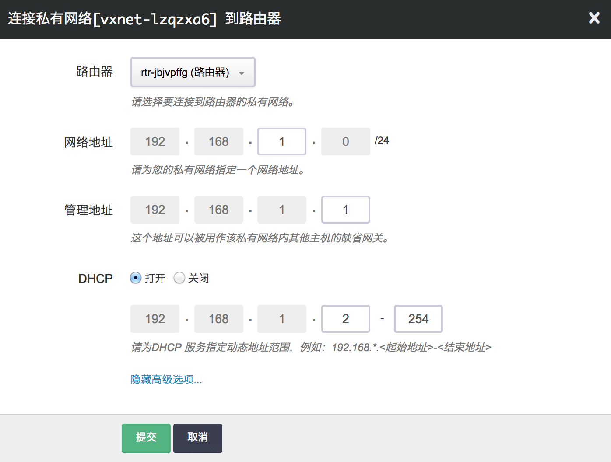

---
---

# 快速入门

## 登录 PostgreSQL DB  

对于主从双节点版本，集群提供一个对外的读写 VIP ，在保证高可用性的同时，无需手动切换主节点 IP 地址。
     

通过 psql 命令行客户端 ，用新建集群步骤中定义的数据库用户名和密码，连接到新创建的自定义的 PostgreSQL database 。  
输入命令：`psql -U qingcloud -h 192.168.100.250 -d qingcloud`  
>-U 参数值是上图的服务器参数：数据库用户名，  
-h 参数值是postgresql节点的IP或者是双节点集群的VIP，  
-d 参数值可以是上图服务器参数:数据库名称。    
然后输入的密码是上图服务器参数：数据库密码。  

输入命令：`\l`， 可以查看当前 PostgreSQL server 上的数据库信息。  


除了用 psql 命令行客户端连接数据库之外，还可以使用自己熟悉的其他图形化的数据库客户端连接到 PostgreSQL DB 上，方便做数据库操作以及数据库开发等工作。  
例如：pgAdmin 、DbVisualizer 、DBeaver 等。

------

## PaaS 服务

您仅需数十秒即可获得一个完整的基于 MySQL 或 PostgreSQL 的关系型数据库服务， 包括主从节点、高可用服务、读写分离、自动备份、在线扩容以及监控告警等各种管理功能。 青云QingCloud 数据库服务运行于私有网络内，结合青云QingCloud 提供的高性能硬盘和实时副本， 您的数据安全将会得到最大限度的保护。

### 新建

在控制台导航中点击『数据库』-『关系型数据库』进入列表页面，然后点击『创建』按钮， 并在『类型』下拉框中选择”PostgreSQL-9.3”即可。


**私有网络**

建议将数据库服务放入一个独立的受管私有网络中，并确保该私有网络的 DHCP 处于『打开』状态。 使用一个数据库独享的私有网络的好处是方便您对其做『过滤控制』，同时也不影响其它私有网络的设置。



**资源设置**

在资源设置页中可以选择数据库的配置、磁盘大小以及自动备份的时间。 数据库配置决定了 PostgreSQL 的 Shared_buffers、effective_cache_size 等值； 磁盘大小则决定了数据库最大容量，您的数据和日志会共享这块磁盘； 请谨慎选择是否关闭自动备份；


**账号设置**

在这一步中设置数据库服务的名称，默认的用户名和密码，并选择一个独立的、已经连接到路由器的私有网络。


点击『提交』按钮后数据库服务便创建完成了，如果之后需要修改或调整，都可在数据库详情页中进行相应操作。

### 扩容

可以对一个运行中的数据库服务进行在线扩容，右键点击您需要扩容的数据库服务再选择『扩容』即可。


> 警告
> 在线扩容期间，会有一小段时间数据库处于只读状态，这是正常现象，通常只需要几秒钟时间即可恢复。所以如果希望减少对线上业务的影响，可以选择在业务低峰时段进行在线扩容。

### 备份

**自动备份**

默认情况下，数据库服务会每日备份。 在数据库服务被彻底销毁前，您都可以选择从这些备份创建出全新的数据库服务。

从备份创建出的新数据库服务完全独立于原数据库服务运行， 临时性维护节点则给予您自由处置数据又不影响线上业务的能力。

**手动备份**

如果需要手动备份，可以在数据库列表点击“备份”图标或者数据库详情页的『备份』标签下点击『创建备份』实现。


**创建新数据库服务**

如果需要从备份创建出一个独立于原有数据库服务的新数据库服务， 可以在数据库详情页的『备份』标签下右键相应的备份点，再选择『新建关系型数据库』即可。

### 监控

**主机监控**

- CPU 使用率
- 内存使用率
- 硬盘使用率

**数据库服务监控**

- 连接数：呈现了一段时间内 PostgreSQL 的连接数量
- 缓存命中率：计算公式为 (heap_blks_hit / (heap_blks_hit + heap_blks_read)) * 100%
- 查询数：呈现了一段时间为 PostgreSQL 接收到的查询数量

### 操作

**连接数据库**

数据库创建成功之后，就可以通过提供的 IP 地址来访问。


比如针对上图中的数据库，就可以通过主节点 IP 192.168.1.4 和从节点 IP 192.168.1.5 这两个 IP 地址来访问； 区别是主节点同时提供了读、写的能力，而从节点是只读节点。

下面创建了两台主机 app-server-1 和 app-server-2， 并将它们都放入数据库所在的私有网络 user-vxnet 中。


> 注解
> 如果主机是从基础网络或者其他私有网络离开，并重新加入这个网络时，可能需要手工重启一下网络或者主机，以便让网络变更生效（比如上图中的 app-server-2），下面列出了几种主流操作系统的重启方式：

RHEL/CentOS

```
# service NetworkManager restart
```

Fedora

```
# systemctl restart NetworkManager
```

Debian

```
# service network-manager restart
```

Ubuntu

```
# restart network-manager
```

下图展示了如何通过 [psql](http://www.postgresql.org/docs/9.3/static/app-psql.html) 这个官方命令行工具连接 shire 数据库。


> 警告
> 请不要删除 postgres 数据库，因为该数据库下存有 pg_stat_statsments 视图。

**创建新账号**

可以使用 root 账号连接到 PostgreSQL server，然后执行 [CREATE ROLE](http://www.postgresql.org/docs/9.3/static/sql-createrole.html) 命令创建新账号；比如：

```
 foo=# CREATE ROLE test_user WITH CREATEDB LOGIN PASSWORD 'guest';
 CREATE ROLE
```

**导入数据**

如果需要向 PostgreSQL 数据库导入数据，可用参考下面的操作。

1. 在源数据库端使用 psql_dump 将需要的内容导出到 dump.sql 文件；比如下面就导出了整个 shire 数据库中的 schema 和数据。

```
# pg_dump shire > shire.sql
```

2. 将上一步导出的 shire.sql 文件复制到一台能连接 RDB 的主机后执行该 .sql 文件，将表和数据导入指定的 shire 数据库中。

```
# psql -h 192.168.1.4 shire anrshu
```

### 基准测试

**TPC-B**

我们采用满足 [TPC-B](http://www.tpc.org/tpcb/) 基准测试规范的 PostgreSQL 测试工具 pgbench 做了基准测试， 在8核32G规格的数据库下，100个 TPC-B 仓库，每个仓库500个销售端，模拟256个连接，TPS 测试结果为5680，详情见下图：


其它规格数据库的基准测试建议您自己来做，以获得对测试数据最真实的第一手资料。