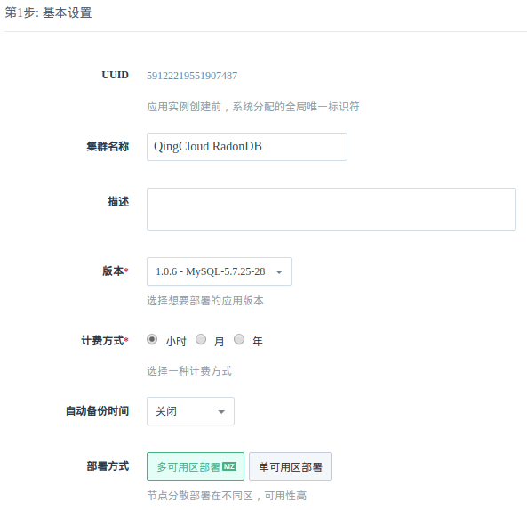
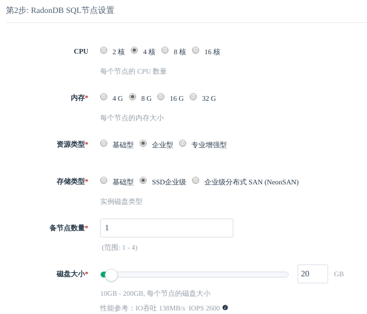
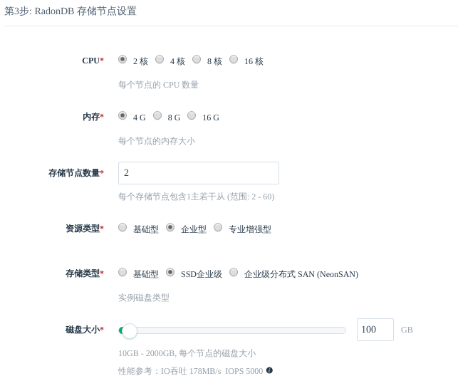
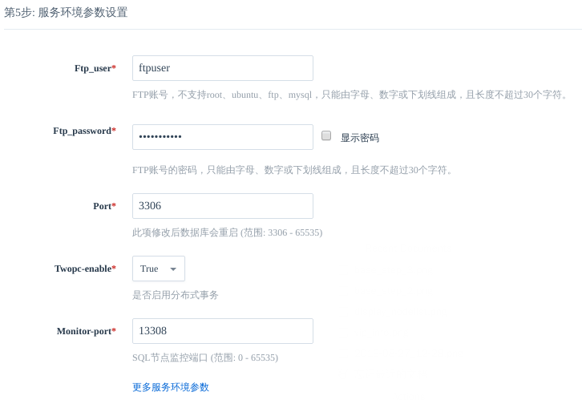

---
---

# 创建步骤

## 1. 基本设置

这里可以填写新集群的基本信息。

计费方式可选小时、月、年。若开启自动备份，则在每天指定时间段都会创建一次备份。

多可用区域将节点分散部署在不同区，可用性高。单可用区域将节点部署在同一个区，网络延迟最低。

**注解**：如果您选择『多可用区部署』，则集群所有节点将分散部署在当前region中的所有zone，反之，如果选择『单可用区部署』，则集群所有节点将部署在当前region中的某一个zone中。

## 2. 节点设置

RadonDB 包含两种类型的节点：SQL 节点、存储节点。SQL 节点的数量固定为 1，存储节点数量可选，每个节点都有副本节点。具体说明如下表：

| 节点类型 | 节点数量范围 | 副本节点数量范围 |
| - | :-: | -: |
| SQL 节点 | 1        | 1-4，默认为 1 |
| 存储节点   | 2-60，默认为 2 | 2 |

每种类型的节点都可设置 CPU、内存、磁盘类型、磁盘大小。磁盘类型可选择性能型或者超高性能型。磁盘大小决定了数据库最大容量，您的数据和日志会共享这块磁盘。

**注解**：按上述设置，集群会有 8 个主机，包括：SQL 节点 1 组，每组包括 1 主 1 副本；存储节点 2 组，每组包含 1 主 2 副本。

## 3. 网络设置

为安全起见，数据库集群服务需加入已连接路由器的私有网络，并确保该私有网络的 DHCP 处于『打开』状态 (默认已打开)。 使用一个数据库独享的私有网络的好处是方便您对其做『过滤控制』，同时也不影响其它私有网络的设置。

**注解**：如果您选择的集群部署方式是多可用区部署，则只能看到多可用区的私有网络。关于如何在region创建VPC、私有网络，请参考[区域(region)与可用区(zone)](https://docs.qingcloud.com/product/region)。

## 4. 服务环境参数设置

在这一步可以设置数据库服务的配置参数。

