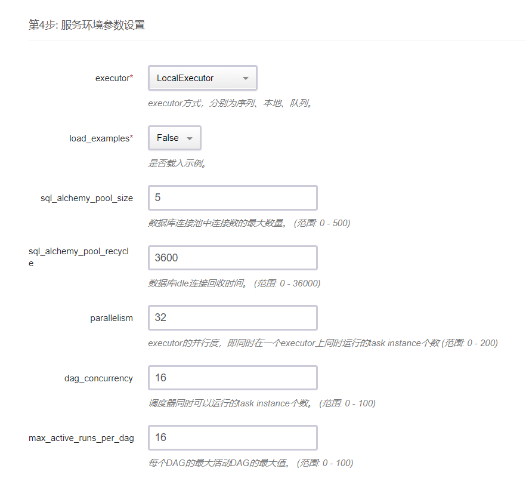
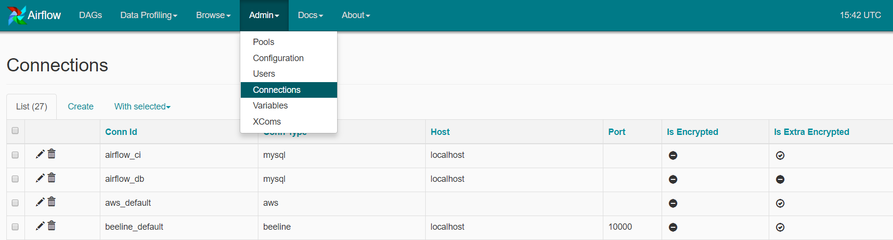

---
---

# Airflow on QingCloud AppCenter  用户手册  

<extoc></extoc>

## 1.描述  

`Airflow on QingCloud AppCenter`将 Airflow 通过云应用的形式在 QingCloud AppCenter 部署，具有如下特性：

- 目前提供单机版版本，后续会尽快推出集群版，分别满足不同作业数量级别的需求。  
- 单机版提供本地执行器，采用伪分布模式，通过在本地用 python 的多进程库从而达到以多进程的方式调度和运行作业的效果。如果只有适量的作业数量，可以采取这种方式。  
- Airflow on QingCloud AppCenter  支持 Airflow v1.9.0 版本。
- 提供实时监控、健康检查、日志自动清理等功能，方便用户运维。
- 一键部署，开箱即用。

## 2.简介  

- [Airflow](https://airflow.apache.org/project.html) 是 [Airbnb](https://www.airbnb.com/) 开源的 data pipeline 调度和监控工作流的平台，用来创建、监控和调度 data pipeline（ETL），目前项目仍在 Apache Software Foundation 孵化中。   

- Airflow 将 workflow 编排为 tasks 组成的 DAGs(Directed Acyclic Graph) 即有向无环图，调度器在一组workers上按照指定的依赖关系执行tasks。

- Airflow 提供了丰富的命令行工具和简单易用的用户界面以便用户查看和操作，基于 Web 的用户界面可以可视化管道的依赖关系、监控进度、触发任务等。

- 这个平台拥有和 Hive、Presto、MySQL、HDFS、Postgres 和 S3 交互的能力，并且提供了钩子使得系统拥有很好的扩展性。

- 不同于其它调度器使用XML或者text文件方式定义工作流，airflow 通过 python 文件定义工作流，用户可以通过代码完全自定义自己的工作流。

类似的产品有：Azkaban (LinkedIn)、 Luigui (Spotify) 和 Oozie (Yahoo)


## 3.部署

目前 `Airflow on QingCloud AppCenter` 提供单机版版本，后续会尽快推出集群版：

- 单机版版本号为： Airflow1.9.0-Standalone-V1.0.0  

对于单机版，对 Airflow 进行一个适度的安装，包括如下组件：  
- Airflow Web 服务器  
- Airflow 调度器  
- 元数据库（PostgreSQL）  
- 上述两个组件（ Web 服务器和调度器）运行于一个单机上，数据库运行在单机之上。   

以下以单机版为例具体说明创建步骤。

### 第1步：基本设置  


根据自己的需求填写 `应用名称` 和 `应用描述`，选择`版本`为单机版（Airflow1.9.0-Standalone-V1.0.0）。

### 第2步：Airflow节点设置  


CPU，内存，节点类型，磁盘大小根据自己实际需求进行选择即可，生产环境建议磁盘使用超高性能型。

### 第3步：网络设置  


出于安全考虑，所有的集群都需要部署在私有网络中，选择自己创建的网络中。

### 第4步：Airflow 参数设置  


界面提供的参数大部分和 Airflow 性能相关，如果需要调整相关参数，可以按照自己的实际需求配置和调整相关参数，修改参数会导致 Airflow 服务重启，具体可以参考参数说明。
>对于 executor 参数设置的说明:  
单机版可以用于测试开发环境，需要设置 executor 为 SequentialExecutor ，表示单进程顺序执行 DAG 中的任务，通常只用于测试。   
当单机版中参数 executor 设置为 LocalExecutor，表示多进程本地执行，可用于适量作业的生产环境。  

### 第5步: 用户协议  

阅读并同意青云 AppCenter 用户协议之后即可开始部署应用。

## 4.集群使用

### 4.1查看集群信息  

在集群创建完毕后，可以在控制台 `Appcenter -> 集群列表` 标签下看到目前已经创建的集群信息。

 集群列表


 集群的详细信息


 集群基础资源监控信息
   

### 4.2 修改配置参数  

  点击`配置参数`可以修改 Airflow 参数，修改参数会导致 Airflow 服务重启，参数具体含义可以参考 Airflow 参数说明。
  

### 4.3 扩容集群  

  点击 `扩容集群` ， 可以在集群性能不足时提高集群的配置：
  

## 5.Airflow 的使用  

### 5.1 进入 Airflow web UI

Airflow 提供了一个基于 Web 的用户界面让用户可以可视化管道的依赖关系、监控进度、触发任务等操作。  
部署好`Airflow on QingCloud AppCenter `之后，连入内网，输入 url http://[airflow所在的IP地址]:8080/admin/  进入 Airflow web UI 界面。  
为了方便用户快速学会使用 DAG，初始化的时候在 Dags 目录下放置了一个5个青云提供的示例 Dag 文件，默认进入 web UI 界面的会显示这5个 DAGs 。  
    

### 5.2 Dag的开发测试

`Airflow on QingCloud AppCenter `提供用户登录主机的权限，在控制台上，Appcenter -->集群列表,找到自己的 Airflow 集群列表，进入节点 tab 页，点集群ID列右下角的 VNC图标。  
以用户名 airflow ，密码 airflow.2018! 登录系统。
   

在 `Airflow on QingCloud AppCenter ` 开发测试环境下完成 DAG 文件的开发测试步骤如下。

- 1.编写任务脚本(.py)文件
- 2.测试任务脚本(command)
- 3.WebUI 自查

DAG (Directed Acyclic Graph)有向非循环图，表示的是一些任务的集合，描述了任务之间的依赖关系，以及整个 DAG 的一些属性， 比如起止时间，执行周期，重试策略等等。  
Airflow 采用 Python 定义 DAG，通常一个 .py 文件就是一个 DAG 。

在部署的时候，如果参数是否载入示例选择是，在 web 界面会出现 airflow 内置的示例dag，通过学习这些 DAG 的源码可掌握 operator、调度、任务依赖等知识，能快速入门 Airflow DAG开发。

`Airflow on QingCloud AppCenter `中，DAGS 文件存放的目录是/data/airflow/dags目录，在该目录下编写自己的 DAG 文件定义自己的数据流逻辑代码，编码完成后，Airflow 提供一系列的命令支持开发测试。

```shell
#进入DAGS目录
airflow@i-ayvkovqg:/data/airflow/dags$ cd /
airflow@i-ayvkovqg:/$ cd /data/airflow/dags
airflow@i-ayvkovqg:/data/airflow/dags$ ls  

#测试 python 代码的正确性
airflow@i-ayvkovqg:/data/airflow/dags$ python Helloworld_Sample.py

#查看 DAG 是否成功加载
airflow@i-ayvkovqg:/data/airflow/dags$ airflow list_dags
-------------------------------------------------------------------
DAGS
-------------------------------------------------------------------
BashOperator_Sample
Helloworld_Sample
PythonOperator_Sample
SSHOperator_Sample
SSHOperator_Sparksample

#查看 DAG 的下Task
airflow@i-ayvkovqg:/data/airflow/dags$ airflow list_tasks Helloworld_Sample
py_hello_task
sh_date_task
sh_sleep_task

#查看 DAG 的下 task 的树形结构
airflow@i-ayvkovqg:/data/airflow/dags$ airflow list_tasks Helloworld_Sample --tree
<Task(BashOperator): sh_sleep_task>
    <Task(BashOperator): sh_date_task>
<Task(PythonOperator): py_hello_task>
    <Task(BashOperator): sh_date_task>

#测试 DAG 的下 task 运行是否正确，不需要依赖满足
airflow@i-ayvkovqg:/data/airflow/dags$ airflow test Helloworld_Sample py_hello_task 20180530
airflow@i-ayvkovqg:/data/airflow/dags$ airflow test Helloworld_Sample sh_date_task 20180530
airflow@i-ayvkovqg:/data/airflow/dags$ airflow test Helloworld_Sample sh_sleep_task 20180530

# 对dag进行某段时间内的完整测试，会自动解析依赖关系，按依赖顺序执行
airflow@i-ayvkovqg:/data/airflow/dags$ airflow backfill Helloworld_Sample -s 20180530 -e 20180530
```

在 DAGS 目录 /data/airflow/dags 下增加任何新的 dag文件，需要重启 Airflow 的 Webserver 服务才能在 Web 界面上显示。  
这个操作可以通过自定义服务-->重启 Airflow Web 服务 实现。
   


>青云提供的示例 Dag 文件主要是基于3个基础的 Operator 的使用，分别是 BashOperator，SSHOperator，PythonOperator，下面具体说明他们的使用方法。

#### 5.2.1 BashOperator 的使用

BashOperator 的示例在 WebUI 上对应的 Dag 是 BashOperator_Sample，以 airflow 用户登录 Airflow 节点进入 Dags 目录/data/airflow/dags，找到对应的 Dags 文件 BashOperator_Sample.py。  

```
dag = DAG(
    "BashOperator_Sample",
    default_args=default_args,
    description="BashOperator_Sample",
    schedule_interval=timedelta(days=1))
#-------------------------------------------------------------------------------
# first operator
date_operator = BashOperator(
    task_id="BashOperator_Sample_task1_date",
    bash_command="date;",  
    dag=dag)
#-------------------------------------------------------------------------------
# second operator
sh_operator = BashOperator(
    task_id='BashOperator_Sample_task2_testsh',
    bash_command='BashOperator_Sample.sh',  
    dag=dag)
#-------------------------------------------------------------------------------
# dependencies
date_operator.set_upstream(sh_operator)
```

同样也可以直接在 WebUI 上直接查看 Dags 对应的代码。
   

对于 BashOperator 不需要做其他额外的配置，DAG文件经过测试后可以直接在 WebUI 上开启调动。
   

#### 5.2.2 SSHOperator 的使用

SSHOperator 的示例在 WebUI 上对应的 Dag 是 SSHOperator_Sample ，以 airflow 用户登录 Airflow 节点进入 Dags 目录/data/airflow/dags，找到对应的 Dags 文件 SSHOperator_Sample.py 。  
同样也可以直接在 WebUI 上直接查看 Dags 对应的代码。
```
dag = DAG(
    "SSHOperator_Sample",
    default_args=default_args,
    description="SSHOperator_Sample",
    schedule_interval=timedelta(days=1))
#-------------------------------------------------------------------------------
sshHook = SSHHook(ssh_conn_id='test_sshconn')
sshHook.no_host_key_check = True  
task = SSHOperator(
    task_id="SSHOperator_Sample_task1",
    command=" echo \"`date '+%Y-%m-%d %H:%M:%S'` - test.sh - Info - test testSSHOperator.\" >>/tmp/testSSHOperator.log",
    ssh_hook=sshHook,
    dag=dag)
#-------------------------------------------------------------------------------
task2 = SSHOperator(
    task_id="SSHOperator_Sample_sshcmd",
    command="/data/bin/SSHOperator_Sample.sh",
    ssh_hook=sshHook,
    dag=dag)
```

为了能够正确运行 SSHOperator 需要做以下设置。   
- 1.以 airflow 用户进入 Airlfow 节点，进入目录 /home/airflow/.ssh，将 id_rsa.pub 复制到远程服务器的 ~/.ssh/authorized_keys 文件中去。   
- 2.进入 Web UI ，在 admin 的 connections 添加 test_sshconn。
   
 点 create ，输入以下相关信息。
 
- 3.如果要执行远程机器上的sh脚本，需要保证对应的目录下有相关 shell 文件，例如示例中的/data/bin/SSHOperator_Sample.sh，该脚本是存在于远程机器上的 shell 文件。

完成配置之后可以在 Web UI 上开启该 Dag，点击运行可以看到 Job 运行状态。

#### 5.2.3 PythonOperator 的使用
PythonOperator 的示例在 WebUI 上对应的 Dag 是 PythonOperator_Sample ，以 airflow 用户登录 Airflow 节点进入 Dags 目录/data/airflow/dags，找到对应的 Dags 文件 PythonOperator_Sample.py。  
```
dag = DAG(
    "PythonOperator_Sample",
    default_args=default_args,
    description="PythonOperator_Sample",
    schedule_interval=timedelta(days=1))
#-------------------------------------------------------------------------------
def print_hello():
    return "Hello world!"
hello_operator = PythonOperator(
    task_id="PythonOperator_Sample_task1",
    python_callable=print_hello,
    dag=dag)
```
对于 PythonOperator 不需要做其他额外的配置，DAG文件经过测试后可以直接在 WebUI 上开启调动。

关于 Airflow 的 DAG 开发请参考[官方文档](https://airflow.apache.org/tutorial.html#example-pipeline-definition) 获取更多相关知识。

### 5.3 Dag 的运维管理

以用户名 airflow ，密码 airflow.2018! 登录系统，在 Airflow 的 DAG 目录下编写自己的 DAG 文件，如果开发的 DAG 通过测试，就可以在生产环境下运行自定义的 DAG 了。      
在开发测试环境下准备好 DAG 文件之后，需要把开发好的 DAG 文件上传到生产环境下的 DAGS 目录。  
上传之后，重启集群或者重启 Airflow web 服务，然后再刷新 Airflow web UI 界面，就可以看到新加的 DAG 文件已经被加载成功了。


为了启动 DAG Run，首先打开工作流(off键)，然后单击 Trigger Dag 按钮(Links 第一个按钮)，最后单击 Graph View 按钮(Links 第三个按钮)以查看运行进度:


点击 Airflow 的树形图（Tree View）迅速进掌握运行的状态。  
垂直列着的方格表示的是一个 DAG 在一天里运行的所有任务。所有的方块都是绿色表示运行全部成功！
  

完成后，你可以单击task，然后单击 View Log 查看日志。如果一切都按预期工作，日志应该显示一些行。

关于 Airflow 的运维管理请参考[官方文档](https://airflow.apache.org/configuration.html#) 获取更多相关知识。

### 5.4 日志管理

`Airflow on QingCloud AppCenter ` 日志目录存放在/data/airflow/logs,可以以用户名 airflow ，密码 airflow.2018! 登录系统，进入该目录查看相关日志。  


关于 `Airflow on QingCloud AppCenter ` 的介绍就到这里，希望您在 Qingcloud 上使用愉快！
