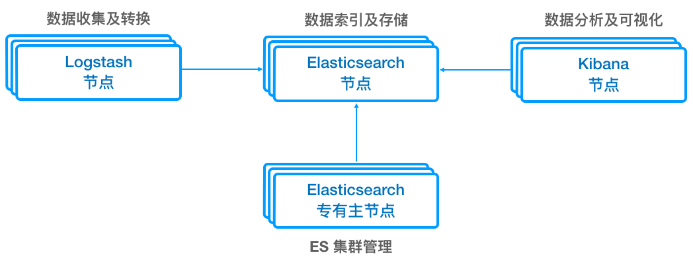
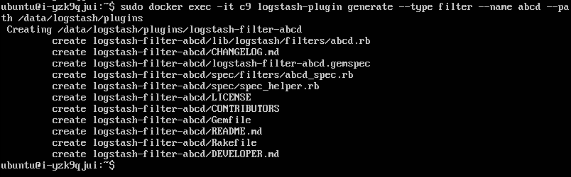
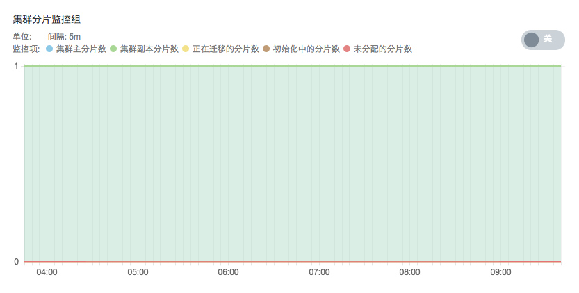

---
---

# ELK 用户指南

## 简介

_ELK_ 是 _Elasticsearch_ 、 _Kibana_ 和 _Logstash_ 这三个软件集合的简称， _Elasticsearch_ 是一个实时分布式搜索和分析引擎， _Kibana_ 则为 _Elasticsearch_ 提供了强大的可视化界面， _Logstash_ 为用户提供数据采集、转换、优化和输出的能力。 _ELK_ 目前被广泛应用于实时日志处理、全文搜索和数据分析等领域。

ELK 服务对 Elasticsearch、Kibana 与 Logstash（后两者为可选）三者进行了很好的集成后以 AppCenter 云应用的形式交付给用户使用。

组件版本对应关系如下：

| ELK 服务 | Elasticsearch | Logstash | Kibana |
| --- | --- | --- | --- |
| ELK 5.6.16 - QingCloud 1.5.0 | 5.6.16 | 5.6.16 | 5.6.16 |
| ELK 5.5.1 - QingCloud 1.2.8 及之前版本 | 5.5.1 | 5.5.1 | 5.4.3 |

### ELK 功能概览

* 为 Elasticsearch 提供了更强大的分词功能支持，集成了 [IK Analysis](https://github.com/medcl/elasticsearch-analysis-ik) 中文分词插件，并为该插件提供了 [结巴分词](https://github.com/fxsjy/jieba/blob/master/jieba/dict.txt) 的词库和 IK 自带的搜狗词库，同时还支持用户上传自定义词典
* Elasticsearch 与 [青云对象存储 QingStor](https://www.qingcloud.com/products/qingstor/) 集成。Elasticsearch 集成了官方 [S3 Repository 插件](https://www.elastic.co/guide/en/elasticsearch/plugins/6.7/repository-s3.html)，可通过标准 S3 接口与青云对象存储 QingStor 集成，以便生成 snapshot 并将其存储到到 QingStor 中，并可以在必要时从中恢复
* Logstash 与 青云对象存储 QingStor 集成，用户可以很方便地从 QingStor 对象存储通过内置的 [官方插件 logstash-input-s3](https://www.elastic.co/guide/en/logstash/6.7/plugins-inputs-s3.html) 输入数据到 Elasticsearch 或者通过 [logstash-output-s3](https://www.elastic.co/guide/en/logstash/6.7/plugins-outputs-s3.html) 插件将输入到 Logstash 的数据导出到青云对象存储
* Logstash 提供自定义插件能力
* Kibana 节点集成 ES 反向代理和负载均衡，并提供 Elasticsearch 节点失效时的故障转移能力
* Kibana 节点提供 Cerebro、ES Head、ElasticHD、Elasticsearch-HQ、ES SQL 等可视化管理工具，方便用户通过浏览器使用 Elasticsearch
* 所有节点内置日志查看工具，用户可通过浏览器直接访问日志文件，方便定位问题
* 集群关键指标监控
* 一键集群安装部署
* 支持节点横向和纵向扩容
* 集成 elasticsearch-analysis-pinyin 插件 *（ ELK 5.5.1 - QingCloud 1.2.1 版本开始）*
* *`新上线！`* 支持企业级分布式 SAN（NeonSAN）存储，单节点最大 50T 容量 *（ ELK 5.6.16 - QingCloud 1.5.0 开始）*
* *`新上线！`* 支持 ES 专有主节点（Dedicated Master）*（ ELK 5.6.16 - QingCloud 1.5.0 开始）*
* *`新上线！`* 支持热温冷（Hot-Warm-Cold）架构 *（ ELK 5.6.16 - QingCloud 1.5.0 开始）*
* *`新上线！`* 支持 ES 节点滚动升级和重启，最小化对业务的影响 *（ ELK 5.6.16 - QingCloud 1.5.0 开始）*

### ELK 集群组件说明

_ELK_ 为用户提供了以下组件，用以服务集群其他组件或直接为用户提供服务。

* [ES Head](http://mobz.github.io/elasticsearch-head/) 提供一个 Elasticsearch cluster 的 web 控制台，用户可以在这个控制台里很方便的查看集群拓扑架构、监控集群状态，进行节点和索引级别的各种操作，以及进行数据的浏览、查询、分析等。在浏览器输入网址 `http://<Kibana节点IP>:9100/` 即可使用该插件提供的集群控制台。进入后请输入 `http://<任意Elasticsearch节点IP>:9200/` 后，点击连接即可查看 Elasticsearch 集群状态。
* [elasticsearch-sql](https://github.com/NLPchina/elasticsearch-sql) 使用户可以使用SQL来进行 Elasticsearch 查询，并且可以在 SQL 中使用 Elasticsearch 的函数。在浏览器输入网址 `http://<Kibana节点IP>:8080/` 即可使用该插件提供的查询页面。此插件在 1.2.1 版本加入。
* [Cerebro](https://github.com/lmenezes/cerebro) 的前身是 kopf，她是一个开源的 Elasticsearch Web 管理工具，她提供了查看集群节点资源使用状态、查看集群分片状态、创建索引、修改集群设置、创建仓库及快照等功能，为用户提供了极大的便利。在浏览器输入网址 `http://<Kibana节点IP>:9000/` 即可使用该插件提供的集群控制台。进入后请输入`http://<任意Elasticsearch节点IP>:9200/`后，点击 Connect 即可查看 Elasticsearch 集群状态。此插件在 1.2.1 版本加入。
* [ElasticHD](https://github.com/360EntSecGroup-Skylar/ElasticHD) 是一个 Elasticsearch 可视化管理工具, 支持 ES 监控、实时搜索，Index template 快捷替换修改，索引列表信息查看，SQL converts to DSL 等功能。在浏览器输入网址 `http://<Kibana节点IP>:9800/` 即可使用该插件提供的集群控制台。
* [Elasticsearch-HQ](https://github.com/ElasticHQ/elasticsearch-HQ) 是一个 ES 可视化监控和管理工具，可在浏览器打开 `http://<Kibana 节点 IP>:5000` 使用。
* [Caddy](https://caddyserver.com/) 是一个支持 HTTP/2 的跨平台 Web 服务器，除了日志查看功能，还为 Logstash 节点提供上传分词和停止词词典功能，为 Elasticsearch 节点提供上传同义词词典功能。Caddy运行在集群节点的80端口，用户可通过 http://[节点IP]/logs/ 查看日志。
* [HAProxy](http://www.haproxy.org/) 是一个高性能的负载均衡软件，部署在 Kibana 节点上，为我们提供 Elasticsearch 的负载均衡和故障转移功能。建议用户通过集群的 VIP （绑定在 Kibana 节点上）访问 Elasticsearch 服务（http://[VIP]:9200/)。

  > `ELK 5.5.1 - QingCloud 1.2.8` 及之前版本使用 Nginx 。

* [Keepalived](https://www.keepalived.org) 为 HAProxy 提供故障转移能力，防止 HAProxy 单点失败，确保 http://[VIP]:9200/ 的高可用。

  > 注意：如需此功能，需要配置两个 Kibana 节点。此组件从版本 `ELK 5.6.16 - QingCloud 1.5.0` 起开始支持。

## <a name="deploy-elk"></a>部署 ELK

### 基本设置


填写服务`名称`和`描述`，选择版本。如快速配置不能满足要求，可选择“自定义”逐项设置。

### Elasticsearch 节点设置


填写 Elasticsearch 节点CPU、内存、节点数量、主机类型及数据盘大小等配置信息。

> 注意：企业级分布式 SAN（NeonSAN）目前仅支持 北京3区-B、上海1区-A，广东2区-A 这三个区域。

### Elasticsearch 专有主节点设置


填写 Elasticsearch 专有主节点CPU、内存、节点数量、主机类型及数据盘大小等配置信息。

### Kibana节点设置


填写 Kibana 节点CPU、内存、节点数量及主机类型等配置信息。

###  Logstash 节点设置


填写 Logstash 节点CPU、内存、节点数量、主机类型及数据盘大小等配置信息。

### 网络设置


出于安全考虑，所有的集群都需要部署在私有网络中，请选择自己创建的已连接路由器的私有网络

### 服务环境参数设置


提供了多项自定义参数供用户填写，可以点击`展开配置`对所有配置项进行修改，也可使用默认值并在集群创建后弹性进行修改。

### 用户协议

阅读并同意青云 AppCenter 用户协议之后即可开始部署应用。

## ELK 使用简介

### 查看服务详情


创建成功后，点击集群列表页面相应集群可查看集群详情。可以看到集群分为 Elasticsearch 节点（热、温、冷共三组）、Elasticsearch 专有主节点、Kibana 节点和 Logstash 节点等角色：

* Elasticsearch 节点（热、温、冷共三组）管理所有数据；
* Elasticsearch 专有主节点管理集群状态，生产环境建议配置三个 ES 专有主节点保证 ES 集群的高可用；
* Logstash 节点提供数据收集及实时数据转换处理的能力；
* Kibana 节点提供 Kibana 以及 Cerebro 等 Elasticsearch 可视化管理工具，并且绑定了 VIP 保证 Elasticsearch 服务的高可用。

Elasticsearch 节点可提供远程扩展字典及热更新，Logstash 节点提供用户自定义插件能力，具体使用方法将在下文中详述。



> ELK 提供的是 HTTP RESTful 接口，可以使用很多兼容的工具进行交互。为了方便理解，下文将交叉使用 [Kibana Console 语法](https://www.elastic.co/guide/en/kibana/current/console-kibana.html#console-api) 和 `curl` 语法来演示与 ELK 的交互，比如下面两段请求是等价的：
>
>> Kibana Console 语法（可通过 Kibana 的 Dev Tools 直接执行）：
>> ```
>> GET _search
>> {
>>   "query": {
>>     "match_all": {}
>>   }
>> }
>> ```
>>
> curl 语法：
>> ```bash
>> curl -XGET "http://192.168.2.2:9200/_search" -d'
>> {
>>   "query": {
>>     "match_all": {}
>>   }
>> }'
>> ```

下文使用的 IP 地址说明如下，请根据实际情况修改：
>
> | 示例 IP 地址 | 说明 |
> |---|---|
> | 192.168.2.2 | Elasticsearch 节点 IP |
> | 192.168.2.7 | Logstash 节点 IP |
> | 192.168.2.9 | Kibana 节点 IP |

### <a name="es-intro"></a>Elasticsearch 基本用法

Elasticsearch 用索引（index）来组织数据，用户向 Elasticsearch 发送数据时需要指定目标索引，比如如下命令把数据（访问日志）以 JSON 格式发送到了名为 `access-log-2019.05.13` 的索引（索引名称可根据实际情况指定）：

> Elasticsearch 从 6.x 版本起，新创建的 index 不再支持多 mapping types（在老版本创建的可以在 6.x 版本继续使用），官方建议使用 `_doc` 作为唯一的 mapping type，更多详情请查阅 [官方说明](https://www.elastic.co/guide/en/elasticsearch/reference/6.7/removal-of-types.html)；如果是 5.x 版本，mapping type 不能以下划线开头，需要把下面的 `_doc` 改成 `doc` 或者其他任意名称。

```
POST access-log-2019.05.13/_doc
{
  "from": "10.10.10.10",
  "success": true
}
```

从 Elasticsearch 查询数据时也需要指定目标索引，比如如下命令从名为 `access-log-2019.05.13` 的索引查询：

```bash
curl -H "Content-Type: application/json" "192.168.2.2:9200/access-log-2019.05.13/_search?q=*"
```

### <a name="ls-intro"></a>Logstash 基本用法

Logstash 可通过服务器端的数据处理流水线（pipeline），对来自多种数据源的数据进行转换后，发送到指定的多种目标（比如 Elasticsearch，QingStor 对象存储等）。


本应用默认开启了 HTTP Input 插件（运行在 Logstash 节点的 9700 端口），比如下面的命令通过此插件把数据（字符串）发送到 Logstash（随后经过处理， Logstash 最终把数据发送到 Elasticsearch）：

```bash
curl -d "This is a test message." 192.168.2.7:9700 # 发送测试数据

curl 192.168.2.2:9200/logstash-*/_search # 查询
```

### <a name="kibana-intro"></a>Kibana 基本用法

Kibana 是 Elasticsearch 的可视化工具，可通过浏览器访问。在浏览器中输入 http://192.168.2.9:5601/ 打开 Kibana，首先点击左侧栏的 `Management` 菜单，然后点击 `Create index pattern` 按钮来创建 index pattern，默认情况下，Kibana 认为您要访问的是通过 Logstash 导入 Elasticsearch 的数据。这时候您可以用默认的 `logstash-*` 作为您的 index pattern。

> 如果显示 "Unable to fetch mapping. Do you have indices matching the pattern?"，可参考 [Logstash 基本用法](#ls-intro) 发送一些数据。


index pattern 创建成功后可点击左侧栏的 `Discover` 菜单查看导入的日志。

> 关于 Kibana 更多的使用方式，请参考[官方文档](https://www.elastic.co/guide/en/kibana/6.7/index.html)

***

> ELK 常被联合使用于日志收集，存储，检索及分析领域，下面两个场景将详解 ELK 在这方面的应用
>
>为了方便测试，这两个场景选择了 logstash-http-input 插件输入日志数据，在实际应用中用户可以选择多种 Logstash Input 插件从各种数据源获取日志数据，比如文件、log4j、syslog、QingStor 对象存储、Kafka 等
>
> 此外，Logstash 默认将日志输出到 Elasticsearch 中，用户可以通过 `output_es_content` 配置项，对这个输出过程进行定制。用户还可以通过 `output_conf_content` 配置项，选择将日志输出到除了 Elasticsearch 之外的其他位置，比如 QingStor 对象存储

### <a name="elk-all-cn"></a>场景：ELK 中文日志搜索场景

本场景为用户呈现了中文日志从 Logstash 导入到 Elasticsearch，再通过 Kibana 进行搜索的完整的过程。

> 注意：从版本 `ELK 5.6.16 - QingCloud 1.5.0` 起已内置用于指定 ik 分词器的模板文件，用户可以直接使用（在 Logstash 节点的 /data/elasticsearch/dicts 目录下）；如果是以前的版本，需要事先把 [模板文件](logstash.json) 下载到 Logstash 节点的 `/data/elasticserach/dicts/` 目录下再进行后面的操作，否则 Logstash 会因找不到模板文件而无法启动（可以直接登录到节点下载，也可以通过如下命令上传，注意 URL 最后的 `/` 不能省略：
> ```bash
> curl -sL https://docs.qingcloud.com/product/big_data/elk/logstash.json |
>   curl -F "file=@-;filename=logstash.json" 192.168.2.7/dicts/
> ```

第一步，在集群详情页面，切换到参数配置页面，选择 Logstash 节点，修改 `output_es_content` 配置项为如下，点击保存。

```ruby
template_overwrite => true
template => "/data/elasticsearch/dicts/logstash.json"
```

> 注意：上述模板文件 logstash.json 只能对之后新创建的 index 生效，无法对已经存在的 index 生效。如果当天的 Logstash index 已经存在，可以备份完里面的数据以后先删除这个 index 再进行下面的操作。

第二步，重启 Logstash 节点：在集群列表页面右键点击您的 ELK 集群，点击重启，选择 Logstash 节点，点击提交，此时 Logstash 节点将会重启。

第三步，待 Logstash 重启完成后，向 Logstash 发送数据：

```bash
curl -d "中国驻洛杉矶领事馆遭亚裔男子枪击 嫌犯已自首" 192.168.2.7:9700
```

第四步，参照 [Kibana 基本用法](#kibana-intro) 在浏览器中访问 Kibana 节点并配置 index pattern。

点击左侧的 `Discover` 菜单项，显示近期接收到的日志，在搜索栏中输入“中国”，点击右侧的“搜索”按钮。如图，“中国”被高亮显示并且中间没有空格分隔，测试成功。


### <a name="elk-all-en"></a>场景：ELK 英文日志搜索场景

本场景为用户呈现了英文日志从 Logstash 导入到 Elasticsearch ，再通过 Kibana 进行搜索的完整的过程。

第一步，在集群详情页面找到任意 Logstash 节点的 IP 地址。参照 [Logstash 基本用法](#ls-intro)，执行如下命令将一条模拟日志发往 Logstash ：

```bash
curl -d "[09-07 15:57:26]: call_es_api [:10105/_cluster/health] Exception [error: [Errno -5] No address associated with hostname], try to sleep 10 second." 192.168.2.7:9700
```

第二步，参照 [Kibana 基本用法](#kibana-intro) 在浏览器中访问 Kibana 节点并配置 index pattern：

点击左侧的 `Discover` 菜单项，显示近期接收到的日志，在搜索栏中输入 `error` ，点击右侧的“搜索”按钮。如图，`error` 被高亮显示，测试成功。


***
### <a name="es-custom-dicts-cn"></a>场景：Elasticsearch 使用 IK Analysis 插件和自定义字典进行中文分词

本场景为用户呈现了直接调用 Elasticsearch API 的中文分词使用方式，为了在 Elasticsearch 中获取更好的中文分词效果，ELK 集成了 IK Analysis 中文分词插件，并为该插件提供了结巴分词的词库和 IK 自带的搜狗词库，同时还支持用户上传自定义词典。IK Analysis 插件用法请参考 [IK Analysis plugin](https://github.com/medcl/elasticsearch-analysis-ik)。

第一步，把自定义字典上传到可访问到的 HTTP 服务器上，本示例将通过如下命令上传到某个 Logstash 节点，用户也可以放在其他任意 HTTP 服务器，只要 Elasticsearch 节点可以访问到即可：

> 注意：URL最后的 `/` 不能省略

```bash
curl -F "file=@-;filename=mydict.dic" 192.168.2.7/dicts/ <<- EOF
青云
优帆科技
优帆
EOF
```

上传成功后可通过访问 192.168.2.7/dicts/mydict.dic 来查看上传的字典文件。

第二步，在集群详情页面中切换到配置参数标签页，选择"Elasticsearch节点"进行参数配置，设置 `remote_ext_dict` 设置项为用户自定义字典的可访问 URL（如示例的 `http://192.168.2.7/dicts/mydict.dic`）后保存, 然后在集群列表页面 **重启** 集群中的 Elasticsearch 节点。

第三步，执行如下命令测试中文分词功能：

```bash
INDEX=chinese-news # 可根据实际情况调整
MAPPING_TYPE=_doc  # ELK 6.7.1 - QingCloud 2.0.0 以前版本请去掉开头的下划线，即：doc

# 创建 $INDEX 索引
curl -XPUT 192.168.2.2:9200/$INDEX; echo

# 创建 mapping
curl -s -H "Content-Type: application/json" 192.168.2.2:9200/$INDEX/$MAPPING_TYPE/_mapping -d'
{
    "properties": {
        "content": {
            "type": "text",
            "analyzer": "ik_max_word",
            "search_analyzer": "ik_smart"
        }
    }
}'; echo

# 索引 一些 文档
postData() {
  curl -H "Content-Type: application/json" -d'{"content":"'$1'"}' 192.168.2.2:9200/$INDEX/$MAPPING_TYPE; echo
}

sampleData="
美国留给伊拉克的是个烂摊子吗
公安部：各地校车将享最高路权
中韩渔警冲突调查：韩警平均每天扣1艘中国渔船
中国驻洛杉矶领事馆遭亚裔男子枪击，嫌犯已自首
北京优帆科技有限公司于2012年4月正式成立，是全球首家实现资源秒级响应并按秒计量的基础云服务商
青云的12字决：从初创企业到云生态的蜕变
"

for data in $sampleData; do postData "$data"; done

# 高亮查询
query() {
  curl -s -H "Content-Type: application/json" 192.168.2.2:9200/$INDEX/$MAPPING_TYPE/_search -d@- <<- EOF |
  {
      "query" : { "match" : { "content" : "$1" }},
      "highlight" : {
          "pre_tags" : ["<tag1>", "<tag2>"],
          "post_tags" : ["</tag1>", "</tag2>"],
          "fields" : {
              "content" : {}
          }
      }
  }
EOF
  grep --color "<tag1>[^<]*</tag1>"
}

words="
中国
青云
优帆科技
"
sleep 5; for word in $words; do query "$word"; done
```

第五步，查看中文分词结果，结果如下图红色部分所示即为成功。即"中国"、"青云"、"优帆科技"被当做固定的中文分词表示。


第六步，可根据实际需要随时更新用户自定义字典，Elasticsearch 会自动检测 HTTP 响应头中的 Last-Modified 和 ETag 的变化，来进行分词字典的热更新。

### <a name="es-synonym-cn"></a>场景：Elasticsearch 同义词词典配置与同义词搜索

首先需要上传同义词词典到所有 Elasticsearch 节点：

第一步，按照每行一组同义词、词语之间以 **半角** 逗号 `,` 分隔的格式准备名为 `synonym.txt` 的同义词词典文件，如：

```solr
番茄,西红柿 => 西红柿,番茄
```

> 详细的synonym.txt文件配置说明请参考[官方文档](https://www.elastic.co/guide/en/elasticsearch/reference/6.7/analysis-synonym-tokenfilter.html)

第二步，通过如下命令在 **所有** Elasticsearch 节点和 Elasticsearch 专有主节点上传词典：

> **注意**： URL最后的 `/` 不能省略

```bash
curl -T synonym.txt http://192.168.2.2/analysis/
```

上传成功后可通过访问 http://192.168.2.2/analysis/synonym.txt 来查看同义词文件。

> 注意：`ELK 5.6.16 - QingCloud 1.5.0` 之前的版本需要重启集群中的 Elasticsearch 节点使词典生效，待集群恢复 `green` 状态（可通过以下命令查看状态，等待 `status` 字段变为 `green` ）：
>
> ```bash
> curl 192.168.2.2:9200/_cluster/health?pretty
> ```

第三步，进行同义词搜索测试。

使用如下 bash 脚本测试同义词搜索功能：

```bash
INDEX=synonym-test
MAPPING_TYPE=_doc      # ELK 6.7.1 - QingCloud 2.0.0 以前版本请去掉开头的下划线，即：doc

# 创建 索引
curl -H "Content-Type: application/json" -XPUT http://192.168.2.2:9200/$INDEX -d'
{
  "index": {
    "analysis": {
      "analyzer": {
        "by_smart": {
          "type": "custom",
          "tokenizer": "ik_smart",
          "filter": ["by_tfr","by_sfr"],
          "char_filter": ["by_cfr"]
        },
        "by_max_word": {
          "type": "custom",
          "tokenizer": "ik_max_word",
          "filter": ["by_tfr","by_sfr"],
          "char_filter": ["by_cfr"]
        }
      },
      "filter": {
        "by_tfr": {
          "type": "stop",
          "stopwords": [" "]
        },
        "by_sfr": {
          "type": "synonym",
          "synonyms_path": "analysis/synonym.txt"
        }
      },
      "char_filter": {
        "by_cfr": {
          "type": "mapping",
          "mappings": ["| => |"]
        }
      }
    }
  }
}'

# 创建 mapping
curl -H "Content-Type: application/json" -XPUT http://192.168.2.2:9200/$INDEX/$MAPPING_TYPE/_mapping -d'
{
  "properties": {
    "content": {
      "type": "text",
      "analyzer": "by_max_word",
      "search_analyzer": "by_smart"
    }
  }
}'

# 索引 一些 文档
postData() {
  curl -H "Content-Type: application/json" -d'{"content":"'$1'"}' 192.168.2.2:9200/$INDEX/$MAPPING_TYPE; echo
}

phrases="
我有一个西红柿
番茄炒蛋饭
西红柿鸡蛋面
"
for phrase in $phrases; do postData $phrase; done

# 高亮 查询
sleep 5; curl -s -H "Content-Type: application/json" -XPOST http://192.168.2.2:9200/$INDEX/_search  -d'{
    "query" : { "match" : { "content" : "番茄" }},
    "highlight" : {
        "pre_tags" : ["<tag1>", "<tag2>"],
        "post_tags" : ["</tag1>", "</tag2>"],
        "fields" : {
            "content" : {}
        }
    }
}' | grep --color "<tag1>[^<]*</tag1>"
```

第五步，查看同义词搜索结果，如下图所示，包含"西红柿"和"番茄"的文档均被搜索出来。


***
> QingStor 对象存储为用户提供了云端可无限扩展的通用数据存储服务，具有安全可靠、简单易用、高性能、低成本等特点。 用户可以将数据、日志、静态资源等多种文件类型，通过多种方式上传至 QingStor 对象存储中，以满足日常数据存储、归档、分析等需求。为了更好的满足用户的需求，青云提供了Elasticsearch、Logstash 等与 QingStor 对象存储的集成功能。

### <a name="es-qingstor"></a>场景：Elasticsearch 与 QingStor 对象存储集成

Elasticsearch 可以通过快照（snapshot）将指定 index 甚至整个 cluster 的数据存储到某远端仓库（repository）, 并能从该远端仓库存储的快照中恢复数据。本应用的 Elasticsearch 可以通过 S3 Repository Plugin 与 QingStor 对象存储集成以便生成快照将数据存储到 QingStor 中，并可以在必要时从中恢复。

<a name="es-qingstor-step-1"></a>第一步，创建一个 repository：

```
PUT _snapshot/repo-qingstor
{
  "type": "s3",
  "settings": {
    "endpoint": "s3.pek3a.qingstor.com",
    "access_key": "<YourAccessKey>",
    "secret_key": "<YourSecretKey>",
    "bucket": "my_qingstor_bucket"
  }
}
```

| 参数 | 说明 |
|---|---|
| repository | 名称，如示例中的 repo-qingstor |
| endpoint | s3.[region].qingstor.com （请根据实际情况就近选择，目前支持：pek3a, pek3b, sh1a，gd2，请参阅 [区域及访问域名](https://docs.qingcloud.com/qingstor/#区域及访问域名) 获取最新列表）|
| access_key | 青云账号关联的access_key |
| secret_key | 青云账号关联的secret_key |
| bucket | QingStor上bucket名称my_qingstor_bucket(如果不存在将创建出来) |

更多参数的详细说明请参阅 [官方文档](https://www.elastic.co/guide/en/elasticsearch/plugins/current/repository-s3-client.html)。

第二步，通过如下命令查看、删除已有的 repository：

```bash
curl 192.168.2.2:9200/_snapshot/repo-qingstor    # 获取指定repository信息

curl "192.168.2.2:9200/_snapshot/repo*,*backup*" # 获取所有满足特定条件的repository信息

curl 192.168.2.2:9200/_snapshot/_all             # 获取所有repository信息

curl -XDELETE 192.168.2.2:9200/_snapshot/repo-qingstor # 删除repository
```

第三步，用如下命令创建快照（该快照将会存放在之前指定的 QingStor 的 bucket  `my_qingstor_bucket` 中）：

```bash
# 创建包含集群所有index的snapshot
curl -H "Content-Type: application/json" -XPUT "192.168.2.2:9200/_snapshot/repo-qingstor/backup-2019.05.13?wait_for_completion=true"

# 创建包含集群指定index(此处为index_1,index_2)的snapshot
curl -H "Content-Type: application/json" -XPUT "192.168.2.2:9200/_snapshot/repo-qingstor/backup-2019.05.13?wait_for_completion=true" -d'
{
  "indices": "index_1,index_2",
  "ignore_unavailable": true,
  "include_global_state": false
}
'
```

> 参数 wait_for_completion 为 true 时表示该命令将会在快照创建完成返回；
false 表示该命令将会在快照初始化完成就返回

第四步，通过如下命令查看、删除快照：

```bash
curl "192.168.2.2:9200/_snapshot/repo-qingstor/backup-2019.05.13" # 查看指定repository中某snapshot信息

curl "192.168.2.2:9200/_snapshot/repo-qingstor/_all"              # 查看指定repository中所有snapshot信息

curl -XDELETE "192.168.2.2:9200/_snapshot/repo-qingstor/backup-2019.05.13" # 删除snapshot
```

<a name="es-qingstor-step-5"></a>第五步，通过如下命令恢复存储在 QingStor 的快照到 Elasticsearch 集群：

```bash
# 恢复包含集群所有index的snapshot
curl -H "Content-Type: application/json" -XPOST "192.168.2.2:9200/_snapshot/repo-qingstor/backup-2019.05.13/_restore"

# 恢复包含集群指定index(此处为index_1,index_2)的snapshot
curl -H "Content-Type: application/json" -XPOST "192.168.2.2:9200/_snapshot/repo-qingstor/backup-2019.05.13/_restore" -d'
{
  "indices": "index_1,index_2",
  "ignore_unavailable": true,
  "include_global_state": false,
  "rename_pattern": "index_(.+)",
  "rename_replacement": "restored_index_$1"
}
'
```

> __注意__：要恢复的 index 必须是集群中处于关闭状态的 index, 处于打开状态的 index 将会提示无法恢复

第六步，快照由于并没有和具体的集群信息绑定，所以也可以恢复到另一个不同的集群，用户可以用这种方法在不同集群之间通过 QingStor 导入导出数据。

> __注意__：新集群的版本必须和老集群一致或者更新。

* 先在目标集群中生成和源集群同样的 repository（必须使用同样的参数，具体方法请参考 [第一步](#es-qingstor-step-1) ）。

* 在新的集群创建好与老集群相同的 repository 后，就可以通过 [第五步](#es-qingstor-step-5) 中提到的命令（需要把 URL 地址改成新集群里节点的地址）将老集群的数据恢复到新集群上去。

  > 更详细的有关集群快照的生成和恢复的信息请参考 [Elasticsearch官方文档](https://www.elastic.co/guide/en/elasticsearch/reference/6.7/modules-snapshots.html)

> __注意__：如果 ES 集群和 QingStor 位于同一区域进行数据迁移耗公网流量，如果不在同一区域则需要消耗公网流量，比如位于 北京3区-A 的 ES 集群可以选择同一区域的 QingStor （https://s3.pek3a.qingstor.com）避免产生公网流量。

### <a name="es-hot-warm-cold"></a>场景：Elasticsearch 热-温-冷 数据架构

在某些大规模数据分析场景（比如时间数据分析），可以采用此架构：基于时间创建 index，然后持续地把温/冷数据迁移到相应的数据节点。

> 详情可参考官方博客 [“Hot-Warm” Architecture in Elasticsearch 5.x](https://www.elastic.co/blog/hot-warm-architecture-in-elasticsearch-5-x)。


* 专有主节点：由于不保存数据，也就不参与索引和查询操作，不会被长 GC 干扰，负载可以保持在较低水平，能极大提高集群的稳定性；

* 热数据节点：保存近期的 index，承担最频繁的写入和查询操作，可以配置较高的资源，如超高性能主机及硬盘。可以在集群配置参数里 Elasticsearch 节点的参数 node.attr.data（热）做修改，默认为 `hot`。

* 温/冷数据节点：保存只读 index，会接收少量的查询请求，可以配置较低的资源。可以在集群配置参数里 Elasticsearch 节点的参数 node.attr.data（温）和 node.attr.data（冷）做修改，默认为 `warm` 和 `cold`。

  > 

创建好的集群如下图所示：


如下图所示，假设有三个 index，分别代表热、温、冷 index 数据，它们最初都处于热数据节点上：


可以使用如下命令迁移温数据（名为 `last-month` 的 index，可根据实际情况选择相应的 index）到相应节点上：

```bash
PUT /last-month/_settings
{
  "index.routing.allocation.require.data": "warm"
}
```

使用如下命令迁移冷数据（名为 `last-year` 的 index，可根据实际情况选择相应的 index）：

```bash
PUT /last-year/_settings
{
  "index.routing.allocation.require.data": "cold"
}
```

下面的动态截屏展示了通过 Kibana 的 Dev Tools 进行温/冷数据迁移的过程：


### <a name="es-view-logs"></a>场景：Elasticsearch 集群日志查看

可直接通过浏览器访问任意 Elasticsearch 节点的 80 端口 http://192.168.2.2/logs/ 查看所有 Elasticsearch 节点的日志，如下图所示。


> `ELK 5.6.16 - QingCloud 1.5.0` 之前的版本请按下面的步骤操作。
>
> 第一步，在集群列表页面，在 ELK 集群上点击右键选择 **自定义服务** > **收集ES日志**，然后选择 **Elasticsearch节点** 点击提交。
>
> 
>
> 第二步，任务执行成功后可通过浏览器访问`http://< Logstash 节点IP>/logs/`查看对应 ES 节点的日志。
>
>> 注意：如存在多个 Logstash 节点请在集群详情页面切换到参数配置界面，配置 Elasticsearch 节点的 `logstash_node_ip` 配置项。

***
> 下面几个场景将介绍如何对 ELK 中的 Logstash 进行个性化定制及使用

### <a name="ls-qingstor"></a>场景：Logstash 与 QingStor 对象存储集成

Logstash 支持从 QingStor 对象存储输入数据到 Elasticsearch，或者从 Elasticsearch 导出数据到 QingStor 对象存储。

| 版本 | 插件 |
| --- | --- |
| 5.6.16 | logstash-input/output-s3（**`推荐！`**）, logstash-input/output-qingstor |
| 5.5.1 | logstash-input/output-qingstor |

> 请先在 青云控制台 申请 [Access Key](https://console.qingcloud.com/access_keys/) 和 [创建Bucket](https://docs.qingcloud.com/qingstor/guide/bucket_manage.html#%E5%88%9B%E5%BB%BA-bucket)。

第一步，在集群详情页面，切换到参数配置页面，选择 Logstash 节点，修改 `input_conf_content` 配置项为如下，点击保存。

```ruby
s3 {
    access_key_id => "access key id"
    secret_access_key => "secret access key"
    endpoint => "https://s3.pek3a.qingstor.com"
    bucket => "logstash-input"
}
```

> 请根据实际情况调整上面的参数，比如按区域就近指定 endpoint 地址等，关于参数的详情可参考其 [官方文档](https://www.elastic.co/guide/en/logstash/6.7/plugins-inputs-s3.html)。

> `ELK 5.6.16 - QingCloud 1.5.0` 之前的版本请使用 Logstash Inputs QingStor 插件参考如下示例进行配置：
>
> ```ruby
> qingstor {
>     access_key_id => "your_access_key_id"
>     secret_access_key => "your_secret_access_key"
>     bucket => "bucket_name"
>     region => "pek3a"
>     sincedb_path => "~/.sincedb"
> }
> ```
>
> 请根据您的具体配置替换上面的配置，其他配置参数详情请参见[手册](https://github.com/yunify/logstash-output-qingstor/blob/master/docs/index.asciidoc)

第二步，重启 Logstash 节点。

在集群列表页面右键点击您的 ELK 集群，点击重启，选择 Logstash 节点，点击提交，此时 Logstash 节点将会重启。

第三步，保存成功后请在您配置的 bucket 里上传日志文件。

第四步，参照 [Kibana 基本用法](#kibana-intro) 使用浏览器输入 `http://192.168.2.9:5601/` 打开 Kibana 界面，配置 index pattern 后，既可在 Discover 查看到导入的日志。

> Logstash 默认的 output 是 Elasticsearch， 并自动配置好了 Elasticsearch 集群的 hosts 选项。如果需要在 output 到 Elasticsearch 的过程中指定其他参数， 可以在`output_es_content`中指定，比如：
>
> ```ruby
> 	action => "update"
> 	index => "my-first-index"
> ```
>
> 如还需输出到其他位置，可以通过`output_conf_content`指定，比如通过如下配置将数据上传到 QingStor 对象存储：
>
> ```ruby
> s3 {
>     access_key_id => "access key id"
>     secret_access_key => "secret access key"
>     endpoint => "https://s3.pek3a.qingstor.com"
>     bucket => "bucket name"
>     codec => "json"
>     encoding => "gzip"
>     rotation_strategy => "size_and_time"
>     size_file => 10485760
>     time_file => 10
> }
> ```
>
> 更多参数详情可参考其 [官方文档](https://www.elastic.co/guide/en/logstash/6.7/plugins-outputs-s3.html)。
>
> `ELK 5.6.16 - QingCloud 1.5.0` 之前的版本请使用 Logstash Outputs QingStor 插件参考如下示例进行配置：
>
> ```ruby
> qingstor {
>     access_key_id => "your-access_key_id"
>     secret_access_key => "your-secret-access_key"
>     bucket => "bucket name"
>     region => "pek3a"
>     codec => "json"
>     encoding => "gzip"
>     rotation_strategy => "size_and_time"
>     file_size => 10485760
>     file_time => 10
> }
> ```
>
> 关于`logstash-input/output-qingstor`插件的更多细节信息请查看[相关文档](https://docs.qingcloud.com/qingstor/third_party_integration/index.html)

### <a name="ls-install-plugin"></a>场景：Logstash 插件安装使用方法

> **注意**：此处仅讨论在线安装，需要有公网连接，如需离线安装，请参考 [官方文档](https://www.elastic.co/guide/en/logstash/6.7/offline-plugins.html)。下面以 logstash-output-influxdb 插件的安装为例，其他插件安装方式类似。

第一步，在集群列表页面的 Logstash 节点上点击节点 ID 右侧的显示器图标，打开 Web 终端。输入默认用户名 `ubuntu`、密码 `p12cHANgepwD`，进入 shell，然后输入命令 `sudo su` 切换到 root 用户。

第二步，运行如下命令下载 logstash-output-influxdb 插件：

```bash
cd /data/logstash/plugins
git clone https://github.com/logstash-plugins/logstash-output-influxdb.git
```

第三步，在集群详情页面，切换到参数配置页面，选择 Logstash 节点，修改`gemfile_append_content`配置项为如下示例并点击保存：

```ruby
gem "logstash-output-influxdb", :path => "/data/logstash/plugins/logstash-output-influxdb"
```

第四步，打开之前的 Web 终端，执行如下命令安装插件：

```bash
/usr/share/logstash/bin/logstash-plugin install --no-verify
```

> `ELK 5.5.1 - QingCloud 1.2.0` 及以前版本请使用如下命令：
>
> ```bash
> sudo docker exec -it $(docker ps -q) logstash-plugin install --no-verify
> ```

第五步，在集群详情页面，切换到参数配置页面，选择 Logstash 节点，修改 `output_conf_content` 配置项为如下，点击保存。

```ruby
influxdb {
    data_points => {
        "duration" => "%{data.event.duration}"
    }
    host => '192.168.0.7'
    password => ''
    user => ''
    db => 'elk'
}
```

> 请参考相关插件的配置参数进行必要的修改，logstash-output-influxdb 相关的配置参数请参考其[文档](https://www.elastic.co/guide/en/logstash/5.5/plugins-outputs-influxdb.html)
>
> __注意__：如您有多个 Logstash 节点，请在所有 Logstash 节点上执行第 1、2、4 步骤，确保所有 Logstash 节点成功安装相关插件，不然状态会显示不正常。

第六步，重启 Logstash 节点：

在集群列表页面右键点击您的ELK集群，点击重启，选择 Logstash 节点，点击提交，此时 Logstash 节点将会重启。

第七步，参考 [Logstash 基本用法](#ls-intro) 发送一条数据：

```bash
curl -d "qingcloud" 192.168.2.7:9700
```

如成功，则 influxdb 中将新增一条 point ，说明插件配置生效，如发现 influxdb 中没有新增 point ，请查看 logstash 日志，位置为 `/data/logstash/logs/logstash-plain.log`。

### <a name="ls-custom-plugin"></a>场景：Logstash 自定义插件支持

第一步，在集群列表页面的 Logstash 节点上点击节点 ID 右侧的显示器图标，打开 Web 终端。输入默认用户名 `ubuntu`、密码 `p12cHANgepwD`，进入 shell。

> `ELK 5.6.16 - QingCloud 1.5.0` 之前的版本请继续输入命令 `sudo su` 切换到 root 用户。

第二步，用如下命令创建自定义插件，其中 `filter` 可替换为您想要定制的插件的类型，类型包括 `{input, filter, codec, output}` ，`abcd` 可替换为您要开发的插件的名称，更多详情请参考 [官方文档](https://www.elastic.co/guide/en/logstash/6.7/contributing-to-logstash.html)：

```bash
/usr/share/logstash/bin/logstash-plugin generate --type filter --name abcd --path /data/logstash/plugins
```

> `ELK 5.5.1 - QingCloud 1.2.0` 及以前版本请使用如下命令：
>
> ```bash
> sudo docker exec -it $(docker ps -q) logstash-plugin generate --type filter --name abcd --path /data/logstash/plugins
> ```
>
> 

第三步，进入上面生成的插件目录，修改其中的文件，按实际业务需求进行开发，并修改 `.gemspec` 文件（比如示例 `/data/logstash/plugins/logstash-filter-abcd/logstash-filter-abcd.gemspec`），把包含 `TODO`  或 `FIXME` 的行改成实际内容，否则会导致 Logstash 无法启动。

第四步，在集群列表页面中切换到配置参数标签页，选择"Logstash 节点"进行参数配置，点击"修改属性"，根据您的插件类型及参数修改相应的配置项，如示例中，将 `filter_conf_content` 修改为 `abcd {}` ，根据您插件所在位置修改 `gemfile_append_content` ，插件位置前缀必须是 `/data/logstash/plugins` ，如示例中，将 `gemfile_append_content` 修改为 `gem "logstash-filter-abcd", :path => "/data/logstash/plugins/logstash-filter-abcd"`，修改后保存即可，如下图为示例中配置的展示。

> __注意__：如您有多个 Logstash 节点，请在所有 Logstash 节点上执行第 1、2、3 步骤，确保所有 Logstash 节点成功安装相关插件，不然状态会显示不正常。


第五步，重启 Logstash 节点：

在集群列表页面右键点击您的ELK集群，点击重启，选择 Logstash 节点，点击提交，此时 Logstash 节点将会重启。

第六步，参考 [Logstash 基本用法](#ls-intro) 发送一条数据：

```bash
curl -d "qingcloud" 192.168.2.7:9700
```

参照 [Kibana 基本用法](#kibana-intro) 在浏览器打开 Kibana 并进行必要配置，点击左侧的 Discover 菜单项，显示近期接收到的日志，如图，示例中的 `logstash_filter_abcd` 成功将原消息中的 `qingcloud` 替换为了 `Hello World!` ，说明插件配置生效。


### <a name="ls-custom-config"></a>场景：Logstash 自定义启动配置文件

默认情况下， Logstash 的启动配置文件会根据 **配置参数** 中 ** Logstash 节点** 的 `input_conf_content、filter_conf_content、output_conf_content、output_es_content` 配置项自动生成，如果用户想自定义 logstash.conf 配置文件，只需在 `/data/logstash/config/` 目录创建 logstash.conf.lock 文件，系统就不再覆盖  logstash.conf 文件。

用户通过上述方法修改 logstash.conf 配置文件后，需执行 `/usr/share/logstash/sbin/restart.sh` 重启 Logstash 服务。

> 如显示 `[=[Restart]=] Can't lock the file.`，则表示其他操作正在执行，请稍后再次尝试重启命令；
>
> 如果重启失败，可查看位于 `/data/logstash/logs/logstash-plain.log` 和 `/var/log/syslog` 的日志文件排查原因。

> `ELK 5.5.1 - QingCloud 1.2.0` 及以前版本请使用如下命令：
>
> `sudo docker exec -it $(docker ps -q) restart.sh`

### <a name="ls-syslog-plugin"></a>场景：logstash-input-syslog 插件使用说明

Logstash 预置了 logstash-input-syslog 插件，通过此插件可在 Logstash 节点上运行 syslog 服务以收集日志。

> 更多的预置 Logstash 插件请参见 [Logstash 预置插件列表](#logstash-plugins)。

第一步，在集群详情页面，切换到参数配置页面，选择 Logstash 节点，修改`input_conf_content`配置项为如下，点击保存。

```ruby
syslog { port => 514 }
```

> 请注意不要使用 22、80、9600 端口。
>
> 请根据您的具体配置替换上面的配置，其他配置参数详情请参见[官方文档](https://www.elastic.co/guide/en/logstash/6.7/plugins-inputs-syslog.html)

第二步，重启 Logstash 节点。

在集群列表页面右键点击您的ELK集群，点击重启，选择 Logstash 节点，点击提交，此时 Logstash 节点将会重启。

第三步，将 syslog 日志发送到 Logstash 配置的端口，如本示例登录到 Logstash 节点上使用 logger 命令发送到 514 端口：

```bash
logger -n 192.168.2.7 -P 514 "This is a test message for logstash syslog plugin."
```

第四步，测试插件是否如预期工作，在浏览器中访问 Kibana 节点提供的 Web 界面`(http://<Kibana节点IP>:5601)`，默认进入配置索引模式界面，如图，直接点击 Create 即可，点击左侧的 Discover 菜单项，显示近期接收到的日志，说明插件配置生效。


## 在线伸缩

### 增加节点

在 ELK 详情页点击 `新增节点` 按钮可以增加 `Elasticsearch 节点`、`Elasticsearch 专有主节点`、`Kibana 节点` 或 `Logstash 节点` 的数量，可以对每个新增节点指定 IP 或选择自动分配。


### 删除节点

可以在 ELK 详情页选中需要删除的节点，然后点击 `删除` 按钮，删除节点前系统会自动将数据从待删除节点迁移到其他节点，迁移数据如果因各种原因失败，则不会删除节点。

> __注意__：删除节点有丢失数据的风险，建议谨慎操作！`ELK 5.5.1 - QingCloud 1.2.2` 之前的版本需要人工确保数据是否已经安全转移到其他节点再删除，如操作不当会有数据丢失风险，升级到新版以后，系统会在删除节点前尝试把处于打开状态的 index 迁移到未删除节点，但处于关闭状态的 index 无法迁移，建议先打开这些 index 或者作好备份以后再进行节点删除，否则这些 index 可能会永久丢失。
>
> 如需要在 `ELK 5.5.1 - QingCloud 1.2.2` 之前的版本删除节点，注意一次只能删除一个，并且必须等到上个节点删除后且 Elasticsearch 集群完成数据迁移后状态变成 Green 才能删除下一个节点，否则数据可能会丢失。删除节点过程中会锁定 ELK 集群不让对其进行其它生命周期操作。
>
> 对于通常规模的集群大概需要 1、2 分钟的时间恢复到 Green 状态，可通过访问任意 Elasticsearch 节点的 9200 端口来获得集群状态，示例命令为：
>
> ```bash
> curl 192.168.2.2:9200/_cluster/health
> ```
>
> 也可以通过浏览器访问Kibana节点的9100端口提供的 ES Head 界面或 Kibana 节点的 9800 端口提供的 ElasticHD 界面来查看集群状态。

### 纵向伸缩

ELK 允许分别对各种角色的节点进行纵向的扩容及缩容。


## 监控告警

### Elasticsearch 集群监控

为了帮助用户更好的管理和维护 ELK 集群，我们提供了针对 Elasticsearch 集群的监控指标，可通过点击任意 Elasticsearch 节点右侧的监控按钮来查看。





### 告警

我们提供了资源和 Elasticsearch 集群级别的告警服务，包括 CPU 使用率、内存使用率、硬盘使用率、JVM 堆占用等。

## 配置参数

可以通过 `配置参数` 来定制个性化的 ELK 服务并进行调优。

### 修改配置参数

在 ELK 详情页，点击 `配置参数` Tab 页，切换到 `Elasticsearch节点`、`Kibana节点` 或 `Logstash 节点`，点击 `修改属性`，修改完后，需要进行 "保存"。如图所示：


> __注意__：在修改 Elasticsearch、Logstash 节点相关配置后需手动重启。

## 注意事项

### 安全

Elasticsearch 本身的 API 没有提供安全机制，同时 Elasticsearch 的 API 的功能非常强大，所以强烈不建议通过公网将 Elasticsearch 直接暴露出去，Elasticsearch 需要在应用或者 API 网关后面。 针对Elasticsearch的攻击频发，因此建议用户通过 VPN 的方式而不是端口转发的方式访问集群节点，配置青云 VPN 的方法详见 [用户指南](https://docs.qingcloud.com/product/network/vpn) 。

### 数据迁移

#### 方法1: 通过 QingStor 对象存储迁移

可借助青云 QingStor 对象存储完成数据迁移（比如原青云大数据平台的 Elasticsearch 用户可通过此方法把数据迁移到新版 ELK 应用后继续使用），具体操作步骤如下：

第一步，根据 [部署 ELK 服务](#deploy-elk) 创建 ELK 集群。

第二步，根据 [青云对象存储文档](https://docs.qingcloud.com/qingstor/index.html) 创建对象存储的 Bucket。

第三步，在青云控制台申请 [API 密钥](https://console.qingcloud.com/access_keys/)。

第四步，通过如下命令为原青云大数据平台的 Elasticsearch 集群创建 repository。

```bash
curl -XPUT 'http://<原青云大数据平台的 Elasticsearch 集群的某一节点的IP地址>:9200/_snapshot/repo-qingstor/' -d'
{
  "type": "s3",
  "settings": {
    "endpoint": "s3.pek3a.qingstor.com",
    "access_key": "<YourAccessKey>",
    "secret_key": "<YourSecretKey>",
    "bucket": "my_qingstor_bucket"
  }
}
'
```

上述命令必须指定的几个关键参数包括：

| 参数 | 说明 |
| --- | --- |
| 集群节点地址 | <原青云大数据平台的 Elasticsearch 集群的某一节点的 IP 地址> 需替换为具体的 IP 地址 |
| repository | repo-qingstor |
| endpoint | s3.pek3a.qingstor.com (请就近选择 pek3a, pek3b, sh1a，gd2 中的一个) |
| access_key | 青云账号关联的 access_key |
| secret_key | 青云账号关联的 secret_key |
| bucket | QingStor上 bucket 名称 my_qingstor_bucket (如果不存在将创建出来) |

第五步，创建了 repository 后，用如下命令即可创建名为 backup-2019.05.13 的快照（该快照将会存放在之前指定的 QingStor 的 bucket my_qingstor_bucket 中）：

```bash
创建包含集群所有 index 的 snapshot
curl -XPUT 'http://<原青云大数据平台的 Elasticsearch 集群的某一节点的IP地址>:9200/_snapshot/repo-qingstor/migration-2019.05.13?wait_for_completion=true'
```

第六步，在 ELK 集群上创建和第四步中相同配置的 repository。命令如下：

```bash
curl -H 'Content-Type: application/json' -XPUT 'http://<ELK集群的某一节点的IP地址>:9200/_snapshot/repo-qingstor/' -d'
{
  "type": "s3",
  "settings": {
    "endpoint": "s3.pek3a.qingstor.com",
    "access_key": "<YourAccessKey>",
    "secret_key": "<YourSecretKey>",
    "bucket": "my_qingstor_bucket"
  }
}
'
```

> 注意！这里只有 IP 地址需变更为 ELK 集群的某一节点的 IP 地址，其他配置应与第四步中的配置完全相同。

第七步，通过如下命令恢复存储在 QingStor 的快照到 ELK 集群，完成数据迁移。

```bash
curl -H 'Content-Type: application/json' -XPOST 'http://<ELK集群的某一节点的IP地址>:9200/_snapshot/repo-qingstor/migration-2019.05.13/_restore'
```

> 注意！目前 QingStor 对象存储只开放了 `北京3区-A`、`北京3区-B`、`上海1区-A` 和 `广东2区`，这些区内的数据迁移是不耗公网网络流量的，其他区借助对象存储迁移是需要耗费公网流量的。

#### 方法2: 使用 elasticdump 工具完成迁移

第一步，在任意可以连通两个 Elasticsearch 集群的主机上安装 elasticdump，命令如下：

```bash
# 没有 nodejs 及 npm 需要手动安装
npm install elasticdump -g
```

第二步，elasticdump 安装成功后，即可进行数据迁移操作，命令如下：

```bash
elasticdump --input=http://192.168.0.37:9200 --output=http://192.168.0.24:9200
```

> 将 192.168.0.37 替换为原青云大数据平台的 Elasticsearch 集群的任意节点的 IP 地址，将 192.168.0.24 替换为 ELK 集群的任意 Elasticsearch 节点的 IP 地址。

### App 设计说明

用户可通过网页 VNC 登录到 Logstash 节点，安装目录在 `/usr/share/logstash`。

> `ELK 5.5.1 - QingCloud 1.2.0` 及以前版本的 Logstash 运行在 Docker 容器的 `/opt/logstash` 目录下，用户需先进入 Docker 容器查看 Logstash 文件：
>
> ```bash
> # 执行如下命令进入运行中的 CONTAINER 中
> sudo docker exec -it $(docker ps -q) /bin/bash
> # 然后在CONTAINER中执行如下命令即可看到 Logstash 的安装目录
> ls
> # 执行如下命令可看到其位于/opt/logstash目录下
> pwd
> ```

本 App 的源码全部开源在 [GitHub](https://github.com/QingCloudAppcenter/elk)。

### Elasticsearch 集成插件列表

* [elasticsearch-analysis-ik](https://github.com/medcl/elasticsearch-analysis-ik)
* [elasticsearch-analysis-pinyin](https://github.com/medcl/elasticsearch-analysis-pinyin) (1.2.1加入)
* repository-s3
* analysis-icu (1.2.1加入)
* analysis-kuromoji (1.2.1加入)
* analysis-phonetic (1.2.1加入)
* ingest-attachment (1.2.1加入)
* ingest-geoip (1.2.1加入)
* ingest-user-agent (1.2.1加入)
* mapper-murmur3 (1.2.1加入)
* mapper-size (1.2.1加入)

### <a name="logstash-plugins"></a>Logstash 集成插件列表

* logstash-codec-cef
* logstash-codec-collectd
* logstash-codec-dots
* logstash-codec-edn
* logstash-codec-edn_lines
* logstash-codec-es_bulk
* logstash-codec-fluent
* logstash-codec-graphite
* logstash-codec-json
* logstash-codec-json_lines
* logstash-codec-line
* logstash-codec-msgpack
* logstash-codec-multiline
* logstash-codec-netflow
* logstash-codec-plain
* logstash-codec-rubydebug
* logstash-filter-aggregate
* logstash-filter-anonymize
* logstash-filter-cidr
* logstash-filter-clone
* logstash-filter-csv
* logstash-filter-date
* logstash-filter-de_dot
* logstash-filter-dissect
* logstash-filter-dns
* logstash-filter-drop
* logstash-filter-elasticsearch
* logstash-filter-fingerprint
* logstash-filter-geoip
* logstash-filter-grok
* logstash-filter-http
* logstash-filter-jdbc_static
* logstash-filter-jdbc_streaming
* logstash-filter-json
* logstash-filter-kv
* logstash-filter-memcached
* logstash-filter-metrics
* logstash-filter-mutate
* logstash-filter-ruby
* logstash-filter-sleep
* logstash-filter-split
* logstash-filter-syslog_pri
* logstash-filter-throttle
* logstash-filter-translate
* logstash-filter-truncate
* logstash-filter-urldecode
* logstash-filter-useragent
* logstash-filter-uuid
* logstash-filter-xml
* logstash-input-azure_event_hubs
* logstash-input-beats
* logstash-input-couchdb_changes
* logstash-input-dead_letter_queue
* logstash-input-elasticsearch
* logstash-input-exec
* logstash-input-file
* logstash-input-ganglia
* logstash-input-gelf
* logstash-input-generator
* logstash-input-graphite
* logstash-input-heartbeat
* logstash-input-http
* logstash-input-http_poller
* logstash-input-imap
* logstash-input-irc
* logstash-input-jdbc
* logstash-input-kafka
* logstash-input-log4j
* logstash-input-lumberjack
* logstash-input-pipe
* ~~logstash-input-qingstor~~ (`ELK 6.7.1 - QingCloud 2.0.0` 版本中已移除)
* logstash-input-rabbitmq
* logstash-input-redis
* logstash-input-s3
* logstash-input-snmp
* logstash-input-snmptrap
* logstash-input-sqs
* logstash-input-stdin
* logstash-input-syslog
* logstash-input-tcp
* logstash-input-twitter
* logstash-input-udp
* logstash-input-unix
* logstash-input-xmpp
* logstash-output-cloudwatch
* logstash-output-csv
* logstash-output-elastic_app_search
* logstash-output-elasticsearch
* logstash-output-email
* logstash-output-file
* logstash-output-graphite
* logstash-output-http
* logstash-output-irc
* logstash-output-kafka
* logstash-output-lumberjack
* logstash-output-nagios
* logstash-output-null
* logstash-output-pagerduty
* logstash-output-pipe
* ~~logstash-output-qingstor~~ (`ELK 6.7.1 - QingCloud 2.0.0` 版本中已移除)
* logstash-output-rabbitmq
* logstash-output-redis
* logstash-output-s3
* logstash-output-sns
* logstash-output-sqs
* logstash-output-statsd
* logstash-output-stdout
* logstash-output-tcp
* logstash-output-udp
* logstash-output-webhdfs
* logstash-output-xmpp
* logstash-patterns-core

### 版本历史

ELK 5.6.16 - QingCloud 1.5.0

* 升级到版本 ELK 5.6.16
* 新增 ES 专有主节点（Dedicated Master）
* 新增两组 ES 节点，支持热温冷（Hot-Warm-Cold）架构
* 支持企业级分布式 SAN（NeonSAN）存储，最大 50T 容量
* 新增支持 ES 节点共挂载三块数据硬盘，提高读写性能
* 新增支持 ES 节点滚动重启，最小化对业务的影响
* 新增支持滚动升级（升级前请完整备份数据）
* 新增 ES VIP 并支持高可用
* 新增支持自动扩容硬盘空间
* 新增支持自助清理 Heap Dump 文件

ELK 5.5.1 - QingCloud 1.2.8

* 修复ELK5.5.1-QingCloud1.2.7版本无法在地址范围为172.17.0.0/16的VPC网络中创建的问题
* 基于ElasticSearch5.5.1版本、Kibana5.5.1版本、Logstash5.4.3版本

ELK 5.5.1 - QingCloud 1.2.7

* 修复监控脚本遗留的问题
* 基于Elasticsearch5.5.1版本、Kibana5.5.1版本、Logstash5.4.3版本

ELK 5.5.1 - QingCloud 1.2.6 (deprecated)

* 新增配置ES日志输出级别的功能
* 新增ES日志文件清理的功能
* 新增Heap dump文件输出到数据盘的功能
* 修复SIGTERM无法停止ES、Logstash服务的问题
* 修复集群负载较重时遗留大量监控进程的问题
* 基于Elasticsearch5.5.1版本、Kibana5.5.1版本、Logstash5.4.3版本

ELK 5.5.1 - QingCloud 1.2.5

* 修复 Logstash 节点无法删除的问题
* 基于Elasticsearch5.5.1版本、Kibana5.5.1版本、Logstash5.4.3版本

ELK 5.5.1 - QingCloud 1.2.4

* 新增上传同义词词典功能
* 新增`nginx_client_max_body_size`配置项，Nginx默认请求体大小增加到20m
* 新增`path.repo`配置项
* 新增`repositories.url.allowed_urls`配置项
* 新增`es_additional_config`配置项
* 基于Elasticsearch5.5.1版本、Kibana5.5.1版本、Logstash5.4.3版本

ELK 5.5.1 - QingCloud 1.2.3

* 优化heap dump行为，避免OOM时生成heap dump文件造成文件系统被占满导致节点离线
* 新增`action.destructive_requires_name`配置项
* 新增`indices.fielddata.cache.size`配置项
* 基于Elasticsearch5.5.1版本、Kibana5.5.1版本、Logstash5.4.3版本

ELK 5.5.1 - QingCloud 1.2.2

* 优化删除节点逻辑

ELK 5.5.1 - QingCloud 1.2.1

* 修复之前版本无法使用logstash-input-beats插件的问题
* 集成ES SQL、Cerebro可视化插件
* 集成elasticsearch-analysis-pinyin、analysis-icu、analysis-kuromoji、analysis-phonetic、ingest-attachment、ingest-geoip、ingest-user-agent、mapper-murmur3、mapper-size插件

ELK 5.5.1 - QingCloud 1.2

* 修复ELK5.5.1-QingCloud1.1版本无法在地址范围为172.17.0.0/16的VPC网络中创建的问题

ELK 5.5.1 - QingCloud 1.1

* 基于Elasticsearch5.5.1版本、Kibana5.5.1版本、Logstash5.4.3版本
* 支持节点横向和纵向扩容
* ES集成了IK中文分词插件，提供了结巴分词的词库和IK自带的搜狗词库，同时还支持用户上传自定义词典
* ES集成官方S3存储仓库插件支持，可通过标准S3接口与青云对象存储集成
* Logstash集成青云对象存储的input/output插件
* Logstash提供自定义插件能力
* Kibana集成Nginx，提供ES节点失效时的故障转移能力
* 提供ES Head，ElasticHD可视化插件，方便用户通过浏览器使用ES
* 集群关键指标监控

### ELK升级操作方式

ELK进行版本升级时，用户集群的应用版本的右侧会出现升级标志，用户可通过关闭集群，然后右键升级的方式来完成集群升级操作。

##  旧版 Elasticsearch 服务文档

请访问[这里](../elasticsearch.html)

