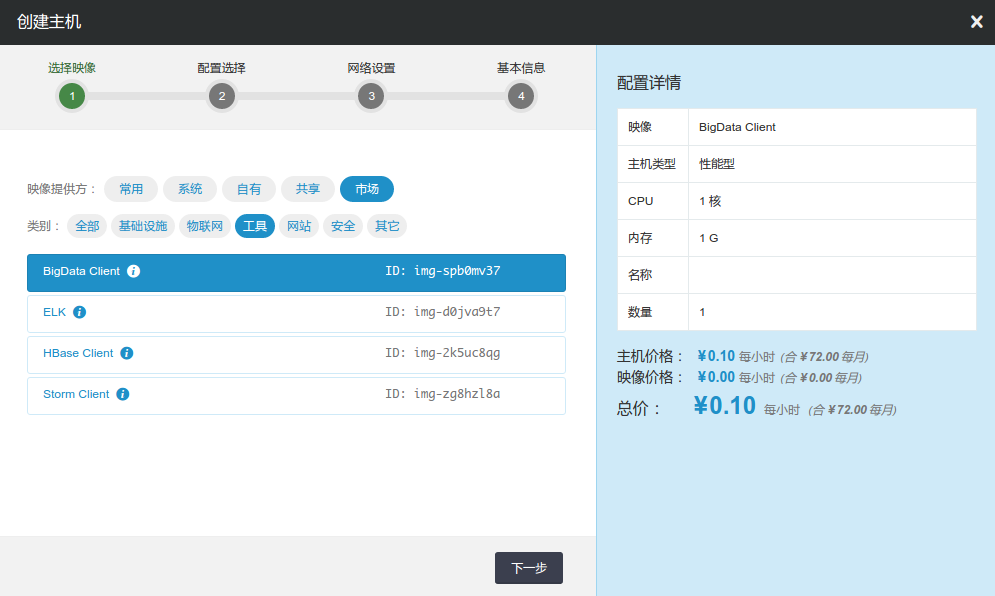
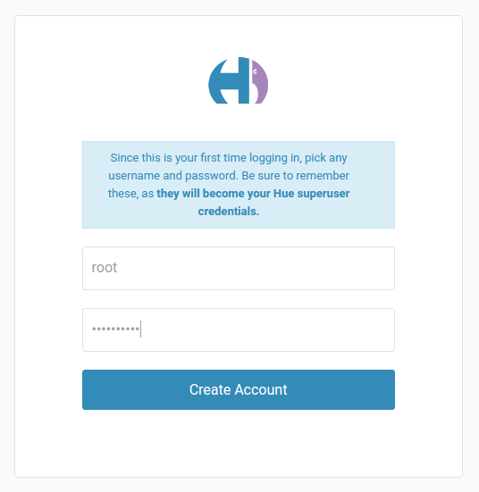
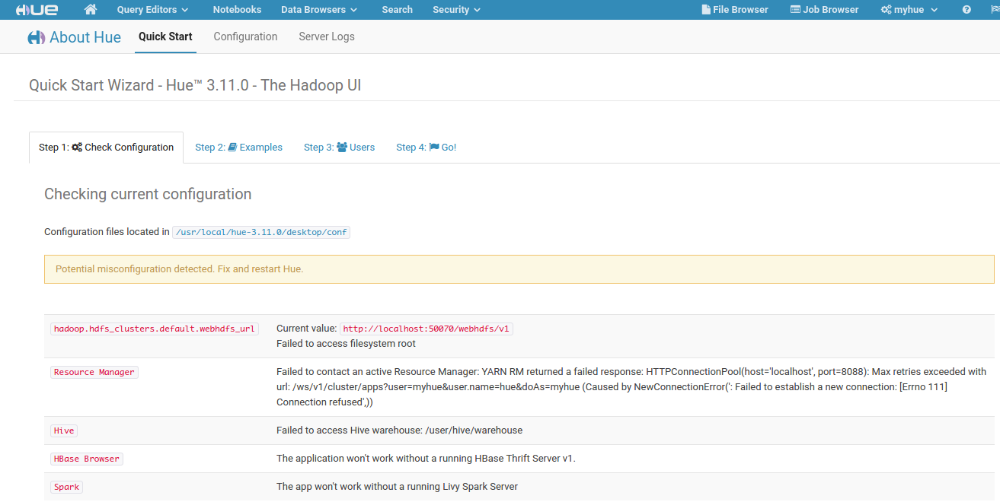
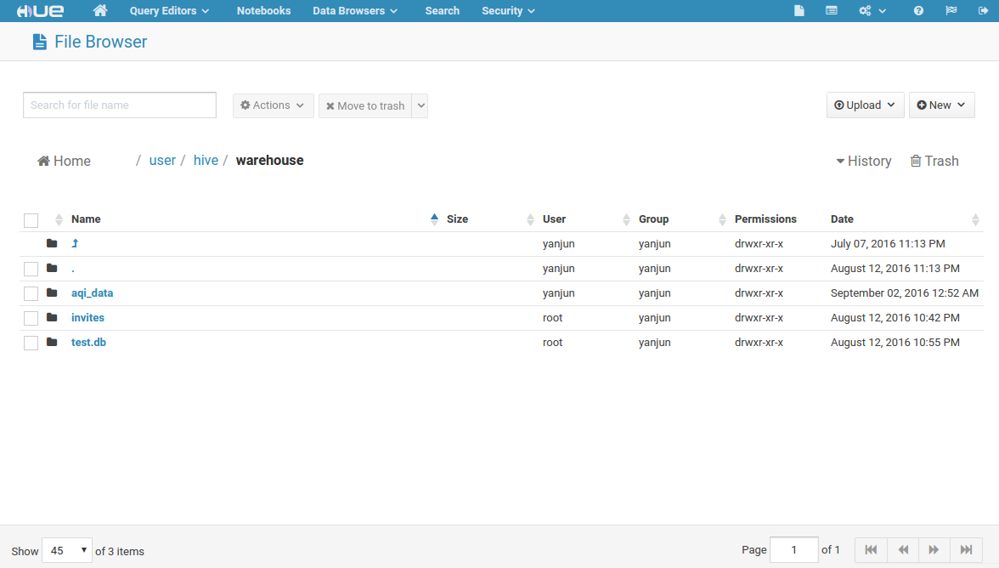
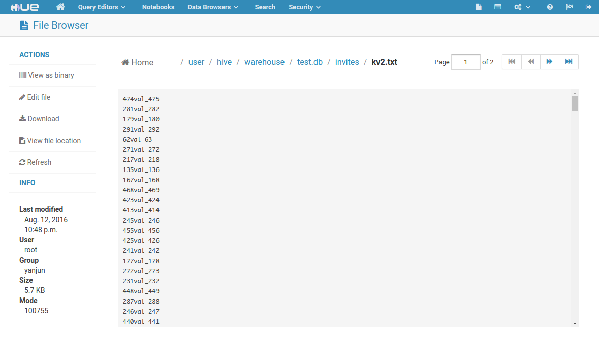
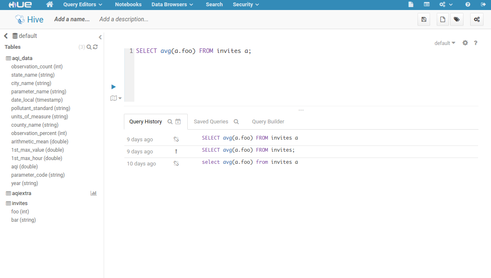
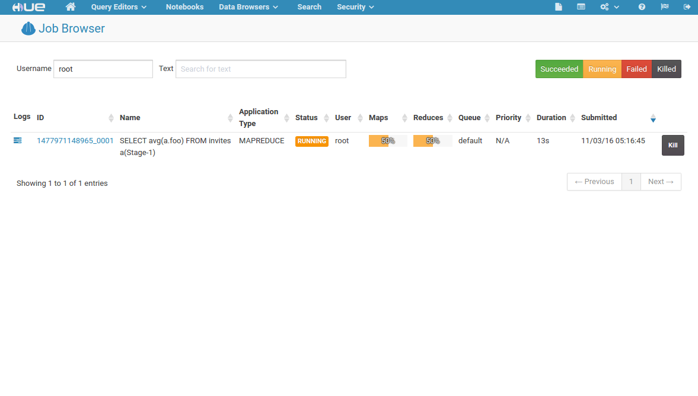

---
---

# Hue 指南

Hue是一个开源的Hadoop生态的Web UI界面，最早由Cloudera Desktop演化而来，由Cloudera贡献给开源社区，它是基于Python Web框架Django实现的。通过使用Hue，我们可以在浏览器端的Web控制台上与各类Hadoop生态的大数据集群进行交互和分析处理数据，例如操作HDFS上的数据，运行MapReduce Job，执行Hive脚本，执行Spark脚本等等。关于Hue更多的详细信息，可参阅 [Hue 官方网站](http://gethue.com) 。

## 使用映像创建Hue服务

Hue 运维非常繁琐，而在青云上，您可以快速创建一个 Hue 服务。

**第一步：创建Hue主机**

首先，您需要使用映像市场的 **BigData Client** 创建一个主机，如下图所示。该主机已经安装了Hue, MySQL, JRE等软件。



>注解
为了保证Hue可以访问大数据集群，Hue主机需要和大数据集群处在同一私有网络。

>注解
目前，映像市场仅支持北京2区、北京3区-A、广东1区、上海1区-A，后续我们将开放更多的分区，敬请期待;

**第二步：配置Hue**

Hue的配置文件地址为：``$HUE_HOME/desktop/conf/hue.ini``

首先，您需要完成Hue自身配置。

1.  配置hue.ini中secret_key字段。
2.  配置hue.ini中app_blacklist字段。
3.  修改Hue元数据存储所使用的数据库（可选）。

其次，为了用Hue实现各类大数据系统集成，您需要完成以下三个方面的配置：

1.  大数据集群配置
2.  大数据Client配置
3.  Hue配置文件配置

以上各类相关配置的详细说明，请参考本文文末的附录。

## 启动 Hue 服务

**第一步：启动 启动Hue Service**

首先，运行以下命令以启动Hue服务：

```
$ hue runcpserver&
```

**第二步：启动Hue，并创建初始账户**

打开浏览器，输入地址：

[http:/](http:/)/:

>注解
默认配置下端口号为8888

第一次打开，输入默认用户和口令，即可完成初始账户创建。



>注解
由于hue对Hadoop集群操作是以hue账户名义进行的，因此建议您使用root作为第一次创建的用户。

## 测试 Hue 服务

**测试一 测试集群配置是否正确**

Hue提供了一个内置工具，测试所使用的配置是否正确。

单击左上角Hue LOGO，选择Quick Start菜单下，Step 1：Check Configuration菜单。Hue会检查用户加载APP是否完成配置：



其中，红色提示表示配置有误。

**测试二 测试HDFS的使用**

Hue为HDFS提供了非常方便的UI界面，可以通过点选来进行分布式文件系统的各项操作，包括查看文件/目录、上传文件/目录、创建文件/目录、在线修改文本文件等，如下图所示：



下图为打开一个文本文件，进行文档的在线查看：



**测试三 测试Hive脚本与Yarn的使用**

Hue为Hive提供了一个强大的脚本编辑工具，包括代码自动填充、元数据查询、元数据采样等，这里提交一个简单的Hive脚本，如图所示：



脚本提交后，一个Hive Job开始工作，可以通过Hue提供的Yarn工具，查看Job状态，如图所示：



## 附录：各类配置详细说明

hue.ini使用[]标记，将配置文件划分为不同配置区域，每个配置区域可以含有若干子区域，使用多一层的[]进行标记（如[desktop]-[[custom]]），每个配置区域包含若干配置字段。您可以使用文本搜索工具先检索配置区域，再检索相应字段。

注解

hue.ini配置时请注意取消##的注释标记

### **Hue自身配置**

配置区域：[desktop]

| 字段名称 | 字段描述 | 配置样例 |
| --- | --- | --- |
| secret_key | 随机的30-60个数字或者字母组成 | secret_key=acma41wiUIqdf13Omdf1aPPZfe1IIsRZA12ladb |
| app_blacklist | 屏蔽暂时不需要使用的Hue应用 | app_blacklist=oozie,pig,impala,solr |

### **Hue元数据数据库配置**

默认条件下，Hue使用SQLite作元数据存储数据库。修改为高级数据库有利于Hue的拓展、迁移与管理。这里MySQL数据库为例：

1.  创建并启动一个MySQL Server。参见 [_青云的MySQL服务_](https://docs.qingcloud.com/product/database_cache/app_mysql_plus/index.html)。您也可以使用Hue镜像中已安装的MySQL数据库，本机的MySQL Server启动请依次执行以下命令：

 ```
$ sudo -u ubuntu service mysql.server start
 ```

>注解
本机的MySQL Server请务必使用linux的ubuntu用户启动。如果误操作导致启动失败，请执行chown -R ubuntu:ubuntu /usr/local/mysql/data

2.  在MySQL中为Hue创建一个用户并设置密码。同时，在MySQL中为Hue创建一个数据库，并将数据库的所有权限赋予该用户。具体的执行过程为：


```
$ mysql -u root -p
mysql> create database ;
mysql> grant all on .* to @'%' identified by '';
mysql> grant all on .* to @'localhost' identified by '';
mysql> flush privileges;
```

> 注解
本地MySQL数据库的root密码详见映像描述，实际使用中请修改密码！


3.  修改hue.ini配置


配置区域：[desktop]-[[database]]


| 字段名称 | 字段描述 | 配置样例 |
| --- | --- | --- |
| engine | Database服务的引擎名称 | engine=mysql |
| host | Database服务的IP地址 | host=192.168.100.35 |
| port | Database服务的端口号 | port=3306 |
| user | Database服务创建的用户名 | user=hue |
| password | Database服务创建的用户密码 | password=1234567890 |
| name | Database服务创建的数据库名称 | name=hue |

> 注解
本地MySQL数据库，设置host请使用IP地址。


4.  使用hue工具创建元数据数据表


```
$ hue syncdb --noinput
$ hue migrate
```


### **Hadoop配置**
**一、Hadoop集群配置：**

>注解
青云的Hadoop服务已经默认完成了以下配置

1.  开启WebHdfs服务。开启方法为在hdfs-site.xml文件中添加如下字段，并重启HDFS集群：


```

dfs.webhdfs.enabled true
```


2.  开启Proxy服务。开启方法为在core-site.xml文件中添加如下字段，并重启HDFS集群：


```

   hadoop.proxyuser.hue.hosts
  *


  hadoop.proxyuser.hue.groups
  *
```


**二、Hadoop集群Hosts配置：**

您需要根据Hadoop集群网络信息，配置Hue主机的hosts文件(/etc/hosts)。具体的信息您可以在控制台 Hadoop 详情页查到。

```
192.168.107.20    localhost
192.168.107.20    i-tp5n8o28
192.168.107.55    hdpn-mmqm9blk-hdfs-master
192.168.107.66    hdpn-on161rse-yarn-master
192.168.107.77    hdpn-dflptij8-slave
192.168.107.88    hdpn-dggp37ij-slave
192.168.107.99    hdpn-kjtvfg34-slave
```

>注解
由于 Ubuntu 主机名对应 IP 127.0.0.1存在 [已知问题](https://wiki.apache.org/hadoop/ConnectionRefused)。所以先要在 /etc/hosts 文件里把127.0.0.1修改成主机的私网 IP (如192.168.107.20)。

**三、Hue配置文件配置：**

配置区域：[desktop]

| 字段名称 | 字段描述 | 配置样例 |
| --- | --- | --- |
| default_hdfs_superuser | hdfs根目录的用户 | default_hdfs_superuser=root |

配置区域：[hadoop]-[[hdfs_clusters]]

| 字段名称 | 字段描述 | 配置样例 |
| --- | --- | --- |
| fs_defaultfs | 集群hdfs的地址以及端口号（一般为NameNode地址） | fs_defaultfs=hdfs://192.168.100.6:9000 |
| webhdfs_url | 集群webhdfs的地址以及端口号（一般为NameNode地址） | webhdfs_url=http://192.168.100.6:50070/webhdfs/v1/ |

配置区域：[hadoop]-[[yarn_clusters]]

| 字段名称 | 字段描述 | 配置样例 |
| --- | --- | --- |
| resourcemanager_host | ResourceManager地址 | resourcemanager_host=192.168.100.8 |
| resourcemanager_port | ResourceManager端口号 | resourcemanager_port=8032 |
| resourcemanager_api_url | ResourceManager的web接口地址及端口号 | resourcemanager_api_url=http://192.168.100.8:8088 |
| proxy_api_url | WebProxy的地址及端口号，默认与ResourceManager的web接口地址相同 | proxy_api_url=http://192.168.100.8:8088 |
| history_server_api_url | History_server的地址及端口号，默认与ResourceManager的web接口地址相同 | history_server_api_url=http://192.168.100.8:19888 |

### **Hive配置**

**一、Hive主机配置：**

Hive主机需要配置并启动Hiveserver2服务，详细的配置方法，参见 [_青云的Hive服务_](hive.html#guide-hive)

**二、Hue配置文件配置：**

配置区域：[beeswax]

| 字段名称 | 字段描述 | 配置样例 |
| --- | --- | --- |
| hive_server_host | hiveserver2服务的地址 | hive_server_host=192.168.100.11 |
| hive_server_port | hiveserver2服务的端口号 | hive_server_port=10000 |

### **Hbase配置**

**一、Hbase Client配置：**

1.  首先，您需要完成Hbase Client配置。详细的配置方法，参见 [_青云的Hbase服务_](hbase.html#guide-hbase)。

>注解
Hue本机已安装Hbase(/usr/local/hbase)，您可以直接使用Hue本机作为Hbase Client，从而无需额外创建主机。本机Hbase所使用的Hadoop目录为/usr/local/hbase-hadoop，请修改配置时注意！

2.  启动Hbase ThriftServer。在Hbase Client主机上运行：

```
$ cd $HBASE_HOME/bin
$ ./hbase-daemon.sh start thrift
```


**二、hue配置文件配置：**

配置区域：[hbase]

| 字段名称 | 字段描述 | 配置样例 |
| --- | --- | --- |
| hbase_clusters | Hbase ThriftServer的地址与端口号，格式为（|:） | hbase_clusters=(Hbase_01|192.168.100.33:9090),(Hbase_02|192.168.100.33:9091) |

### **Zookeeper配置**

**一、hue配置文件配置：**

配置区域：[zookeeper]-[[clusters]]

| 字段名称 | 字段描述 | 配置样例 |
| --- | --- | --- |
| host_ports | Zookeeper的地址与端口号，格式为:,:,:.... | host_ports=192.168.100.14:2181,192.168.100.13:2181,192.168.100.12:2181 |

### **Spark配置**

**一、Spark Client配置：**

1.  您需要根据Spark集群网络信息，配置Hue主机的hosts文件(/etc/hosts)。具体的信息您可以在控制台 Spark 详情页查到。


```
192.168.107.20    localhost
192.168.107.20    i-tp5n8o28
192.168.107.77    skn-8ct52oqk-spark-master
192.168.107.88    skn-2pfpy7bo-hadoop-master
192.168.107.99    skn-kflp37ij-slave
```

>注解
由于 Ubuntu 主机名对应 IP 127.0.0.1存在 [已知问题](https://wiki.apache.org/hadoop/ConnectionRefused)。所以先要在 /etc/hosts 文件里把127.0.0.1修改成主机的私网 IP (如192.168.107.20)。


2.  将本机配置为Spark集群的Client，方法为：修改Spark配置文件$SPARK_HOME/conf/spark-defaults.conf，添加如下字段，其中为Spark Master所在地址：


```
$spark.master       spark://:7077
```


**二、Livy配置与启动：**

1.  使用默认配置启动Livy服务，执行：


```
$/usr/local/livy/bin/livy-server start
```

**三、hue配置文件配置：**

配置区域：[spark]

| 字段名称 | 字段描述 | 配置样例 |
| --- | --- | --- |
| livy_server_host | livy服务的地址 | livy_server_host=localhost |
| livy_server_port | livy服务的端口号 | livy_server_port=8998 |

### **关系数据库配置**[¶](#id10 "永久链接至标题")

**一、hue配置文件配置：**

配置区域：[librdbms]-[[databases]]-[[[]]]

[[[]]]为区域划分字段，可以自己命名。如果需要添加多个关系数据库，可以在[[databases]]区域增加该字段。

| 字段名称 | 字段描述 | 配置样例 |
| --- | --- | --- |
| nice_name | Hue中显示名称 | nice_name=”My MySQL DB2” |
| name | 关系数据库中的数据库名 | name=hue |
| engine | 关系数据库的引擎名称 | engine=mysql |
| host | 关系数据库的地址 | host=192.168.100.254 |
| port | 关系数据库的端口号 | port=3306 |
| user | 登陆数据库的用户名 | user=hue |
| password | 登陆数据库的用户密码 | password=zhu88jie |

>注解
映像内软件版本号:Hue-3.11.0, Hive-1.2.1, Hadoop-2.6.0, MySQL-5.6.30
