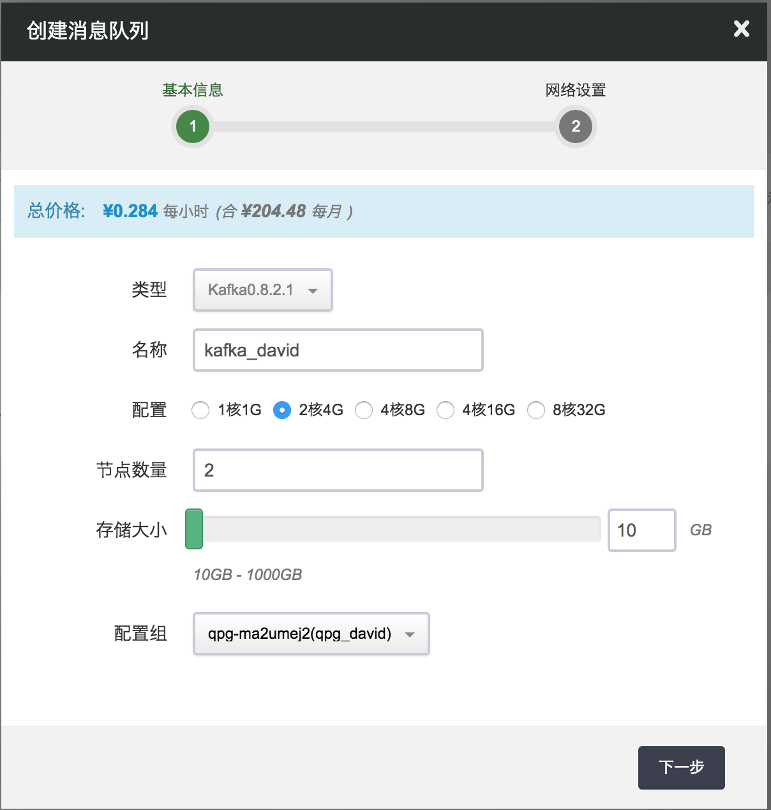
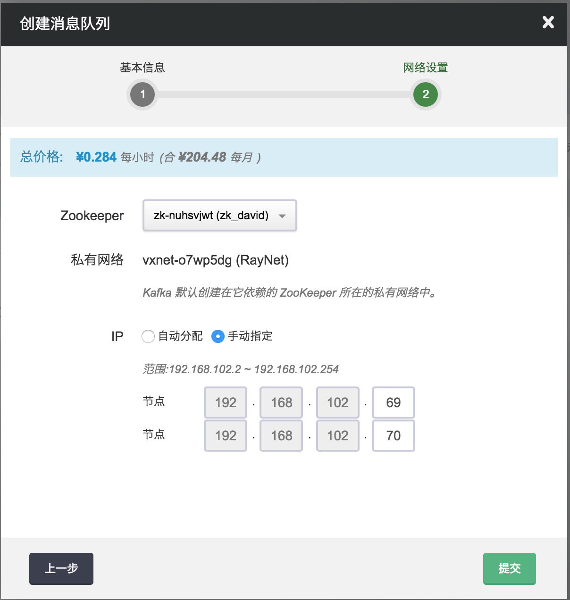
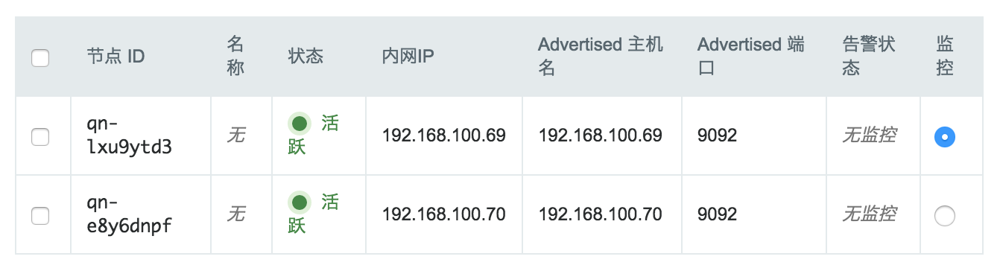
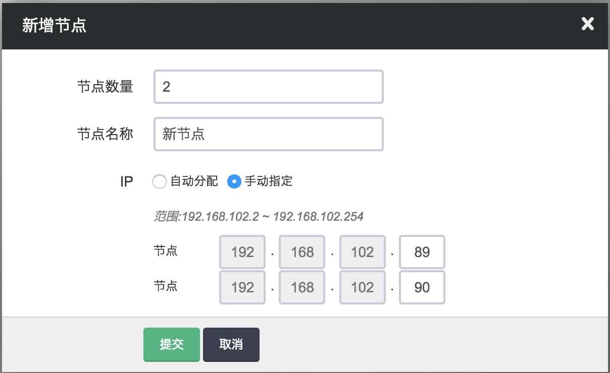
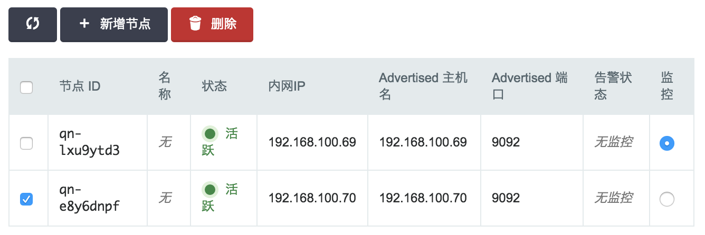
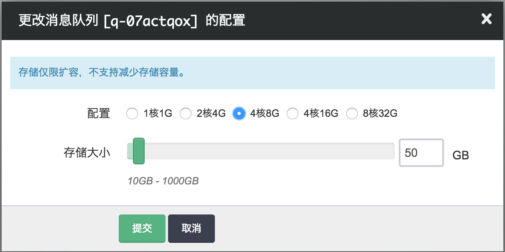
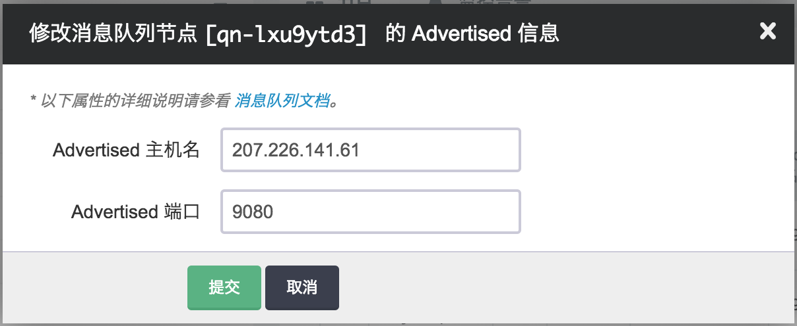
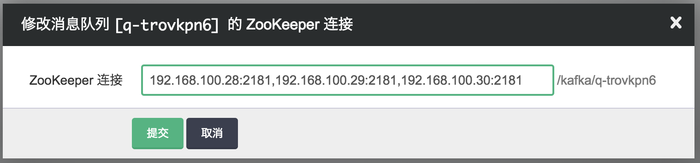
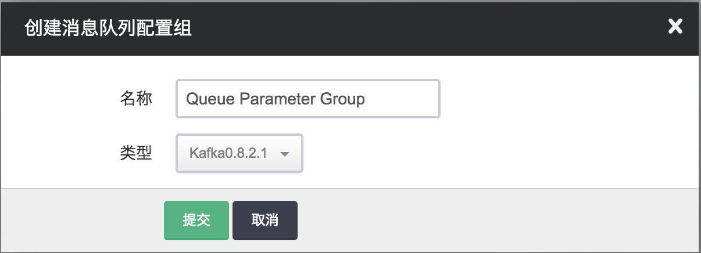
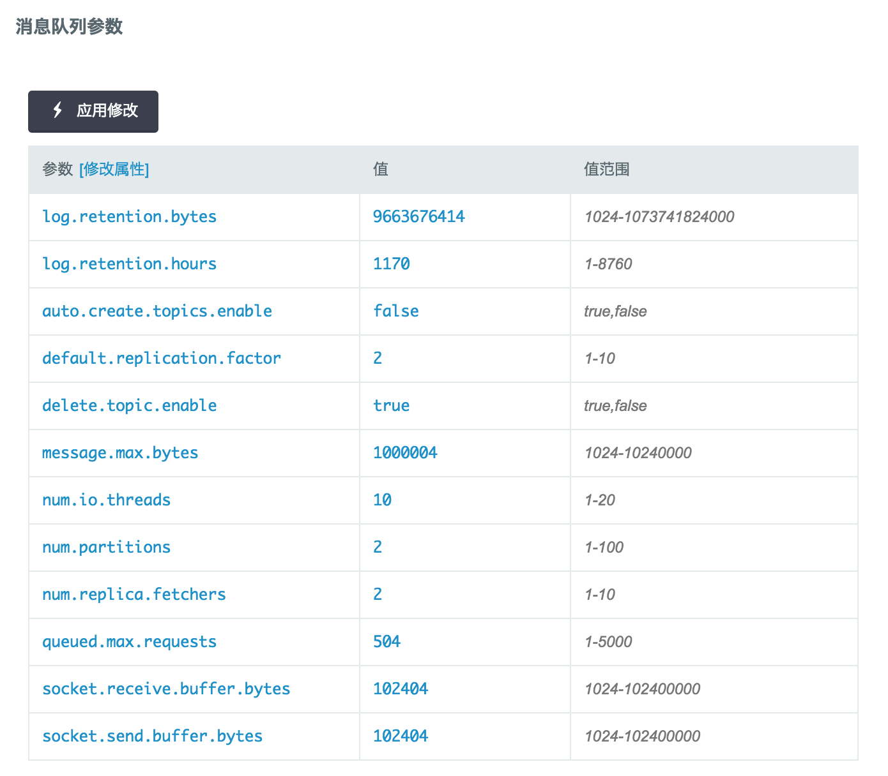

---
---

# 消息队列

消息队列服务是为了缓解消息生产者与消息消费者之间不同步问题、从而在两者之间加了一层缓冲区的一项服务； 目前支持 Kafka。本指南旨在介绍如何创建、使用及管理消息队列服务。

## Kafka

Kafka 是一个分布式、可分区、多副本的高吞吐量消息系统，主要用于处理活跃的流式数据，比如网页的访问量、日志等，既能够实时处理也能离线处理大量数据信息。 跟传统的消息队列系统如 RabbitMQ、ActiveMQ 相比，Kafka 具有高吞吐量、低延迟等优点。目前 Kafka 已成为大数据处理平台的一个常用组件。

## 创建 Kafka

在青云，您可以很方便的创建和管理一个 Kafka 集群。青云的 Kafka 集群支持横向与纵向的在线伸缩，如果每个 topic 的副本因子大于１的话在线伸缩对 Kafka 客户端(producer 和 consumer)是透明的， 即消息的发送和消费不会因此而中断。另外我们还提供了监控、告警等功能来帮助您更好的管理集群。 集群将运行于私有网络内，结合青云提供的高性能硬盘，在保障高性能的同时兼顾您的数据安全。

>注解
为了保障数据安全， Kafka 服务需要运行在受管的私有网络中，同时由于 Kafka 依赖于 ZooKeeper，所以在创建一个 Kafka 服务之前，您至少需要拥有一个路由器和一个受管私有网络以及在该网络中创建一个 ZooKeeper 集群，受管私有网络需要和路由器连接，并开启 DHCP 服务（默认开启）。

**第一步：选择基本配置**

在创建的对话框中，您需要选择 Kafka 版本号及 CPU 和内存配置，填写名称(可选)、节点数量和存储大小，选择配置组，然后点击下一步。



**第二步：配置网络**

在配置网络的过程中，首先选择 Kafka 所需要的 ZooKeeper 集群， Kafka 集群将加入该 ZooKeeper 所在的私有网络中, 然后可以为 Kafka 中的每个节点指定 IP， 也可以选择”自动分配”，让系统自动指定 IP。



**第三步：创建成功**

当 Kafka 创建完成之后，您可以查看每个节点的运行状态。 如图所示，当节点显示为 “活跃” 状态，表示该节点启动正常。当每个节点都启动正常后 Kafka 集群显示为“活跃” 状态，表示您已经可以正常使用 Kafka 服务了。



**第四步：测试 Kafka**

Kafka 创建完成之后，您可以下载 [Kafka 客户端(producer 和 consumer)](https://cwiki.apache.org/confluence/display/KAFKA/Clients) ，也可以 下载 [Kafka 服务器端(broker)](https://www.apache.org/dyn/closer.cgi?path=/kafka/0.8.2.1/kafka_2.10-0.8.2.1.tgz) ，用里面带的工具进行测试。您可以在本地通过公网测试，也可以在 Kafka 同一私有网络或跨网段测试， 如果客户端和 Kafka 不在同一私有网络，您需要配置路由器端口转发，请参考 [青云用户指南](https://docs.qingcloud.com/product/operation/topology) 。

现假设客户端和 Kafka 在同一私有网络， Kafka 集群有两个节点， IP 地址分别为 ``192.168.102.69,192.168.102.70``, ZooKeeper 连接串为``192.168.102.10:2181,192.168.102.11:2181,192.168.102.12:2181/kafka/q-07actqox``(在创建 Kafka 的时候， 系统会自动根据 Kafka 的 ID 在 ZooKeeper 里 chroot 成 /kafka/)，您可以在 Kafka 详情页的基本属性中查看 ZooKeeper 连接信息。然后可以用下载的服务器端里自带的工具通过如下命令测试。

**创建 topic**

```
bin/kafka-topics.sh --create --zookeeper 192.168.102.10:2181,192.168.102.11:2181,192.168.102.12:2181/kafka/q-07actqox --replication-factor 1 --partitions 1 --topic test
```

**发送消息**

```
bin/kafka-console-producer.sh --broker-list 192.168.102.69:9092,192.168.102.70:9092 --topic test
This is a message
This is another message
```

**接收消息**

```
bin/kafka-console-consumer.sh --zookeeper 192.168.102.10:2181,192.168.102.11:2181,192.168.102.12:2181/kafka/q-07actqox --topic test --from-beginning
This is a message
This is another message
```

>注解
ZooKeeper IP list 之间不能有空格

## 在线伸缩

**增加节点**

当 Kafka 需增加节点以应付业务量的增长带来的压力时，您可以如下图所示增加节点。同样，您可以对每个新增节点指定 IP 或选择自动分配。



**删除节点**

当业务量降低的时候您也可以如下图所示删除节点以节省资源和费用，删除节点前需注意的是要用 Kafka 的分区 reassignment 工具把该节点的分区做迁移。



**纵向伸缩**

您可以如下图所示纵向伸缩 Kafka 的 CPU、内存、硬盘，您可以根据青云提供的监控结合您的业务情况决定是否纵向伸缩。



>注解
存储不能缩小。

## 跨网访问

青云提供灵活的网络配置， Kafka 在实际使用中会出现 producer，consumer 与 broker 都不在一个网段之中， 这个时候需要在 broker 所在的路由器上配置端口转发，并且需要修改 broker 的 advertised host 与 advertised port 为路由器转发的源地址和源端口。这是因为 Kafka 各节点(broker, producer, consumer) 之间是靠 advertised host 与 advertised port 通讯的。假设路由器的 IP 地址是 207.226.141.61，端口9080转发到 Kafka broker 192.168.102.69端口9092， 右击该节点，选择“修改 Advertised 信息”， 然后如下图所示填入正确的信息。同理依次修改其它节点。



## ZooKeeper 配置

ZooKeeper 可以和 Kafka 不在同一个私有网络里，可以右击 Kafka 选择“修改 ZooKeeper 连接”，然后如下图所示填写 ZooKeeper 对应的路由器端口转发源地址和端口。 路由器端口转发配置请参考 [青云用户指南](https://docs.qingcloud.com/product/operation/topology) 。



>注解
因 Kafka 集群极度依赖 Zookeeper，为了保障数据安全，该功能仅在 Kafka 集群关闭时才能使用。

## 升级

目前青云提供的 Kafka 支持版本0.8.2.1、0.9.0.1和0.10.0.0。用户可以很方便的升级到新版本(也可以回退到旧版本)，先关闭 Kafka 集群，然后右键 Kafka，点击升级，选择新的版本号，最后启动集群即可。

**注意事项**

1.  Kafka 0.9.0.1有 [potential breaking changes](https://kafka.apache.org/090/documentation.html#upgrade_9_breaking) ，升级后需更新客户端的生产者及消费者(版本要保持一致)。
2.  Kafka 0.10.0.0不仅有 [potential breaking changes](https://kafka.apache.org/documentation.html#upgrade_10_breaking) ，而且默认的消息格式也有变化，请仔细阅读 [Potential performance impact following upgrade to 0.10.0.0](https://kafka.apache.org/documentation.html#upgrade_10_performance_impact) ，升级后及时更新客户端的生产者和消费者(版本要保持一致)以及相应的配置项 log.message.format.version。

>注解
Kafka 0.10.0.0提供了新配置 log.message.format.version，用户可以通过该配置来调整消息格式版本，但必须保证该值大于等于 Kafka 集群现有消息的格式版本，否则消费者将无法正常消费消息。例如，设定 log.message.format.version 为 0.10.0.0 并生成消息保存于 Kafka 集群之后，只能使用0.10.0.0的消费者，0.8.2.1和0.9.0.1的消费者将无法消费该消息，即使调整消息版本格式也不能正常工作。

## 监控和告警

我们提供了如下监控和告警服务，以帮助用户更好的管理和维护运行中的 Kafka 集群。

**监控服务**

首先对每个节点提供了资源监控，包括 CPU 使用率、内存使用率、硬盘使用率等。

其次，对每个 broker 节点提供了 Kafka 服务监控。

*   **JVM heap 监控**： JVM 堆内存使用百分比
*   **消息吞吐率监控**： 每秒流入消息个数，对应 kafka.server:type=BrokerTopicMetrics,name=MessagesInPerSec
*   **流入数据速率监控**： 每秒流入数据，对应 kafka.server:type=BrokerTopicMetrics,name=BytesInPerSec
*   **流出数据速率监控**： 每秒流出数据，kafka.server:type=BrokerTopicMetrics,name=BytesOutPerSec
*   **副本消息最大滞后量监控**： Follower 落后 Leader 的最大消息量，对应 kafka.server:type=ReplicaFetcherManager,name=MaxLag,clientId=Replica
*   **分区监控**： 分布在该节点上的分区总数，对应 kafka.server:type=ReplicaManager,name=PartitionCount
*   **Leader 分区监控**： 分布在该节点上的 leader 分区总数，对应 kafka.server:type=ReplicaManager,name=LeaderCount
*   **未复制的分区监控**： 未复制的分区总数，对应 kafka.server:type=ReplicaManager,name=UnderReplicatedPartitions
*   **ISR 扩大速率监控**： ISR 扩大速率，对应 kafka.server:type=ReplicaManager,name=IsrExpandsPerSec
*   **ISR 收缩速率监控**： ISR 收缩速率，对应 kafka.server:type=ReplicaManager,name=IsrShrinksPerSec
*   **管理节点数监控**： 管理节点个数，对应 kafka.controller:type=KafkaController,name=ActiveControllerCount
*   **离线分区数监控**： 离线分区总数， 即集群里没有 leader 的分区总数（该分区不能读写)，对应 kafka.controller:type=KafkaController,name=OfflinePartitionsCount

**告警服务**

我们支持对每个节点配置监控告警策略，当发生异常时，会触发用户设定的告警阈值，并发送短信和邮件通知给用户。除了资源如CPU、内存、硬盘告警外， Kafka 还支持如下告警

*   **存在异常分区**：当存在未复制的分区或离线分区的时候告警

## 配置

我们通过消息队列配置组来管理消息队列服务的配置。消息队列服务和消息队列配置组是解耦的，您可以创建多个独立的配置组，并应用到不同的消息队列服务。 消息队列服务在运行过程中，也可以随时变更配置组。

1）创建新的消息队列配置组


默认情况下，我们会为每个用户创建一个缺省配置组。用户也可以创建新的配置组，如图所示：

> 注解
缺省配置组不可以被删除。




2.  修改配置项

点击该新建的消息队列配置组，我们可以对每项配置项进行修改，如图所示：



修改完后，我们需要进行 “保存”，并点击 “应用” 让新的配置生效。


>注解
当配置发生变化时，将会重启对应的消息队列服务。


3.  常用配置项

*   **log.retention.bytes**: topic 每个分区的最大文件大小
*   **log.retention.hours**: 消息保留的最大时间
*   **auto.create.topics.enable**: 自动创建 topic
*   **default.replication.factor**: 创建 topic 如果不指定复制因子时的默认值
*   **delete.topic.enable**: 是否支持删除 topic
*   **message.max.bytes**: 消息的最大尺寸
*   **num.io.threads**: Kafka broker 处理磁盘 IO 的线程数
*   **num.partitions**: 创建 topic 如果不指定分区数时的默认值
*   **num.replica.fetchers**: 从分区 Leader 复制消息的线程数
*   **queued.max.requests**: 等待 IO 线程处理的请求队列最大数，若是等待 IO 的请求超过这个数值，就会停止接受外部消息
*   **socket.receive.buffer.bytes**: socket的接收缓冲区大小
*   **socket.send.buffer.bytes**: socket的发送缓冲区大小

其配置项的详细解释请参见 [Kafka 官方文档](http://kafka.apache.org/documentation.html) 。
