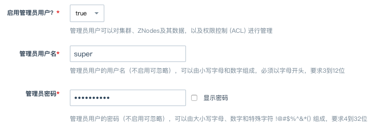
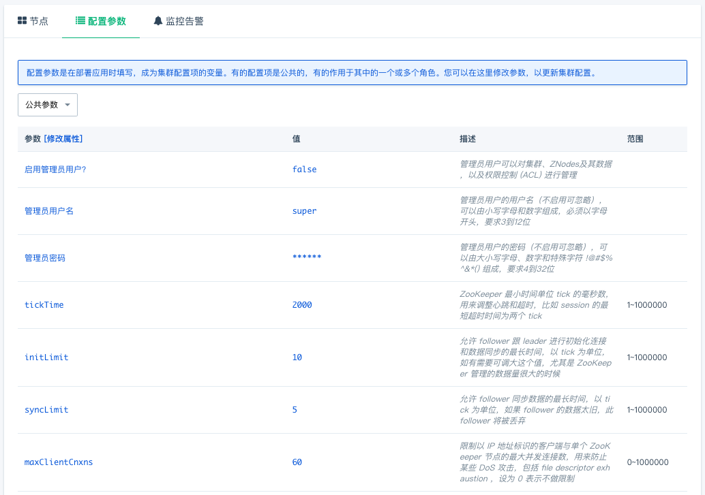
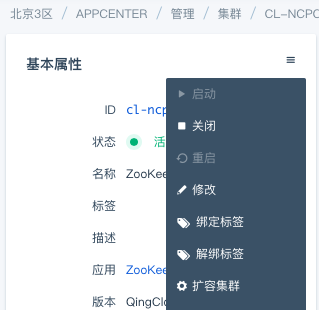
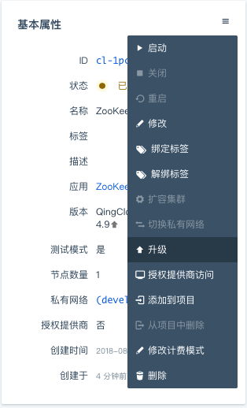

---
---

# Apache ZooKeeper on QingCloud AppCenter 用户指南

> `New` 当前版本已支持多可用区部署（需在支持的区域如`北京 3 区`使用），需要注意：1) 仅在新部署集群时有效，已有的单可用区旧集群升级以后仍然是单可用区；2) 多可用区部署会对性能有很大影响，请评估后使用，测试结果详情见页末[多可用区（同城多活）测试](#multi-zone-result)。

> 当前版本已支持开启管理员帐号进行访问权限控制。

## 简介

青云QingCloud ZooKeeper 服务提供的是原生 [Apache ZooKeeper](http://zookeeper.apache.org/) 云服务，ZooKeeper 是一个高可用的分布式数据管理与系统协调软件，它可以为分布式应用提供状态同步、配置管理、名称服务、群组服务、分布式锁及队列、以及 Leader 选举等服务。

## 创建 ZooKeeper

在青云上，您可以很方便的创建和管理一个 ZooKeeper 集群。青云的 ZooKeeper 集群支持横向与纵向在线伸缩，同时具有自我诊断与自我修复功能，即当系统发现某节点坏死时会自我修复，无需人为干预。 另外我们还提供了监控告警等功能来帮助您更好的管理集群。集群将运行于私有网络内，结合青云提供的高性能硬盘，在保障高性能的同时兼顾您的数据安全。

> 为了保障数据安全, ZooKeeper 集群需要运行在受管私有网络中。所以在创建一个 ZooKeeper 集群之前，需要创建一个 VPC 和一个受管私有网络，受管私有网络需要加入 VPC，并开启 DHCP 服务（默认开启）。

### 第一步：基本设置

在创建的对话框中，您需要填写名称 (可选)，选择 ZooKeeper 版本号、可用区等。

### 第二步：节点设置

目前我们只支持 ZooKeeper 的参与者节点，后续会增加观察者节点。参与者节点是指参与投票选举的节点，包括 Leader，Follower，和单节点 Standalone 三种服务模式。在这一步选择参与者节点的配置：CPU、内存、存储、节点配置和数量等。为了确保集群可以正常工作，我们通常需要保证有足够多的参与者节点，这样当某个或某几个节点坏掉以后，参与者的数量 （Quorum） 还可以保证选举出 leader 。需注意的是，增加参与者节点会影响 ZooKeeper 的写性能，因为写操作需要得到 Quorum 对 leader 的一致同意才能进行，参与者越多，所需要的协商时间越长，所以一般不会在集群里设置很多的参与者节点。如果 ZooKeeper 集群在单个区域，建议不要超过5个参与者节点；如果跨多个区域，不要超过9个参与者节点。

> 目前集群节点数支持1、3、5、7、9，其中1个节点的 ZooKeeper（工作在 Standalone 模式）仅供测试使用。

### 第三步：网络设置

选择私有网络和 IP 分配方式。

### 第四步：服务环境参数设置

* 开启管理员帐号（默认关闭）



有时候我们给某些 znode 设置了权限，又忘记了相应的密码，这时候可以通过管理员帐号进行重新设置。详细用法可查阅[示例代码](https://github.com/QingCloudAppcenter/Zookeeper/tree/master/3.4.13/examples)。

* ZooKeeper 参数设置

用户可以在这里对 ZooKeeper 常用的参数进行设置，方便测试开发。详细说明和用法可查阅 [ZooKeeper 官方文档](https://zookeeper.apache.org/doc/r3.4.13/zookeeperAdmin.html#sc_configuration)。

|配置名|默认值|说明|
| --- | --- | --- |
| tickTime | 2000 | ZooKeeper 最小时间单位 tick 的毫秒数，用来调整心跳和超时，比如 session 的最短超时时间为两个 tick |
| initLimit | 10 | 允许 follower 跟 leader 进行初始化连接和数据同步的最长时间，以 tick 为单位，如有需要可调大这个值，尤其是 ZooKeeper 管理的数据量很大的时候 |
| syncLimit | 5 | 允许 follower 同步数据的最长时间，以 tick 为单位，如果 follower 的数据太旧，此 follower 将被丢弃 |
| maxClientCnxns | 1000 | 限制以 IP 地址标识的客户端与单个 ZooKeeper 节点的最大并发连接数，用来防止某些 DoS 攻击，包括 file descriptor exhaustion ，设为 0 表示不做限制 |
| autopurge.snapRetainCount | 3 | 当自动清除功能 (Auto Purge) 开启时，所要保留的最新快照和事务日志文件数，其余文件将被清除 |
| autopurge.purgeInterval | 0 | 自动清除功能的执行间隔，以小时为单位，默认值 0 表示不开启 |


### 第六步：创建成功

当 ZooKeeper 创建完成之后，您可以查看每个节点的运行状态。当节点的服务状态显示为“正常”状态，表示该节点启动正常。 当每个节点都启动正常后 ZooKeeper 集群显示为“活跃”状态，表示您已经可以正常使用 ZooKeeper 服务了。


## 测试 ZooKeeper

ZooKeeper 创建完成之后可以进行连接测试。下载 [ZooKeeper](http://zookeeper.apache.org/releases.html) 并解压，您可以在 ZooKeeper 同一私有网络或跨网络的客户端上测试。现假设客户端和 ZooKeeper 在同一私有网络，ZooKeeper 集群有三个节点，IP 地址分别为192.168.100.10,192.168.100.11,192.168.100.12， 您可以通过如下命令连接 ZooKeeper：

```shell
bin/zkCli.sh|zkCli.cmd -server 192.168.100.10:2181,192.168.100.11:2181,192.168.100.12:2181
```

同时该应用也提供了 [REST](https://github.com/apache/zookeeper/blob/release-3.4.13/src/contrib/rest) 服务，可以通过下面命令获取 znode 信息：

```shell
curl -H'Accept: application/json' http://192.168.100.10:9998/znodes/v1/
```

> REST 当前版本不能很好的支持按权限访问 ZooKeeper ，所以如果 ZNodes 设置了权限，REST 会返回相应的错误代码。具体信息可查看其[规范](https://github.com/apache/zookeeper/blob/release-3.4.13/src/contrib/rest/SPEC.txt#L274)。

## 调整配置

目前应用暴露了常用的 ZooKeeper 配置参数，用户可以在“配置参数”标签页中进行更新操作。需注意，更新配置后所有 ZooKeeper 服务会依次自动重启使配置生效，重启所需时间与机器配置有关，每个节点一般在1分钟之内可以完成。用户可以根据监控指标判断操作是否已经完成。相关配置参数的详细说明和用法可查阅 [ZooKeeper 官方文档](https://zookeeper.apache.org/doc/r3.4.13/zookeeperAdmin.html#sc_configuration)。


## 在线伸缩

### 增加节点

当 ZooKeeper 需增加节点以应付客户端逐步增多带来的压力时，您可以在 ZooKeeper 详细页点击“新增节点”按钮。

新增节点数必须为偶数，最好每次增加两个。需注意的是，增加参与者节点会影响 ZooKeeper 的写性能，因为写操作需要得到 Quorum 对 leader 的一致同意才能进行，参与者越多，所需要的协商时间越长，所以一般不会在集群里设置很多的参与者节点。如果 ZooKeeper 集群在单个区域，建议不要超过5个参与者节点；如果跨多个区域，不要超过9个参与者节点。

### 删除节点

当客户端连接并不多的时候您也可以在 ZooKeeper 详细页选中需要删除的节点，然后点“删除”按钮删除节点，以节省资源和费用。 同样，删除节点数只能为偶数，最好每次删除两个。

### 纵向伸缩

由于 ZooKeeper 的每个节点都有数据的全拷贝，并且数据都是要装载在内存里，所以当业务存放在 ZooKeeper 里的数据量增大到一定程度的时候， 不可避免需要纵向扩容每个节点的内存。反之，如果节点的 CPU、内存使用并不大，可以降低配置。值得注意的是，在缩小内存的时候选择新配置的内存不能过小， 否则 ZooKeeper 服务会启动不起来。ZooKeeper 内存使用率可以查看 ZooKeeper 详细页的监控图。在集群列表 ZooKeeper 所在栏右键选择或者在集群信息页弹出菜单处选择「扩容集群」即可做纵向伸缩。



## 数据迁移

ZooKeeper 的数据可借助 [zkcopy](https://github.com/ksprojects/zkcopy)  在不同的 ZooKeeper 集群间进行迁移，迁移步骤如下：

假设源集群包含3个节点：192.168.0.7, 192.168.0.9, 192.168.0.8
目标集群也包含3个节点：192.168.0.6, 192.168.0.5, 192.168.0.12
源集群中包含路径为 /zk-test 的 znode
下面的步骤将会把 /zk-test 下的数据从源集群迁移到目标集群

```shell
# 新建能联通两个集群环境的虚拟机，并运行如下命令获取 zkcopy 的 docker 映像
docker pull ksprojects/zkcopy

# 迁移 /zk-test
docker run --rm -it ksprojects/zkcopy --source 192.168.0.7:2181,192.168.0.9:2181,192.168.0.8:2181/zk-test --target 192.168.0.6:2181,192.168.0.5:2181,192.168.0.12:2181/zk-test
```

## 版本升级

使用旧版本的用户可以直接升级到最新版，只需要在升级前关闭集群，然后在菜单里点“升级”按钮即可完成升级。由于关机期间集群不可用，建议在业务低谷进行升级操作。



## <a name="multi-zone-result"></a>多可用区（同城多活）测试

### 背景

- [青云QingCloud 升级区域（Region）架构 轻松实现同城多活](https://log.qingcloud.com/archives/3981)

### 测试结果

由于写操作（ Create/Set/Delete ）的吞吐量基本接近，所以在下表中合并统计。

| 集群 / 指标 | 网络延时 Ping * | 读吞吐量 TPS | 写吞吐量 TPS |
| --------- | ------------ | ---------- | ----------- |
| 单可用区部署（pek3b） | `0.45 ms` | `~9000` | `~2000` |
| 多可用区部署（pek3b, pek3c, pek3d） | `2.48 ms` | `~2000` | `~ 600` |

\* *网络延时视情况而定，同可用区可能在 `0.1 ~ 0.5 ms` 之间波动，不同可用区之间波动更大一些，一般在 `1 ms` 以上。*

### 测试环境

* [x] 区域：北京 3 区
* [x] ZooKeeper 节点：1 CPU， 2G 内存，性能型
* [x] Client 节点：pek3b 区，2 CPU， 4G 内存，性能型，Ubuntu Server 16.04.5 LTS 64bit

### 测试方法

不同的操作（Read, Create, Update, Delete）分别持续 30 秒，在客户端用操作成功的次数除以时间 30 秒得到 TPS 。每个集群分别测 5 次。

### 测试代码

https://github.com/brownsys/zookeeper-benchmark

### 结果截图

以下截图来自青云控制台。

> 测试结果以客户端统计为准；截图中服务器端数据由于采集延时，以及测试过程中客户端会对服务器端的统计值进行 reset 操作，所以截图中的数据并不完全准确，仅供参考。

#### 单可用区


#### 多可用区


## Zookeeper PaaS 文档

Zookeeper PaaS 文档请点击[这里](../zookeeper.html)