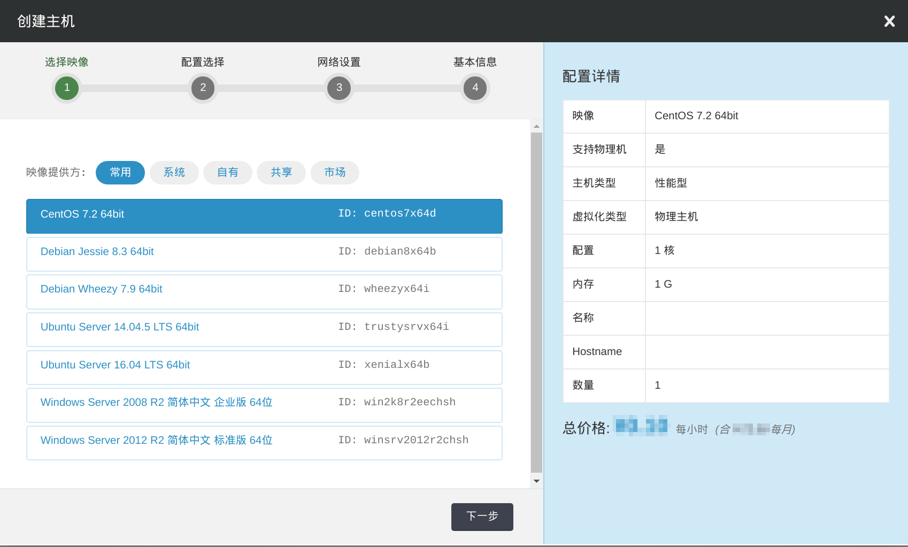
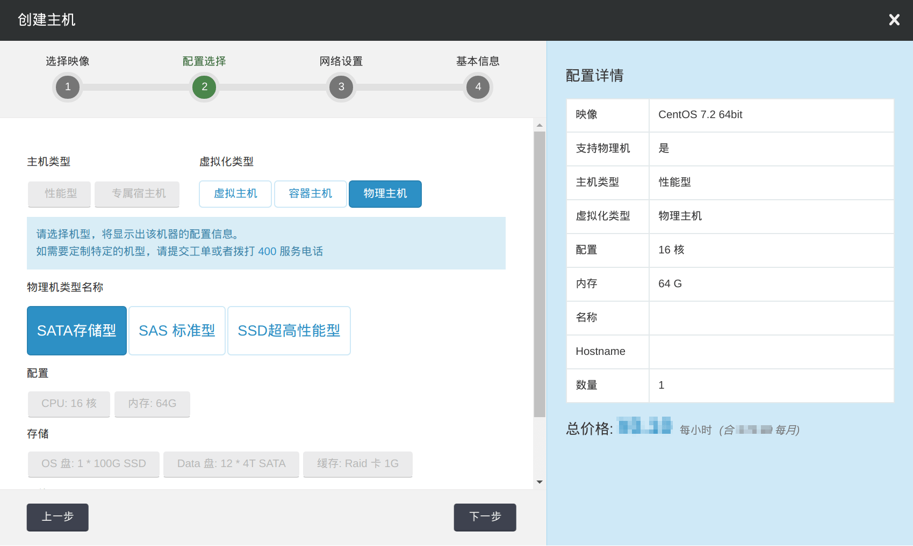
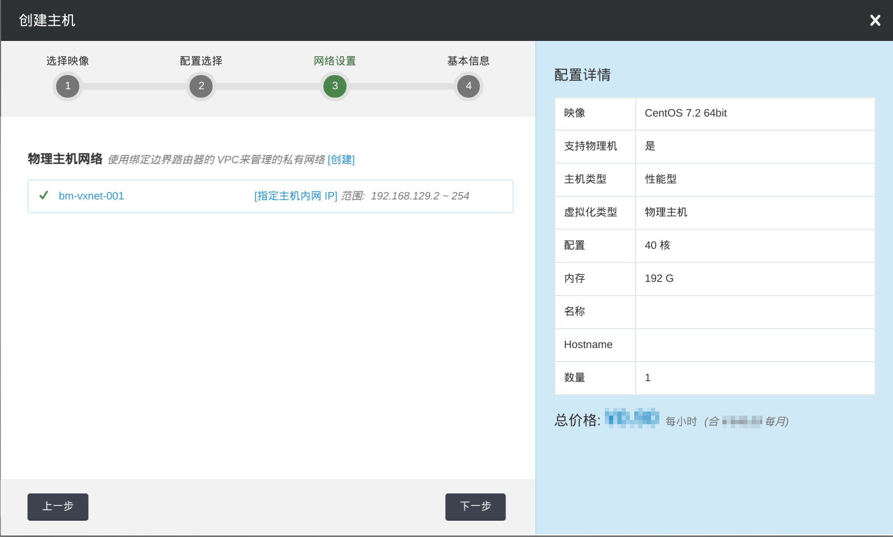
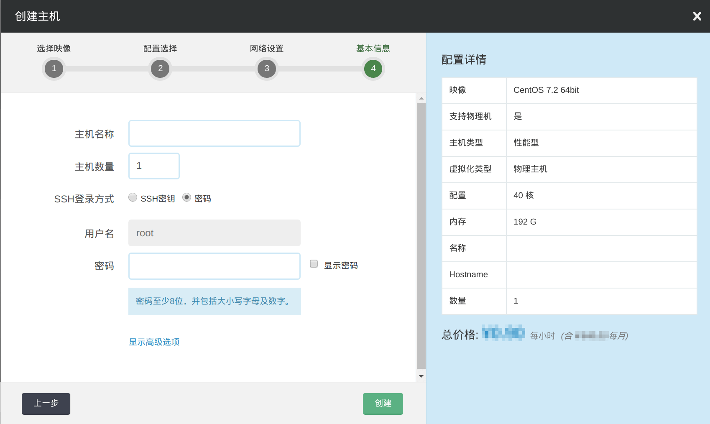
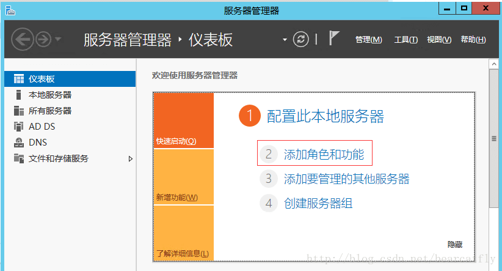
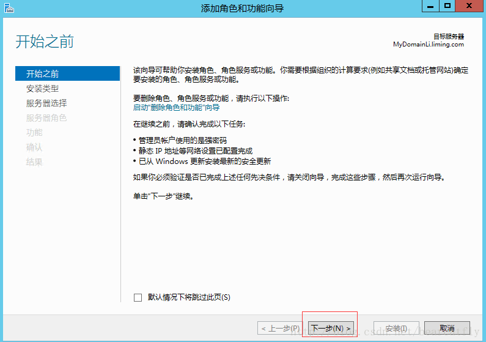
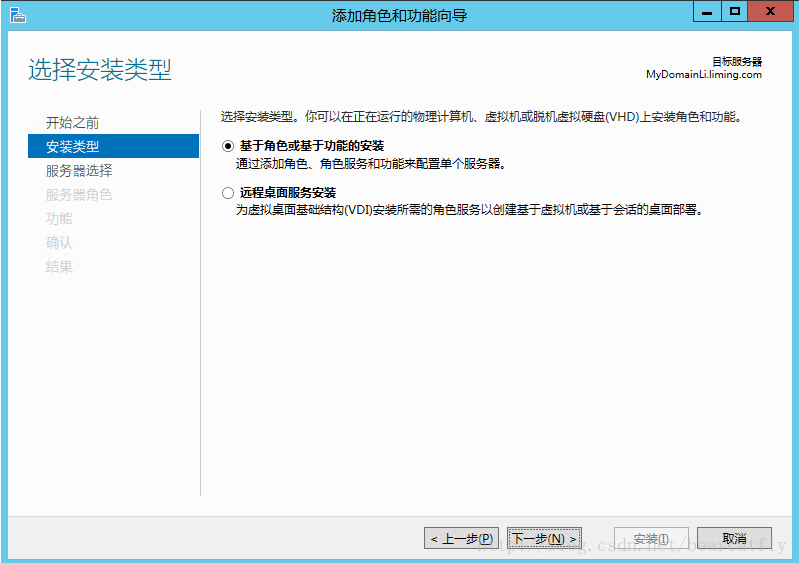
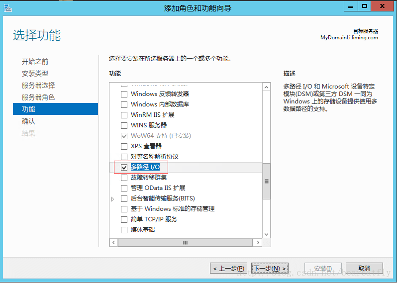

---
---

# 物理主机

青云 QingCloud 物理主机服务，提供高性能、资源独享、安全隔离的专属物理主机群组，满足各类核心应用对高性能及稳定性的需求，同时提供完整的设备管理权限及运维服务。 用户可以像使用其他云资源一样，快速、灵活的部署及管理物理主机，并可按需弹性购买。

物理主机特性：

1、承载核心业务。

独享物理隔离的硬件资源，释放极致性能，匹配 VPC 网络赋予的完整控制能力， 满足核心业务对性能、可靠性及安全合规的苛刻需求。

2、高效的资源交付。

10 分钟完成 OS 部署上线，自动化配置，秒级操作响应，兼容所有虚拟主机系统镜像及用户自有镜像，助您轻松完成基础架构部署。

3、灵活简便的使用体验

VPC 直连，提供与虚拟主机（VM）一致的使用方式，支持弹性伸缩、按需秒级计费及 API 自动化管理，赋予物理主机弹性、灵活与敏捷的云端特性。

## 物理主机使用步骤

一、创建边界路由器

在"网络与 CDN"下的"边界路由器"页面中, 点击"创建"即可创建边界路由器。


二、绑定 VPC 网络

在边界路由器详情页, 点击"绑定 VPC 网络", 选择需要绑定的VPC。


三、创建物理主机网络

进入刚绑定 VPC 的详情页面，在私有网络界面下点击创建按钮，将工作模式设为物理机即可创建物理主机网络。


四、创建物理主机

物理主机和创建普通主机的步骤是类似的，具体步骤如下。

第一步：选择支持物理主机的镜像。



>注解
有些镜像因系统太老，无法支持新硬件，所以无法运行在物理主机上。不含NIC组合功能的Windows镜像，也无法运行在物理主机上。

第二步：选择物理机类型。



第三步：选择物理主机网络。



第四步：设置主机名称、登录方式等信息，然后点击创建。



注解

按需付费模式下，物理主机被删除后仍然会计费，需要在回收站中销毁。销毁物理主机，有三个模式。若选择“快速清除”，通常只需几分钟即可销毁物理主机，若选择“完全清除”则需要若干个小时。如果用户自己已经清除了数据，可以选择“不清除”或者“快速清除”模式。

## 物理主机监控

青云使用 zabbix 来收集物理主机的监控信息，包括 CPU 使用率、内存使用率、硬盘使用率等。 在创建主机时，青云会在物理主机上部署 zabbix agent。 创建成功后，青云会在物理主机所属的路由器上，通过 zabbix_get 收集物理主机监控信息。 


对于 Linux 操作系统, 用户如果不需要或不想使用监控服务，可以在物理主机内执行 ``service stop gapd`` 命令来停止服务，同时删除如下文件：

*   ``/usr/sbin/zabbix_agentd``
*   ``/etc/zabbix/zabbix_agentd.conf``
*   ``/usr/bin/gapd``
*   ``/etc/init/gapd.conf``
*   ``/usr/lib/systemd/system/gapd.service``


对于 Windows 操作系统, 没有预装 zabbix agent, 需要用户自己安装。 具体步骤如下:

1. 从 zabbix 官网下载 Windows 版本的 zabbix_agents, 为方便描述, 以 ``zabbix_agents_2.2.19.win.zip`` 为例。

2. 解压 ``zabbix_agents_2.2.19.win.zip``, 将解压目录下的 ``zabbix_agentd.exe``, ``zabbix_agentd.win.conf`` 拷贝到 C 盘下。

3. 编辑 ``zabbix_agentd.win.conf``, 修改文件内容如下。

    ```
    AllowRoot=1
    EnableRemoteCommands=1
    Server=<monitor_server_ip>
    Hostname=<instance_id>
    ```
    
    其中, instance_id 是主机 id, 类似: i-vmqi7s9z。 monitor_server_ip 是 VPC IPv4 地址范围内倒数第 4 个 IP, 例如, VPC IPv4 地址范围为 172.16.0.0/16, monitor_server_ip 为 172.16.255.252。

4. 执行如下命令, 安装启动 zabbix_agentd

    ```
    C:\zabbix_agentd.exe -i -c C:\zabbix_agentd.win.conf 
    C:\zabbix_agentd.exe -s -c C:\zabbix_agentd.win.conf
    ```

5. 防火墙入放行 zabbix_agentd 端口号 10050


## 物理主机+共享存储（NeonSAN）功能用户指南


一、创建物理主机 

请参考：[物理主机](https://docs.qingcloud.com/product/computing/bm_instance)

二、创建 NeonSAN 硬盘

请参考： [企业级分布式 SAN (NeonSAN)](https://docs.qingcloud.com/product/storage/shared/vsan)

三、创建 VSAN，并将 NeoSAN 硬盘挂载到 VSAN 上

请参考：[Virtual SAN（vSAN）](https://docs.qingcloud.com/product/storage/shared/vsan)

四、主机端配置：

Windows 系统

多路径：

（1）以 Windows 2012 R2 版本为例（其他版本类似）。

1、	首先打开服务器管理器，选择"添加角色和功能"。

 

 

2、	点击“下一步”。

 

 

3、	点击“下一步”。

 

4、	点击“下一步”。

 


5、	点击“下一步”。

 

6、	重点：勾选“多路径 I/O” ，点击下一步。


7、	勾选“如果需要，自动重新启动目标服务器”，安装 MPIO 是需要重启的。然后点击安装。


8、	等待重启安装完成。 

9、	MPIO 设置 （服务器管理-工具-MPIO），MPIO 属性页面，单击发现多路径，勾选“增加对 iSCSI 设备的支持”。
 


（2）配置 Windows iSCSI 客户端，请参考文档 [Virtual SAN（vSAN）](https://docs.qingcloud.com/product/storage/shared/vsan)

> 注解：当创建的 VSAN 为多节点时， 点击程序的发现页面，然后点击『发现门户』，输入每个 VSAN 节点的 IP 。


Linux 系统

（1）多路径：

 以 ubuntu16.04 为例：

- 启动 ubuntu16.04主机，安装 multipath：

```
apt-get install multipath-tools
```

- 关闭服务：

```
service multipath-tools stop
```

- 增加/修改配置
修改 ```/etc/multipath.conf```

配置内容如下:

```
blacklist{
devnode "^vd"
}
defaults {
user_friendly_names yes
path_grouping_policy multibus
failback immediate
no_path_retry queue
}
devices {
device {
vendor "LIO-ORG"
path_selector "queue-length 0"
path_checker "tur"
hardware_handler "1 alua"
prio "alua"
prio_args "exclusive_pref_bit"
fast_io_fail_tmo 25
}
}

```


- 登录 iSCSI 目标

```
#!/bin/bash
mkdir -p /etc/multipath; touch /etc/multipath/wwids;
for IP in ip1 ip2 ip3(这里输入VSAN各节点IP地址); do
for IQN in `iscsiadm -m discovery -t st -p ${IP}:3260 | awk '{print $2}'`; do
iscsiadm -m node -T ${IQN} -p ${IP}:3260 -l
done
done
```


- 启动服务

```
service multipath-tools start
```

```multipath -ll```  可以看到 mpath 信息。

```ls /dev/mapper/```  可以看到对应的盘符. 后续可以格式化等操作，开始使用。

（2）配置 Linux iSCSI 客户端，请参考文档 [Virtual SAN（vSAN）](https://docs.qingcloud.com/product/storage/shared/vsan)
