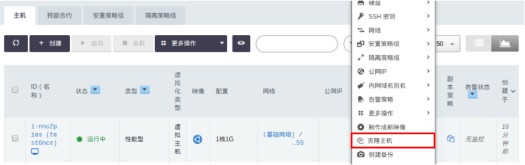
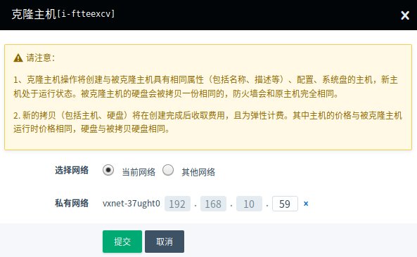
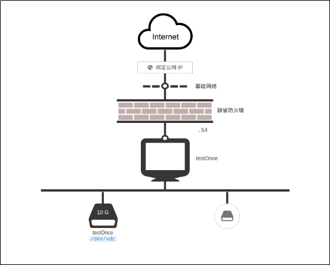

---
---

# 克隆主机

## 克隆主机功能简介

克隆主机功能可以让主机在运行的状态下，创建出一份具有相同配置、内网网段、系统盘、挂载数据盘的主机，有助于业务不中断服务时方便地进行环境复制。

## 操作指南

1、登陆青云[终端控制台](https://console.qingcloud.com/)，切换至“计算”--“主机”。在要克隆的主机上点击鼠标右键，在弹出的菜单中选择“克隆主机”。

2、在弹出的提示框中，会对克隆主机功能进行一些说明，请您详细阅读。阅读后，点击“确定”，触发克隆主机任务。

3、当克隆任务完成后，创建出一个新的运行状态的主机，通过主机图形化比对，发现与原主机一致。

* 克隆前的原主机：

* 克隆出的新主机：

克隆主机可以选择新主机要加入的私有网络 ID 和指定的 IP 地址，如果不选择的话，默认是原来主机的同一个私有网络。

>注解
克隆原主机需要原主机使用的镜像是可用状态。如果原主机启动的镜像被删除了的话，克隆会失败。
