---
---

# 专属宿主机

专属宿主机功能为用户提供了专属物理服务器，用户可以通过申请专属宿主机的方式来独占物理服务器资源，从而将实例定向部署到宿主机上。 专属宿主机通过专属宿主机组的方式来进行申请和管理。

专属宿主机上的主机不再另外收费。

[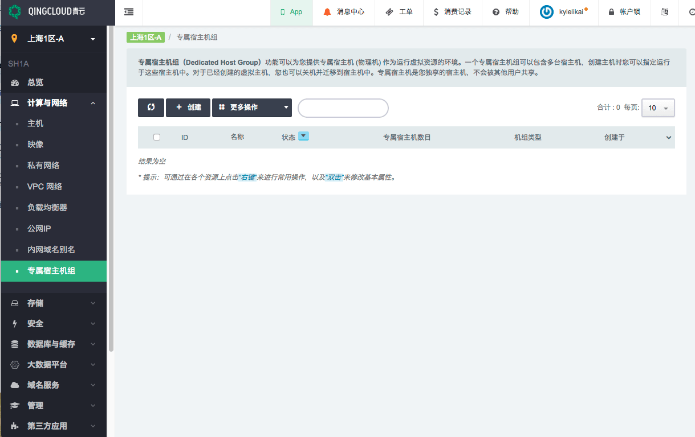](_images/overview_1.png)

## 创建 专属宿主机组

在青云上，您可以很方便的创建和管理一个专属宿主机组，并且可以对组内的物理机数量进行增加和减少。

**第一步：选择基本配置** 在创建的对话框中，您需要选择专属宿主机类型、专属宿主机数量以及填写名称（可选）。

[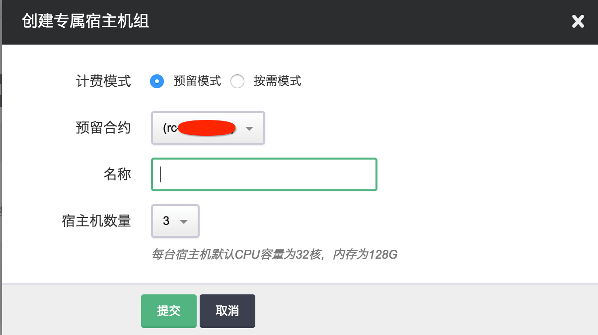](_images/create_dhg_1.png)

注解

专属宿主机数量最小为2

注解

创建专属宿主机默认为预留模式（详情参考 [预留资源计费模式](./reserved_contract.html#reserved-contract) ）。按需模式（试用）需要单独提工单申请配额。

**第二步：创建成功** 当 专属宿主机组 创建完成之后，您可以查看专属宿主机组的基本信息。如图所示，当状态显示为“活跃”状态，表示该物理机组可用。

通过点击 专属宿主机组 的ID可以进入专属宿主机组的详情页面，在宿主机列表可以看到宿主机的ID、状态、以及CPU和内存的使用情况； 通过切换右侧的宿主机按钮，可以在下方实例列表里看到运行在该宿主机上的实例信息。

[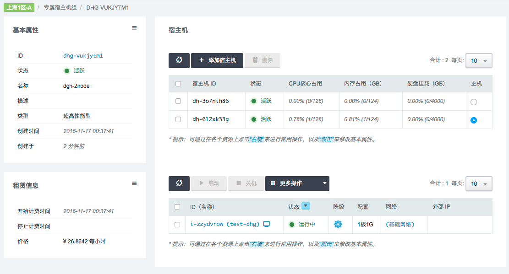](_images/create_dhg_3.png)

## 增加 专属宿主机数量

当专属宿主机不够用时，可以增加专属宿主机的数量来承担更多的业务，您可以在 专属宿主机 详情页点击添加“添加宿主机”按钮，在弹出页面输入您要增加宿主机数量。

## 减少 专属宿主机的数量

当专属宿主机数量过多时，可以减少专属宿主机的数量来节约成本，您可以在 专属宿主机 详情页选择需要删除的专属宿主机，然后点击添加“删除”按钮。

注解

删除专属宿主机时，需要确保宿主机上没有任何资源。可以将资源迁移到其它专属宿主机或专属宿主机组。

[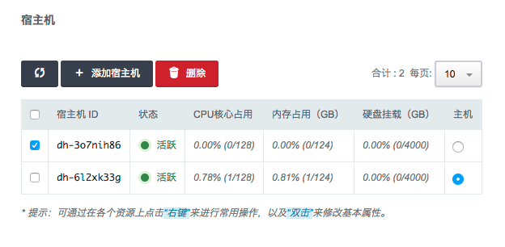](_images/delete_host_1.png)

## 创建 专属型实例

**第一步：选择镜像**

[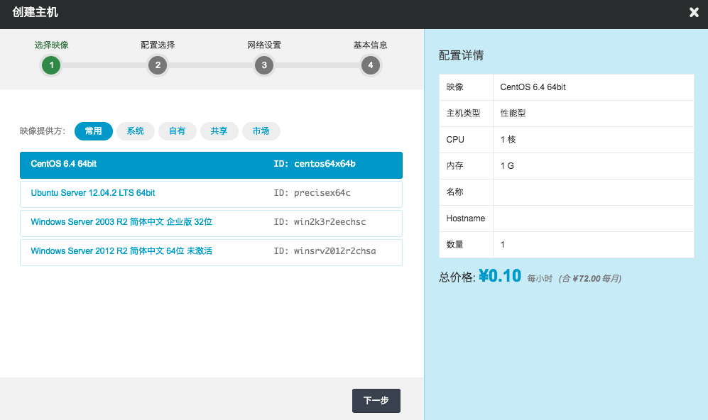](_images/create_instance_1.png)

**第二步：选择配置** 在选择配置里 点击 专属宿主机 类型，通过下拉菜单指定 专属宿主机组 和 专属宿主机，之后选择CPU和内存等配置。

[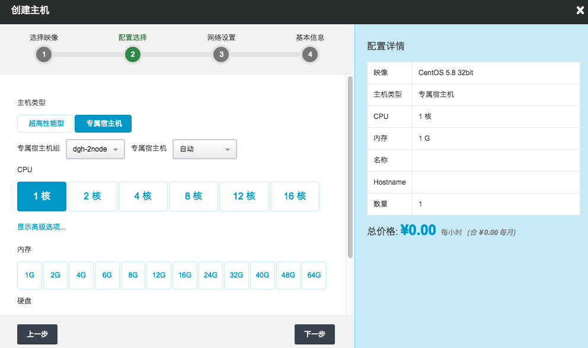](_images/create_instance_2.png)

**第三步：设置网络**

[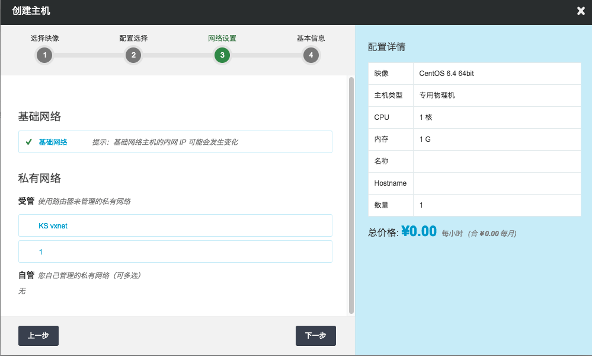](_images/create_instance_3.png)

**第四步：设置基本信息**

[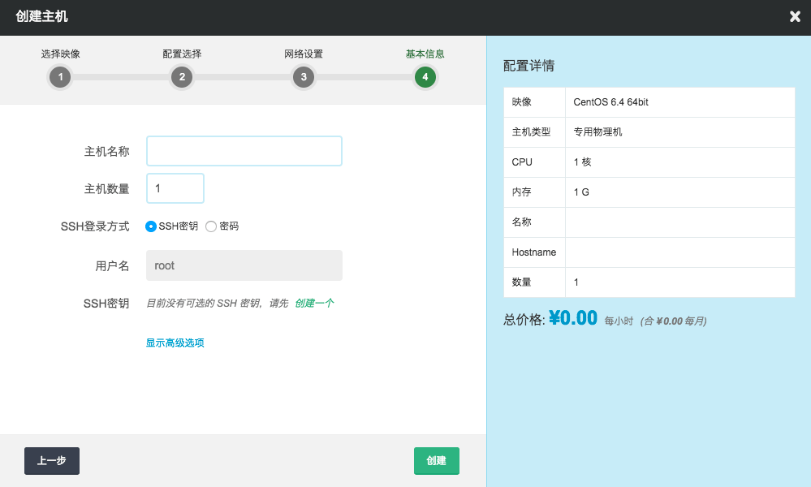](_images/create_instance_4.png)

之后可以在主机的信息里看到该实例类型为“专属宿主机”。

## 迁移 -迁入到专属宿主机组

可以将普通实例迁移到指定的专属宿主机组或者指定的专属宿主机上，实例需要为关机状态。 在主机列表右键点击需要迁移的实例，选择“迁移到专属宿主机”，在弹出界面上选择专属宿主机组或者专属宿主机来进行迁移。

迁移完成后，可以在专属宿主机详情页对应的宿主机的实例列表中看到该实例。

[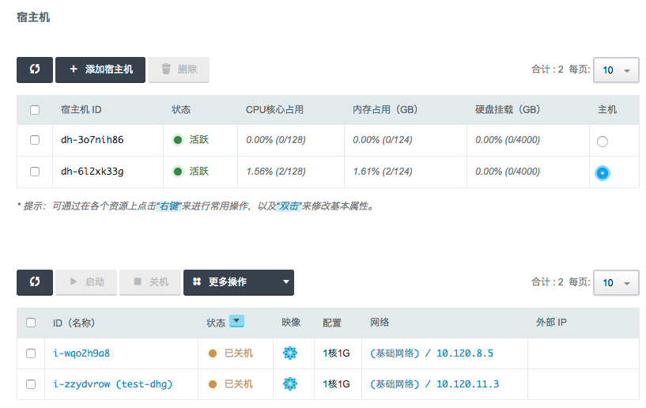](_images/migrate_in_2.png)

## 迁移 -从专属宿主机/组迁移到另一个专属宿主机/组

对于专属宿主型实例，可以从一个专属宿主机组迁移到另一个专属宿主机组，也可以在同一组内的不同宿主机上进行迁移，实例需要为关机状态。

在实例列表，右键点击需要迁移的实例，依次选择“迁移”，“迁移到专属宿主机”。

[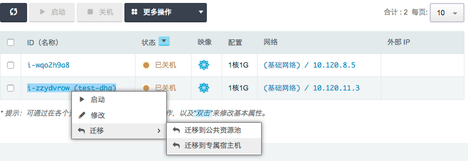](_images/migrate_in_groups_1.png)

在弹出的界面上指定专属宿主机和专属宿主机组。

[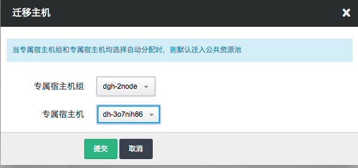](_images/migrate_in_groups_2.png)

## 迁移 -从专属宿主机迁出

可以将专属实例从专属宿主机上迁移到公共资源池，实例需要为关机状态。 在实例列表，右键点击需要迁移的实例，依次选择“迁移”，“迁移到公共资源池”。

## 删除专属宿主机组

当不再需要时，可以通过专属宿主机组页面的删除来进行删除操作。

注解

删除专属宿主机组时，需要确保宿主机组上没有任何资源。可以将资源迁移到其它专属宿主机或专属宿主机组。
