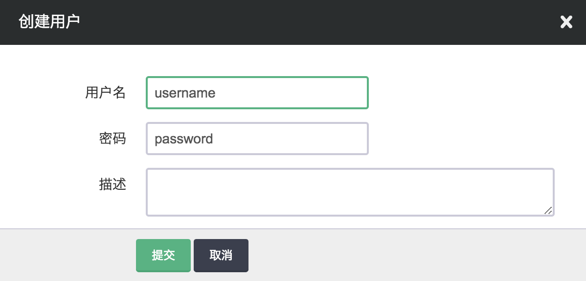
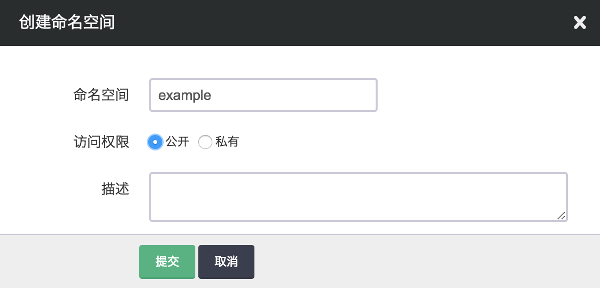
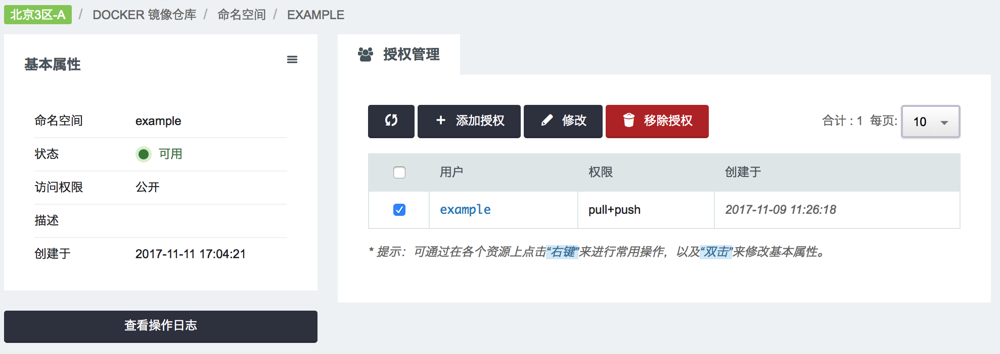
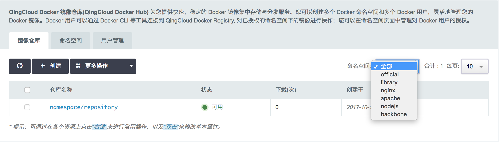
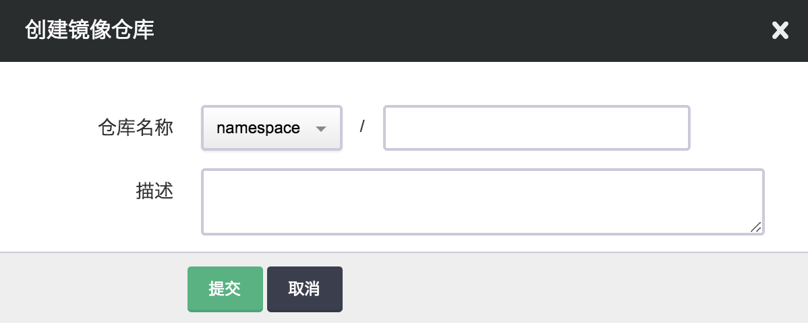
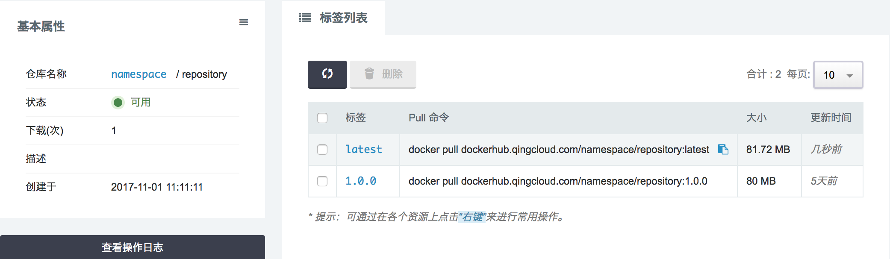
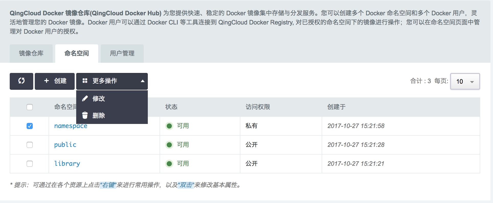
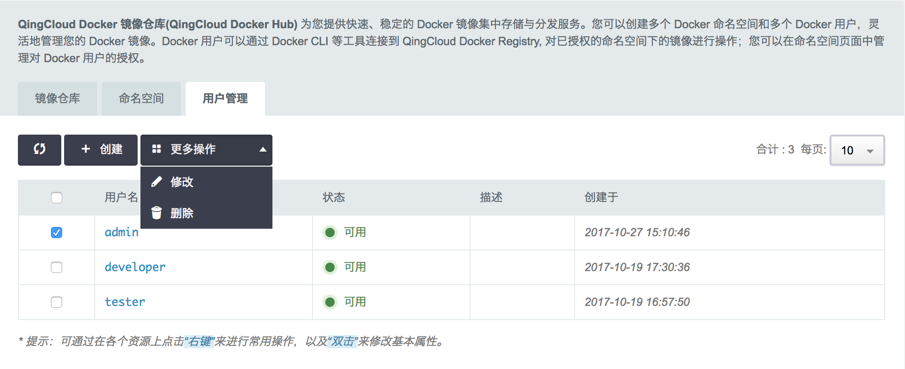

---
---

# 容器镜像仓库[¶](#guide-docker-hub "永久链接至标题")

容器的使用离不开镜像。Kubernetes on QingCloud 上线后，为用户提供了基于原生 Kubernetes 的容器集群管理与编排功能，用户可以基于此应用来进行容器相关的应用开发。 同时，QingCloud Docker Hub 公有镜像仓库也投入了使用，为用户提供快速、稳定的 Docker 镜像集中存储和分发服务。

## 镜像仓库服务概述[¶](#id2 "永久链接至标题")

QingCloud Docker Hub 基于 Docker 官方开源的 Docker Distribution 为用户提供 Docker 镜像集中存储和分发服务。QingCloud Docker Hub 的原地址是dockerhub.qingcloud.com. Docker Distribution 对镜像仓库的管理共分为3个层级，依次是 命名空间(namespace) 、镜像仓库(repository) 和 标签(tag)。命名空间以其名称标识，每个命名空间分别管理多个镜像仓库，同样通过名称标识；一个镜像仓库中则可以保存一个镜像(image)的多个版本，版本则通过标签进行区分。 基于以上的层级关系，通过完整的镜像路径 {namespace}/{repository}:{tag} 可以唯一确定一个镜像。

## 镜像仓库的使用[¶](#id3 "永久链接至标题")

注解

在 Docker Distribution 的基础上，QingCloud Docker Hub 提供了更灵活的镜像仓库管理方式。

**独立的镜像仓库用户体系**

Docker 开发者通过 Docker CLI 等工具下载或推送镜像时，需要用 Docker user 账号登录到对应的 Docker Registry。 在 QingCloud Docker Hub 的设计中， Docker user 是 QingCloud 用户的资源：每个用户可以创建多个 Docker user；用户可以将 Docker user 给予其它开发者使用。

创建 Docker user 时指定用户名和登录密码，在 Docker CLI 登录到 QingCloud Docker Hub 时使用对应的用户名和登录密码。

> docker login -u {username} -p {password} dockerhub.qingcloud.com

独立的镜像仓库用户体系，能够更灵活地管理命名空间和镜像仓库。

**基于命名空间的权限管理**

用户在创建命名空间时，可以指定命名空间的访问权限。

*   设置为公开的命名空间，任意 Docker 用户都允许访问和下载该命名空间下的镜像仓库；
*   设置为私有的命名空间，只有添加了 pull 权限的 Docker user 才能访问和下载该命名空间下的镜像仓库；
*   而所有的命名空间，只有添加了 push 权限的 Docker user 才能推送内容到该命名空间下的镜像仓库。

您也可以在之后更改命名空间的访问权限。 命名空间的授权管理位于命名空间的详情页。您可以在该页面添加新的 Docker user 授权，或对已有的授权进行修改或移除。

## 页面操作[¶](#id4 "永久链接至标题")

从 QingCloud 控制台左侧菜单 > 容器服务 > 「Docker 镜像仓库」即可进入该模块， 「Docker 镜像仓库」包含「镜像仓库」「命名空间」「用户管理」三个子模块，分别管理镜像仓库、命名空间和 Docker user。

**管理镜像仓库**

镜像仓库列表页展示了各仓库的仓库名称（包括所属命名空间）、仓库状态、镜像被下载次数、仓库创建时间等信息。页面默认罗列当前账号下所有命名空间下的所有镜像仓库，用户可以通过右上角的下拉框，显示指定命名空间下的仓库。

在该页面，用户可以创建新的镜像仓库，或者修改、删除已有的仓库。

点击列表中仓库名称，进入该仓库详情页，可管理该仓库下的镜像。

**管理命名空间**

同样，命名空间列表页罗列了当前账号下所有命名空间，可在该页面创建新的命名空间，或修改、删除已有的命名空间。

进入命名空间详情页，则可以对命名空间授权进行管理。

**管理 Docker user**

用户管理页面，则罗列了用户创建的所有 Docker user，用户可在该页面创建新的 Docker user，或修改、删除已有的 Docker user。

注解

另外，「Docker 镜像仓库」是全局服务，不区分区域。
