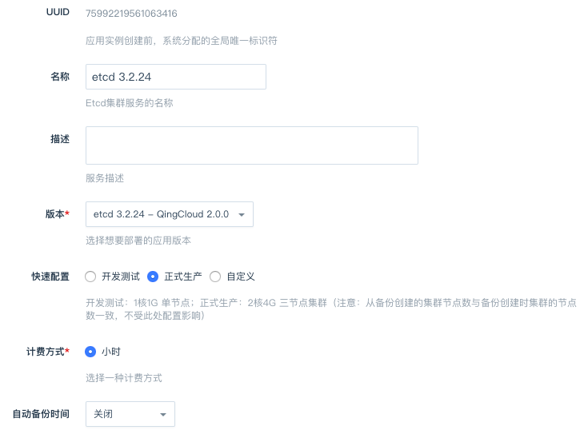
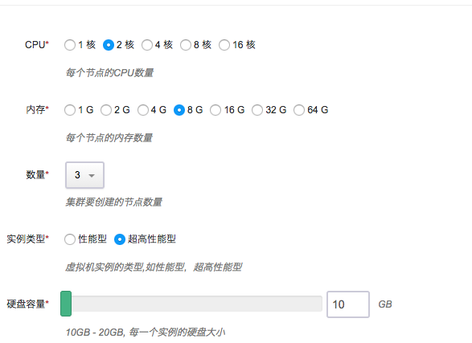
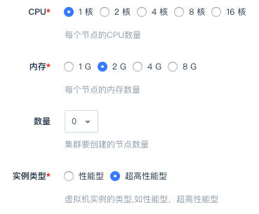
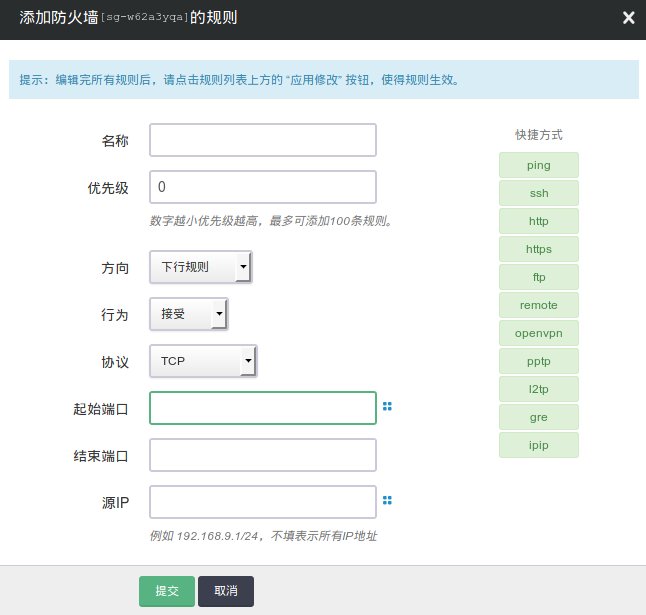
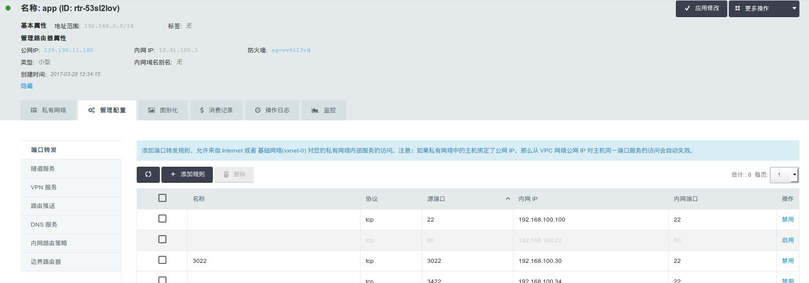
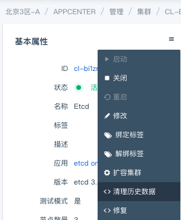
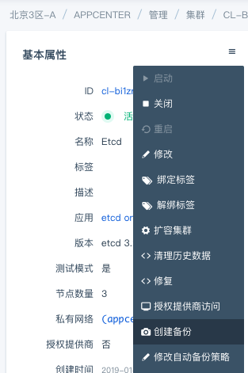
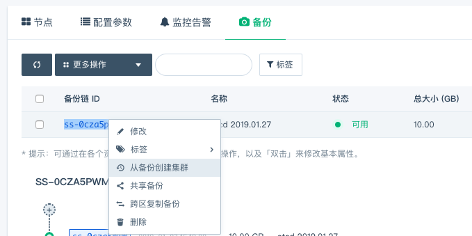
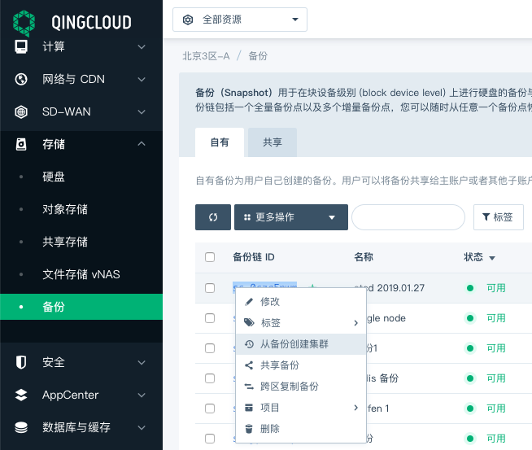
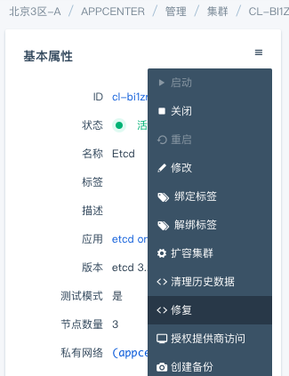

---
---

# etcd on QingCloud AppCenter 用户指南

## 简介

[etcd](https://coreos.com/etcd/) 是一个为分布式系统设计的分布式可靠的键值存储服务，应用程序可以从 etcd 中读取写入数据，监控数据变化。它主要用来提供注册服务，配置服务等功能。

本应用方便用户在青云平台搭建 etcd 集群。应用借助 AppCenter 提供的能力可以进行集群的动态扩容，备份恢复，健康检查和监控。

## 创建 etcd 集群

  > etcd 集群需要运行在受管私有网络中。所以在创建一个 etcd 集群之前，需要创建一个 [VPC](https://appcenter-docs.qingcloud.com/user-guide/apps/docs/network-config/create_vxnet.html#1-创建-vpc-网络) 和一个[受管私有网络](https://appcenter-docs.qingcloud.com/user-guide/apps/docs/network-config/create_vxnet.html#2创建私有网络)，受管私有网络需要加入 VPC，并开启 DHCP 服务（默认开启）。

### 第一步：创建集群

选择集群名称，描述，版本和计费方式，设置自动备份时间：


可选择快速配置跳过下面两步的节点配置。

选择 etcd 节点机器配置，推荐使用超高性能型机器：


选择 etcd 代理节点配置：


配置集群需要的参数：


每次对 etcd 键值的更新/设置操作都会被记录在数据文件中，可开启自动清除功能定时做数据清理以防止性能下降和空间耗尽。相关原理可参考官方说明文档 [Compaction](https://github.com/etcd-io/etcd/blob/release-3.2/Documentation/op-guide/maintenance.md#history-compaction)。

### 第二步：创建成功

当 etcd 创建完成之后，您可以查看每个节点的运行状态。当节点的服务状态显示为“正常”状态，表示该节点启动正常。 当每个节点都启动正常后 etcd 集群显示为“活跃”状态，表示您已经可以正常使用 etcd 服务了。

**添加防火墙规则**

  
  起始端口设置为目标端口，协议根据需求选择（UDP/TCP)。

  > 要点击应用修改将设置同步，否则不会生效

**添加端口转发规则**

  
  点击添加规则

  
  源端口选择协议，端口，然后填入私网 IP 的地址，协议和端口。

  > 要点击应用修改将设置同步，否则不会生效

## 测试 etcd

etcd 创建完成之后可以进行连接测试。您可以在 etcd 同一私有网络或跨网络的客户端上测试，下载 [etcd](https://github.com/etcd-io/etcd/releases/tag/v3.2.24) 并解压。现假设客户端和 etcd 在同一私有网络，etcd 集群有三个节点，IP 地址分别为192.168.100.10,192.168.100.11,192.168.100.12， 您可以通过如下命令连接 etcd：

> etcdctl 支持 v2 和 v3 两个版本，以下以 v3 为例，详细说明请查阅[官方文档](https://github.com/etcd-io/etcd/tree/v3.2.24/etcdctl)。

```shell
# ETCDCTL_API=3 ./etcdctl --endpoints http://192.168.100.10:2379,http://192.168.100.11:2379,http://192.168.100.12:2379 endpoint health
```

同时该应用也提供了 REST 接口，详情请参考 [官方文档](https://coreos.com/etcd/docs/latest/getting-started-with-etcd.html#reading-and-writing-to-etcd)。

## 增加节点

当 etcd 需增加节点以应付客户端逐步增多带来的压力，您可以在 etcd 详细页点击“新增节点”按钮。需注意的是，增加节点会影响 etcd 的性能，因为每个节点上需要进行数据同步。增加 etcd 代理节点时可以同时添加，添加成功详情页会显示服务状态为活跃。

## 删除节点

您也可以在 etcd 详细页选中需要删除的节点，然后点“删除”按钮删除节点，以节省资源和费用。 同样，删除节点数只能为偶数以保证集群始终为奇数个节点，可以同时删除代理节点。

## 清除历史数据

若没有开启自动清除，可通过点击“清除历史数据”菜单手动进行清除操作。



## 备份集群数据

若没有开启自动备份，可通过点击”创建备份“菜单手动备份当前数据。

> 注意：如果集群只有一个节点并且存储了 v2 的数据，此集群在备份过程中服务会中断，备份完成后服务自动恢复（多节点集群不受影响）。



## 恢复集群

可通过自动或手动创建的备份创建一个新集群。

备份可以在 etcd 集群的“备份”标签页找到：



如果 etcd 集群已删除，可以通过青云控制台左侧菜单”存储“-”备份“找到：



## 修复集群

> 注意：该操作会覆盖现有数据，请谨慎操作！如需协助，可通过工单咨询青云工程师。

如果 etcd 集群由于无法预知的原因导致不能正常工作（节点之前的数据不一致），可尝试“修复集群”，该操作将用指定的某个集群内节点上的数据文件覆盖其他节点上的文件从而恢复数据一致。



## <a name="multi-zone-result"></a>多可用区（同城多活）测试

### 背景

- [青云QingCloud 升级区域（Region）架构 轻松实现同城多活](https://log.qingcloud.com/archives/3981)

### 测试结果

| 集群 / 指标 | 网络延时 Ping * | 读吞吐量 TPS | 写吞吐量 TPS |
| --------- | ------------ | ---------- | ----------- |
| 单可用区部署（pek3c） | `0.3 ms` | `~28000` | `~3500` |
| 多可用区部署（pek3b, pek3c, pek3d） | `1.6 ms` | `~20000` | `~3175` |

\* *网络延时视情况而定，同可用区可能在 `0.1 ~ 0.5 ms` 之间波动，不同可用区之间波动更大一些，一般在 `1 ms` 以上。*

### 测试环境

* [x] 区域：北京 3 区
* [x] etcd 节点：1 CPU， 1G 内存，超高性能型
* [x] Client 节点：pek3c 区，4 CPU， 8G 内存，企业型，Ubuntu Server 16.04.5 LTS 64bit

### 测试方法

参考[官方文档](https://coreos.com/etcd/docs/latest/op-guide/performance.html)，不同的操作（Get, Set）分别定量处理，在客户端用操作成功的次数除以时间得到 TPS 。

### 测试代码

https://github.com/etcd-io/etcd/tree/master/tools/benchmark

写操作：
```
benchmark --endpoints=${HOST_1},${HOST_2},${HOST_3} --conns=30 --clients=30 \
    put --key-size=8 --sequential-keys --total=100000 --val-size=256
```

读操作：
```
benchmark --endpoints=${HOST_1},${HOST_2},${HOST_3} --conns=30 --clients=30 \
    range key0001 --consistency=s --total=1200000
```

## 注意事项

1. 单节点 etcd 集群仅做开发测试使用，正式使用建议至少 3 节点。 etcd 集群代理节点可根据实际情况创建。

2. 节点监控界面中 etcd_server_has_leader 表示当前节点是否有 leader ，处于无 leader 状态的集群是不能提供服务的，集群会自动重新选举。

3. 具体使用方法请参考 [官方文档](https://coreos.com/etcd/)。

## 版本历史

### etcd 3.2.24 - QingCloud 2.0.0
* 升级到 etcd 3.2.24 版本；
* 添加备份恢复功能；
* 支持滚动升级，集群可不关机无感知升级；
* 支持在 Region 多可用区区域部署，同城多活；
* 新增单节点模式方便开发和测试。

### etcd 3.1.0 - QingCloud 1.1.1
* 使用 etcd 3.1.0 构建 etcd 集群；
* 提供 etcd 节点和 etcd 代理功能。
