---
---

# Kubernetes on QingCloud AppCenter 用户指南



[Instruction in English is available here](k8s-en-US.html)

## 简介

Kubernetes 是一个开源的、用于管理云平台中多个主机上的容器化的应用的调度系统，是一个用于容器应用的自动化部署、弹性伸缩、应用升级以及运维等的开源平台。青云QingCloud Kubernetes 服务旨在方便用户在青云平台搭建 Kubernetes 集群。

## 创建 Kubernetes 集群

在青云上，您可以很方便的创建和管理一个 Kubernetes 集群。青云的 Kubernetes 集群支持横向在线伸缩，同时具有自我诊断功能，即当系统发现某节点坏死时在控制台显示状态。 另外我们还提供了监控告警等功能来帮助您更好的管理集群。集群将运行于私有网络内，结合青云提供的高性能硬盘，在保障高性能的同时兼顾您的数据安全。

### 准备工作

为了保障数据安全， Kubernetes 集群需要运行在受管私有网络中。所以在创建一个 Kubernetes 集群之前，需要创建一个 VPC 和一个受管私有网络，受管私有网络需要加入 VPC，并开启 DHCP 服务（默认开启）。VPC 的地址范围请不要选择 172.17.0.0/16 这个段，因为这个 docker 默认使用这个段，使用这个段会导致网络问题。  

### 选择基本配置

在创建的对话框中，您需要填写名称 (可选)，选择 Kubernetes 版本号以及选择计费方式。  

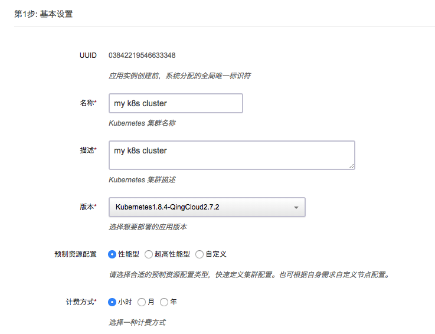  

我们提供了**两种默认资源配置组**：性能型除配置组都是用性能型主机及存储，工作节点标记 node role label 为 node，超高性能型除客户端节点为都为超高性能型主机及存储，工作节点标记 node role label 为 ssd_node，

用户也可根据自身需求选择自定义方式配置节点，但由于创建挂盘的是和主节点类型一致的，所以，对于有挂盘的资源，请配置正确的调度策略调度到和主节点类型一致的工作节点上，比如：主节点为超高性能型主机，mysql 使用挂盘，则需调度这个pod到 ssd_node 标记的节点

如选择自定义方式，请根据需要选择 Kubernetes 主节点，性能型节点，超高性能型节点和日志节点的 CPU、节点配置和数量、下图以主节点为例。每种角色节点的主机资源类型请保持一致，要么都是性能型，要么都是超高性能型。  

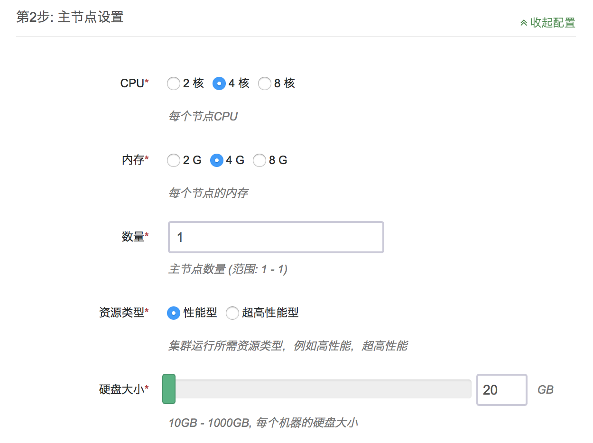  

如果用户选择不部署日志节点（节点个数为0），则需在依赖服务中选择预先部署好的 ELK 集群或者环境变量中指定自建的 Elastic Search 服务器的 IP 地址和端口。  

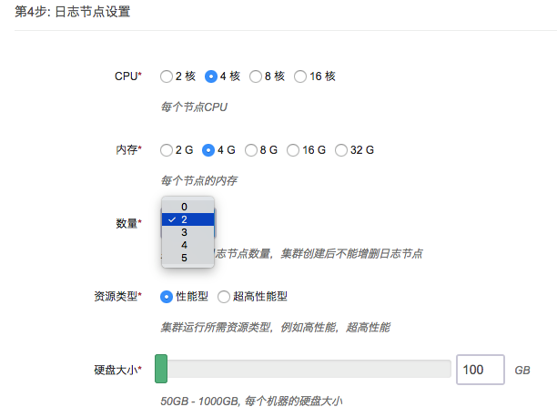  

选择集群主机所在的私网，私网需要在创建集群前准备好。  

  

如果用户不想使用 Kubernetes App 的日志节点和内置的日志管理工具，可以预先部署 [ELK App on QingCloud](https://appcenter.qingcloud.com/apps/app-p6au3oyq)，在此处选择其为 Kubernetes 集群的依赖服务。**注意：日志节点数必须为0，ELK 集群必须和 Kubernetes 集群在同一 VPC 下。**  
Kubernetes 集群的状态数据默认存储在主节点的 etcd 应用中，同时用户可以选择预先部署 [etcd on QingCloud](https://appcenter.qingcloud.com/apps/app-fdyvu2wk)，在此处选择其为 Kubernetes 集群的依赖服务，以便获得更好的数据稳定性和更多的工作节点支持。**注意：etcd 集群必须和 Kubernetes 集群在同一 VPC 下。**  


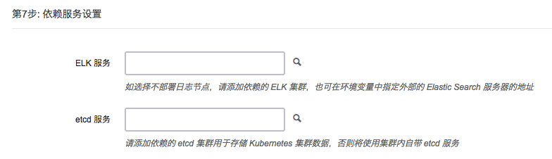  

填写 Kubernetes 应用所需参数： 

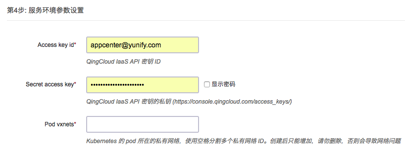  

* 为了更好地与青云基础设施集成，Kubernetes 应用需要使用您的 API 密钥来调用 QingCloud IaaS API。请在控制台生成[密钥](https://console.qingcloud.com/access_keys/)。  

* Kubernetes 应用可选择使用青云提供的 SDN2.0（hostnic），创建的 Pod 都会绑定一个网卡，分配一个私网地址。这里可以设置所使用的私网 ID，私网需要预先准备好，如(vxnet-xxxxxxx)。建议给 Pod 设置专用的私网，每个私网可以容纳200多个 IP，如果您需要的容器数量较多，请填写多个，之间用空格切分。**如果打开hostnic，Pod 的 vxnet 请不要复用 Kubernetes 所在的 vxnet，且应和 Kubernetes 集群所在的私网在同一 VPC 中。如果关闭hostnic，请填写Kubernetes 所在的 vxnet。**

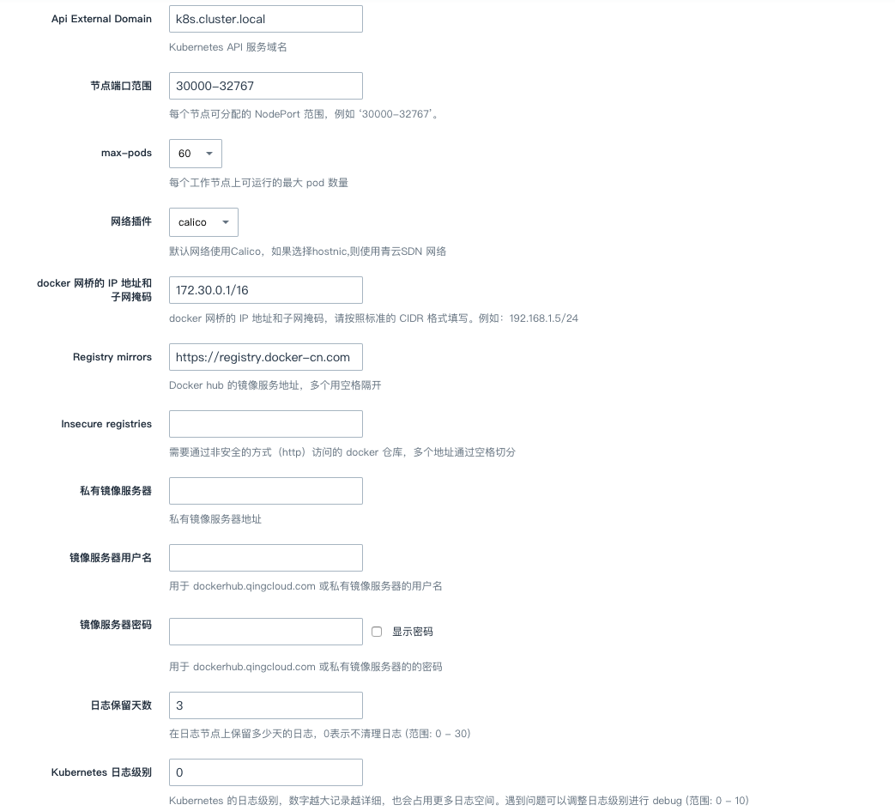  

* 这里可以设置 Kubernetes API的域名，用于生成api server使用的ca证书。 
* 每个工作节点可以暴露的 nodePort 类型的服务的端口是有范围和数目限制的，默认为 30000-32767。  
* 每个工作节点可以运行的 pod 上限默认为60，可以通过配置 max-pods 提高这个上限。如选择 hostnic 网络方案，由于有绑定网卡数限制，目前只可以将 pod 上限设置为60。  
* 集群默认使用 calico 网络插件，同时提供 flannel 和 hostnic 网络插件共用户选择。hostnic 为青云基于 cni 标准开发的网络插件，可以将私网下的网卡直接绑定 Pod 上。如果没有特殊网络性能需求，可以不用选择 hostnic。主机上运行容器的的限制更少。如果 pod 中执行的任务有很多调用集群外部的请求。比如说 批处理迁移数据等，hostnic 会更好，pod 请求是单独网卡处理，缺点是虚拟机可以挂载的网卡数量有上限，每个机器能够创建的pod有限。flannel 是比较流行的方案，除在上述提到的场景外，其他的场景，flannel 在扩展性上会更好一点。缺点是所有网络包都经过主机转发。二层网络有损耗。建议如果跑服务，测试环境，大多数的情况使用 flannel,如果跑需要访问 k8s 集群外服务的批处理程序使用 hostnic。  
* 允许用户自行配置容器运行环境所使用的网桥 IP 地址和子网掩码。
* Registry mirrors Docker hub 官方镜像仓库的 镜像 地址，默认是 docker hub 官方提供的中国区的镜像站点。镜像仓库包含所有官方镜像仓库的所有镜像。  
* Insecure registries Kubernetes 应用支持使用私有容器仓库，方便使用内部容器仓库的用户，青云提供了[harbor应用](https://appcenter.qingcloud.com/apps/app-2mhyb1ui)可以方便用户部署私有容器仓库。如果私有容器仓库没有支持 https，需要将 registry 的 ip 地址填写在这里（如果端口是非 80 端口，也需要填写，格式 ip:port)。  
* 配置私有镜像服务器地址，指向用户自建的或者通过青云 Harbor app 创建的私有镜像服务器，部署集群的时候会自动登陆，以便用户在使用集群的时候直接拉取镜像。**如果是私网下的镜像服务器，确保和 Kubernetes 集群在同一 VPC下，否则需要做 VPC 之间的隧道打通。如果镜像服务器绑定了域名，需要预先在 VPC 的 DNS 管理菜单下添加域名之后，再创建 Kubernetes 集群。**  
* Kubernetes 需要从 dockerhub.qingcloud.com 或者私有镜像服务器下载镜像，dockerhub.qingcloud.com 是青云提供给开发者的仓库服务，不包含官方镜像，这里需要用户填写 dockerhub.qingcloud.com 或者私有镜像服务器的用户名和密码，用来下载镜像。系统已经内置了青云 guest 账号，可以拉取 dockerhub.qingcloud.com 上的公开仓库。  
* Kubernetes 应用内置了自定义日志监控功能，用户可以查询到所有 Kubernetes 管理的资源的日志。为了节省空间，日志会定期销毁。这里可以设置保存日志的天数。  
* 设置 Kubernetes 系统的日志级别，之后可以通过 kibana 查看。  

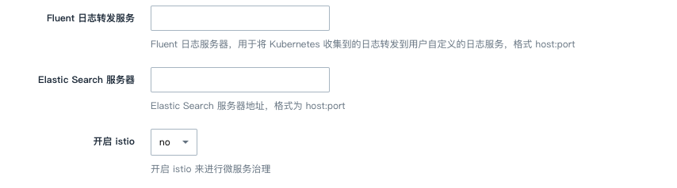  

* 如果用户需要自己对 Kubernetes 的日志或者容器输出的日志进行自定义处理，可以自己搭建 Fluent 或者 Fluent-bit 服务，将服务地址填写到这里，系统会自动将日志转发到填写的日志服务地址上。  
* 如果用户既不想使用 Kubernetes App 的日志节点和内置的日志管理工具，也不想使用青云提供的 ELK App作为依赖服务，而是用自己搭建的 ELK 或者 EFK 服务，可以通过指定 Elastic Search 服务器的 IP 地址和端口，这里要确保 Kubernetes 集群内的节点能够访问这个地址且端口有效，格式 ip:port。  
* Istio 是一个试验性功能，用于提供微服务治理的能力。鉴于Istio 还没有发布一个可以保证性能的稳定版本，因此不建议在生产环境开启此选项。当前集成的Istio 版本为0.3.0，Istio-Initializer 未开启，istioctl 部署在客户端节点。详见[Istio官网](https://istio.io/)。  
* Helm为集群提供包管理功能，默认开启。Helm 是一个开源的 Kubernetes 应用包管理器。(QingCloud k8s 2.8 之后的版本会默认开启Helm功能，此选项不再可选)  

### 创建成功

当 Kubernetes 创建完成之后，您可以查看每个节点的运行状态。当节点的服务状态显示为“正常”状态，表示该节点启动正常。 当每个节点都启动正常后 Kubernetes 集群显示为“活跃”状态，表示您已经可以正常使用 Kubernetes 服务了。


## 测试 Kubernetes

### 使用客户端节点

Kubernetes 集群创建完成之后可以进行测试。找到客户端节点，点击 vnc 图标。  

使用 **root/k8s**登录。登录客户端节点后可以通过 ssh 免密登录其他工作节点，**因此我们强烈建议您在集群创建好之后修改客户端节点的默认密码**。  
	
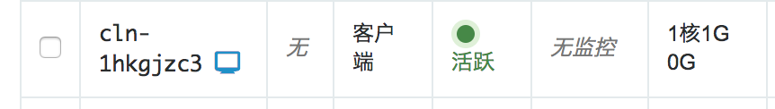  

执行  

```shell
kubectl get pods --all-namespaces
```

程序返回所有 pod 状态，整个集群工作正常。

```shell
kubectl get service --all-namespaces

NAMESPACE     NAME                    CLUSTER-IP      EXTERNAL-IP   PORT(S)         AGE
default       kubernetes              10.96.0.1       <none>        443/TCP         1m
kube-system   elasticsearch-logging   10.96.0.11      <none>        9200/TCP        1m
kube-system   fluentbit-logging       10.96.195.104   <none>        24224/TCP       1m
kube-system   heapster                10.96.132.130   <none>        80/TCP          1m
kube-system   kibana-logging          10.96.18.90     <none>        5601/TCP        1m
kube-system   kube-dns                10.96.0.10      <none>        53/UDP,53/TCP   1m
kube-system   kubernetes-dashboard    10.96.70.70     <none>        80/TCP          1m
```

程序返回所有 service 状态，可以通过 cluster-ip 或者 service name 来调用 service。

```shell
curl 10.96.0.11:9200/_cluster/health
curl elasticsearch-logging.kube-system:9200/_cluster/health
```

客户端节点默认的 dns search domain 是 "default.svc.cluster.local svc.cluster.local cluster.local"，所以非 default namespace 下的 service，调用的时候需要加上 namespace 后缀。关于 Kubernetes 的 dns 支持的更详细的文档请参看 [Kubernetes 官方文档 DNS Pods and Services](https://kubernetes.io/docs/concepts/services-networking/dns-pod-service/) 。

### 使用 KubeSphere

> 此功能仅限于版本 **Kubernetes1.10.5-QingCloud2.8.0** 及之后的版本，之前的版本不包含 KubeSphere，您需要升级到此版本以使用 KubeSphere。如果您使用的是之前的版本，您可以跳过此部分说明。 更加详细的说明文档您可以参看 KubeSphere 官网说明文档，[http://docs.kubesphere.io](http://docs.kubesphere.io)

集群创建完成后，确认 KubeSphere 的后端都已正常运行，并查看 KubeSphere 的服务端口
```shell
root@i-in5veftt:~# kubectl get pod -n kubesphere-system
NAME                           READY     STATUS    RESTARTS   AGE
ks-account-6b5b77cfb5-8qmnt    1/1       Running   0          5m
ks-apiserver-b775dbc4d-p5qcn   1/1       Running   2          5m
ks-console-76b96d979f-9l8tm    2/2       Running   0          5m

root@i-in5veftt:~# kubectl get svc -n kubesphere-system
NAME           TYPE        CLUSTER-IP      EXTERNAL-IP   PORT(S)        AGE
ks-account     ClusterIP   10.96.223.167   <none>        80/TCP         5m
ks-apiserver   ClusterIP   10.96.200.24    <none>        80/TCP         5m
ks-console     NodePort    10.96.231.176   <none>        80:30529/TCP   5m

```

KubeSphere console 以 NodePort 的形式运行在端口 30529，您可以在 VPC 上设置端口转发到任一集群节点(非Client节点)的此端口来访问 KubeSphere 服务。如下图所示。

> 此示例中，端口是30529，在实际使用中，您需要根据上面的命令返回结果来查看具体端口号

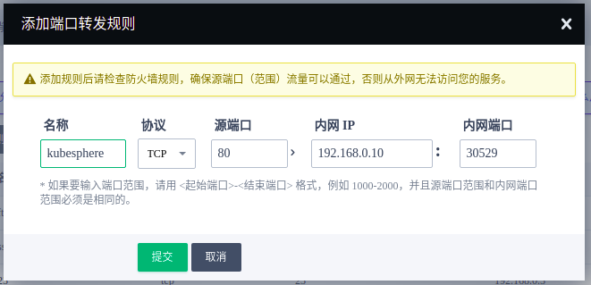

配置规则保存后，您就可以使用 vpc 的 eip 地址来访问 KubeSphere 了，如下图。

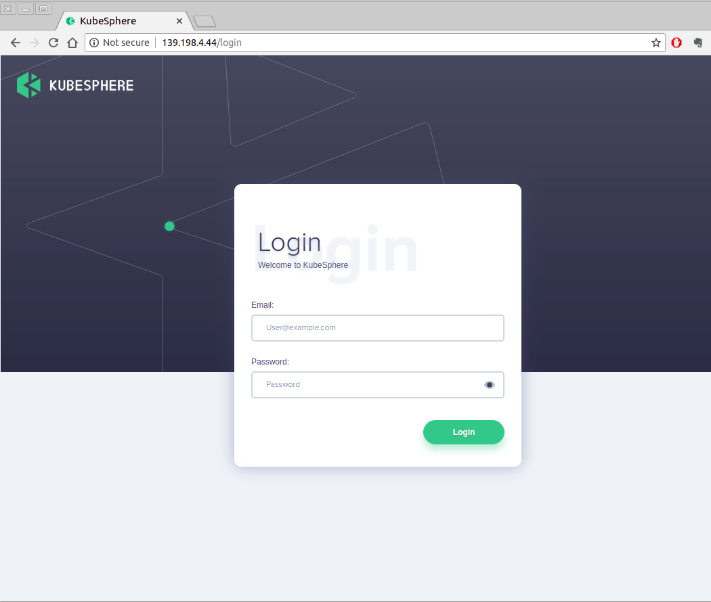

使用如下账户信息来登录 KubeSphere

> **用户名: admin@kubesphere.io**  
> **密码: passw0rd**  

### 使用 KubeSphere 应用模板

在使用应用模板之前，您需要先添加应用仓库地址，仓库的应用须是有效的符合规范的 Helm Charts 应用。如下图，您可以添加地址 https://helm-chart-repo.pek3a.qingstor.com/kubernetes-charts/ 来测试应用模板。点击 "验证" 按钮，验证有效后，即可添加。

> 您可以添加其它的仓库地址，只要仓库是包含有效的Helm Charts即可。

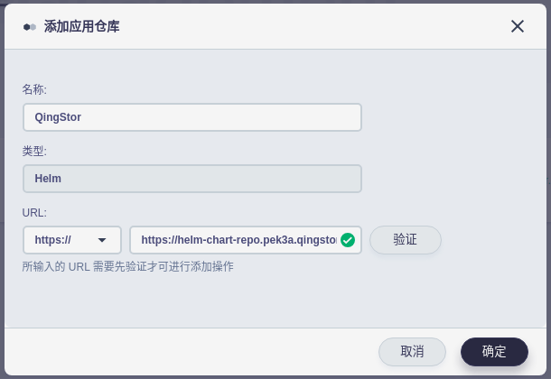

添加完成应用仓库后，您可以在应用模板里浏览部署应用了。

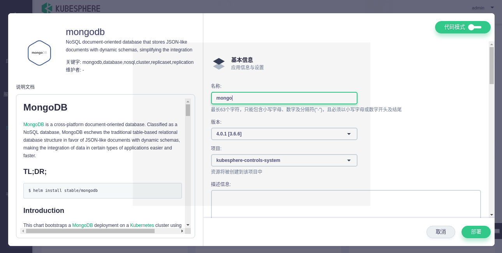

### 通过浏览器查看集群状态

Kubernetes 集群应用集成了官方的监控组件 heapster 和 dashboard。并提供了一个 elasticsearch kibana集群。方便用户查看监控和日志信息。  

登录客户端节点后执行  

```shell
nohup kubectl proxy --address='0.0.0.0' --accept-hosts='.*' --disable-filter=true --accept-paths="^.*" &
```

连接客户端节点所在 vpc 的VPN后，使用浏览器访问：  

http://客户端节点ip:8001/ui（Kubernetes 1.8.4-QingCloud2.7.3及以前版本）  

http://客户端节点ip:8001/api/v1/namespaces/kube-system/services/http:kubernetes-dashboard:/proxy/#!/overview?namespace=default（Kubernetes 1.10.5-QingCloud2.8.1及以后版本）  

会自动跳转到dashboard应用。  
例如： 

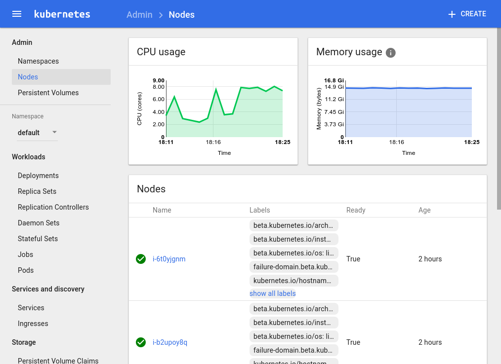

同样，访问：  

http://客户端节点ip:8001/api/v1/proxy/namespaces/kube-system/services/kibana-logging/ （Kubernetes 1.8.4-QingCloud2.7.3及以前版本）  

http://客户端节点ip:8001/api/v1/namespaces/kube-system/services/http:kibana-logging:/proxy/#!/overview?namespace=kube-system（Kubernetes 1.10.5-QingCloud2.8.1及以后版本）  

会打开日志服务的 kibana    
如图  

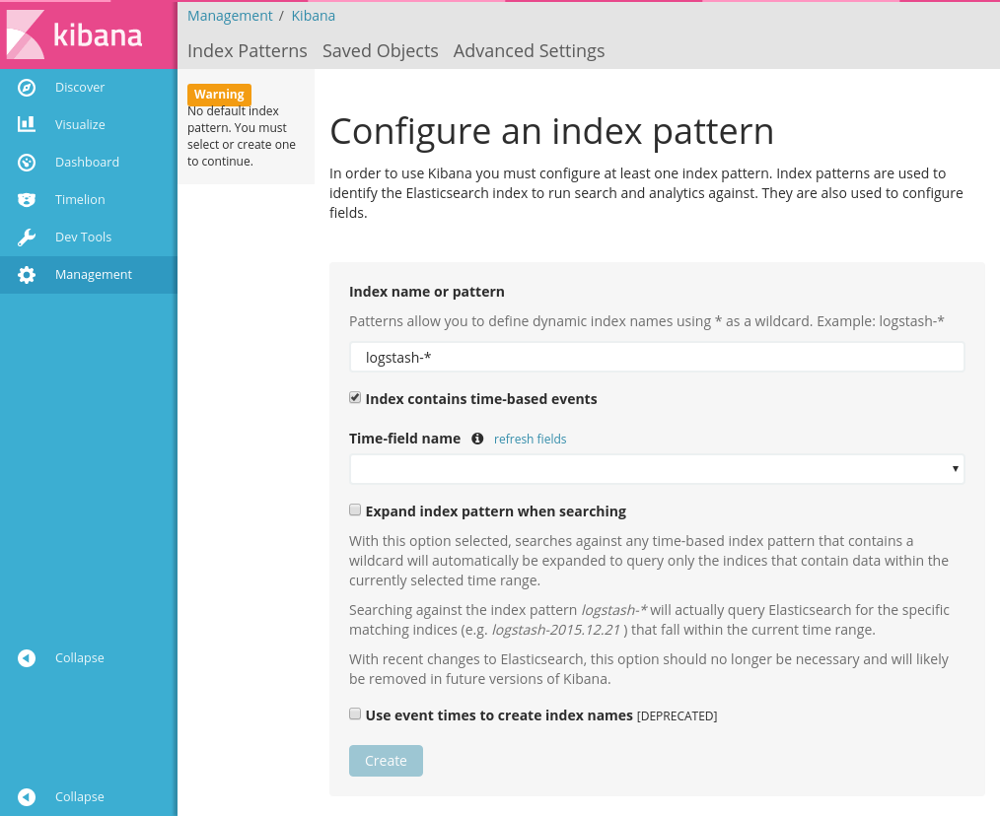

用户可以执行以下命令获得其他服务的proxy地址  

```shell
kubectl cluster-info
```

用户需要导入以下index来获取所需数据。数据都是以时间为基准，需要输入index名称的匹配模式和数据的时间戳．输入index匹配模式后，在时间戳下拉框中选择对应的字段然后点击创建即可。  

| index                 | timestamp                  |
| --------------------- | -------------------------- |
| heapster-cpu-*        | CpuMetricsTimestamp        |
| heapster-memory-*     | MemoryMetricsTimestamp     |
| heapster-filesystem-* | FilesystemMetricsTimestamp |
| heapster-network-*    | NetworkMetricsTimestamp    |
| logstash-*            | @timestamp                 |


具体配置请参考[官方文档](https://www.elastic.co/guide/en/kibana/current/discover.html)

heapster的数据结构可以访问 http://客户端节点ip:8001/api/v1/proxy/namespaces/kube-system/services/elasticsearch-logging/_cat/indices 获得。  

我们提供了一些预置的模板，可以在[这里](_images/export.json)下载。  

主要的timeline查询如下  

```Text
.es(index='heapster-cpu-*',q="MetricsTags.type:node",split='MetricsTags.host_id:10',timefield='CpuMetricsTimestamp',kibana=true,metric="max:Metrics.cpu/node_utilization.value")
```

heapster-cpu- 是 heapster-的别称。可以通过_type来加以区分。
MetricsTags.type:node是不同类型实体的标记（例如 pod， node等）
用户可以先将同一类型数据找出，然后按照需要构建查询。并绘出图表。

### Kubernetes集群监控及应用监控

监控集成了 prometheus，Service 服务采用了 NodePort 的部署方式，用户可以访问除客户端节点外的任意节点的30000端口来访问 prometheus 的Web界面。如可以访问 http://\<主节点IP\>:30000/  

prometheus 可以通过其自身的 Kubernetes service discovery 机制来自动发现需要采集数据的 targets。可以在 Web 界面上看到已发现的 target,如下图所示:    

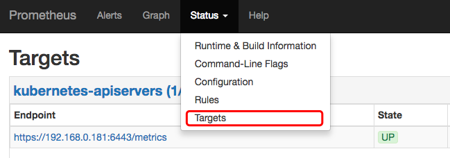  

每个target会以prometheus所定义的描述格式提供监控数据。描述格式请参考[官网](https://prometheus.io/docs/instrumenting/exposition_formats/)。  

通过采集 target 所提供的监控数据即可在prometheus所提供的Web界面中绘制出图。点击菜单栏的 "Graph" 按钮，进入绘图界面，如下图所示。  

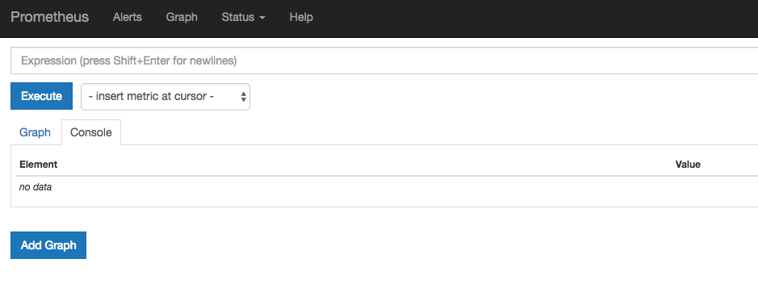  

例如我们可以输入如下的表达式来查看 prometheus 所启动的 container 的内存使用情况，如下图所示:  

```prome
container_memory_usage_bytes{pod_name="prometheus-0",container_name="prometheus"}
```

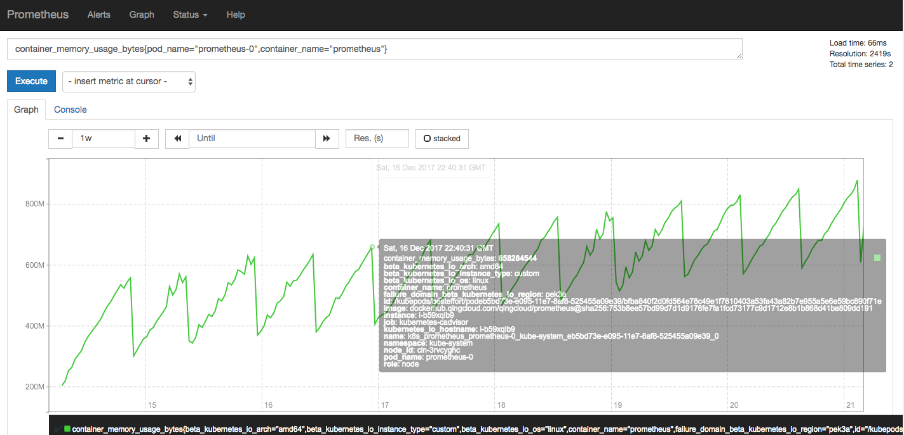  

更多的 prometheus 表达式规则请查看[官方文档](https://prometheus.io/docs/prometheus/latest/querying/basics/)  

### Kubernetes 包管理器 Helm

启用helm后，在客户端节点中用户可以使用helm给集群安装应用。默认的helm仓库使用gce的对象存储服务(国内不可访问)。青云提供了以下仓库给用户使用。因为gcr.io国内不可访问，helm charts中定义的镜像如果引用了gcr.io的镜像会导致镜像拉取失败。**使用helm时，请确保集群能够访问公网。**

|仓库|地址|
stable| https://helm-chart-repo.pek3a.qingstor.com/kubernetes-charts/
incubator| https://helm-chart-repo.pek3a.qingstor.com/kubernetes-charts-incubator/
svc-catalog-charts| https://helm-chart-repo.pek3a.qingstor.com/svc-catalog-charts/

可以先检查tiller服务和客户端是否可用

```shell
$ helm version
Client: &version.Version{SemVer:"v2.0.0-alpha.4", GitCommit:"db...", GitTreeState:"dirty"}
Server: &version.Version{SemVer:"v2.0.0-alpha.4", GitCommit:"a5...", GitTreeState:"dirty"}
```

查看仓库列表

```shell
$ helm repo list
NAME           	URL
stable         	https://helm-chart-repo.pek3a.qingstor.com/kubernetes-charts/
local          	http://localhost:8879/charts
```

更新仓库列表

```shell
$ helm repo update
```

查找charts

```shell
$ helm search
NAME                 	VERSION 	DESCRIPTION
stable/drupal   	0.3.2   	One of the most versatile open source content m...
stable/jenkins  	0.1.0   	A Jenkins Helm chart for Kubernetes.
stable/mariadb  	0.5.1   	Chart for MariaDB
stable/mysql    	0.1.0   	Chart for MySQL
```

安装应用,此处以mysql为例

```shell
$ helm install stable/mysql
Released smiling-penguin
```

查看版本

```shell
$ helm ls
NAME             VERSION   UPDATED                   STATUS    CHART
smiling-penguin  1         Wed Sep 28 12:59:46 2016  DEPLOYED  mysql-0.1.0
```

删除版本

```shell
$ helm delete smiling-penguin
Removed smiling-penguin
```

---

## 在线伸缩

### 增加节点

当 Kubernetes 需增加节点以应付应用逐步增多带来的压力，您可以在 Kubernetes 详细页点击“新增节点”按钮。添加成功详情页会显示服务状态为活跃。

### 删除节点

当客户端连接并不多的时候您也可以在 Kubernetes 详细页选中需要删除的节点，然后点“删除”按钮删除节点，以节省资源和费用。

### 垂直扩容

如果需要给节点增强配置或降低配置，可以使用扩容集群的功能。  


可以在接下来的界面中调整不同角色的容量。  
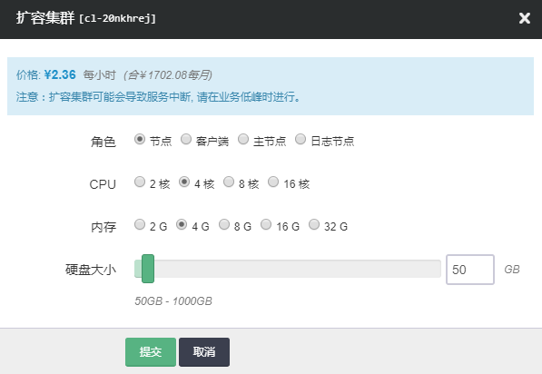

## Kubernetes 和 QingCloud IaaS 的整合

### 负载均衡器

Kubernetes on QingCloud 支持将 Kubernetes 内部的服务和 QingCloud IaaS 的负载均衡器关联起来，通过负载均衡器将服务暴露给集群外部调用。

Service 的 type 设置为 LoadBalancer，然后在 metadata 中增加以下 annotations:

1. service.beta.kubernetes.io/qingcloud-load-balancer-type ，负载均衡器的承载能力类型，和 [create_loadbalancer](https://docs.qingcloud.com/product/api/action/lb/create_loadbalancer.html) 接口中的 loadbalancer_type 取值范围相同。
2. service.beta.kubernetes.io/qingcloud-load-balancer-eip-ids ，负载均衡器上绑定的 eip ID，最多支持4个，这个 annotation 表示要创建的是 “公网” 类型的负载均衡器。 eip 必须是可用的 eip，系统会自动创建负载均衡器。
3. service.beta.kubernetes.io/qingcloud-load-balancer-vxnet-id ，负载均衡器要加入的私有网络 ID，表示要创建的是“私网” 类型负载均衡器。

qingcloud-load-balancer-eip-ids 和 qingcloud-load-balancer-vxnet-id 根据负载均衡器的"公网"或者"私网"二选一即可。如果指定了 LoadBalancer 的 Service，但没有配置 annotations 或者 annotations 下面没有具体的负载均衡器的参数，则会默认创建“私网”类型的负载均衡器，并关联当前 Kubernetes 集群所在的私网。

整体如下面的例子：

```yaml
apiVersion: v1
kind: Service
metadata:
  name: helloworld
  annotations:
    service.beta.kubernetes.io/qingcloud-load-balancer-eip-ids: "eip-xxxx"
    service.beta.kubernetes.io/qingcloud-load-balancer-type: "0"
spec:
  ports:
    - port: 80
      targetPort: 80
  selector:
    app: helloworld
  type: LoadBalancer
---
apiVersion: v1
kind: Service
metadata:
  name: helloworld-internal
spec:
  ports:
    - port: 80
      targetPort: 80
  selector:
    app: helloworld
  type: LoadBalancer
```

可以看到 helloworld-internal 没有指定 qingcloud-load-balancer-eip-ids 和 qingcloud-load-balancer-vxnet-id，所以默认创建"私网"类型的负载均衡器，并使用当前集群所在的私网。

通过 kubectl 可以查看 service 的状态：

```shell
kubectl get service

NAME                  CLUSTER-IP     EXTERNAL-IP     PORT(S)        AGE
helloworld            10.96.146.44   139.198.0.55    80:30760/TCP   3d
helloworld-internal   10.96.145.22   192.168.0.5     80:30221/TCP   3d
```

公网的负载均衡器的 EXTERNAL-IP 显示的是负载均衡器绑定的 eip 的 ip 地址，私网负载均衡器的 EXTERNAL-IP 显示的是均衡器的私网 ip。
如配置了多个 port（监听器），则须给每个 port 指定 name 参数，否则 Service Spec 文件会验证失败导致无法部署 service。

### 存储

Kubernetes on QingCloud 支持将 QingCloud IaaS 上的硬盘直接挂载到 pod 上作为 PersistentVolume，当 pod 迁移时，硬盘会自动随着 pod 迁移到其他主机上。

定义 PersistentVolume 时，在 spec 中增加 qingCloudStore，有两个属性

1. volumeID 您在青云控制台上创建一块硬盘，然后将硬盘 ID 复制到 这里。
2. fsType 该硬盘挂载后的文件系统格式。

整体如下面的例子：

```yaml
kind: PersistentVolume
apiVersion: v1
metadata:
  name: qingcloud-pv
  labels:
    type: qingcloud
spec:
  capacity:
    storage: 10Gi
  accessModes:
    - ReadWriteOnce
  qingCloudStore:
        volumeID: vol-xxxxx
        fsType: ext4
```

在 pod 中使用的例子（Kubernetes1.5）：

```yaml
apiVersion: v1
kind: Pod
metadata:
  name: test-pd
spec:
  containers:
  - image: dockerhub.qingcloud.com/docker/nginx
    name: test-container
    volumeMounts:
    - name: html-volume
      mountPath: "/usr/share/nginx/html"
  volumes:
  - name: html-volume
    qingCloudStore:
      volumeID: vol-xxxxx
      fsType: ext4
```

在 pod 中使用的例子（Kubernetes1.7）：

```yaml
apiVersion: v1
kind: Pod
metadata:
  name: test-pd
spec:
  containers:
  - image: dockerhub.qingcloud.com/docker/nginx
    name: test-container
    volumeMounts:
    - name: html-volume
      mountPath: "/usr/share/nginx/html"
  volumes:
  - name: html-volume
    flexVolume:
      driver: "qingcloud/flex-volume"
      fsType: "ext4"
      options:
        volumeID: "vol-xxxx"
```

#### 使用 PersistentVolumeClaim

通过上面的例子可以看出来，要使用 PersistentVolume 需要预先创建好硬盘，并且配置文件和具体的资源绑定了，不方便迁移。为了解决这个问题 Kubernetes 提供了 PersistentVolumeClaim，只需要声明 PersistentVolume 需求，创建和回收 volume 交给系统。

定义 StorageClass:

```yaml
kind: StorageClass
apiVersion: storage.k8s.io/v1beta1
metadata:
  name: qingcloud-storageclass
  labels:
      addonmanager.kubernetes.io/mode: EnsureExists
  annotations:
      storageclass.beta.kubernetes.io/is-default-class: "true"
provisioner: kubernetes.io/qingcloud-volume
```

定义 PersistentVolumeClaim

```yaml
kind: PersistentVolumeClaim
apiVersion: v1
metadata:
  name: qingcloud-pvc
  annotations:
    volume.beta.kubernetes.io/storage-class: qingcloud-storageclass
    kubernetes.io/fsType: xfs
spec:
  accessModes:
    - ReadWriteOnce
  resources:
    requests:
      storage: 10Gi
```

qingcloud-storageclass 已经在 Kubernetes on QingCloud 内置，所以不需要用户自己配置，同时 qingcloud-storageclass 是默认的 storageclass，所以 PersistentVolumeClaim 中的 annotations volume.beta.kubernetes.io/storage-class: qingcloud-storageclass，也可以省略，使用默认的文件系统类型 ext4 则可省略 kubernetes.io/fsType 的定义。更完整的例子参看后面教程中的 wordpress 例子。

**默认的 qingcloud-storageclass 使用的是性能盘或者超高性能盘，取决于集群主节点选择的主机的资源类型(性能型或者超高性能型)，系统会自动根据主机类型进行创建。所以有一个要求就是集群中的所有节点都必须选择一致的资源类型，如果使用混合型节点，则这种挂载 volume 的 pod 需要调度到和主节点类型一致的工作节点上**。  

如果想使用容量盘，只需要指定 storage-class 为 qingcloud-storageclass-capacity。
可以通过

```shell
kubectl get storageclass

NAME                               TYPE
qingcloud-storageclass (default)   kubernetes.io/qingcloud-volume
qingcloud-storageclass-capacity    kubernetes.io/qingcloud-volume
```

命令查看系统中已有的 storageclass，也可以定义自己的 storageclass。

>注意：无论是性能盘还是容量盘，volume 的 acccessModes 请设置为 **ReadWriteOnce**

### 网络

Kubernetes on QingCloud 容器网络使用的是 SDN Passthrough 方案，每个 pod 分配的 ip 和主机是同一个 vpc 下的 ip。所以部署容器的时候，会在控制台看到挂载网卡的任务提示出现。这种网络方案让 pod 和主机使用同一层的网络，避免了性能损失，但也有一些限制需要了解：

1. 每个主机当前最多支持 64 个网卡，所以 Kubernetes on QingCloud 限制每个节点上最多 60 个pod。
2. 每个私有网络是一个 C 段地址，只能支持 200 多个 ip 地址，所以如果集群要支持更多的 pod，创建时需要添加多个私有网络 ID。

## 教程

1. [使用 QingCloud LoadBalancer 部署 Helloworld Service](tutorials/helloworld.html)
2. [使用 QingCloud LoadBalancer 以及 PersistentVolumeClaim 部署 Wordpress](tutorials/wordpress.html)

### 更多示例

在  [Kubernetes on QingCloud github 仓库](https://github.com/QingCloudAppcenter/kubernetes/tree/master/sample) 中包含更多使用青云磁盘，负载均衡器的配置文件。

    kubectl apply -f xxxx.yaml


## 注意事项

1. VPC 的地址范围请不要选择 172.17.0.0/16 这个段，因为这个 docker 默认使用这个段，使用这个段会导致网络问题。  
2. 所有节点的主机资源类型请保持一致，要么都是性能型，要么都是超高性能型。  
3. 节点监控界面中包含当前节点运行的 pod 数量和容器数量。  
4. 由于需要调用 QingCloud IaaS API 以及拉取镜像，请确保集群所在私网能够访问公网（**VPC 绑定了公网 IP**)。  
5. 私有网络负载均衡器的 vxnet 请选择 kubernetes 集群所在的 vxnet，不要和 pod 的 vxnet 混用。  
6. 如果既部署了日志节点又依赖了外部 ELK 集群，则优先使用自带的日志服务，如果依赖了外部 ELK App 集群，又在环境变量中指定了 Elastic Search 服务器，则优先使用 ELK App 集群。  
7. 更多 Kubernetes 的使用方法请参考 [ Kubernetes 官方文档](https://kubernetes.io/docs/home/)。  

## FAQ

### 如何在集群外部访问 Kubernetes 内的 service？

主要有两个方案：

1. 将 service 通过 LoadBalancer 暴露出来，如果只是私网内使用可以用私网的负载均衡器。这个方案比较通用，建议正式场景使用这个方案。
2. 设置一条路由，将发给 cluster-ip 的数据包都转发给集群的某个节点(包括 master)。这个相当于将该节点作为网关来转发给 cluster-ip 的数据包。如果还想通过域名访问，可以设置 dns。这个方案不建议作为正式的机制使用。

```shell
    ip route add 10.96.0.0/16 via $cluster_node_ip
```

```reStructuredText
   	nameserver 10.96.0.10
    search default.svc.cluster.local svc.cluster.local cluster.local
```


### 集群为什么启动失败或者超时，不能正常工作

1. 确认 VPC 是否绑定了公网。
2. 确认您的 API 密钥是否填写正确。

如果以上两项都没有问题，请提交工单和我们联系。

### 负载均衡器（LoadBalancer）为什么不能正常工作

1. 确认 Service 可以通过 Cluster IP 访问。

2. 确认 Service 可以通过 NodePort 访问。

3. 如果是私有网络的负载均衡器，请确认负载均衡器的私有网络ID（vxnet）没有复用 pod 所在的私有网络。

4. 如果使用的是 80 端口，请确认您的账号通过了[账号认证](https://docs.qingcloud.com/product/faq/#%E4%B8%BA%E4%BB%80%E4%B9%88-80-%E7%AB%AF%E5%8F%A3%E8%A2%AB%E7%A6%81%E7%94%A8)（最好 IP 通过备案）。

### 如何在应用中输出 json 格式的日志，并被 Elasticsearch 按字段索引

Kubernetes On QingCloud 的 fluent-bit 服务默认开启了 json 格式探测设置，如果应用输出的日志是 json 字符串，会自动解析为 json 并展开，索引到 Elasticsearch 中。
注意：

1. 必须整条日志都是 json 才可以，日志库会自动增加时间等信息，导致输出不是完整的 json，可以直接用各语言的输出到控制台的类库进行日志输出。
2. 具体可参考 [helloworld 例子](tutorials/helloworld.html)中的日志输出。

### 如何自定义处理 Kubernetes 以及应用的日志？

Kubernetes On QingCloud 提供了日志收集功能，自动将应用的日志收集到 Elasticsearch 中进行存储，并提供 Kibana 进行查询，但有时候用户需要对日志进行自定义处理。我们提供了配置项，用户可以将日志转发到自己的日志收集服务，当前支持 [Fluent 或者 Fluent-bit](http://fluentbit.io/documentation/0.12/output/forward.html)。我们提供了一个 fluent-bit 的 [示例](https://github.com/QingCloudAppcenter/kubernetes/tree/k8s-1.7/sample/fluentbit) ，可以直接在集群客户端节点上运行查看效果，具体步骤：

1. 登陆客户端节点，启动 fluent-bit forward server

  ```console
  		cd /opt/kubernetes/sample/fluentbit/
  		sh run.sh
  ```

2. 修改集群配置中的 fluent 转发服务，填入 clientip:24224
    系统会自动逐台重启 fluent-bit agent，等一会就会在控制台看到转发过来的日志。

注意：如果开启了这项设置，请确保日志转发服务能正常工作，否则会影响 fluent-bit agent 的日志收集。

### 日志不能被收集怎么办？

如果发现应用的日志没有被收集到系统内置的 Elasticsearch 中或者自己的转发服务中，可能是 fluent-bit agent 出问题了。可以执行以下命令，将 fluent-bit 的 daemonset 删除，触发系统重新部署。


```  console
kubectl delete ds/fluent-bit -n kube-system
```

### 如何使用私有仓库

 Kubernetes on QingCloud 支持使用用户想使用自己部署的 registry 服务

1. 如果私有 registry 服务没有启用 https，则需要将 registry 的 ip:port 填写到集群设置的 Insecure registries 设置选项里。

2. 如果私有仓库需要用户名密码验证，当前尚未提供添加第三方集群的 registry 账号的机制，不过可以通过 Kubernetes 的 secret 机制来管理 registry 账号。

具体的操作步骤：

1. 创建 secret，根据自己的情况修改 myregistrykey 和 myregistryserver

   ```console
   kubectl create secret docker-registry myregistrykey --docker-username=username --docker-password=password --docker-email=email --docker-server=myregistryserver.com
   ```

2. 通过 imagePullSecrets 在配置文件中引用

  ```yaml
  apiVersion: v1
  kind: Pod
  metadata:
      name: private-reg
    spec:
      containers:
        - name: private-reg-container
      image: <your-private-image>
      imagePullSecrets:
        - name: myregistrykey
  ```


## 版本历史  

### 2.8.1  
* 升级 Kubernetes 至 1.10.5  
* 集成了 KubeSphere 易捷版 1.0.0 alpha (kubesphere.io，k8s 发行版)  
* 增加 calico 网络插件支持  
* proxy mode 改为 ipvs   
* 修正了存储插件以及 cloud controller 插件的bug  
* helm 升级至 2.9.1  
* istio升级至 0.8.0  
* 增加 docker 网桥网络配置  
* 集成 nfs client  
* 修正了客户端节点 ssh key 绑定后被重置的 bug  
* 其他若干细节调整  

### 2.7.2  
* hot fix: 解决私有云无外网连接条件下 heapster 镜像拉取问题  
* 提供预制资源配置组方式以及自定义方式配置节点资源，性能型工作节点标记为 node，超高性能型节点标记为 ssd_node  
* 增加 nodePort 端口范围参数，默认值为 30000-32767  k
* helm 升级为 2.8.2  
* istio 升级为 0.7.1  

### 2.7.1  
* 可选依赖appcenter提供的外部etcd集群，提高k8s集群管理数据可靠性。  
* 添加helm支持。用户可以使用helm部署应用。  
* 修复volume（v1.3.1）和cloud controller(v1.1.1)插件的问题。  
* 通过client节点ssh免密登录其他节点。  
* 单节点max-pods上限可配置。  

