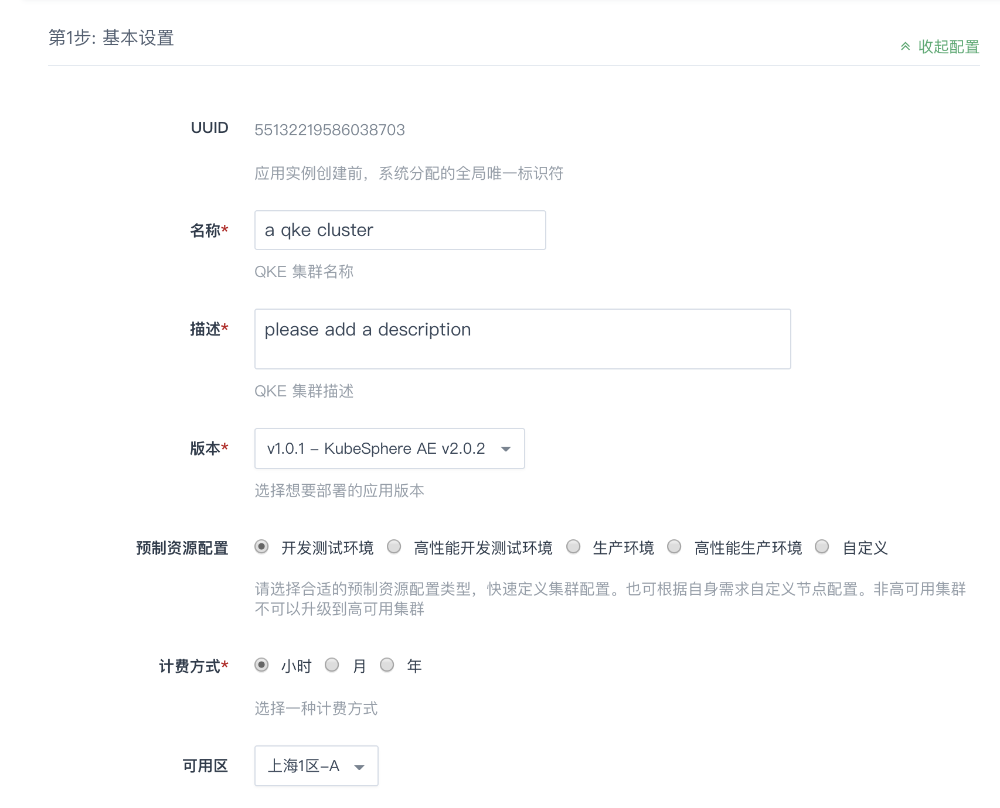
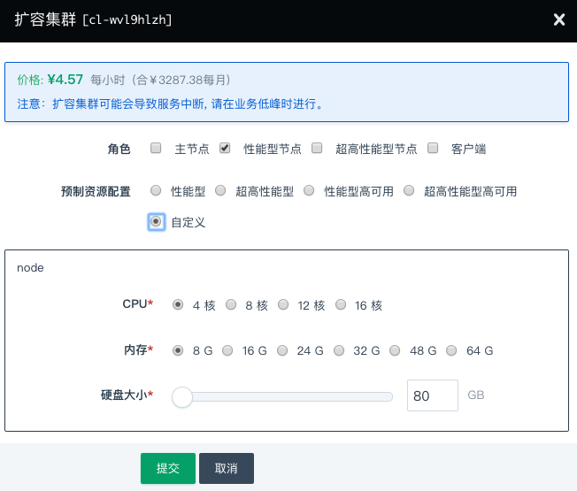
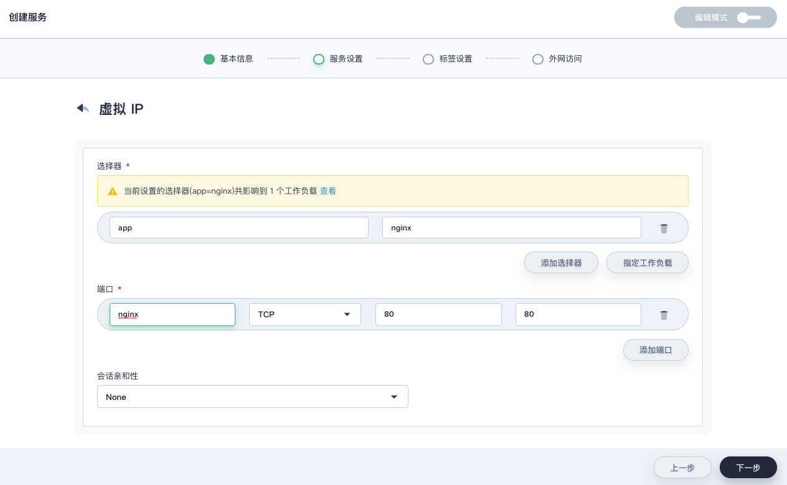
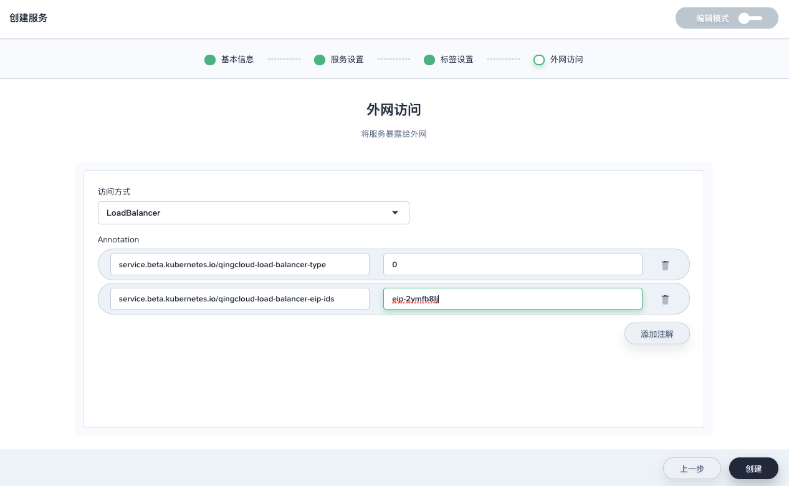
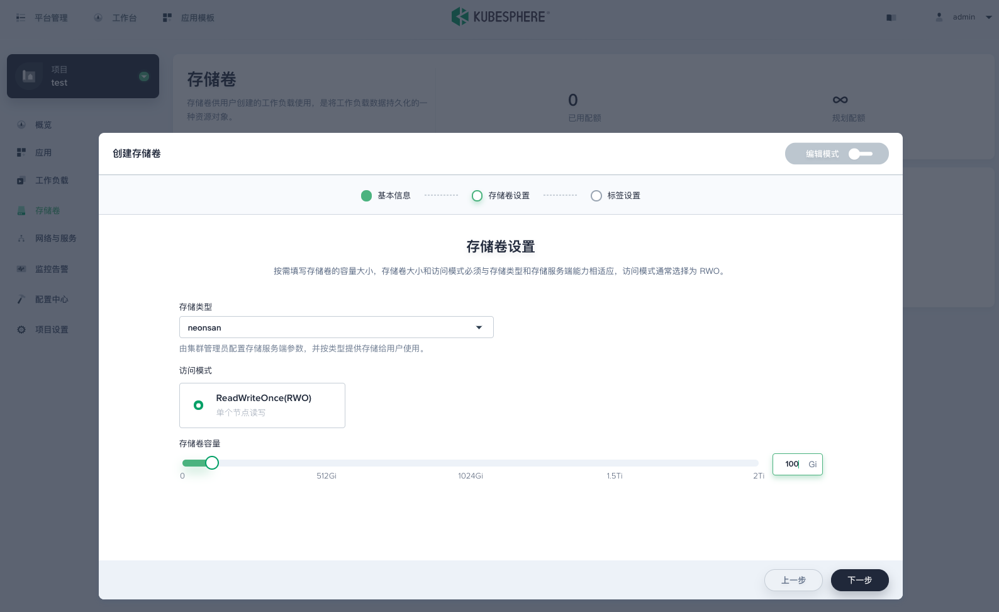

---
---

# KubeSphere®️（QKE） 用户指南

## 简介

QingCloud Kubernetes Engine (QKE) 服务旨在方便用户在青云平台搭建 KubeSphere 集群。KubeSphere 是在目前主流容器调度平台 Kubernetes 之上构建的企业级分布式多租户容器管理平台，帮助企业轻松应对多租户、工作负载和集群管理、服务与网络管理、应用管理、镜像仓库管理和存储管理等业务场景。

## 创建 QKE 

在青云上，您可以很方便的创建和管理一个 QKE 集群。支持横向在线伸缩，同时具有自我诊断功能，即当系统发现某节点坏死时在控制台显示状态。 另外我们还提供了监控告警等功能来帮助您更好的管理集群。集群将运行于私有网络内，结合青云提供的硬盘，在保障高性能的同时兼顾您的数据安全。

### 准备工作

为了保障数据安全， QKE 集群需要运行在受管私有网络中。所以在创建一个 QKE 集群之前，需要创建一个 VPC 和一个受管私有网络， 若还未创建请参考[创建 VPC](https://docs.qingcloud.com/product/network/vpc) 和[创建私有网络](https://docs.qingcloud.com/product/network/appcenter_network_config/create_vxnet)。受管私有网络需要加入 VPC，并开启 DHCP 服务（默认开启）。如果 VPC 选择 172.30.0.1/16，那需要修改docker默认网段，避免冲突。 

预先创建 API 密钥。

至少有 230GB，14块的硬盘配额。硬盘的类型与 QKE 集群主机类型一致。

当要创建高可用的集群时，需要 1 个负载均衡器配额，1 个防火墙配额。

当要通过 EIP 暴露 KubeSphere Console 时，需要 1 个额外的负载均衡器配额，1 个额外的防火墙配额。

### 选择基本配置

在创建的对话框中，您需要填写名称 (可选)，选择 QKE 版本号以及选择计费方式。 



#### 节点资源配置

我们提供了**四种默认资源配置组**：
- 开发测试环境配置组都是用性能型主机及存储，计算节点标记 Role 为 node_perf。
- 高性能开发测试环境配置组都为超高性能型主机及存储，计算节点标记 Role 为 node_super_perf。
- 生产环境配置组都是用性能型主机及存储，计算节点标记 Role 为 node_perf。
- 高性能生产环境配置组都为超高性能型主机及存储，计算节点标记 Role 为 node_super_perf。

用户也可根据自身需求选择自定义方式配置节点，但由于创建挂盘的是和主节点类型一致的，所以，对于有挂盘的资源，请配置正确的调度策略调度到和主节点类型一致的计算节点上，比如：主节点为超高性能型主机，Mysql 使用挂盘，则需调度这个 Pod 到 超高性能型节点。创建自定义 QKE 集群计算节点个数要大于等于 2 个，类型与主节点一致。

如选择自定义方式，请根据需要选择 Kubernetes 主节点，性能型节点，超高性能型节点的 CPU、节点配置和数量、下图以主节点为例。集群主机资源类型请保持一致，要么都是性能型，要么都是超高性能型。


#### 网络设置

选择集群主机所在的私网，私网需要在创建集群前准备好。  


#### 依赖服务设置

QKE 集群的状态数据默认存储在主节点的 etcd 应用中，同时用户可以选择预先部署 [etcd on QingCloud](https://appcenter.qingcloud.com/apps/app-fdyvu2wk) v3.2.24 以上版本，在此处选择其为 QKE 集群的依赖服务，为了便于扩容，推荐添加依赖的 ELK 服务，**注意：etcd 集群必须和 QKE 集群在同一 VPC 下。**  如果此 VPC 内无可用 etcd 集群，可以在 QKE 创建界面快速创建 etcd 集群。

QKE 集群的日志组件默认存储在集群内置的 ES 应用中，同时用户可以选择预先部署 [ELK on QingCloud](https://appcenter.qingcloud.com/apps/app-p6au3oyq/ELK) v5.5.1 以上版本，在此处选择其为 QKE 集群的依赖服务，为了更强性能，推荐添加依赖的 etcd 服务，**注意：ELK 集群必须和 QKE 集群在同一 VPC 下。**  如果此 VPC 内无可用 ELK 集群，可以在 QKE 创建界面快速创建 ELK 集群。


#### 服务环境参数设置

* 为了更好地与青云基础设施集成，QKE 需要使用您的 API 密钥来调用 QingCloud IaaS API。请在控制台生成[密钥](https://console.qingcloud.com/access_keys/)。  


* 其他可以设置的参数
  - 安装 KubeSphere：选择是否安装 KubeSphere，如果不安装 KubeSphere，KubeSphere 配置项不生效。
  - KubeSphere 控制台绑定的 EIP：KubeSphere 配置项，选择可用 EIP，可通过此 EIP 直接访问 KubeSphere 控制台
  - Kubernetes EIP 地址：点分十进制格式写 EIP 地址，可通过此 EIP 远程访问 Kubernetes 集群资源，用户确保此 EIP 与 Kubernetes Apiserver 连通性。
  - Pod 网段：Pod IP 地址范围
  - Service 网段：Service IP 地址范围
  - API External Domain：集群的域名
  - 节点端口范围：NodePort 端口范围
  - Max Pods： 每个工作节点（计算节点）上可运行的最大 pod 数量, k8s 官方的每节点推荐 Pod 数 100 个左右
  - 选择网卡插件：支持 Calico 和 Flannel
  - Proxy Mode：Kube Proxy 运行方式，支持 ipvs 和 iptables

  - 主机 hosts 记录：在 Node 中设置 hosts 记录，多条记录用逗号分割
  - Registry mirrors：镜像服务地址，多个记录用 1 个空格分割
  - Insecure registry：需要通过非安全的方式 HTTP 和不受信任的 HTTPS 访问的 Docker 仓库，多个记录用空格分割
  - Docker 网桥的 IP 地址和子网掩码：Docker 网桥的 IP 地址和子网掩码


* 日志和清理设置
  - Kubernetes 日志级别：Kubernetes 的日志级别，数字越大记录越详细，也会占用更多日志空间
  - 日志保留天数：KubeSphere 配置项，每隔多少日清理日志，0表示不清理日志 (范围: 0 - 30)
  - 设置审计日志规则文件路径：设置审计日志规则文件路径，路径为空不记录审计日志，预置默认审计日志规则文件路径：/etc/kubernetes/audit/default-audit-policy-file.yaml
  - 审计日志保留天数：每隔多少日清理审计日志，0表示不清理审计日志 (范围: 0 - 30)
  - Docker 清理天数：每隔多少日清理 Docker，0表示不清理 Docker 无用数据 (范围: 0 - 30)


### 创建成功

当 QKE 创建完成之后，您可以查看每个节点的运行状态。当节点的服务状态显示为“正常”状态，表示该节点启动正常。 当每个节点都启动正常后 QKE 集群显示为“活跃”状态，表示您已经可以正常使用 QKE 服务了。

## 测试 QKE

### 使用客户端节点

QKE 集群创建完成之后可以进行测试，创建集群大概需要 8 分 30 秒。找到客户端节点，点击 vnc 图标。

使用 **root/k8s** 登录。首次登录需要修改密码。登录客户端节点后可以通过 ssh 免密登录其他计算节点。 
	
  

执行  

```shell
kubectl get pods --all-namespaces
```

程序返回所有 pod 状态，整个集群工作正常。

### 使用 QKE

QKE v1.0.1 - KubeSphere Advanced Edition v2.0.2 含有 KubeSphere Advanced Edition v2.0.2 是基于 Kubernetes v1.13.5。 更加详细的说明文档您可以参看 [KubeSphere v2.0.2 说明文档](https://kubesphere.io/docs/advanced-v2.0/zh-CN/release/release-v202/)。

集群创建完成后，确认 KubeSphere 的后端都已正常运行。
```shell
# kubectl get po -n kubesphere-system
NAME                                     READY   STATUS      RESTARTS   AGE
ks-account-c6dbfbdbb-7l8td               1/1     Running     2          43m
ks-apigateway-7bb9bccc6d-ghpkp           1/1     Running     0          43m
ks-apiserver-769d57ddbc-mj79h            1/1     Running     0          41m
ks-console-f5bf76dd4-qqmkh               1/1     Running     0          42m
ks-console-f5bf76dd4-xfrj6               1/1     Running     0          42m
ks-controller-manager-6fb548b8dc-qqcd8   1/1     Running     0          43m
ks-docs-77c4796dc9-sjsdh                 1/1     Running     0          42m
kubesphere-installer-79k96               0/1     Completed   0          44m
openldap-84857748b4-4pv89                1/1     Running     0          43m
redis-78ff75bddc-rcrtp                   1/1     Running     0          43m
```

#### 通过 EIP 访问 Kubernetes 资源

通过 EIP 访问 Kubernetes 资源需要 Kubernetes Apiserver 证书添加 EIP 记录，并且确保 EIP 能够访问到 Kubernetes Apiserver。用户需要 1. 在 QKE 配置 Kubernetes EIP 地址，2. 确保 EIP 与 Kubernetes Apiserver 相连通，3. 修改 kubeconfig 中 server 字段的值。

> 此示例中，VPC 绑定的 EIP 为 139.198.190.141

##### 在 QKE 配置 Kubernetes EIP 地址

QKE 的 Kubernetes EIP 地址可以在 QKE 创建时指定，也可以在 QKE 运行时更新。运行时修改 QKE 的 Kubernetes EIP 地址会造成 Kubernetes Apiserver 重启，不建议频繁更新。


##### 确保 EIP 与 Kubernetes Apiserver 相连通

提供通过 VPC 端口转发和通过负载均衡器 2 种示例方法，确保 EIP 与 Kubernetes Apiserver 6443 端口相连通。

- 通过 VPC 端口转发

对于 QKE 所在 VPC 绑定了 EIP 可以采用此方法。

找到访问 Kubernetes Apiserver 的私有网络 IP 地址。对于一个主节点的 QKE，到 QKE 详情页查询 QKE 主节点私有网络 IP 地址。

对于高可用的 QKE，访问 Kubernetes Apiserver 的私有网络 IP 地址应为 QKE 创建时创建的私有网络负载均衡器的 IP，负载均衡器名为 QKE 集群 ID。


VPC 配置转发规则，源端口可以根据用户实际情况配置，内网 IP 为访问 Kubernetes Apiserver 的私有网络 IP 地址，内网端口为 6443，
> 此示例中 VPC 端口转发源端口为 16443


打开 VPC 网络绑定的防火墙下行端口，


- 通过负载均衡器

对于有负载均衡器访问到 QKE Kubernetes Apiserver 可以采用此方法。
将外部绑定类型 EIP 绑定至负载均衡器。


##### 修改 kubeconfig 中 server 字段的值
确保用户本地主机主机可访问 EIP。

- 在 Kubeconfig 标签页将 QKE 的 Kubernetes Kubeconfig 拷贝到用户本地主机


- 通过 VPC 端口转发，server 的值应设置为 `https://VPC绑定EIP: VPC端口转发源端口`。示例为 `https://139.198.190.141:16443`。

```shell
$ cat admin.conf
apiVersion: v1
clusters:
- cluster:
    certificate-authority-data: ...
    server: https://139.198.190.141:16443
  name: kubernetes
contexts:
- context:
    cluster: kubernetes
    user: kubernetes-admin
  name: kubernetes-admin@kubernetes
current-context: kubernetes-admin@kubernetes
kind: Config
preferences: {}
users:
- name: kubernetes-admin
  user:
    client-certificate-data: ...
```

```shell
$ kubectl get no --kubeconfig admin.conf 
NAME         STATUS    ROLES             AGE       VERSION
i-2h8z0yah   Ready     master            1h        v1.13.5
i-fkrjiogt   Ready     master            1h        v1.13.5
i-hxvba1qe   Ready     node_super_perf   1h        v1.13.5
i-jnvuwr6t   Ready     master            1h        v1.13.5
i-ktdt8pwe   Ready     node_super_perf   1h        v1.13.5
i-z8rbb2qt   Ready     node_super_perf   1h        v1.13.5
```

- 通过负载均衡器, server 的值应设置为 `https://负载均衡器绑定EIP: 6443`。示例为 `https://139.198.186.186:6443`。

```shell
$ cat admin.conf
apiVersion: v1
clusters:
- cluster:
    certificate-authority-data: ...
    server: https://139.198.186.186:6443
  name: kubernetes
contexts:
- context:
    cluster: kubernetes
    user: kubernetes-admin
  name: kubernetes-admin@kubernetes
current-context: kubernetes-admin@kubernetes
kind: Config
preferences: {}
users:
- name: kubernetes-admin
  user:
    client-certificate-data: ...
```

```shell
$ kubectl get no --kubeconfig admin.conf 
NAME         STATUS    ROLES             AGE       VERSION
i-2h8z0yah   Ready     master            2h        v1.13.5
i-fkrjiogt   Ready     master            2h        v1.13.5
i-hxvba1qe   Ready     node_super_perf   2h        v1.13.5
i-jnvuwr6t   Ready     master            2h        v1.13.5
i-ktdt8pwe   Ready     node_super_perf   2h        v1.13.5
i-z8rbb2qt   Ready     node_super_perf   2h        v1.13.5
```

#### 访问 KubeSphere 控制台

- 对于没有设置 “KubeSphere 控制台 EIP” 参数的 QKE 集群

KubeSphere Dashboard 以 NodePort 的形式暴露在端口 30880，您可以在 VPC 上设置端口转发到任一集群节点 (非Client节点) 的此端口来访问 KubeSphere Dashboard。还需要配置的如下图所示。

> 此示例中，端口是30880，在实际使用中，您需要根据 `kubectl get svc -n kubesphere-system ks-console` 命令返回结果来查看具体端口号。


> 如果 VPC 绑定了公网 IP，用户通过公网 IP 访问 KubeSphere Dashboard 还需要配置 VPC 所绑定的防火墙的下行规则，放行通过公网 IP 对 30880 端口的访问。


配置规则保存后，您就可以使用 VPC 的公网 IP 地址来访问 KubeSphere 了，如下图


- 对于设置 "KubeSphere 控制台 EIP" 参数的 QKE 集群

可在 QingCloud 控制台 QKE 集群详情页的 "KubeSphere 控制台链接" 标签页找到 KubeSphere 控制台访问链接。


可直接单击链接访问 KubeSphere 控制台

- 登录默认账户
使用如下账户信息来登录 KubeSphere, 用户登录后务必修改登录密码！

> **用户名: admin@kubesphere.io**  
> **密码: P@88w0rd**  

## 在线伸缩

### 增加节点

当 QKE 需增加节点以应付应用逐步增多带来的压力，您可以在 QKE 详情页点击“新增节点”按钮，建议新增节点类型与集群主节点类型一致。添加成功详情页会显示服务状态为活跃。

### 删除节点

当客户端连接并不多的时候您也可以在 QKE 详情页选中需要删除的节点，然后点“删除”按钮删除节点，以节省资源和费用。此操作要保证 QKE 集群内有足够资源容纳迁移的 Pod。

#### 删除节点后挂载存储卷的容器组迁移失败问题解决办法

使用云平台硬盘作为存储服务的有状态副本集的容器组所在节点被删除后，可能会遇到此有状态副本集的容器组无法在其他节点重新创建的问题。要查看集群内被删除容器组挂载存储卷的 volumeattachment 对象是否正常清理，将此 volumeattachment 对象删除后，重新创建的容器组可以正常挂载存储卷。

- 找到无法重新创建的容器组
```
# kubectl get po -n demo-project nginx-perf-7
NAME           READY   STATUS              RESTARTS   AGE
nginx-perf-7   0/1     ContainerCreating   0          22h
```

- 查看容器组无法重新创建的原因，显示挂载存储卷失败
```
# kubectl describe po -n demo-project nginx-perf-7
...
Events:
  Type     Reason       Age                  From                 Message
  ----     ------       ----                 ----                 -------
  Warning  FailedMount  51s (x604 over 22h)  kubelet, i-e5ri86tg  Unable to mount volumes for pod "nginx-perf-7_demo-project(087b3391-8990-11e9-9b03-525433ce642d)": timeout expired waiting for volumes to attach or mount for pod "demo-project"/"nginx-perf-7". list of unmounted volumes=[nginx-neonsan-pvc]. list of unattached volumes=[nginx-neonsan-pvc default-token-znp5w]
```

- 找到未挂载上的存储卷 `nginx-neonsan-pvc-nginx-perf-7`
```yaml
# kubectl get po -n demo-project nginx-perf-7 -oyaml
...
spec:
    volumes:
      - name: nginx-neonsan-pvc
        persistentVolumeClaim:
            claimName: nginx-neonsan-pvc-nginx-perf-7
...
```

- 找到未挂载上的存储卷对应的 PV `pvc-93e24c1d88d711e9`, 到 QingCloud 控制台查看硬盘名为 `pvc-93e24c1d88d711e9` 的硬盘应为可用状态。
```
# kubectl get pvc nginx-neonsan-pvc-nginx-perf-7 -n demo-project
NAME                             STATUS   VOLUME                 CAPACITY   ACCESS MODES   STORAGECLASS   AGE
nginx-neonsan-pvc-nginx-perf-7   Bound    pvc-93e24c1d88d711e9   100Gi      RWO            neonsan        44h
```

- 找到 PV `pvc-93e24c1d88d711e9` 对应的 volumeattachment 对象名 `csi-8b2ed050e78ad6f3a5491af35c9351358856ae15cc874262ca0b78a1c332b883`
```yaml
# kubectl get volumeattachment -oyaml|grep pvc-93e24c1d88d711e9 -B 16
    apiVersion: storage.k8s.io/v1
    kind: VolumeAttachment
    metadata:
        creationTimestamp: 2019-06-07T03:52:13Z
        deletionGracePeriodSeconds: 0
        deletionTimestamp: 2019-06-09T00:47:49Z
        finalizers:
        - external-attacher/csi-qingcloud
        name: csi-8b2ed050e78ad6f3a5491af35c9351358856ae15cc874262ca0b78a1c332b883
        resourceVersion: "1178846"
        selfLink: /apis/storage.k8s.io/v1/volumeattachments/csi-8b2ed050e78ad6f3a5491af35c9351358856ae15cc874262ca0b78a1c332b883
        uid: a21a70df-88d7-11e9-aed1-525433888127
    spec:
        attacher: csi-qingcloud
        nodeName: i-5n8osu8t
        source:
            persistentVolumeName: pvc-93e24c1d88d711e9
```

- 查看未被正常清理的 volumeattachment 对象, status.detachError 显示 `node "XXX" not found`
```yaml
# kubectl get volumeattachment csi-8b2ed050e78ad6f3a5491af35c9351358856ae15cc874262ca0b78a1c332b883 -oyaml
    apiVersion: storage.k8s.io/v1
    kind: VolumeAttachment
    metadata:
        creationTimestamp: 2019-06-07T03:52:13Z
        deletionGracePeriodSeconds: 0
        deletionTimestamp: 2019-06-09T00:51:53Z
        finalizers:
        - external-attacher/csi-qingcloud
        name: csi-8b2ed050e78ad6f3a5491af35c9351358856ae15cc874262ca0b78a1c332b883
        resourceVersion: "1180401"
        selfLink: /apis/storage.k8s.io/v1/volumeattachments/csi-8b2ed050e78ad6f3a5491af35c9351358856ae15cc874262ca0b78a1c332b883
        uid: a21a70df-88d7-11e9-aed1-525433888127
    spec:
        attacher: csi-qingcloud
        nodeName: i-5n8osu8t
        source:
            persistentVolumeName: pvc-93e24c1d88d711e9
    status:
        attached: true
        detachError:
            message: node "i-5n8osu8t" not found
            time: 2019-06-09T00:52:12Z
```

- 编辑 volumeattachment 对象，删去 `finalizers` 部分
```yaml
# kubectl edit volumeattachment csi-8b2ed050e78ad6f3a5491af35c9351358856ae15cc874262ca0b78a1c332b883 -oyaml
    apiVersion: storage.k8s.io/v1
    kind: VolumeAttachment
    metadata:
        creationTimestamp: 2019-06-07T03:52:13Z
        deletionGracePeriodSeconds: 0
        deletionTimestamp: 2019-06-09T00:51:53Z
        name: csi-8b2ed050e78ad6f3a5491af35c9351358856ae15cc874262ca0b78a1c332b883
        resourceVersion: "1180401"
        selfLink: /apis/storage.k8s.io/v1/volumeattachments/csi-8b2ed050e78ad6f3a5491af35c9351358856ae15cc874262ca0b78a1c332b883
        uid: a21a70df-88d7-11e9-aed1-525433888127
    spec:
        attacher: csi-qingcloud
        nodeName: i-5n8osu8t
        source:
            persistentVolumeName: pvc-93e24c1d88d711e9
...
```

- 观察容器组状态，5 分钟左右可挂载上存储卷，没有其他问题情况下容器组可恢复运行状态
```
# kubectl get po -n demo-project nginx-perf-7
NAME           READY   STATUS    RESTARTS   AGE
nginx-perf-7   1/1     Running   0          23h
```


### 垂直扩容

如果需要给节点增强配置或降低配置，可以使用扩容集群的功能。 此操作会造成扩容节点暂时不可用，要保证 QKE 集群内有足够资源容纳迁移的 Pod。


可以在接下来的界面中调整不同角色的容量。


## 和 QingCloud IaaS 的整合

### 负载均衡器

QKE v1.0.1 - KubeSphere Advanced Edition v2.0.2 集成了 [QingCloud 负载均衡器插件 v1.3.4](https://github.com/yunify/qingcloud-cloud-controller-manager/tree/v1.3.4) 支持将 KubeSphere 内部的服务和 QingCloud IaaS 的负载均衡器关联起来，通过负载均衡器将服务暴露给集群外部调用。LB 插件具体用法请参考[文档](https://github.com/yunify/qingcloud-cloud-controller-manager/blob/v1.3.4/docs/configure.md)。根据中国大陆工信部的规定，所有在大陆境内运行的服务都必须进行 ICP 备案。只要在互联网能访问并且使用大陆公网 IP 地址的域名都需要备案。

Service 的 type 设置为 LoadBalancer，然后在 metadata 中增加以下 annotations:

1. service.beta.kubernetes.io/qingcloud-load-balancer-type ，负载均衡器的承载能力类型，和 [create_loadbalancer](https://docs.qingcloud.com/product/api/action/lb/create_loadbalancer.html) 接口中的 loadbalancer_type 取值范围相同。
2. service.beta.kubernetes.io/qingcloud-load-balancer-eip-ids ，负载均衡器上绑定的 EIP ID，最多支持4个，这个 annotation 表示要创建的是 “公网” 类型的负载均衡器。 EIP 必须是可用的 EIP，系统会自动创建负载均衡器。

整体如下面的例子：

1. QingCloud 控制台创建公网 IP。

2. 得到公网 IP 的 ID。

3. 在 KubeSphere Dashboard 创建 LoadBalancer 类型服务。



4. 通过公网 IP 访问到集群内部服务。


### 存储

QKE v1.0.1 - KubeSphere Advanced Edition v2.0.2 内置了 [QingCloud CSI v0.2.1](https://github.com/yunify/qingcloud-csi/tree/v0.2.1)，可以动态创建基于 QingCloud IaaS 上的硬盘的 PVC，并挂载到 Pod，当 Pod 迁移时，硬盘会自动随着 Pod 迁移到其他主机上。KubeSphere 的存储卷使用方法见[文档](https://docs.kubesphere.io/advanced-v1.0/zh-CN/storage/pvc/)。

#### 使用 NeonSAN 硬盘

QKE 在支持 NeonSAN 硬盘的区创建了 neonsan 存储类型，用户可以在 KubeSphere 控制台创建 NeonSAN 存储卷。

- 创建存储卷时"存储卷设置"处的存储类型选择 "neonsan" 存储类型


- 创建工作负载挂载 NeonSAN 存储卷


#### 对接 NFS 服务端

QKE 预安装了 NFS 客户端程序，用户对接 NFS 服务端时应确保 QKE 各节点有权限挂载 NFS 服务端文件夹。用户可以使用 [Kubernetes 官方方法对接 NFS 服务端](https://kubernetes.io/docs/concepts/storage/volumes/#nfs)，这是一种静态分配存储卷方法，分配和回收存储卷过程复杂，可对接多个 NFS 服务端。为了方便用户对接 NFS 服务端，QKE 预置了 [NFS 动态分配器](https://github.com/helm/charts/tree/master/stable/nfs-client-provisioner)，支持动态分配存储卷，分配和回收存储卷过程简便，可对接一个 NFS 服务端。

> 示例 NFS 服务端 IP 为 192.168.0.4，NFS 共享文件夹为 /data

- 在 QKE client 节点，执行 Helm 安装命令
```
$ helm install --name ks --set nfs.server=192.168.0.4 --set nfs.path=/data /opt/kubernetes/k8s/addons/nfs-client-provisioner/ --namespace kube-system
NAME:   ks
LAST DEPLOYED: Tue Aug  6 13:30:44 2019
NAMESPACE: kube-system
STATUS: DEPLOYED
```

- 查看 NFS 动态分配器容器组在正常运行状态
```
$ kubectl get po -n kube-system |grep nfs-client
ks-nfs-client-provisioner-cc7f5db98-c4b2m   1/1     Running   0          6s
```

- 查看 NFS 存储类型
```
$ kubectl get sc nfs-client
NAME         PROVISIONER                               AGE
nfs-client   cluster.local/ks-nfs-client-provisioner   26m
```

- 验证
可以通过动态创建 NFS 存储卷和工作负载挂载 NFS 存储卷验证

## 删除 QKE

**用户删除集群可以在 APPCenter 集群列表页选中待删除集群，在更多操作中选择删除，可删除 QKE 集群。集群删除后会进入回收站，用户可以到回收站恢复或永久删除集群，回收站中资源保存 2 小时之后会自动永久删除。集群永久删除后用户可手动删除 QKE 集群残留资源，如硬盘、负载均衡器、防火墙。**

## 关于合约价格的说明

QKE 页面上的费用预览计费仅包括集群基础资源费用。QKE 创建时会自动创建的硬盘、负载均衡器，QKE 创建时快速创建的依赖服务、公网 IP 资源费用将会另外计算。使用 QKE 时用户创建的硬盘、负载均衡器、防火墙也将另外计算。

### QKE 创建时另外计费资源

|资源|个数|说明|
|:--:|:--:|:--:|
|硬盘|14|安装 KubeSphere 会自动创建硬盘|
|负载均衡器|2|高可用集群会自动创建 1 个负载均衡器，KubeSphere 控制台通过公网 IP 暴露会自动创建 1 个负载均衡器|
|防火墙|2|高可用集群会自动创建 1 个防火墙，KubeSphere 控制台通过公网 IP 暴露会自动创建 1 个防火墙|
|依赖服务|2|快速创建外接 etcd 会创建 1 个 etcd 集群，快速创建外接 ELK 会创建 1 个 ELK 集群|


## 注意事项

1. 如果 VPC 选择 172.30.0.1/16，需要修改 Docker 默认网段，避免冲突。 
2. 所有节点的主机资源类型请保持一致，要么都是性能型，要么都是超高性能型。 
3. 添加节点请选择与主节点类型一致的主机。
4. 由于需要调用 QingCloud IaaS API 以及拉取镜像，请确保集群所在私网能够访问公网（**VPC 绑定了公网 IP**)。  
5. 私有网络负载均衡器的 vxnet 请选择 QKE 集群所在的 vxnet，不要和 Pod 的 vxnet 混用。
6. 基础网络部署请将集群缺省防火墙开通 6443 和节点端口范围（默认为 30000-32767）。
7. 如果删除 QKE 集群，集群将在回收站保留 2 小时，2 小时之后将被永久清理，需要手动删除负载均衡器、VPC 等相关资源。
8. 更多 Kubernetes 的使用方法请参考 [ Kubernetes 官方文档](https://kubernetes.io/docs/home/)。

## 版本历史

### 1.0.1
1. 基于 Ubuntu 18.04.1 LTS 64 bit 操作系统
1. 内置 KubeSphere 高级版 v2.0.2 提供 Kubernetes 管理运维、DevOps、微服务治理等功能
1. 内置 QingCloud Cloud Controller Manager v1.3.6，可自动创建云平台负载均衡器并暴露服务
1. 内置 NFS，Ceph RBD，Glusterfs 客户端程序
1. 优化 KubeSphere console 链接地址显示
1. 禁止将 Qingcloud 镜像仓库地址设置为 registry mirror
1. QKE 集群自动伸缩
1. 删除私有镜像仓库服务环境参数
1. 优化预制资源名
1. 内置 KubeSphere v2.0.2
1. 删除 Harbor 和 Gitlab 容器镜像
1. 在支持的区创建 NeonSAN 存储类型
1. 支持 EIP 访问 Kubernetes
1. 新增安装 KubeSphere 选项，默认安装
1. insecure registry 输入正则检查
1. 内置 arping
1. 删除 latest tag 的容器镜像
1. 内置 NFS 动态分配 Helm Chart
1. 在 Qingcloud 控制台显示 Kubeconfig
1. 启用 kube 和系统资源保留
1. 启用 Docker 日志 rotation
1. 修复 hosts aliases 输入参数检测缺陷
1. 修复 max pods 参数在工作节点失效缺陷
1. 修复审计日志文件路径输入参数检测缺陷
1. 修复创建集群时创建软链接失败缺陷

### 1.0.0
1. 内置 Kubernetes v1.13.5
1. 基于 KubeSphere 高级版 v2.0.1 提供 Kubernetes 管理运维、DevOps、微服务治理等功能
1. 集成 QingCloud CSI v0.2.1，Pod 可直接挂载云平台块存储
1. 集成 QingCloud Cloud Controller Manager v1.3.4，可自动创建云平台负载均衡器并暴露服务
1. 支持 Master 节点高可用
1. 可选内置或者外置 etcd 集群
1. 可选内置或者外置 ES 服务