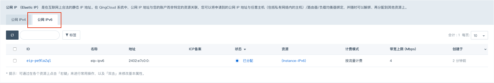
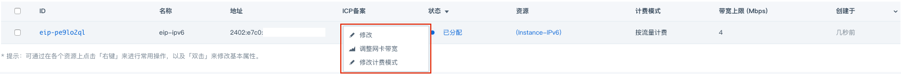
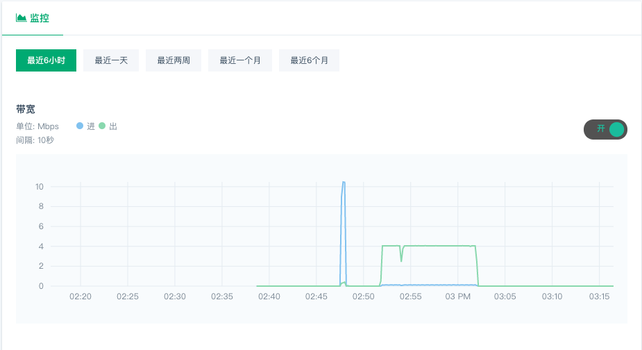

---
---

# IPv6 公网IP

## IPv6 地址接入公网

当您使用支持 IPv6 的镜像创建主机， 并将主机加入到启用 IPv6 的私有网络中，该主机会获取到一个 IPv6 的地址，具体操作可参考 [_IPv6 快速使用指南_](https://docs.qingcloud.com/product/quick_start/IPv6_quick_start#开通主机-ipv6-公网访问)。
当您将该 IPv6地址接入公网后，在公网 IPv6 的标签页中即可查看接入公网的 IPv6 详情。

## IPv6 公网计费

您可以像普通 IPv4 的公网 IP 一样，调整其带宽和修改计费模式。

## IPv6 公网流量监控信息

以及查看该 IPv6 地址的带宽、流量、PPS 监控信息。

弹性公网 IP 是在互联网上合法的静态 IP 地址。在 QingCloud 系统中，公网 IP 地址与您的账户而非特定的资源关联，您可以将申请到的公网 IP 地址与任意主机（包括私有网络内的主机）/路由器/负载均衡器绑定，并随时可以解绑、再分配到其他资源上。

公网 IP 的绑定模式分为两类： **外部绑定** 与 **内部绑定** 。外部绑定是在主机外部通过网络地址转换（ NAT ）的方式将公网 IP 地址转换成用户私有网络地址或基础网络地址。内部绑定是通过在主机内部添加一块连接到公网网关的网卡的方式来绑定公网 IP ，该方式需要用户手动为这块网卡配置 IP 地址及相关路由。

> 注解
> 目前内部绑定仅支持网络 2.0 区域（北京3区，上海1区和广东2区），并且只允许绑定到主机，不允许绑定到路由器与负载均衡器。

