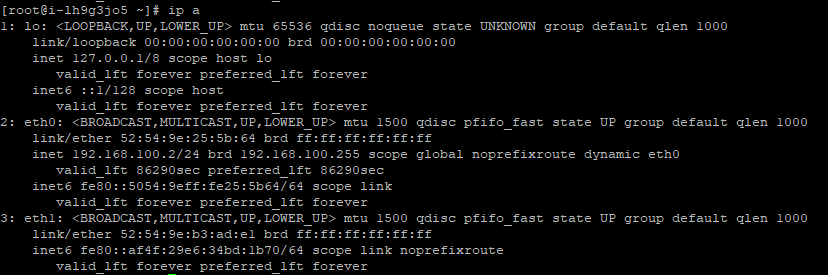
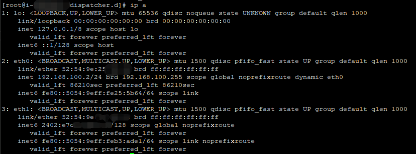

---
---

# IPv6 网络配置指南

IPv6 的网络配置与 IPv4 的配置大体上是类似的。主要是两种方式，一种是配置主机通过 VPC DHCP 获取动态的 IPv6 并与网络同步路由信息，第二种是手动申请静态的公网 IPv6 地址，并在主机中配置静态 IPv6 并与网络同步路由信息。

两种 IPv6 最大的区别，通过 VPC DHCP 获取的 IPv6 地址，在接入公网后，同时具备公网和 VPC 内网的访问能力，点击查看[操作步骤](https://docs.qingcloud.com/product/quick_start/IPv6_quick_start)。手动申请的 IPv6 地址只具有公网能力，无法与不具备公网带宽的VPC内部IPv6访问，类似于用内网的 IPv4 是无法访问公网IPv4。两种方案都可以提供 IPv6 的公网访问，您可以根据自己的网络需求和偏好进行选择。

## 通过私有网络动态分配 IPv6 和自动化配置

在支持 IPv6 的私有网络中，点击“创建资源”按钮，选择“主机”，建议选择标识 `IPv6` 的镜像完成创建主机，有 IPv6 标识的镜像在支持 IPv6 的 VPC网络会自动分配 IPv6 地址，并自动完成 IPv6 配置。

> 注解： 目前仅部分操作系统镜像支持 IPv6 自动化配置：`centos75x64b`，`bionic1x64c`，`xenial5x64b`（及相关操作系统以后的版本）。
> 若从其他的镜像启动的主机， 则未针对 DHCPv6 进行配置， 也即该主机的网络接口无法自动获取/识别 IPv6 相关网络配置。

### <span id="enable_instance_ipv6">主机 IPv6 自动化配置 </span>

对于没有标识 IPv6 的镜像所启动的主机，登录主机后进行一些配置， 也可以开启 IPv6 的自动化 。

青云的网络采用了`DHCPv6`，用户主机需要以`DHCPv6`的方式获取到IPv6地址，并通过[Network Discovery Protocol](https://tools.ietf.org/html/rfc4861)里的`Router Advertisement`来自动路由寻址。

主机内要配置支持 DHCPv6，主要包括三个要点：

1. 需要配置 [DUID](https://en.wikipedia.org/wiki/DHCPv6#DHCP_Unique_Identifier)
   的类型为 [DUID-LLT](https://tools.ietf.org/html/rfc3315#section-9.2)。
2. 需要在关闭网络时，及时清理 lease 文件，确保切换网络时 duid 不会缓存在 lease 文件里。
3. 配置 sysctl `accept_dad` 为 0。[DAD](https://tools.ietf.org/html/rfc4429)
   功能会避免 IPv6 地址重复分配。在青云，会通过 DHCP 机制避免地址重复分配；且底层实现有对 IPv6 实现地址代答功能，可能会导致主机内 IPv6
   地址变为 'duplicated'，所以需要关闭 DAD。

此外，不同操作系统、不同发行版的配置方法是不同的，需要根据您的操作系统版本和网络管理工具，并查阅相关文档，进行合理正确配置。

下面的文档包括了 `CentOS 7.5 / Ubuntu 18.04 / Ubuntu 16.04` 的配置方法

配置完成后，需要重启主机，以确保您的配置生效。

至此，您就可以轻松的体验 IPv6 带来的种种好处了。

### Centos 7.5

以下操作基于镜像ID: `centos75x64a`。

1.升级 NetworkManager 至 1.12 版本以后，才支持 `dhcp-duid` 配置。

```
    [root@ipv6-12 ~]# NetworkManager --version
    1.10.2-13.el7
    [root@ipv6-12 ~]# yum update NetworkManager
    [root@ipv6-12 ~]#
```

2.配置 `/etc/NetworkManager/NetworkManager.conf`，增加 `ipv6.dhcp-duid` 配置：

```
    [root@ipv6-12 ~]# vi /etc/NetworkManager/NetworkManager.conf
    [main]
    plugins=ifcfg-rh,keyfile

    [connection]
    ipv6.dhcp-duid=llt
    [root@ipv6-12 ~]#
```

3.配置 `ifcfg-eth0`：

```
    [root@ipv6-12 ~]# vi /etc/sysconfig/network-scripts/ifcfg-eth0
    TYPE=Ethernet
    NAME=eth0
    DEVICE=eth0
    BOOTPROTO=dhcp
    ONBOOT=yes
    IPV6INIT=yes
    IPV6_AUTOCONF=no
    IPV6_FAILURE_FATAL=no
    DHCPV6C=yes
    [root@ipv6-12 ~]#
```

4.配置 down hook
清理 dhcp6 的 lease，避免切换网络时，DUID 还包含老的 MAC 信息。

```
    [root@ipv6-12 ~]# vi /etc/NetworkManager/dispatcher.d/dhclient-down-hooks.sh
    #!/bin/sh

    RUN="yes"
    if [ "${RUN}" != "yes" ]; then
        exit 0
    fi

    if [ "${NM_DISPATCHER_ACTION}" != "down" ]; then
        exit 0
    fi

    interface=${DEVICE_IFACE}

    f_leases="/var/lib/NetworkManager/dhclient*-${interface}.lease"

    rm -f ${f_leases};
    [root@ipv6-12 ~]# chmod u+x /etc/NetworkManager/dispatcher.d/dhclient-down-hooks.sh
    [root@ipv6-12 ~]#
```

5.关闭 DAD，在`/etc/sysctl.conf`里配置：

```
    [root@ipv6-12 ~]# vi /etc/sysctl.conf
    net.ipv6.conf.eth0.accept_dad = 0
    net.ipv6.conf.eth0.accept_ra = 1
    net.ipv6.conf.eth0.accept_ra_defrtr = 1
    net.ipv6.conf.eth0.accept_ra_rtr_pref = 1
    net.ipv6.conf.eth0.accept_ra_rt_info_max_plen = 1
    [root@ipv6-12 ~]#
```

### Ubuntu 18.04

以下操作基于镜像 ID: `bionic1x64a`。

1.安装 `ifupdown`，使用 `networking` 来管理网络：

```
    [root@ipv6-02 ~]# apt-get update
    [root@ipv6-02 ~]# apt-get install ifupdown -y
    [root@ipv6-02 ~]#
```

2.禁用 `netplan` / `systemd-networkd` / `networkd-dispatcher`：

```
    [root@ipv6-02:~]# echo > /etc/netplan/50-cloud-init.yaml
    [root@ipv6-02:~]# systemctl disable systemd-networkd
    [root@ipv6-02:~]# systemctl disable networkd-dispatcher
```

3.修改 `interfaces` 配置文件， `allow-hotplug`：

```
    [root@ipv6-02:~]# mkdir -p /etc/network/interfaces.d/
    [root@ipv6-02:~]# vi /etc/network/interfaces
    source /etc/network/interfaces.d/*.cfg

    auto lo
    iface lo inet loopback

    [root@ipv6-02:~]# vi /etc/network/interfaces.d/50-cloud-init.cfg
    allow-hotplug eth0
    iface eth0 inet dhcp

    [root@ipv6-02:~]# vi /etc/network/interfaces.d/60-default-with-ipv6.cfg
    iface eth0 inet6 dhcp
        autoconf 0
    [root@ipv6-02 ~]#
```

4.配置 `down hook`
dhclient 会把 v4/v6的配置互做 backup 来确保使用相同的 duid ，所以两个 leases 都需要删除。

```
    [root@ipv6-02:~]# vi /etc/network/if-post-down.d/lease_clean
    #!/bin/sh

    f6_leases="/var/lib/dhcp/dhclient6.${IFACE}.leases"
    f4_leases="/var/lib/dhcp/dhclient.${IFACE}.leases"

    if [ -e ${f6_leases} ]; then
        rm -f ${f6_leases};
    fi

    if [ -e ${f4_leases} ]; then
        rm -f ${f4_leases};
    fi
    [root@ipv6-02:~]# chmod u+x /etc/network/if-post-down.d/lease_clean
    [root@ipv6-02:~]#
```

5.关闭DAD，在`/etc/sysctl.conf`里加一行：

```
    [root@ipv6-02 ~]# vi /etc/sysctl.conf
    net.ipv6.conf.eth0.accept_dad = 0
    [root@ipv6-02 ~]#
```

### Ubuntu 16.04

以下操作基于镜像ID: `xenial5x64a`。

1.修改`interfaces` 配置文件，`allow-hotplug`：

```
    [root@ipv6-02:~]# mkdir -p /etc/network/interfaces.d/
    [root@ipv6-02:~]# vi /etc/network/interfaces
    source /etc/network/interfaces.d/*.cfg

    auto lo
    iface lo inet loopback

    [root@ipv6-02:~]# vi /etc/network/interfaces.d/50-cloud-init.cfg
    allow-hotplug eth0
    iface eth0 inet dhcp

    [root@ipv6-02:~]# vi /etc/network/interfaces.d/60-default-with-ipv6.cfg
    iface eth0 inet6 dhcp
        autoconf 0
    [root@ipv6-02:~]#
```

2.配置 `down hook`
dhclient 会把 v4/v6的配置互做 backup 来确保使用相同的 duid，所以两个 leases 都需要删除。

```
    [root@ipv6-02:~]# vi /etc/network/if-post-down.d/lease_clean
    #!/bin/sh

    f6_leases="/var/lib/dhcp/dhclient6.${IFACE}.leases"
    f4_leases="/var/lib/dhcp/dhclient.${IFACE}.leases"

    if [ -e ${f6_leases} ]; then
        rm -f ${f6_leases};
    fi

    if [ -e ${f4_leases} ]; then
        rm -f ${f4_leases};
    fi
    [root@ipv6-02:~]# chmod u+x /etc/network/if-post-down.d/lease_clean
```

3.关闭DAD，在`/etc/sysctl.conf`里加一行：

```
    [root@ipv6-02 ~]# vi /etc/sysctl.conf
    net.ipv6.conf.eth0.accept_dad = 0
    [root@ipv6-02 ~]#
```

## 申请 IPv6 并完成配置

用户可以申请 IPv6 弹性IP，此类 IPv6 的配置与[内部绑定](https://docs.qingcloud.com/product/network/eip#%E4%BD%BF%E7%94%A8%E5%86%85%E9%83%A8%E7%BB%91%E5%AE%9A%E5%85%AC%E7%BD%91-ip)的公网 IP 类似，
将公网 IP 分配到主机后可以看到主机内多出一块还未分配 IP 地址的网卡。如下图所示

[](./_images/IPv6_inbind_nic.png)

下面以镜像 `CentOS 7.5` / `CentOS 6.8` / `Ubuntu 18.04`为例，配置 IPv6 弹性IP。在`[Your IPv6 Address]`处请填入您在平台申请并绑定到主机的 IPv6 地址

### Centos 7.5

1.修改网卡配置

```
[root@ipv6-eip ~]# vi /etc/sysconfig/network-scripts/ifcfg-eth1

TYPE=Ethernet
NAME=eth1
DEVICE=eth1
ONBOOT=yes
BOOTPROTO=static
NM_CONTROLLED=yes
IPV6INIT=yes
IPV6_AUTOCONF=no
IPV6_FAILURE_FATAL=no
IPV6ADDR=[Your IPv6 Address]/128
```

2.在目录 /etc/NetworkManager/dispatcher.d 下增加网络控制脚本

```
[root@ipv6-eip ~]# cd /etc/NetworkManager/dispatcher.d
[root@ipv6-eip dispatcher.d]# vi interface-up-hook.sh 
#!/bin/sh

RUN="yes"
if [ "${RUN}" != "yes" ]; then
exit 0
fi

if [ "${NM_DISPATCHER_ACTION}" != "up" ]; then
exit 0
fi

interface=${DEVICE_IFACE}

sysctl -w net.ipv6.conf.${interface}.accept_ra=1 
sysctl -w net.ipv6.conf.${interface}.accept_ra_defrtr=1

```

3.执行脚本，然后重启网卡 eth1

```
[root@ipv6-eip dispatcher.d]# chmod +x interface-up-hook.sh
[root@ipv6-eip dispatcher.d]# ifdown eth1
[root@ipv6-eip dispatcher.d]# ifup eth1

```

4.查看您的 IP 和 ping6 测试网路的畅通情况

> 注解： ping6 是 Linux 对IPv6 网络探测的命令

[](./_images/IPv6_inbind_nic_2.png)

### Centos 6.8

1.修改网卡配置

```
[root@ipv6-eip ~]# vi /etc/sysconfig/network-scripts/ifcfg-eth1

TYPE=Ethernet
NAME=eth1
DEVICE=eth1
BOOTPROTO=static
ONBOOT=yes
NM_CONTROLLED=no
IPV6INIT=yes
IPV6_AUTOCONF=yes
IPV6_FAILURE_FATAL=no
IPV6ADDR=[Your IPv6 Address]/128
```

2.启动网卡

```
[root@ipv6-eip dispatcher.d]# ifup eth1

```

3.查看您的 IP 和 ping6 测试网路的畅通情况

[](./_images/IPv6_inbind_nic_2.png)

### Ubuntu 18.04

1.编辑/etc/network/interfaces文件，添加 eth1 的静态 IPv6 地址配置

```
auto eth1
iface eth1 inet6 static
  address 2402:e7c0:0:80::1
  netmask 128

```

2.将配置文件保存之后，使用如下命令将配置应用到网卡 eth1 ：

```
[root@ipv6-eip-ubuntu ~]# sudo ifup eth1

```

3.查看您的 IP 和 ping6 测试网路的畅通情况

如有其它 Linux 发行版的需求，建议您通过提工单来技术交流

