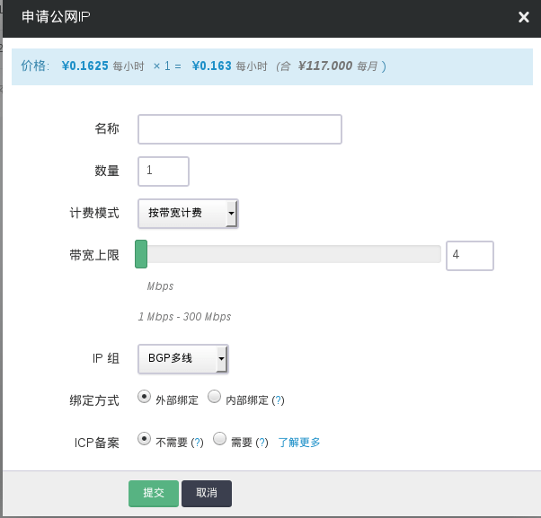
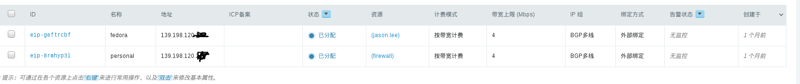

---
---

# 使用外部绑定公网 IP

申请一个外部绑定公网 IP，并分配给主机

登录 WEB 控制台，点击左边导航条中的“计算与网络 -> 公网IP”， 接着在右边区域点击“申请”按钮，这时会弹出申请表单：

- 名称：为您申请的这个 IP 地址取个名字，方便记忆与使用。可选。
- 个数：1个
- 带宽：这个是互联网带宽（上行下行一样）。
- 注意：青云内部网络通讯带宽不受影响，均为 512Mbps。
- 绑定方式： 选择公网 IP 的绑定方式。
- IP分组：选择您希望使用的公网IP提供方
- ICP备案：如果您打算做公开的网站，在中国大陆得备案。

在“绑定方式”一栏选择“外部绑定”，然后点击“提交”即可。如果您在表单中标示了需要 ICP 备案， 那么您申请到的公网 IP 不能立刻投入使用，需要完成政府备案流程方可； 如果您在表单中标示了不需要 ICP 备案，那么您申请到的公网 IP 可以立刻开始使用。 因为本教程仅仅是个演示，所以不需要 ICP 备案了。

申请到手的公网 IP 会列在右边主显示区域，右键点击它， 选择“分配到主机”，在弹出的对话框中选择您在第一步中创建的主机，点击“提交”即可。

类似下图中所示：

