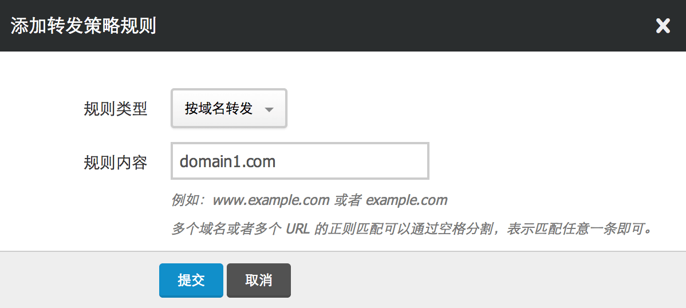
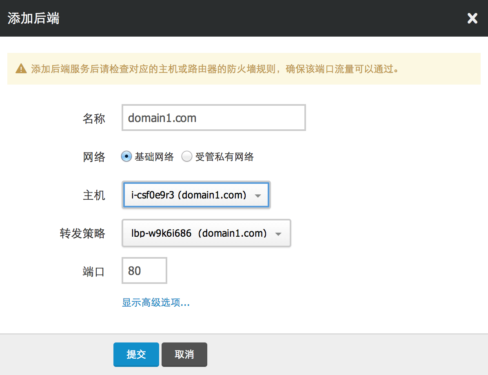
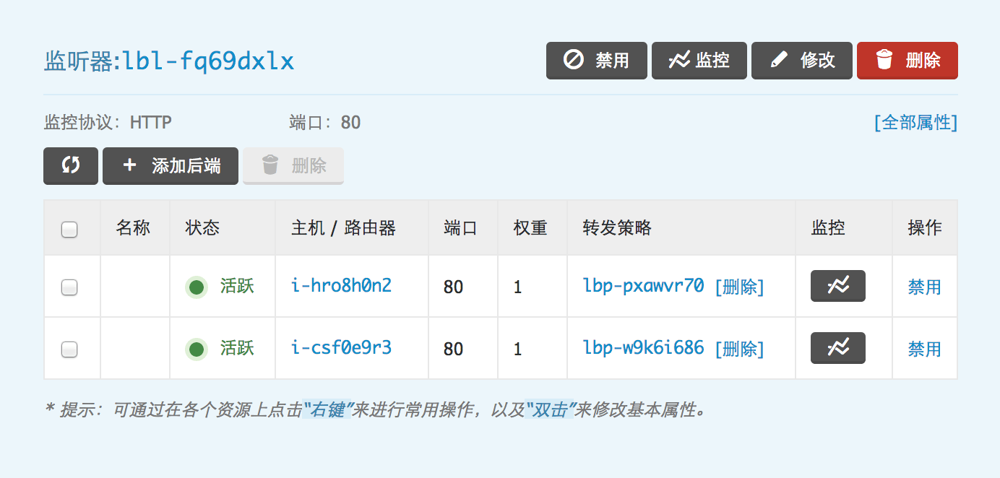
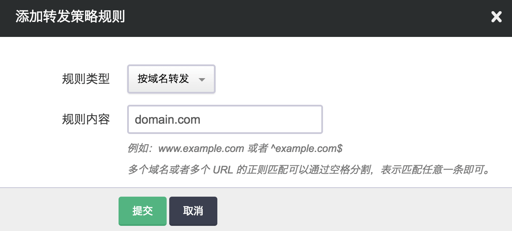
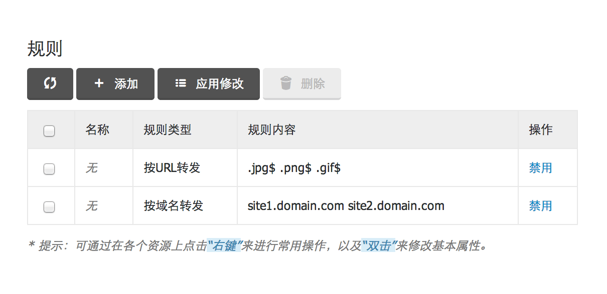
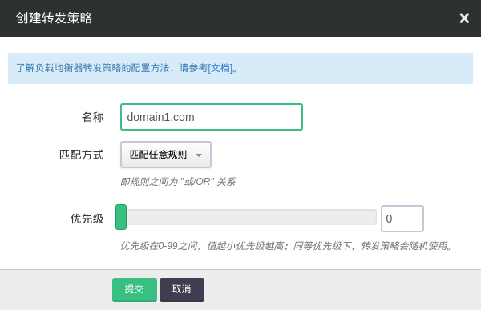

---
---

# 转发策略

## 自定义转发策略

在基础教程的例子中，负载均衡器的后端都是对等的。如果后端不是对等的， 我们可以通过自定义转发策略来进行更高级的转发控制。目前支持 “按域名转发” 和 “按URL转发” 两种规则， 每条转发策略都可以配置多条规则，并可以自定义规则之间的匹配方式。

> 注解
> 当负载均衡器的监听协议为 HTTP 或者 HTTPS 时，都可以支持转发策略配置; 监听协议为 TCP 时，不支持转发策略配置。

为了行文方便，我们假设负载均衡器有两个后端，运行着两个不同域名的网站，域名分别为 “domain1.com” 和 “domain2.com”。 我们现在通过配置转发策略来将不同的域名的流量转发到不同的后端。

### 第1步：创建转发策略和转发规则

首先创建针对域名 “domain1.com” 的转发策略，为了方便查看，我们命名为 “domain1.com”，如图所示：

然后，为该策略创建一条 “按域名转发” 的规则，如图所示：

> 规则内容为 “domain1.com”, 表示匹配任何 “[*](#id4).domain1.com” 的域名的请求都会被转发，例如 “www.domain1.com” 和 “site1.domain1.com” 等。我们支持正则表达式（Perl Compatible Regular Expressions），例如你可以通过 “^domain1.com$” 来实现精确匹配或者通过“^/(?!api).domain1.com” 来匹配不以api开头的url。

同理，我们可以为 “domain2.com” 创建相应的转发策略和规则。

### 第2步：将转发策略与后端进行绑定

当为监听器添加域名为 “domain1.com” 的后端服务时，需要绑定对应的转发策略，即名称为 “domain1.com” 的转发策略，如图所示：

同理，添加域名为 “domain2.com” 的后端服务时，需要绑定名称为 “domain2.com” 的转发策略。

> 注解:
> 当同一条转发策略与多个后端进行绑定时，满足策略的请求会根据监听器中配置的 “均衡方式” 均衡到多个后端，起到负载均衡的作用。

### 第3步：更新负载均衡器配置

当后端添加完成之后，我们点击 “应用修改” 来更新负载均衡器的配置，最后的配置效果如图所示：

> 注解
> 这里你可能还需要做的配置是，在域名解析商处，将这两个域名解析到负载均衡器对应的IP上。

这样，不同域名的请求将被转发到对应的后端，达到按域名转发的目的。

除了 “按域名转发” 之外，我们还可以配置更复杂的转发策略。例如，如果我们希望将 “site1.domain.com” 或者 “site2.domain.com”, 并且 URL 以 ”.jpg”,”.png” 或者 ”.gif” 结尾的请求都发给某个后端，那么可以创建如下策略：

创建策略，匹配方式选择 “匹配所有规则”，即所有规则之间是 “与” 的关系:

为该策略创建两条规则，分别为 “按URL转发” 和 “按域名转发”，多个域名或者多个 URL 的正则匹配可以通过空格分割，表示匹配任意一条即可：

> 注解
> 当某个后端并没有和任何转发策略关联时，表示与后端所在监听器上其他转发策略都无法匹配的流量都会转发到该后端。如果该监听器上没有配置任何转发策略，则所有流量都会转发到该后端。 

## 为转发策略指定优先级

当一个监听器绑定多条转发策略时，如果这些策略的规则之间出现了重叠，监听器会随机匹配，在一些复杂的转发控制场景下，这样的随机匹配会造成跟预期不符的转发情况。因此，需要为这些规则出现重叠的转发策略指定优先级。

负载均衡器会按照转发策略的优先级决定匹配后端的顺序。

> 注解
> 当规则重叠的转发策略，优先级也相同的情况下，仍然会出现随机匹配的情况。所以，在复杂的转发场景，请先做好规则匹配的规划。

## URL 重写

URL重写（英语：URL Rewriting）是一种REST的技术，它可以在负载均衡器中，针对用户所提供的URL进行转换后，再传入负载均衡器后端服务器进行处理。是针对[搜索引擎优化(SEO)](https://zh.wikipedia.org/wiki/%E6%90%9C%E5%B0%8B%E5%BC%95%E6%93%8E%E6%9C%80%E4%BD%B3%E5%8C%96)的重要手段,重写规则的内容符合[正则表达式](https://zh.wikipedia.org/zh-hans/%E6%AD%A3%E5%88%99%E8%A1%A8%E8%BE%BE%E5%BC%8F)语法。

例如： http://www.somebloghost.com/Blogs/Posts.php?Year=2006&Month=12&Day=10

希望经过URL重写后，可以变成：

http://www.somebloghost.com/Blogs/2006/12/10/

可以添加[重写规则](https://www.haproxy.com/documentation/aloha/10-0/traffic-management/lb-layer7/http-rewrite/#rewriting-http-urls)： `%[path,regsub(test,tset,i)]`

