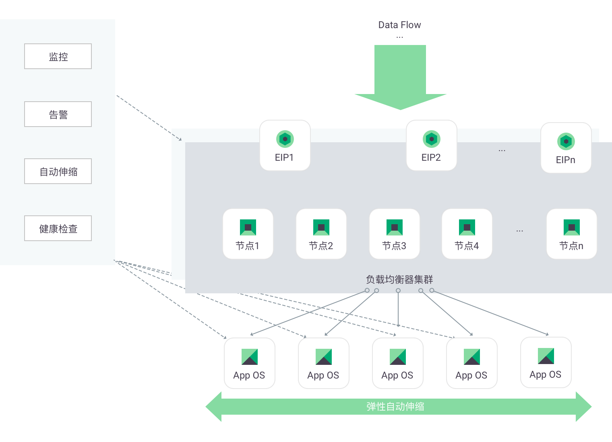

---
---

# 使用场景

## 构建高可用业务架构

通过负载均衡器L4-L7的健康检查功能，可以准确的判断应用的可用性，在任意服务主机出现故障的情况下进行无缝切换，从而确保业务的高可用。同时，负载均衡器集群功能能够确保负载均衡器自身不会成为单点故障点。此外，结合自动伸缩功能，还可以基于负载均衡器监听器的健康检查机制，维持一个固定数量的后端集群。当健康的后端数量不等于所设置值时，会自动创建或删除后端服务器。
推荐 Solution： 区域（Region）级负载均衡 + 自动伸缩 + 虚拟主机

## 负载大动态访问流量

通过负载均衡器对响应延迟时间/并发数/HTTP 多种状态响应数/后端服务器可用数量等各种数据的监控结果，结合自动伸缩功能，动态调整服务器后端数量，满足对高并发大流量业务的支持能力，同时通过对资源使用的动态调节实现使用成本的优化。
推荐 Solution：负载均衡器 + 自动伸缩 + 虚拟主机

## 资源分组管理

通过在私有网络中设置负载均衡器，实现对私有网络的资源分组管理。不同资源间的调用通过负载均衡器完成，根据不同的业务压力需求，透明的实现按需调整。适用于拥有大规模主机资源的复杂私有网络场景。
推荐 Solution：负载均衡+虚拟主机+私有网络VPC

## 满足政策需求

从2017年1月1日起，所有提交到苹果 App Store 的 App 必须强制使用 HTTPS 连接。负载均衡器提供了 HTTPS 卸载及 HTTPS 重定向功能，方便用户在不改变原有应用代码的情况下，无缝的将应用从 HTTP 迁移到 HTTPS。

## Web 性能优化

由于浏览器自身限制，一个浏览器对于同一个域名的最大并发连接在2-10个。通过负载均衡器按域名的转发策略规则功能，可以在不增加 EIP 的同时实现域名拆分，提高网页打开速度。同时，通过负载均衡器按 URL 的转发策略规则功能，还可实现 Web 网站资源的动静分离，进一步优化用户访问体验。
