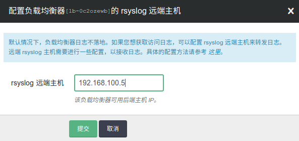

---
---

# rsyslog 远端主机

此功能可以输出负载均衡器的日志流到指定的主机。配置之前，需要提供一台Linux (推荐ubuntu)主机，满足以下要求:

- 公网负载均衡器
  - 在 SDN 1.0区域，包括AP1/GD1/PEK1/PEK2, 主机需要加入基础网络
  - 在 SDN 2.0区域，包括PEK3/SH1, 主机可以加入VPC或者基础网络，同时配置成负载均衡器的后端
- 私网负载均衡器, 主机和负载均衡器位于同一网络

按照下面步骤，配置 rsyslog：

第一步：修改 `/etc/rsyslog.conf`， 添加下面几行：

> 注解
> UDPServerAddress 必须在 UDPServerRun 前面。

```
$ModLoad imudp
$UDPServerAddress 0.0.0.0
$UDPServerRun 514
```

第二步：创建 `/etc/rsyslog.d/haproxy.conf`， 内容如下：

```
local0.* /var/log/haproxy.log
```

第三步：重启服务

```
service rsyslog restart
```

> 注解
> 在这个主机的防火墙放行 udp 514 端口。

准备好主机以后，在青云控制台，右击负载均衡器，选择“配置rsyslog”，输入主机IP，并应用修改就可以生效。



日志格式请参考: [HAProxy文档 8.2.1 Default log format](https://www.haproxy.org/download/1.5/doc/configuration.txt)