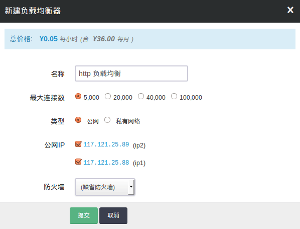
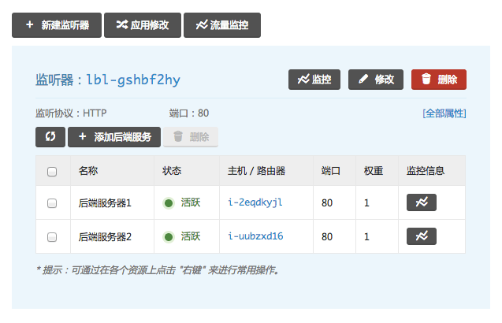

---
---

# 搭建 HTTP 协议的负载均衡器

在本例中，我们假设已经存在2台主机，位于基础网络中， 每台主机上都已搭建好 HTTP 的 web server，监听 80 端口。 我们接下来将配置负载均衡器对这2台主机进行负载均衡。

## 第1步：创建一个负载均衡器

首先，你需要创建一个负载均衡器。 在创建的对话框中，你需要指定负载均衡器类型是公网还是私网。

- 公网负载均衡器需要绑定公网IP地址
- 私网负载均衡器需要选择网络ID (也可以选择私有网络 ID 里面的某个 IP 地址)

这里我们选择两个公网IP地址进行绑定，然后点击提交。

> 注解
> 你也可以在负载均衡器创建完成之后，通过 “绑定”/”解绑” 动作来动态地调整公网IP数目；
> 如果选择的负载均衡器集群是加入在某个私有网络的，可以通过网络 "加入私有网络"/"离开私有网络"来切换负载均衡器集群加入的私有网络 ID. 另外，加入私有网络时可以指定私有 IP 地址。

## 第2步：新建监听器

当负载均衡器创建完成之后，我们需要新建一个 HTTP 协议的监听器。 首先，点击进入负载均衡器的详情页面，找到并点击 “新建监听器” 按钮。 如图所示，在弹出的对话框中，监听协议选择 “HTTP”，监听端口选择 “80”，均衡方式选择 “轮询”，点击提交。

> 注解
> 添加监听器后请检查负载均衡器的防火墙规则，确保 80 端口流量可以通过，否则从外网无法访问你的服务 你也可以通过点击右边 “快速设置” 里头的 “HTTP” 协议进行快速设置

## 第3步：添加后端服务器

监听器添加完成之后，我们需要为监听器添加后端服务器。 首先，找到并点击 HTTP 监听器下面的 “添加后端服务器” 按钮。 如图所示，在弹出的对话框中，”所在网络” 需要选择 “基础网络”， 然后从 “后端服务器” 的下拉菜单中选择我们已经配置好的 web server，”端口” 填 “80”， 然后点击提交。同理你可以添加另一台主机。

> 注解

如果要添加私有网络主机作为后端，同样的，直接选择私有网络即可。

由于你的配置修改还没有被应用，所以后端服务器会显示不可用状态，这是正常的。 这时我们需要点击”新建监听器”旁边的”应用修改”按钮，使得修改生效。

> 注解
> 在每次完成修改负载均衡器配置之后，都需要点击”应用修改”按钮将修改生效

如下图所示，应用修改完成之后，后端服务器会成功被负载均衡器接管， 然后状态会恢复为 “活跃”。此时你通过负载均衡器绑定的IP地址（例如 `http:///` ）， 就可以正常的访问自己的服务了。

