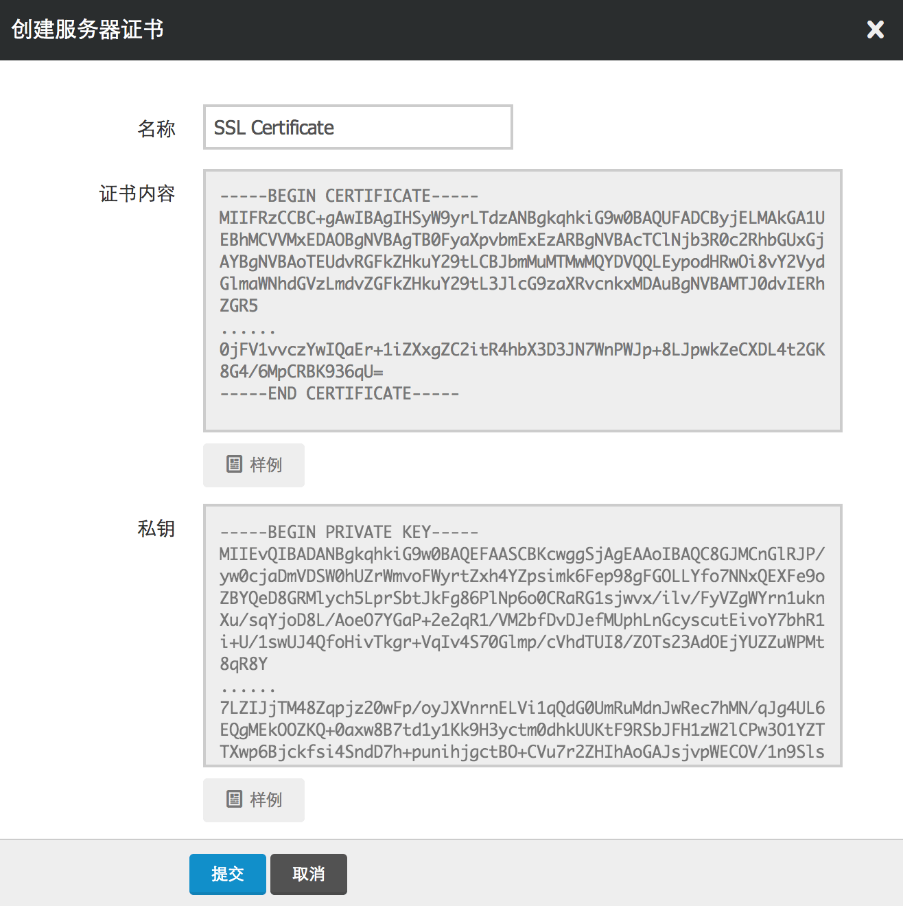
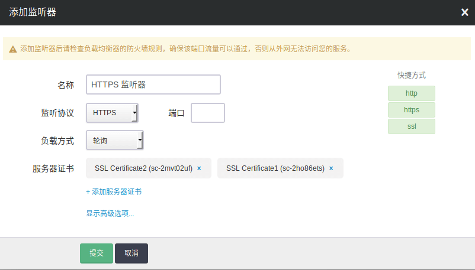
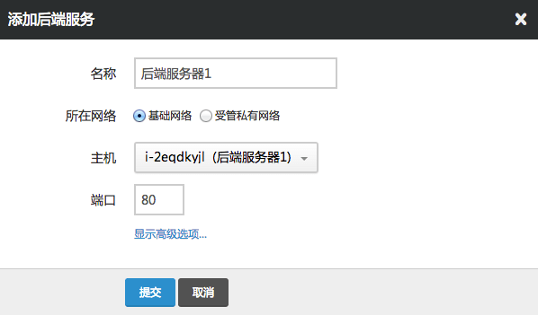

---
---

# 搭建 HTTPS 协议的负载均衡器

假设我们的 web server 主机还需要提供 HTTPS 协议的访问， 那么我们同样可以搭建一个 HTTPS 的负载均衡器来对我们的 web server 进行负载均衡， 我们的负载均衡器提供了原生的 HTTPS 协议支持，即你的后端主机只需要支持 HTTP 协议即可。 如果这不是你期望的模式，例如你希望由你的后端承担 HTTPS 的卸载，那么你可以通过 TCP 协议来实现类似的功能。

## 第1步：创建一个负载均衡器

因为一个负载均衡器可以新建多个监听器，所以在本例里， 我们不再创建新的负载均衡器，而是选择在现有负载均衡器里添加新的监听器。

## 第2步：上传 SSL 服务器证书

进入负载均衡器的 “服务器证书” 页面，点击 “创建”，并将你的 “证书内容” 和 “私钥” 粘贴到对应的输入框中，点击 “提交”。 如下图所示：

> 注解
> 如果你需要上传证书链，也可以将所有证书链的内容粘贴于 “证书内容” 中。

## 第3步：新建监听器

首先，点击进入负载均衡器的详情页面，找到并点击 “新建监听器” 按钮。 如图所示，监听协议选择 “HTTPS”，监听端口选择 “443”，均衡方式选择 “轮询”， 在 “服务器证书” 处选择你上传的证书。点击提交。

> 注解
> 添加监听器后请检查负载均衡器的防火墙规则，确保 443 端口流量可以通过，否则从外网无法访问你的服务 你也可以通过点击右边”快速设置”里头的 “HTTPS” 协议进行快速设置。https监听器可以支持多张证书。

## 第4步：添加后端服务器

如图所示，”所在网络” 依旧选择 “基础网络”， 然后从 “后端服务器” 的下拉菜单中选择我们已经配置好的 web server，”端口” 填 “80”，然后点击提交。

同理，如果还有其他后端主机，你可以通过类似的操作依次添加， 注意在添加完成之后，不要忘记点击 “应用修改” 使配置生效。

> 注解
> 如果要添加私有网络主机作为后端，同样的，直接选择私有网络即可。