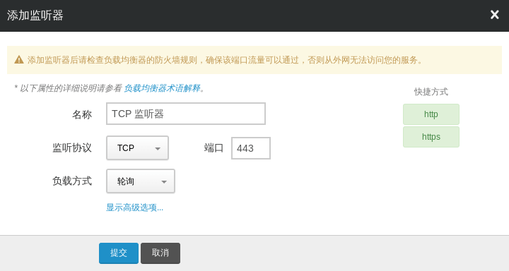
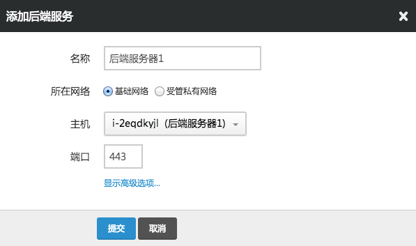

---
---

# 搭建 TCP 协议的负载均衡器

假设后端主机已经支持了 HTTPS 协议，并不需要负载均衡器本身来做 SSL 的卸载，那么我们可以使用 TCP 协议的负载均衡方式。 除此之外，数据库等服务也可以使用 TCP 协议进行负载均衡。

## 第1步：创建一个负载均衡器

因为一个负载均衡器可以新建多个监听器，所以在本例里， 我们不再创建新的负载均衡器，而是选择在现有负载均衡器里添加新的监听器。

## 第2步：新建监听器

首先，点击进入负载均衡器的详情页面，找到并点击 “新建监听器” 按钮。 如图所示，监听协议选择 “TCP”，监听端口选择 “443”，均衡方式选择 “轮询”， 点击提交。

> 注解
> 添加监听器后请检查负载均衡器的防火墙规则，确保 443 端口流量可以通过，否则从外网无法访问您的服务

## 第3步：添加后端服务器

如图所示，”所在网络” 依旧选择 “基础网络”， 然后从 “后端服务器” 的下拉菜单中选择我们已经配置好的 web server，”端口” 填 “443”，然后点击提交。

同理，如果还有其他 HTTPS 主机，你可以通过类似的操作依次添加， 注意在添加完成之后，不要忘记点击 “应用修改” 使配置生效。

> 注解

如果要添加私有网络主机作为后端，同样的，直接选择私有网络即可。