---
---

# RocketMQ on QingCloud AppCenter 用户手册

## 简介

[Apache RocketMQ](https://rocketmq.apache.org) 是一个基于[ Apache 2.0 协议](https://github.com/apache/rocketmq/blob/master/LICENSE)开源的分布式消息和流数据平台，具有低延时、高吞吐、可审计、可几乎无限水平扩展等优点。

下表是 RocketMQ 和其他流行的消息系统之间的对比（摘抄自[ RocketMQ 官网](https://rocketmq.apache.org/docs/motivation/#rocketmq-vs-activemq-vs-kafka)）。

| 产品 | SDK | 协议/规范 | 有序消息 | 定时消息 | 批量消息 | 广播消息 | 过滤 | 自动重发 | 持久化 | 回溯 | 消息优先级 | 高可用和失败转移 | 消息跟踪 | 配置| 管理工具 |
|---|---|---|---|---|---|---|---|---|---|---|---|---|---|---|---|
| ActiveMQ | Java, .NET, C++ etc. | Push 推模式, 支持 OpenWire, STOMP, AMQP, MQTT, JMS | 独占消费者或独占队列可保证消息有序 | 支持 | 不支持 | 支持 | 支持 | 不支持 | 利用 JDBC 和高性能日志，支持非常快的持久化，比如 levelDB, kahaDB | 支持 | 支持 | 支持, 视底层存储而定，如果使用 KahaDB ，则需要依赖 ZooKeeper | 不支持 | 默认配置偏底层，用户需要定制配置参数 | 支持 |
| Kafka | Java, Scala etc. | Pull 拉模式，支持 TCP | 在分区内保证消息有序 | 不支持 | 支持, 通过异步生产者 | 不支持 | 支持, 可使用 Kafka Streams 流过滤消息 | 不支持 | 高性能文件存储 | 支持，偏移量标识 | 不支持 | 支持, 需要依赖 ZooKeeper | 不支持 | 使用键值对做配置，可通过配置文件或编程方式提供 | 支持, 使用命令行工具导出关键指标 |
| RocketMQ | Java, C++, Go | Pull 拉模式, 支持 TCP, JMS, OpenMessaging | 保证严格有序，可优雅横向扩展 | 支持 | 支持, 同步模式防止消息丢失 | 支持 | 支持, 基于 SQL92 的过滤表达式 | 支持 | 高性能、低延时的文件存储 | 支持，时间戮和偏移量标识 | 不支持 | 支持, 主从模式，无需引入第三方系统 | 支持 | 开箱即用，用户仅需要关注很少的配置 | 支持，可使用网页或命令行工具导出关键指标 |

`RocketMQ on QingCloud AppCenter` 将 RocketMQ 通过云应用的形式在 QingCloud AppCenter 部署，具有如下特性:

- 开箱即用
- 支持横向与纵向在线伸缩
- 支持高可用部署，无单点失败
- 系统自动运维，降低企业使用成本
- 可通过网页控制台 [RocketMQ Console](https://github.com/apache/rocketmq-externals/tree/master/rocketmq-console) 对集群进行可视化管理

## 创建 RocketMQ

### 部署前准备

创建 RocketMQ 集群前，您需要先创建一个 VPC 网络。

> 为了保障数据安全, RocketMQ 集群需要运行在受管私有网络中。所以在创建一个 RocketMQ 集群之前，需要创建一个 VPC 和一个受管私有网络，受管私有网络需要加入 VPC，并开启 DHCP 服务（默认开启）。

### 第 1 步：基本设置

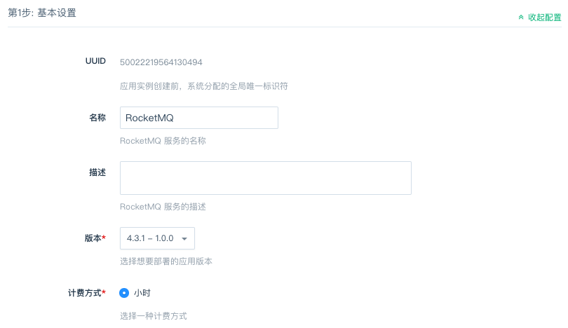

根据自己的需求填写 `名称` 和 `描述`，不影响集群的功能，版本一般建议选择最新版本。

### 第 2 步：Name Server 设置

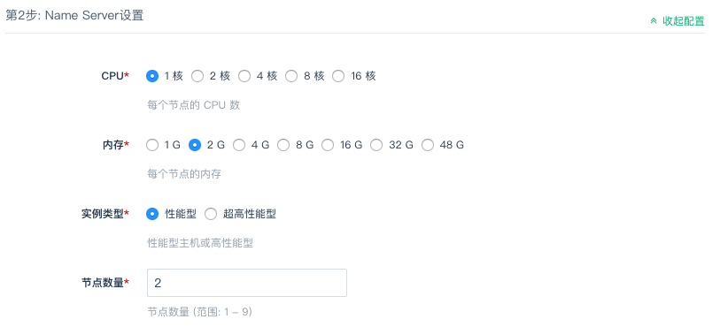

CPU，内存，节点数量，主机类型和磁盘大小根据自己实际需求进行选择即可。单个节点仅供测试使用，生产环境建议创建至少两台 Name Server 保证高可用。

### 第 3 步：Broker 设置

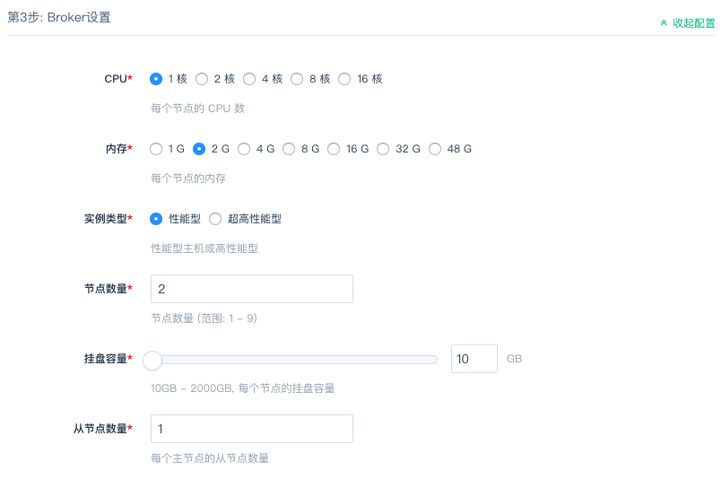

CPU，内存，节点数量，从节点数量，主机类型和磁盘大小根据自己实际需求进行选择即可。

> Broker 可分为主从两种角色，其中，主节点可提供读写操作，从节点只可提供读操作。单个主节点仅供测试使用，生产环境建议创建至少两台主节点，并且为每个主节点创建至少一个从节点，从而确保某个主节点宕机之后，集群还可以提供正常的读写服务。

### 第 4 步：网页控制台节点设置

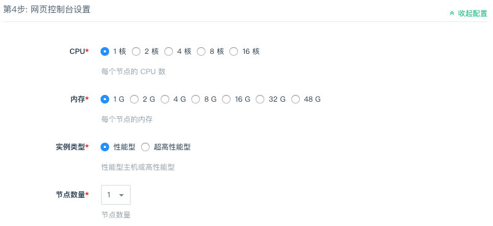

CPU，内存，节点数量，主机类型和磁盘大小根据实际需求进行选择即可。

> 网页控制台 [RocketMQ Console](https://github.com/apache/rocketmq-externals/blob/master/rocketmq-console) 可为用户提供友好的操作界面，从而更方便地对 RocketMQ 集群进行查看和管理。网页控制台提供了运维（ Ops ）、驾驶舱（ Dashboard ）、集群（ Cluster ）信息、主题（ Topic ）信息、发布者（ Producer ）、消费者（ Consumer ）信息、消息查询（ Message Query ）等丰富功能，详情可参见 [官方使用文档](https://github.com/apache/rocketmq-externals/blob/master/rocketmq-console/doc/1_0_0/UserGuide_CN.md)。

### 第 5 步：客户端节点设置

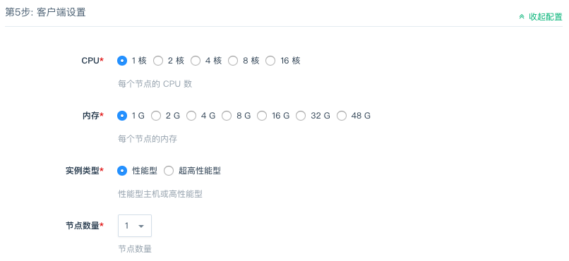

CPU，内存，节点数量，主机类型和磁盘大小根据实际需求进行选择即可。客户端节点为用户预置了 RocketMQ 官方发行包里的命令行管理工具，方便用户使用。

> RocketMQ 命令行管理工具（ CLI admin tool ）可以用来查询、管理和论断问题，详情可参见 [官方使用文档](http://rocketmq.apache.org/docs/cli-admin-tool/)。

### 第 6 步：网络设置

出于安全考虑，所有的集群都需要部署在私有网络中，在这一步选择自己创建的网络。

### 第 7 步：参数设置

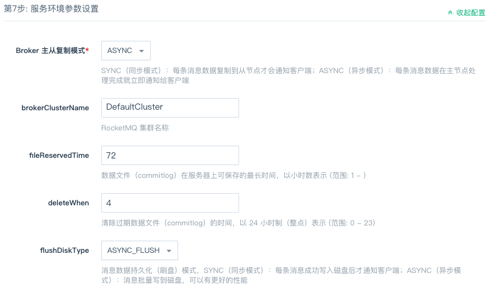

按照实际需求配置 RocketMQ 集群的参数。

### 第 8 步: 用户协议

阅读并同意青云 APP Center 用户协议之后即可开始部署应用。

## 集群使用

### 配置参数

点击 `配置参数` 可以修改 RocketMQ 的相关参数。

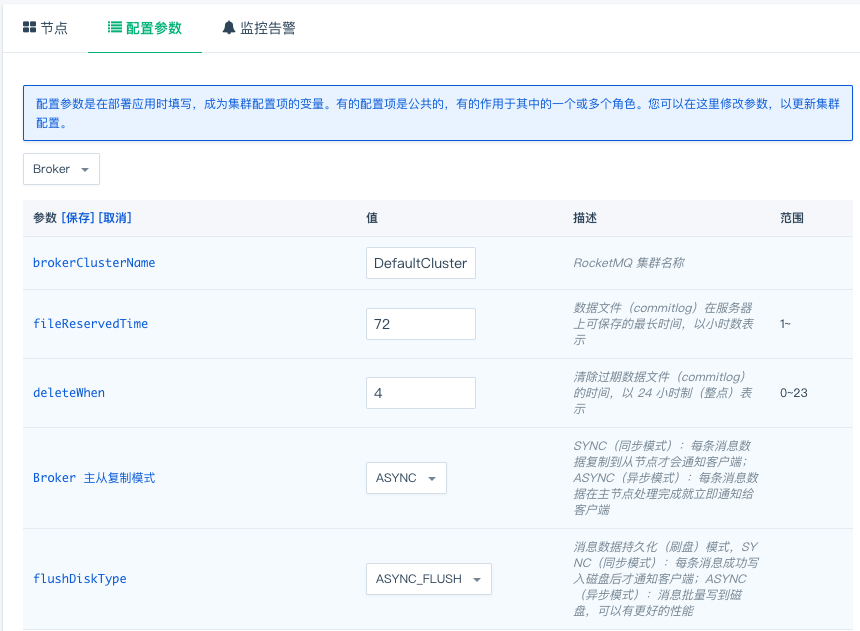

### 扩容集群

点击 `扩容集群` ， 可以在集群性能不足时提高集群的配置：

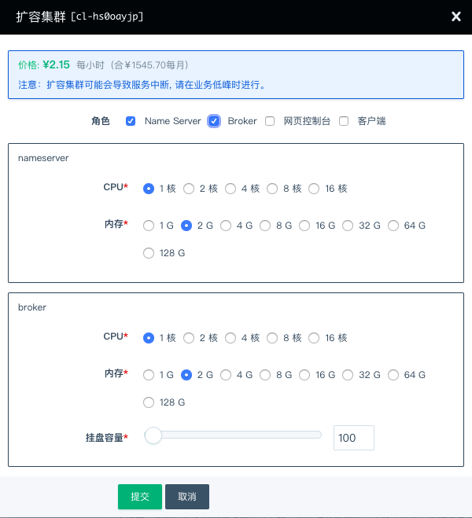

### 删除节点

在集群利用率较低、服务能力过剩的情况下，可以通过删除一些主节点及其从节点来节省资源。

> 注意：删除主节点会导致未被消费的消息永久丢失，请谨慎操作。

## RocketMQ Console 使用示例

用户可在浏览器中打开控制台进行操作。比如控制台节点的 IP 地址是 192.168.2.2 ，则打开：`http://192.168.2.2:8080/`。

下面列举几个常见操作，详情可参见 [官方使用文档](https://github.com/apache/rocketmq-externals/blob/master/rocketmq-console/doc/1_0_0/UserGuide_CN.md)。

> 注意：通过此控制台可以对集群中的实际数据进行增删改，请谨慎操作。

### 创建一个 Topic

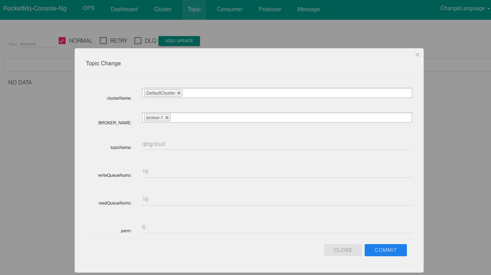

> 创建一个 Topic ，指定 Topic 所在的 broker

### 发送消息

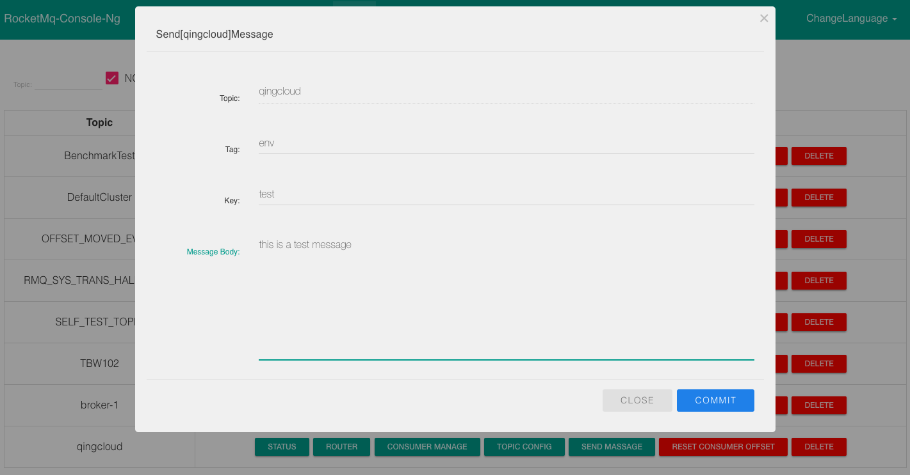

> 在指定的 Topic 后面，点“发送消息”按钮，填写消息内容进行发送

### 查询消息

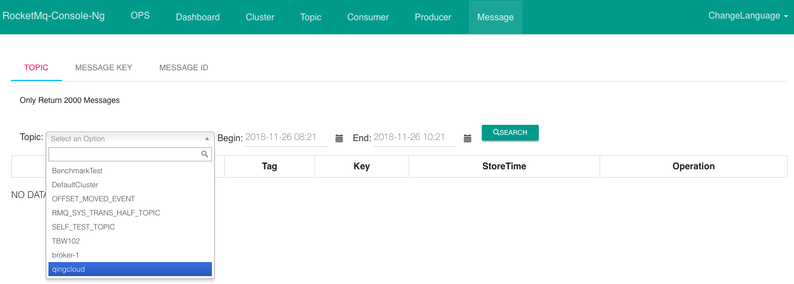

> 查询消息，在“消息”选项卡页面，选择 Topic 和时间范围进行查询，同时可以在查询结果后面查看消息详情

## RocketMQ CLI 命令示例

用户可使用 `ubuntu / p12cHANgepwD` 通过网页 VNC 登录客户端节点进行操作。

下面列举几个常见操作，详情可参见 [官方使用文档](http://rocketmq.apache.org/docs/cli-admin-tool/)。

> 注意：通过此客户端可以对集群中的实际数据进行增删改，请谨慎操作。

### 发送测试消息

`/opt/apache-rocketmq/current/bin/tools.sh org.apache.rocketmq.example.quickstart.Producer`

> 注意：节点的环境变量已经内置了 name server 的地址列表以方便用户使用。如果在用户使用过程中，管理员对 name server 节点进行了调整（增删节点），可以退出重新登录以使环境变量生效，或者通过命令重新加载环境变量：`source /etc/profile.d/rocketmq.sh` 。

### 接收消息

`/opt/apache-rocketmq/current/bin/tools.sh org.apache.rocketmq.example.quickstart.Consumer`

> 注意：节点的环境变量已经内置了 name server 的地址列表以方便用户使用。如果在用户使用过程中，管理员对 name server 节点进行了调整（增删节点），可以退出重新登录以使环境变量生效，或者通过命令重新加载环境变量：`source /etc/profile.d/rocketmq.sh` 。

### 创建 Topic

`/opt/apache-rocketmq/current/bin/mqadmin updateTopic -c DefaultCluster -b 192.168.2.26:10911 -n 192.168.2.29:9876 -t qingcloud`

> `-c` 参数后面指定集群名称（在集群“配置参数”选项卡里设置，如未设置则默认为 DefaultCluster ），`-b` 参数后面指定 broker 地址，`-n` 参数后面指定 name server 地址。

### 删除 Topic

`/opt/apache-rocketmq/current/bin/mqadmin deleteTopic -c DefaultCluster -n 192.168.2.29:9876 -t qingcloud`

> `-c` 参数后面指定集群名称（在集群“配置参数”选项卡里设置，如未设置则默认为 DefaultCluster ），`-n` 参数后面指定 name server 地址。

## 基准测试

### 测试结果

| 指标 | 值 | 说明 |
| --- | --- | --- |
| CPU 利用率 | `~ 90%` | 4 核心 |
| 内存使用率 | `~ 50%` | 总内存 8G |
| TPS | `~ 2000` |

### 测试环境

* [x] 区域：北京 3A 区
* [x] Name Server 节点 × 1：2 CPU， 4G 内存，性能型，Ubuntu Server 16.04.5 LTS 64bit
* [x] Broker 节点 × 2 （一主一从）：2 CPU， 4G 内存，50G 硬盘，性能型，Ubuntu Server 16.04.5 LTS 64bit
* [x] 客户端节点 × 2：4 CPU， 8G 内存，性能型，Ubuntu Server 16.04.5 LTS 64bit

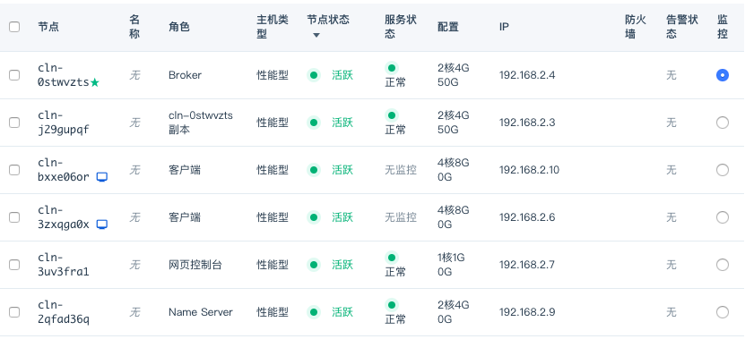

### 参数配置

* [x] 主从复制模式：同步复制 (SYNC)
* [x] 持久化模式：异步 (ASYNC_FLUSH)
* [x] 消息生产者 JVM 参数：`-server -Xms4g -Xmx4g -Xmn2g -XX:PermSize=128m -XX:MaxPermSize=320m -XX:+UseConcMarkSweepGC -XX:+UseCMSCompactAtFullCollection -XX:CMSInitiatingOccupancyFraction=70 -XX:+CMSParallelRemarkEnabled -XX:SoftRefLRUPolicyMSPerMB=0 -XX:+CMSClassUnloadingEnabled -XX:SurvivorRatio=8 -XX:+DisableExplicitGC -verbose:gc -Xloggc:/dev/shm/rmq_srv_gc.log -XX:+PrintGCDetails -XX:-OmitStackTraceInFastThrow -XX:-UseLargePages -XX:+PerfDisableSharedMem -Dorg.apache.rocketmq.client.sendSmartMsg=true`

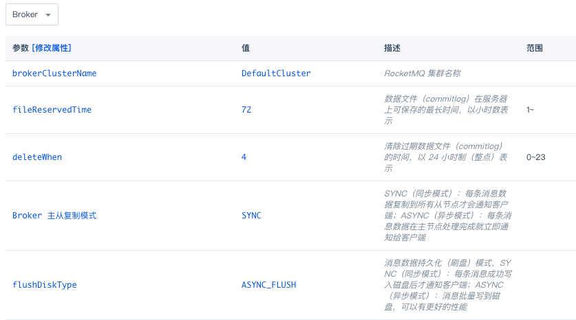

### 测试方法

一个客户端节点生产消息到 Broker ，另一个客户端节点从 Broker 消费消息，持续 24 小时。

### 测试代码

来自官方的 benchmark 代码：[Producer](https://github.com/apache/rocketmq/blob/master/example/src/main/java/org/apache/rocketmq/example/benchmark/Producer.java)，[Consumer](https://github.com/apache/rocketmq/blob/master/example/src/main/java/org/apache/rocketmq/example/benchmark/Consumer.java)

### 截图

