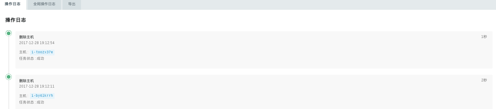
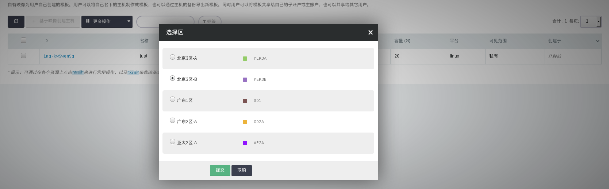
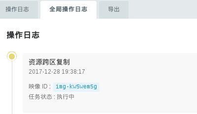
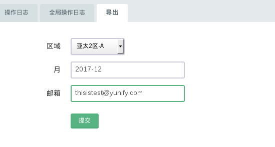

---
---

# 操作日志

最近一段时间的所有操作历史。

青云IaaS云平台支持全球的区域，所以用户的操作有两种类型，一种是本区域，另外一种是跨区域的操作，即全局。下面我们来一一见识下：

## 本区操作日志

在青云的终端控制台，打开“管理”->“操作日志”页面，即可看到您近期的操作：

## 全局操作日志

您若没有做过跨区的操作，全局操作日志为空。本文档为了说明问题，以映像的跨区复制为例。

顾名思义，只有跨区的操作，这里才会显示，我们先来做一次映像的跨区复制，在青云的终端控制台，打开“计算”->“映像”，打开自有映像，选择“跨区复制”操作：

在青云的终端控制台，打开“管理”->“操作日志”页面，就会看到全局操作日志了：

## 导出

另外，操作日志也支持导出到用户的邮箱功能，操作很简单，如下图所示，选择导出操作的区域，月份，填写要导到的邮箱地址即可：

